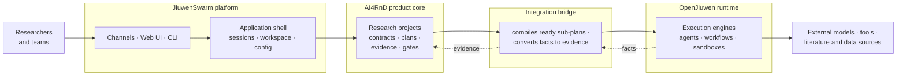

# Executive Summary

**Recommendation: build AI4RnD as a first-class, persistent research product on top of
JiuwenSwarm, keep all product semantics inside AI4RnD, and hand execution to OpenJiuwen
progressively — one capability at a time, each migration gated by a passing compatibility test.**

This package consolidates four revisions of analysis into seven documents. Everything here is
backed by direct source reading of all three codebases and 29 executed experiments; the evidence
for every claim is catalogued in
[06-evidence-assumptions-open-questions.md](06-evidence-assumptions-open-questions.md).

---

## 1. The question

AI4RnD (repository: `Stellven/AI4Research`) is an autonomous R&D product defined by a 142-feature
workbook: it takes a research request, compiles it into a contract, plans the work, searches
literature, forms claims and hypotheses, builds proof-of-concepts, benchmarks them, evaluates the
evidence, and delivers results — improving its own capabilities under governance as it goes.

JiuwenSwarm (with its runtime library OpenJiuwen) is a multi-agent platform: channels, sessions,
a web UI, sandboxing, model management, and several execution engines.

The question: **can the complete intended AI4RnD product be built on JiuwenSwarm/OpenJiuwen as its
foundation — and if so, how?**

## 2. The answer

Yes. The division of responsibility that the evidence supports:

| Layer | Owns | Examples |
|---|---|---|
| **AI4RnD product core** | What the product *means* | Intention Compiler, Contracts, Capability Capsules, semantic TaskGraph, Logical Operators, evidence, gates, evaluators, data foundations, governed self-improvement |
| **JiuwenSwarm application** | The application shell | channels, Gateway, sessions, workspace, UI, accounts, configuration, model providers, packaging |
| **OpenJiuwen runtime** | How work physically runs | DeepAgent, Core Workflow, SwarmFlow, Dynamic Team, code/worktrees, tools, memory, evolution primitives |
| **Integration bridge** | The translation between them | compiles ready sub-plans into execution specifications; converts execution facts back into evidence, state and gate inputs |

Three rules keep this sound:

1. **The product definition never moves.** All 142 workbook outcomes are held constant while
   implementation architectures are compared. A preservation gate evaluates every outcome under
   every option; the recommended architecture drops none.
2. **Execution engines are not architectures.** DeepAgent, SwarmFlow, Core Workflow and Dynamic
   Team each implement 0 of the 142 outcomes alone. They are mechanisms the product composes —
   the user never selects one.
3. **AI4RnD keeps final authority** over semantic readiness, evidence sufficiency, gate decisions,
   repair and replanning, and project completion — because the runtime, as executed today, cannot
   be trusted with them yet (see §4).

## 3. Why progressive, not immediate, delegation

Five architecture options were compared, from "keep AI4RnD's own scheduler" (A) to "delegate
everything to OpenJiuwen now" (D) — details in
[03-integration-options.md](03-integration-options.md).

Option D fails the preservation gate today: one outcome (model routing) would be silently lost,
because OpenJiuwen substitutes a default model when a requested one is missing, without any error.
That failure is **evidence against immediate full delegation, not proof that full delegation can
never become safe** — each gap is small and fixable. The recommended Option C treats D as a
destination that must be earned test by test, keeping every fallback until its replacement passes.

## 4. What execution testing found

The runtime was not just read; it was run. Most of it works as documented — durable graph
execution, journal-based replay of interrupted workflows, admission control, and a persistent
checkpointer in a stock install were all confirmed. Seven negative findings shape the
recommendation:

| # | Finding | Consequence |
|---|---|---|
| 1 | A requested-but-missing model is **silently replaced** by the default | AI4RnD must own model routing until fixed |
| 2 | Workflow resume works internally but is **not reachable** by any agent | the bridge must expose resume |
| 3 | A failed workflow step returns **`None` and the run reports success** | AI4RnD must verify completion itself |
| 4 | The `agent_type` execution knob is accepted but **read by nothing** | typed operator binding must be built |
| 5 | The built-in shell guardrail tier **loads zero rules** in a stock install | fix before relying on it |
| 6 | Of 8 self-improvement surfaces, **only 1 is wired end to end** | governed RSI is mostly new work |
| 7 | AI4RnD's own citation grounding check measured **0.25 precision** | the evidence core must be rebuilt and re-measured |

## 5. What it takes to build

Of the 142 outcomes: **53 must be built new** (they exist in neither system — true under *every*
architecture option), 32 adapted, 23 reused, 20 ported from AI4RnD, 11 extensions of JiuwenSwarm,
2 deferred, 1 unresolved. The plan in
[05-feature-ownership-implementation-plan.md](05-feature-ownership-implementation-plan.md) is
dependency-driven — six phases, each with acceptance evidence and exit criteria, no invented
calendar estimates. The critical path runs: project/Contract foundation → compilation spikes →
trustworthy evidence and capability binding → workflow lanes → data foundations → governed RSI.

## 6. What could change this recommendation

- If the F4 spike fails (real AI4RnD plans cannot compile to either execution engine), the
  architecture reverts toward Option A.
- If the routing, resume and failure-signal gaps close upstream, Option C's mature form *becomes*
  Option D.
- If a replacement grounding check cannot materially beat 0.25 precision, the product's central
  claim — verifiable research — is unmet regardless of architecture.

---

*Reading order: this summary → [04-recommended-target-architecture.md](04-recommended-target-architecture.md)
for the design → [05-feature-ownership-implementation-plan.md](05-feature-ownership-implementation-plan.md)
for the work. Documents 01–03 give the background; 06 carries the evidence.*
