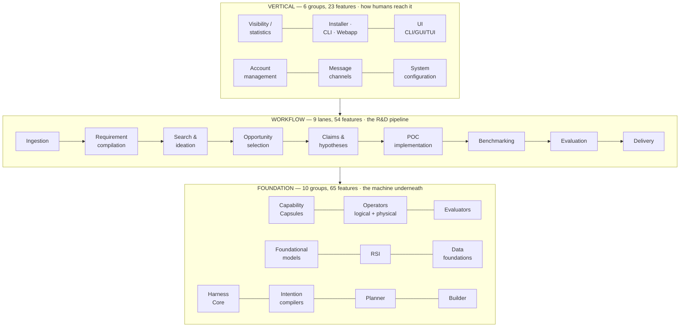
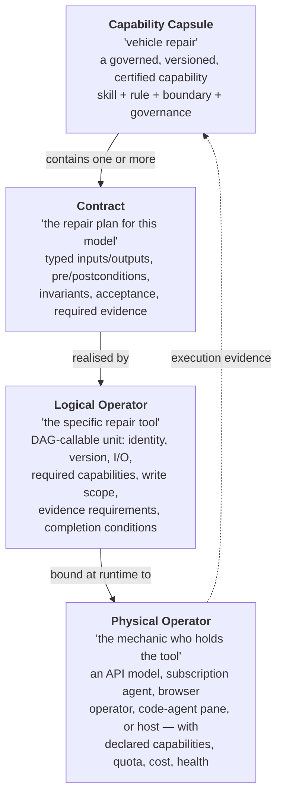
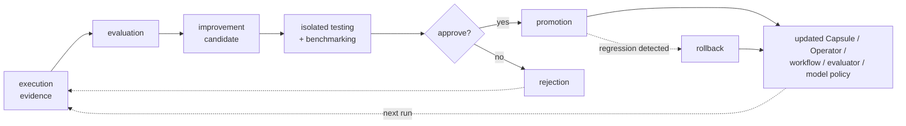

# The Intended AI4RnD Product

> **Revision 4 amendment.** The workbook was re-read directly with `openpyxl` in this revision and
> reconciles exactly: 9 + 10 + 6 = **25 L1 groups**, 54 + 65 + 23 = **142 L2 features**. A
> position-by-position check against the Revision 3 traceability CSV found **zero mismatches** —
> the row set was already correct. What was missing was per-row *ownership*, which is now in
> [20-feature-implementation-ownership.md](20-feature-implementation-ownership.md). Capability
> Capsules are **not** workflow templates: all 42 manifests carry `applicability`, `contract`,
> `composition`, `effects`, `bindings`, `verification`, `operator_compatibility` and `provenance`
> ([V-28](12-verification-appendix.md)).


Derived from `AI4RnD Feature List.xlsx` (142 Level-2 rows), the architecture
specifications in `Stellven/AI4Research-A`, the schemas and contracts in
`Stellven/AI4Research`, and the workbook's own design notes.

**This document defines the target.** Everything else in this analysis measures the two
codebases against it. The previous revision of this analysis modelled AI4RnD as "a research
report generator with an evidence ledger". That was wrong — it described one lane of a much
larger product.

---

## 1. What AI4RnD is meant to be

An **automated R&D organisation**: a system that takes a vague human request and carries it
all the way to an evidence-backed decision about whether a technical idea works.

```
intake → requirement compilation → research & ideation → opportunity selection
→ technical claims & hypotheses → POC construction → benchmarking → evaluation
→ decision support → reusable learning and controlled self-improvement
```

The distinguishing commitment is not that it writes reports. It is that **every step
produces a governed, inspectable artifact, and no step may assert a result it cannot
prove**. The workbook and SDD state this as a rule:

> `LLM proposes. Schemas constrain. Code validates. Gates decide. Artifacts preserve.`

The product is organised in three planes.



| Plane | Groups | L2 features |
|---|---|---|
| Workflow | Ingestion (7), Requirement compilation (7), Search & ideation (8), Idea/opportunity selection (7), Claims & hypotheses (5), POC implementation (5), Benchmarking (5), Evaluation (6), Delivery (4) | **54** |
| Foundation | Capability capsule (5), Operators (6), Evaluator (6), Foundational models (3), RSI (8), Data foundations (9), Harness Core (6), Intention compilers (5), Planner (3), Builder (14) | **65** |
| Vertical | Visibility (4), Installer/CLI/Webapp (5), UI (3), Account management (4), Message channels (3), System configuration (4) | **23** |
| | | **142** |

---

## 2. The central abstraction stack

The workbook is explicit that Capsules, Contracts and Operators are three *different* layers,
not synonyms. From the Operators notes:

> 打包的时候从外往里包，执行时从小往外打开。Capsule → contract → logical operator
> （例如：capsule 仅仅是车辆维修，contract 是不同车型的维修计划，operators 是具体修理项的修理工具）

*"When packaging, you wrap from the outside in; when executing, you unfold from the inside
out. Capsule → contract → logical operator. (For example: the capsule is just 'vehicle
repair'; the contract is the repair plan for a particular vehicle model; the operators are
the specific tools for individual repair items.)"*



### 2.1 A Capability Capsule is not a renamed skill

The workbook: *"capability capsule: is an upgrade of skills → capsule; **skill + rule +
boundary + governance**"* and *"reusable: governable, combinable, verifiable — is a medium
for self-evolution."*

The shipped schema (`schemas/draft/capability-capsule.v1.draft.json`) makes this concrete.
It requires **eleven** top-level sections; a JiuwenSwarm skill has two (`name`,
`description`). Verified by execution — 30 capsules load, 23 manifests validate, 0 invalid:

| Capsule section | What it adds over a skill |
|---|---|
| `capability_capsule_id`, `version` | identity + versioning for promotion/rollback |
| `capsule_kind` | `capability` \| `guard` \| `resource` |
| `applicability` | `task_types`, `positive_signals`, `negative_signals` — machine selection |
| `contract` | `inputs`, `outputs`, `preconditions`, `postconditions`, `invariants` |
| `composition` | `consumes`, `produces`, `compatible_with`, `incompatible_with`, `requires_after` |
| `effects` | `read`, `write`, `execute`, `network`, `cost` — declared side effects |
| `bindings` | `skills`, `mcp_capabilities`, `data_refs`, `secret_refs`, `required_guard_capsules` |
| `verification` | `self_check`, `external_verifier`, `pass_conditions` |
| `operator_compatibility` | `preferred`, `forbidden` physical operators |
| `provenance` | owner, created_at, manifest_path |

Note `bindings.skills`: **a skill is an ingredient of a capsule**, not an equivalent of one.
And `bindings.required_guard_capsules` means capsules can be gated by other capsules.

### 2.2 Operators are the DAG's execution vocabulary

- **Logical operator** — a stable, DAG-callable definition. Declares identity/version, I/O,
  required capabilities/capsules, side effects, **write scope**, evidence requirements,
  completion conditions, concurrency constraints, fallback semantics.
- **Physical operator** — a concrete executor. The workbook is explicit that these are
  first-class and heterogeneous: *"API models, subscription agents, browser/Web operators,
  Code Agent panes, and local/remote environments"*, each with profiles, adapters,
  availability, health, capacity, quota, cost and concurrency state.
- **Binding** — for a DAG node's logical operator, filter eligible physical operators and
  rank by capabilities, capsule compatibility, permissions, health, host, quota, cost,
  latency, load and fallback policy.

The workbook notes the pipeline order:

> `user intent → requirement compilation → Capsule → research contract → planner → dag`

and *"logical operators should be able to be called by the DAG"* / *"DAG generates the nodes
of the workflow"*.

### 2.3 Evaluators are operators too

> *"Evaluator is also a logical operator, but is an important one. Evaluator is in essence
> how to organise the chain of evidence."*

Six evaluator families, each a separate pipeline: contract/schema conformance; engineering
correctness; performance/cost/benchmark; security/privacy/compliance/IP; evidence/factuality/
scientific validity; lifecycle/parity/human review. Human-in-the-loop is explicitly present
in several, not bolted on at the end.

---

## 3. RSI — controlled self-improvement across eight surfaces

RSI in this product is **not** "the agent rewrites its prompt". It is a governed improvement
loop over eight distinct target classes, each with its own validation method:

| # | Improvement target | Named methods | Required validation |
|---|---|---|---|
| 1 | Prompts, rules, rubrics | GEPA, MIPROv2, TextGrad | holdout tasks, A/B, regression |
| 2 | Runtime & resource routing | Bayesian optimisation, bandits, cost-aware RL | traces, load tests, cost–latency |
| 3 | Capsules & physical operators | trajectory mining, code evolution, CEGIS | compatibility tests, sandbox runs, benchmarks |
| 4 | DAG & agent organisation | AFlow, MCTS, ADAS | replay tests, simulation, success–cost |
| 5 | Evaluators, rewards, contracts, governance | judge calibration, reward modelling, CEGIS | golden sets, agreement rates, violation tests |
| 6 | Memory, retrieval, evidence | memory learning, Self-RAG, reranker training | recall, precision, citation accuracy, provenance |
| 7 | Model policies & weights | SFT, LoRA, DPO, GRPO, agent RL | holdout benchmarks, robustness, regressions |
| 8 | Data, benchmarks, curriculum, observability | active learning, hard-case mining, credit assignment | coverage, contamination, trace, ablation |

The workbook's own framing: *"除了 GEPA，还有 Voyager，让系统从成功执行中自动沉淀"* —
*"besides GEPA there is also Voyager, letting the system automatically precipitate [reusable
capability] out of successful executions."*

**The required loop shape** (this is what the target architecture must show):



Every arrow in that loop is a product requirement, not an optional extra.

---

## 4. Data foundations — seven graphs plus memory

The product treats knowledge as a set of typed, linked graphs rather than a document store:

| Graph | Contents |
|---|---|
| Concept | business concepts, entities, terminology, semantic relationships |
| Dataset | datasets, schemas, fields, versions, sources, quality state |
| Code | repos, modules, APIs, functions, tests, configs, dependencies |
| Policy | permissions, approvals, security rules, compliance, retention |
| Workflow | reusable processes, SOPs, approval chains, stages, transitions |
| Trace | requests → plans → executions → operator decisions → tool calls → artifacts → evidence → evaluations → transitions |
| Memory | relationships among remembered facts, decisions, failures, lessons, and their originating evidence |

Plus **persistent memory & context retrieval** and **TaskGraph persistence & lifecycle**
(nodes, dependencies, scopes, gates, checkpoints, results, closure records).

The Trace graph is the auditability backbone: it is what makes "why does this sentence
exist" answerable.

---

## 5. Harness Core — what the execution substrate must provide

Six requirements, and they are stricter than a chat agent loop:

1. **Runtime control loop & run lifecycle** — durable run/node state, status projections,
   close only when required nodes *and gates* are satisfied.
2. **Message bus & durable task queue** — persistent queueing, priority, ordering,
   deduplication/idempotency, backpressure.
3. **DAG scheduler, readiness & operator binding** — validate, determine readiness from
   dependencies/gates/external waits, form safe parallel batches using **scope, effect,
   resource and capacity constraints**.
4. **Execution admission, lease & concurrency control** — approval/policy/availability
   checks, lease acquire/release/reap, no duplicate dispatch, quota and exclusion limits.
5. **Main loop dispatch & runtime supervision** — consume a resolved binding, create the
   execution envelope, dispatch, monitor heartbeat, collect normalised results and evidence
   references.
6. **Failure recovery & resumability** — detect stale execution, retry/requeue/compensate,
   recover expired leases, replay durable state, **resume without rerunning passed work**.

Points 2, 4 and 6 are the ones a conversational agent framework typically does not have.

---

## 6. What the workbook itself marks as unsettled

Preserved rather than resolved, per the instruction not to silently pick an interpretation:

| Open question | Where |
|---|---|
| *"one capsule have multiple contracts inside???"* | Capsule §4 note |
| *"the level 2 for this level 1 feature is too broken"* | Operators §1 note |
| *"现在需要新加一个'如何添加逻辑算子'的feature"* — a "how to add a logical operator" feature is still missing | Operators §4 note |
| *"what are the planning strategy available? Is it a template, or is it real time generated?"* | Planner §1 note |
| *"task graph is a kind of contract. What other kind of contract?"* | Intention compilers §5 note |
| Evaluator splitting — *"evaluator have different pipeline for different things... we should split them up"* | Evaluator §2 note |
| Capsule L2 merging — *"merge some of the level 2 features that focus on capsule management"* | Capsule §5 note |
| Where HITL belongs — *"HITL 在紫，橙，绿里面都有"* (HITL appears in the purple, orange and green areas) | Evaluator §2 note |

These are marked `DEBATED` in the traceability matrix (11 features) rather than assigned a
firm disposition.

---

## 7. Scale of the target versus what exists

Measured against the 142 rows (full detail in
[`traceability/142-feature-matrix.md`](traceability/142-feature-matrix.md)):

| AI4RnD maturity | Count | Meaning |
|---|---|---|
| `ACTIVE` | 68 | wired into a runtime path |
| `IMPL-UNWIRED` | 27 | implemented and tested, but nothing calls it |
| `SCAFFOLD` | 21 | partial or thin |
| `SPEC` | 16 | described in the workbook/SDD only |
| `ABSENT` | 10 | not present at all |

| JiuwenSwarm coverage | Count |
|---|---|
| `FULL` | 20 |
| `PARTIAL` | 50 |
| `NONE` | 72 |

**The headline number: JiuwenSwarm provides nothing at all for 72 of 142 features (51%),
and full coverage for 20 (14%).** Those 20 are concentrated in the execution substrate and
the vertical plane — channels, UI, installers, config, code building, memory. Every
Workflow-plane lane after ingestion, and almost the entire Foundation plane, is either
partial or absent.

That ratio is what the architecture decision has to answer to. It is a very different
picture from a comparison of "two research tools", and it is why
[07-architecture-options.md](07-architecture-options.md) reconsiders the question from
scratch rather than carrying forward the earlier recommendation.
