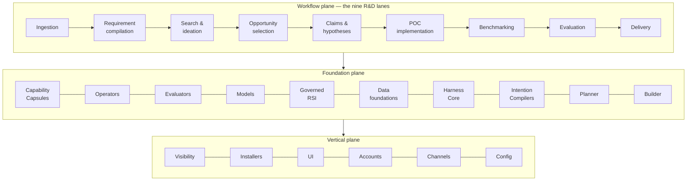

# The Intended AI4RnD Product

**Purpose of this document: define what is being built, independent of how it is built.** The
product is defined by `AI4RnD Feature List.xlsx` — 25 feature groups, 142 features — and this
definition is held constant across every architecture discussion in this package.

The workbook was read directly (not from summaries) and reconciles exactly:

| Sheet | Plane | Groups | Features |
|---|---|---:|---:|
| Workflow Features | Workflow — what a research run does | 9 | 54 |
| Foundation Features | Foundation — the machinery underneath | 10 | 65 |
| Vertical Features | Vertical — the product around both | 6 | 23 |
| **Total** | | **25** | **142** |

Row-level detail: [ownership CSV](traceability/142-feature-implementation-ownership.csv).

---

## 1. What the product does

A user brings a research question, a technical clue, or a pile of material. The product turns it
into defended, evidence-backed results:



**The nine lanes are capabilities, not a fixed pipeline.** A run may skip lanes (a pure literature
review never builds a POC), revisit them (failed evaluation sends work back to construction or
even to claims), run them in parallel (several hypotheses benchmarked at once), or expand them
recursively (a POC lane spawning its own inner search). What is fixed is what each lane must be
able to do, and what evidence it owes.

## 2. The five-level capability model

The workbook's most important structural idea is a strict separation of five things that are
easily conflated:

| Level | What it is | Lifetime |
|---|---|---|
| **Capability Capsule** | A governed, versioned, reusable capability identity | Independent of any request |
| **Contract** | The promise made for *this* request: scope, constraints, acceptance | One request |
| **TaskGraph** | The project-specific plan: what must be established, in what dependency order | One project |
| **Logical Operator** | A stable, callable action that a plan node invokes directly | Independent |
| **Physical Operator** | The concrete executor that actually performs it | One binding |

A Capsule is **not** a workflow template and not a renamed skill. Verified: all 42 capsule
manifests in the AI4RnD repository carry the same eight governed sections — applicability rules,
an input/output contract with pre/postconditions, composition compatibility, declared effects
(read/write/execute/network/cost/risk), resource bindings, verification requirements, permitted
and forbidden executors, and provenance. A skill carries a name, a description and a prompt.

### Capsule lifecycle

```svg
<svg viewBox="0 0 1190 440" width="1190" xmlns="http://www.w3.org/2000/svg" font-family="inherit" role="img" aria-label="Capability Capsule lifecycle">
<defs><marker id="ah3" viewBox="0 0 10 10" refX="9" refY="5" markerWidth="7" markerHeight="7" orient="auto-start-reverse"><path d="M0 0L10 5L0 10z" fill="var(--subtle)"/></marker></defs>
<rect x="40" y="36" width="170" height="52" rx="7" fill="var(--surface)" stroke="var(--line-strong)"/>
<text x="125.0" y="59" font-size="12.5" text-anchor="middle" font-weight="640" fill="var(--ink)">Defined</text>
<text x="125.0" y="73" font-size="11" text-anchor="middle" fill="var(--muted)">manifest authored</text>
<rect x="260" y="36" width="190" height="52" rx="7" fill="var(--surface)" stroke="var(--line-strong)"/>
<text x="355.0" y="59" font-size="12.5" text-anchor="middle" font-weight="640" fill="var(--ink)">Certified</text>
<text x="355.0" y="73" font-size="11" text-anchor="middle" fill="var(--muted)">schema + policy checks</text>
<rect x="500" y="36" width="170" height="52" rx="7" fill="var(--surface)" stroke="var(--line-strong)"/>
<text x="585.0" y="59" font-size="12.5" text-anchor="middle" font-weight="640" fill="var(--ink)">Registered</text>
<text x="585.0" y="73" font-size="11" text-anchor="middle" fill="var(--muted)">discoverable</text>
<rect x="720" y="36" width="200" height="52" rx="7" fill="var(--surface)" stroke="var(--line-strong)"/>
<text x="820.0" y="59" font-size="12.5" text-anchor="middle" font-weight="640" fill="var(--ink)">Selected</text>
<text x="820.0" y="73" font-size="11" text-anchor="middle" fill="var(--muted)">matches a step's requirement</text>
<rect x="970" y="36" width="180" height="52" rx="7" fill="var(--surface)" stroke="var(--line-strong)"/>
<text x="1060.0" y="59" font-size="12.5" text-anchor="middle" font-weight="640" fill="var(--ink)">Bound</text>
<text x="1060.0" y="73" font-size="11" text-anchor="middle" fill="var(--muted)">to a permitted executor</text>
<path d="M210 62 L260 62" fill="none" stroke="var(--subtle)" stroke-width="1.5" marker-end="url(#ah3)"/>
<path d="M450 62 L500 62" fill="none" stroke="var(--subtle)" stroke-width="1.5" marker-end="url(#ah3)"/>
<path d="M670 62 L720 62" fill="none" stroke="var(--subtle)" stroke-width="1.5" marker-end="url(#ah3)"/>
<path d="M920 62 L970 62" fill="none" stroke="var(--subtle)" stroke-width="1.5" marker-end="url(#ah3)"/>
<rect x="970" y="186" width="180" height="52" rx="7" fill="var(--surface)" stroke="var(--line-strong)"/>
<text x="1060.0" y="209" font-size="12.5" text-anchor="middle" font-weight="640" fill="var(--ink)">Executed</text>
<text x="1060.0" y="223" font-size="11" text-anchor="middle" fill="var(--muted)">under declared effects</text>
<rect x="700" y="186" width="200" height="52" rx="7" fill="var(--surface)" stroke="var(--line-strong)"/>
<text x="800.0" y="209" font-size="12.5" text-anchor="middle" font-weight="640" fill="var(--ink)">Verified</text>
<text x="800.0" y="223" font-size="11" text-anchor="middle" fill="var(--muted)">independent verifier</text>
<rect x="420" y="186" width="210" height="52" rx="7" fill="var(--surface)" stroke="var(--line-strong)"/>
<text x="525.0" y="209" font-size="12.5" text-anchor="middle" font-weight="640" fill="var(--ink)">Improvement candidate</text>
<text x="525.0" y="223" font-size="11" text-anchor="middle" fill="var(--muted)">from performance history</text>
<path d="M1060 88 L1060 186" fill="none" stroke="var(--subtle)" stroke-width="1.5" marker-end="url(#ah3)"/>
<text x="1052" y="142" font-size="11" text-anchor="end" fill="var(--muted)">in-flight runs pin their version</text>
<path d="M970 212 L900 212" fill="none" stroke="var(--subtle)" stroke-width="1.5" marker-end="url(#ah3)"/>
<path d="M700 212 L630 212" fill="none" stroke="var(--subtle)" stroke-width="1.5" stroke-dasharray="5 4" marker-end="url(#ah3)"/>
<text x="602" y="174" font-size="11" text-anchor="middle" fill="var(--muted)">performance history</text>
<rect x="420" y="336" width="210" height="52" rx="7" fill="var(--surface)" stroke="var(--line-strong)"/>
<text x="525.0" y="359" font-size="12.5" text-anchor="middle" font-weight="640" fill="var(--ink)">Promoted</text>
<text x="525.0" y="373" font-size="11" text-anchor="middle" fill="var(--muted)">new version, approved</text>
<rect x="720" y="336" width="200" height="52" rx="7" fill="var(--surface)" stroke="var(--line-strong)"/>
<text x="820.0" y="359" font-size="12.5" text-anchor="middle" font-weight="640" fill="var(--ink)">Rolled back</text>
<text x="820.0" y="373" font-size="11" text-anchor="middle" fill="var(--muted)">on regression</text>
<path d="M525 238 L525 336" fill="none" stroke="var(--subtle)" stroke-width="1.5" marker-end="url(#ah3)"/>
<text x="535" y="292" font-size="11" text-anchor="start" fill="var(--muted)">governed approval (RSI loop)</text>
<path d="M630 362 L720 362" fill="none" stroke="var(--subtle)" stroke-width="1.5" stroke-dasharray="5 4" marker-end="url(#ah3)"/>
<path d="M420 362 L230 362 L230 110 L560 110 L560 88" fill="none" stroke="var(--subtle)" stroke-width="1.5" marker-end="url(#ah3)"/>
<text x="240" y="130" font-size="11" text-anchor="start" fill="var(--muted)">promotion updates the registry</text>
<path d="M920 362 L1165 362 L1165 118 L610 118 L610 88" fill="none" stroke="var(--subtle)" stroke-width="1.5" marker-end="url(#ah3)"/>
<text x="700" y="138" font-size="11" text-anchor="start" fill="var(--muted)">rollback restores the prior version</text>
</svg>
```

During execution, capsules **shape, constrain, observe and improve** the work. They never hide
the plan: a TaskGraph node calls a Logical Operator directly, and the capsule governs which
Physical Operator may serve it, under which effects, verified by whom.

## 3. What each foundation group requires

| Group | Features | The requirement in one sentence |
|---|---:|---|
| Capability Capsules | 5 | Define, certify, discover, compose and evolve capsules as governed identities |
| Operators | 6 | Register logical actions, admit and certify executors, match and bind them, manage the fleet, profile performance, evolve under evaluators |
| Evaluators | 6 | Six evaluator families: conformance, engineering correctness, performance/cost, security/compliance/IP, evidence/factuality, lifecycle/human review |
| Foundational models | 3 | A capability registry of models, routing and selection, and auditable usage |
| RSI (self-improvement) | 8 | Eight governed improvement surfaces — text artifacts, routing, capsules/operators, plan structure, evaluators/rewards, memory/retrieval, model weights, data/benchmarks |
| Data foundations | 9 | Persistent memory plus seven typed knowledge graphs (concept, dataset, code, policy, workflow, trace, memory) and TaskGraph lifecycle persistence |
| Harness Core | 6 | Run lifecycle, durable messaging, DAG readiness and binding, admission and concurrency, dispatch and supervision, failure recovery and resume |
| Intention Compilers | 5 | Turn raw intent into a normalized, unambiguous, constraint-checked, acceptance-bearing Contract |
| Planner | 3 | Decompose the Contract into a validated, feasible TaskGraph |
| Builder | 14 | Construct code, models, experiment assets, benchmarks, verification assets, decisions, prototypes, integrations, repairs, reports and runtime deliverables — each with build evidence |

Two clarifications that matter later:

- **"Seven graphs" does not mean seven databases.** The requirement is seven *typed views* with
  their own schemas, provenance and lifecycle. One authoritative store with typed projections
  satisfies it.
- **RSI is governed, not autonomous.** Every improvement travels through proposal → risk
  classification → frozen-policy check → evaluation → human approval → versioned promotion →
  monitoring → rollback. An improvement that relaxes a frozen policy must be rejected before
  evaluation.

## 4. The vertical plane is part of the product

Visibility and statistics, installers for four platforms plus a web application, CLI/GUI/TUI,
account management, message channels (WeChat, Discord, tmux) and system configuration are 23 of
the 142 outcomes. They do not follow automatically from any runtime choice — under every
architecture option examined, the account subsystem, for example, is new work.

## 5. Current implementation state, in brief

The AI4RnD repository today is substantially ahead of "concept" and substantially short of the
workbook:

- **Real and tested:** evidence ledger with citation spans, append-only gate ledger, 42 capsule
  manifests + registry, a 4,189-line plan scheduler, research sources/extractors/evaluators,
  report capsules, GEPA text optimizer.
- **Present but unwired:** benchmark suites, several capsules with no bound runner.
- **Absent (verified by search):** the Idea Card schema, falsifiability screening as a stage, all
  seven typed graphs, account management, and most of the RSI surfaces.
- **Known-broken:** the citation grounding check, measured at 0.25 precision — the single most
  important correctness gap in the product.

The carrier today is a tmux cockpit driven by a polling shell script. The workbook's product —
channels, web UI, accounts, installers — is what JiuwenSwarm exists to provide.
