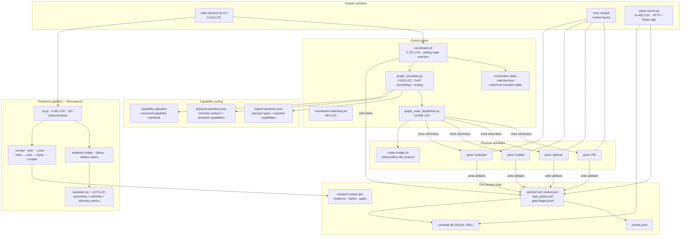
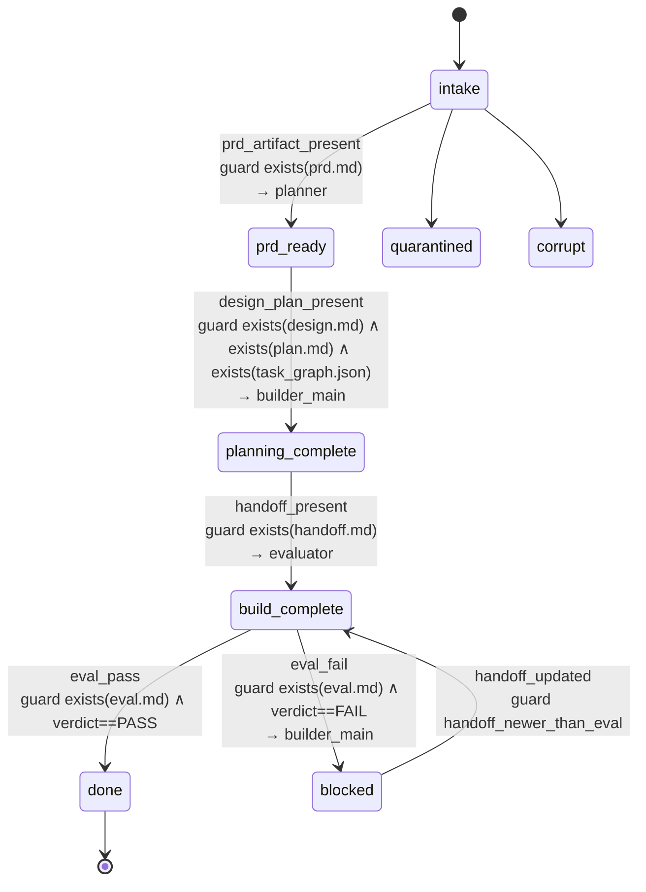
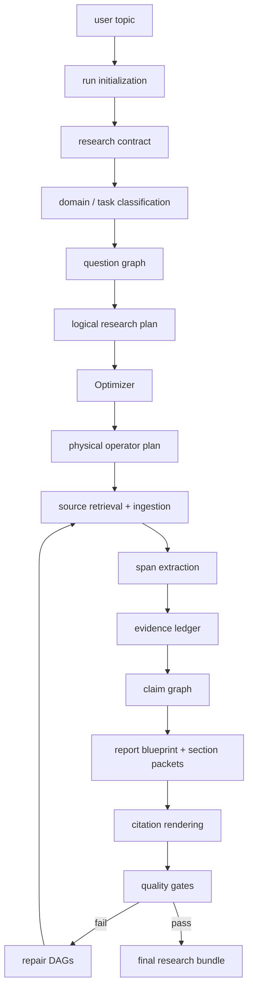

# AI4RnD Architecture — Current State

Analysed at `Stellven/AI4Research` commit `d35c511` (branch `openJiuwen-Solar`), with
specifications from `Stellven/AI4Research-A` and run artifacts from `Stellven/AI4Research-B`.

> **Revision 2.** This document describes what AI4RnD *is today*. What it is *meant to be* is
> in [00-intended-product-model.md](00-intended-product-model.md), which is the controlling
> target. Revision 1 under-described three areas; all three were re-examined by execution:
>
> | Area | Revision 1 | Revision 2 | Section |
> |---|---|---|---|
> | Capability Capsules | dismissed as ≈ skills | formal 11-section contract; 30 registered, 23 validated | §11 |
> | RSI | "largely aspirational" | GEPA is 3,540 LOC with a full promote/rollback lifecycle — unwired | §12 |
> | Unwired code | not identified | 19 modules, ~8,000 LOC, implemented + tested + uncalled | §13 |
>
> Also corrected: the citation-grounding evaluator was **measured** at precision 0.25 (§7.5).

---

## 0. Identifying the system

The task names this system "AI4RnD". That string appears in no repository, package,
module, or configuration key in any repository available to this session. The identifier
resolves to the `Stellven/AI4Research*` family:

| Repository | Contents | Role |
|---|---|---|
| `Stellven/AI4Research` | ~534k LOC Python, ~83k LOC shell, 5,778 files | the implementation |
| `Stellven/AI4Research-A` | 3 documents, 2,376 lines | the Pipeline A architecture specification |
| `Stellven/AI4Research-B` | run artifacts, benchmark data, a vendored agent codebase | Pipeline B execution records |

`AI4Research`'s own README self-describes as **"OpenJiuwen Solar"**, and is candid about
scope: *"Solar is not a finished autonomous cloud service and not a TypeScript orchestrator
product. The working product today is the local harness plus the installer/lifecycle tooling
around it. … Some code in `core/` is roadmap scaffolding or compatibility glue."* [E-A01]

Throughout, **AI4RnD** means the system as a whole; **Solar harness** means the runtime in
`AI4Research/harness/`.

There is a naming collision worth flagging early: AI4RnD has a component called
`lib/symphony/` (its status server and scheduler), and JiuwenSwarm has an unrelated
subsystem called Symphony (skill retrieval and orchestration). They share nothing.

---

## 1. What it is

AI4RnD is a **local multi-agent software and research cockpit**. It does not run agents
in-process. It opens real CLI agent processes — Claude Code or Codex — in tmux panes, and
drives them by typing instructions into those panes. Work is recorded as file-backed
sprint and run artifacts; a bash coordinator polls those files and dispatches the next
step; human approval gates sit between phases.

Two distinguishable layers coexist in the same tree:

1. **The Solar harness** — sprint lifecycle, pane dispatch, DAG scheduling, capability
   routing, gate ledger. General-purpose software delivery.
2. **The research pipeline** — `harness/lib/research/`, a source-grounded research
   compiler with an evidence ledger, claim graph, citation verification and quality gates.
   This is the part that makes AI4RnD *research* infrastructure rather than a coding agent.

The integration question is mostly about layer 2. Layer 1 substantially duplicates — and
in places conflicts with — what JiuwenSwarm already provides.

---

## 2. Topology



---

## 3. The four-agent model

AI4RnD's canonical agent set is **PM → Planner → Builder → Evaluator**. The GUI design
contract is explicit that this is *not* a linear pipeline:

> *"The orchestration is a capability-routed DAG, not a line, so do NOT draw a fixed
> PM → Planner → Builder → Evaluator pipeline with directional flow/arrows — that implies
> a linearity that isn't real."* [E-A02]

And on failure semantics:

> *"the run **stalls honestly** when no agent advertises a needed capability"*

That sentence encodes the architecture's central mechanism. Work is routed by *capability
match*, and when no worker advertises a required capability the node strands with an
explicit reason token (`no_matching_worker`) rather than being force-assigned. Honest
stalling is a stated design value, reflected in the UI rules ("a stalled sprint **never**
shows a filled percentage bar or a synthesized 'Result is available'").

---

## 4. Orchestration and routing

### 4.1 Sprint state machine

`config/coordinator-state-machine.json` is a frozen (since 2026-05-08) canonical transition
table. All routing decisions are stated to flow through it. [E-A03]

Lifecycle states: `intake`, `prd_ready`, `planning`, `planning_complete`, `building`,
`build_complete`, `evaluating`, `done`, `blocked`, `quarantined`, `failed`, `corrupt`.

Each transition declares `from`, `event`, `guard`, `to`, `requested_role`,
`required_artifacts`, `timeout_policy` (separate ack and artifact timeouts) and
`retry_policy` (max attempts, backoff).



Note the guard style: **every transition is guarded on the existence of a file artifact**,
not on a message or a return value. The filesystem is the bus.

### 4.2 Logical and physical operators

Two registries, and the separation is real and useful.

**`config/logical-operators.json`** — operator *types*, each declaring required
capabilities with integer levels, a primary role, cost hint and concurrency policy. [E-A04]

```json
"DeepArchitect": {
  "primary_role": "planner",
  "required_capabilities": { "architecture_reasoning": 4, "long_context": 3,
                             "multi_agent_coordination": 3 },
  "cost_hint": "high",
  "concurrency": { "max_parallel": 6, "singleton": false }
}
```

Shipped operator types include `DeepArchitect`, `RootCauseDebugger`, `ImplementationWorker`,
`PatchWorker`, `TestDesigner`, `TestRunner`, `BenchmarkRunner`, `ParallelExplorer`,
`ResearchScout`. Some carry `risk_constraints` (e.g. `BenchmarkRunner` requires
`allowed_shell_scope: allowed`).

**`config/physical-operators.json`** — concrete workers. Each entry describes a real
runtime: provider, vendor, backend, model, `surface.launch_cmd`, billing pool, quota cycle,
`roles`, `task_classes`, `strengths`, `preferred_for`, `avoid_for`, cost/latency/context
tiers, `max_concurrency`, live `state` (availability, runtime_state, cooldown_until) and
`flow_control` (last block state/reason/expiry). [E-A05]

A representative entry:

```json
"mini-claude-opus-planner": {
  "profile": "planner", "provider": "anthropic", "backend": "claude-cli", "model": "opus",
  "surface": { "type": "claude_code_interactive", "tool": "claude",
               "launch_cmd": "claude --dangerously-skip-permissions --model opus" },
  "compat_maps_to": { "host_type": "tmux_pane",
                      "carrier_hint": { "tmux_pane_meta": { "session": "solar-harness", ... } } }
}
```

Two things follow. First, the physical operator abstraction is genuinely pluggable — a
worker is described by data, and `compat_alias_for: tmux_pane` implies tmux is one carrier
among possible others. Second, **the shipped carrier launches its workers with
`--dangerously-skip-permissions`**, i.e. with the agent CLI's own safety gate disabled.

**`config/capability-capsules.registry.yaml`** — a third layer: versioned capability
manifests (`cap.requirement-compiler-planner`, `cap.requirement-research-scout`, …) each
with a schema ref, manifest path, tags, owner and a `default_operator_profile`. Capsules
bind a named capability to a preferred worker profile.

### 4.3 The routing algorithm

`graph_scheduler.py` performs worker assignment. The logic is careful and worth stating
precisely, because it is one of AI4RnD's strongest pieces of design. [E-A06]

Per ready node, over all workers:

1. **Role penalty** — a worker whose role cannot serve the node's dispatch role is skipped.
2. **Capability match — the hard gate, never relaxed.** In the code's own comment:
   *"Capability match is the HONEST hard gate (never relaxed): a worker missing a required
   capability is genuinely unqualified and is skipped for BOTH the strict and the relaxed
   pass."*
3. Quota exhaustion, strict model match, runtime availability, pane already used, worker
   busy — each skips the worker and records *why*.
4. Survivors are scored on `(role_penalty, −capability_score, −skill_match_count,
   model_penalty, load, pane)`.
5. **Skills are a preference, not a gate.** A worker clearing role + capability + quota +
   model + runtime + capacity but not matching free-form skill strings goes to a *relaxed*
   candidate list. If the strict list is empty, the best relaxed candidate is dispatched —
   the "Layer 3 liveness net" — so a node can never permanently strand on a drifted skill
   string while a capability-qualified worker is idle.
6. If both lists are empty, the node queues with a discriminated reason:
   `worker_runtime_unavailable` (with specific reasons), `worker_capacity_exhausted`, or
   `no_matching_worker` (with `missing_capabilities`, `missing_skills`,
   `any_worker_seen`, `role_candidates_seen`).

The distinction between "no capable worker exists" and "capable workers are all busy" is
maintained end-to-end and surfaced in the UI. This is more honest than most schedulers.

### 4.4 DAG scheduling

`graph_scheduler.py` turns planner output (`sprint-<sid>.task_graph.json`) into dispatch
decisions, with stated guarantees [E-A07]:

- invalid DAGs fail fast (missing deps, cycles, duplicate nodes)
- ready nodes require all dependencies passed
- **nodes with overlapping `write_scope` never share a batch**
- nodes without a declared `write_scope` are treated as exclusive writers
- the parent sprint cannot pass until every node and required gate has passed

Supporting functions: `topo_order`, `topo_layers`, `critical_path`,
`graph_parallelism_metrics`, plus `assert_node_status_write_allowed`,
`_assert_pass_mark_allowed` and `_passed_without_required_eval` — guards that prevent a
node being marked passed without the required evaluation evidence.

Write-scope conflict avoidance is a real concurrency-correctness feature that JiuwenSwarm
has no equivalent for.

---

## 5. Dispatch — how instructions reach a worker

The shipped carrier is tmux. `dispatch_to_pane()` sends text into a pane and then a
separate `Enter`. The protocol document records why, in detail [E-A08]:

- **Swallowed keys.** `tmux send-keys "$cmd" Enter` in one call loses the `Enter` because
  the Claude Code CLI's input buffer cannot keep up. Fix: send text, `sleep 0.8`, send
  `Enter` separately.
- **Busy panes swallow input.** If the pane shows `✳ / ✶ / ⏺ / Cogitated / Cooked /
  Propagating / Worked for`, sent text is lost. Fix: `capture-pane`, grep for busy markers,
  poll up to 12 × 10 s, then record `DISPATCH_DEFERRED` and fail.
- **Directory mtime does not change on content edits** (macOS APFS), so a coordinator
  watching the sprints directory misses status changes. Fix: scan all
  `sprint-*.status.json` and take max file mtime, ~24 ms per round for 24 files.

There is a second carrier: the **Codex bridge**, a file-based request/response protocol.
`coordinator.sh call_codex()` checks a budget and a tier, writes
`codex-bridge/inbox/*.req.md`; a daemon polls the inbox, parses frontmatter, re-checks tier
and budget, runs `codex exec -s read-only` (non-interactive, read-only sandbox), writes
`codex-bridge/outbox/*.res.md`, appends a ledger entry, consumes budget and moves the
request to processed. Three call tiers (S: 4000 tokens for root-cause/architecture
decisions; A: 2000 for cross-module logic; B: forbidden for CRUD and simple scripts) with a
daily circuit breaker (`daily_call_limit: 30`, `daily_token_limit: 20000`, `hard_stop`).

The Codex bridge is materially better engineered than the tmux path: bounded, budgeted,
read-only, auditable.

---

## 6. State model

Everything is file-backed and inspectable. That is a deliberate, repeatedly stated
principle: *"Store major outputs as files so runs are easy to inspect, test, and debug"*
and *"Gate later stages on validated artifacts instead of hidden model context."* [E-A09]

| Artifact | Purpose |
|---|---|
| `sprints/<sid>.status.json` | sprint status, round, phase, history |
| `sprints/<sid>.task_graph.json` | the DAG; carries `workflow_contract_id`/`version`/`hash` |
| `sprints/<sid>.gate-ledger.jsonl` | append-only gate/status evidence |
| `sprints/<sid>.finalized` | idempotency marker for finalisation |
| `sprints/.quarantine/MANIFEST.md` | quarantined corrupt sprints |
| `events.jsonl` | append-only event stream |
| `run/state.db` | SQLite (WAL, busy_timeout) — capabilities, leases, run registry |
| `prd.md` / `design.md` / `plan.md` / `handoff.md` / `eval.md` | phase artifacts, and the transition guards |

### The gate ledger

`lib/gate_ledger.py` implements append-only gate evidence with **node status as a
projection** — a genuinely good design. Record kinds: `eval_verdict`, `auto_resolution`,
`repair_start`, `repair_exhausted`, `human_verdict`, `gate_check`, `status_transition`,
`route_record`. Each carries an author (`evaluator` / `doctor` / `policy` / `human` /
`scheduler` / `operator`), a `verdict_kind` (`content` / `mechanical` / `infrastructure`),
an eval generation, a repair attempt counter, an evidence snapshot timestamp, and for
route records the provider, model, operator id, backend, exit code and timings. [E-A10]

Status transitions additionally record `writer` — *which code seam performed the write* —
described as "the AC-R4.3 audit key", plus `applied: False` for neutralised would-be writes
and `reopen: True` for the legacy reopen-from-pass allowance. The system audits its own
state mutations.

### Atomic command triad

State updates that touch status + history + event go through atomic commands using
tempfile+rename, introduced specifically because agents were previously told to edit JSON
with inline `python3 -c` subshells and were partially completing the update, deadlocking
the coordinator [E-A08]:

| Command | Actor | Transition | History event |
|---|---|---|---|
| `plan-verdict <sid> approve\|reject` | evaluator | planning → approved/active | `plan_reviewed` |
| `handoff-submit <sid>` | builder | approved → reviewing | `implementation_completed` |
| `eval-verdict <sid> pass\|fail` | evaluator | reviewing → passed/failed_review | `eval_completed` |

---

## 7. Verification model

This is AI4RnD's distinguishing contribution and the reason the integration question is
worth asking at all.

### 7.1 Structural verification — `verification_gate.py`

```python
if writer_actor_id and verifier_actor_id and writer_actor_id == verifier_actor_id:
    reasons.append("writer_and_verifier_same_actor")
```

A code task cannot pass without: a patch artifact, test evidence, a verifier decision of
`pass`/`approved`, and **a verifier distinct from the writer**. [E-A11] `check_dag_done`
adds a `high_risk` path and an available-providers check.

`graph_scheduler` reinforces this: `_node_has_independent_eval_report`,
`_node_eval_is_self_graded` and `_passed_without_required_eval` detect and block
self-graded passes.

### 7.2 Epistemic verification — the research evaluator

`lib/research/evaluator.py` (1,673 LOC) computes metrics over exported research artifacts:

| Function | Checks |
|---|---|
| `_citation_grounding_metrics` | does each cited span actually support the sentence citing it |
| `_grounding_checks` | per-claim grounding against evidence text |
| `_source_authority_metrics` / `_source_authority_score` | source trustworthiness, from `policies/source_authority.json` |
| `_source_diversity_metrics` | are sources concentrated in one family |
| `_source_type_validation_metrics` / `_source_type_is_plausible` | is a claimed source type consistent with its URL/title/text |
| `_section_coverage_metrics` | does the report cover the planned sections |
| `_expert_novelty_metrics` | is synthesis adding anything beyond the sources |
| `evaluate_figures_grounding` | are figures grounded |
| `evaluate_final_closeout` / `evaluate_retrieval_closeout` | terminal gates |
| `_apply_profile_gate` | applies per-profile thresholds (`profiles/*.yaml`) |

Plus a pluggable gate registry (`survey/gates/_registry.py` with `@register_gate`,
`DuplicateGateError`, `GateNotFoundError`) and shipped gates: `argument_density`,
`controversy_matrix`, `global_consistency_pass`, `source_quality_distribution`. [E-A12]

### 7.3 The data model

`lib/research/schemas.py` defines the typed artifact set: `SourceConnector`, `SourceHit`,
`SourceDocument`, `EvidenceItem`, `Claim`, `ClaimEvidenceLink`, `CitationSpan`, `Section`,
`Chapter`, `BibEntry`, `Bibliography`, `QualityReport`, `ReportAST`, `FigureSpec`,
`LivingReport`, `ResearchLab`, `ResearchMemory`, `AIInfraPack`, `ArtifactDelta`. [E-A13]

IDs are deterministic: `make_id(*parts)` joins with `|`, SHA-256s the UTF-8 encoding and
takes the first 16 hex characters. Content is hashed with SHA-256. Citation spans are
verified at **character and byte offsets** (`evidence/citation_span.py`), which is what
makes "this sentence is supported by exactly these characters of this source" checkable
rather than asserted.

Persistence: SQLite (`migrations/001_init.sql`, 7 tables) plus JSONL export.

### 7.5 ⚠ MEASURED — the grounding gate does not verify grounding

Revision 1 left this as an open spike. It is now measured, and it is the most consequential
finding in this analysis. [V-12]

The check is not Jaccard-based, as Revision 1 assumed. `evaluator.py:443-476`:

```python
overlap = sorted(context_tokens & evidence_tokens)
checks.append({..., "ok": bool(overlap), ...})
```

A citation is "grounded" if the citing line shares **one** token (≥3 chars) with the evidence
text. Against one evidence item and nine hand-labelled citing sentences:

```
PRECISION of 'grounded'  = 0.25   (6 of 8 passes are wrong)
DETECTION of unsupported = 1/7 = 0.14
```

- *"FlashAttention was invented in 1823 by Napoleon Bonaparte"* → **GROUNDED** (on
  `flashattention`)
- *"Bananas are yellow and grow in tropical climates"* → **GROUNDED** (on `and`)
- Only a sentence sharing literally zero tokens is flagged.

A word-boundary search for `entail`, `NLI`, `entailment`, `cross_encoder`, `deberta`, `mnli`
across `harness/lib/**/*.py` returns **zero** matches — there is no entailment machinery
anywhere.

**Assessment.** The ledger, spans, content hashing and source-authority scoring are sound and
portable. The *judgement layer* on top of them is not. AI4RnD's central claim — that its
output is verified — does not currently hold at the citation-grounding layer. Real entailment
must be built before the claim can be made, and this moves it from late hardening into
Stage 1 of the plan.

### 7.4 The stated discipline

From the Pipeline A SDD [E-A14]:

```
LLM proposes.
Schemas constrain.
Code validates.
Gates decide.
Artifacts preserve.
```

with explicit prohibitions — an LLM must not invent citations, own run state, silently
change the research contract, bypass gates, or introduce unsupported facts into final prose.

And on the worker runtime:

> *"Codex should receive bounded work packets and return artifacts. It should not receive
> an unrestricted instruction to 'research the topic' or 'write the whole report' outside
> the operator plan."*

---

## 8. The research pipeline

### 8.1 Target flow (Pipeline A SDD)



The **Optimizer** turns a logical research need into a physical operator plan, taking the
contract, domain classification, question graph, available operators and connectors, budget
limits, existing artifacts and prior gate failures. Critically: *"The optimizer should not
be hidden chain-of-thought. It should be code-defined, inspectable, and persisted. An LLM
can help propose a plan, but the final plan must validate against schemas and rules."*

Specified quality gates: `SchemaValidationGate`, `EvidenceReferenceGate`, `ClaimSupportGate`,
`CitationSpanGate`, `FreshnessGate`, `SourceDiversityGate`, `QuestionCoverageGate`,
`ContradictionCoverageGate`, `ReportCompletenessGate`, `FinalCloseoutGate`.

**Repair DAGs** are explicit: a `ClaimSupportGate` failure triggers
`TargetedEvidenceSearchOperator → EvidenceExtractOperator → ClaimVerifyOperator →
SectionRewriteOperator → rerun ClaimSupportGate`, persisted to `repair/repair_dags.jsonl`.

### 8.2 What is actually implemented

The CLI is real and large — 4,381 lines, 50+ subcommands [E-A15]:

- **Core** — `init`, `add-source`, `extract`, `ledger`, `status`
- **Run** — `run`, `plan`, `search`, `mine`, `outline`, `write`, `check`, `compile`,
  `compile-grounded`, `synthesize`, `export`
- **Human-in-the-loop retrieval** — `handoff-search`, `import-search` (accepts human,
  Gemini or GPT search Markdown), `serper-usage`
- **Evaluation** — `eval-artifacts`, `policy-doctor`, `policy-explain`, `source-audit`,
  `closeout`
- **Survey pipeline** — `survey-plan`, `survey-pack`, `survey-write-section`,
  `survey-run-sections`, `survey-watch-responses`, `survey-watch-register`,
  `survey-watch-tick`, `survey-rewrite-queue`, `survey-rewrite-run`, `survey-auto-repair`,
  `survey-finalize-run`, `survey-import-search-results`, `survey-enrich-papers`,
  `survey-status-next-action`, `survey-continue`, `survey-review`, `survey-compile`,
  `survey-chief-editor`, `survey-doctor`, `survey-eval`, `survey-diagnose`

Depth tiers: `quick` (3–5 sources), `standard` (10–20), `deep` (50+).

`survey-auto-repair` — "strict-eval survey, rewrite failed sections, then re-eval" — is a
working instance of the repair loop the SDD specifies.

**Gap between spec and implementation.** The SDD's named operators
(`ResearchContractOperator`, `QuestionGraphOperator`, `ClaimCompiler`, `OntologyMapOperator`,
`ContradictionSearchOperator`, …) do not exist as an operator registry in
`lib/research/`. The implemented pipeline is CLI-subcommand-shaped, not operator-shaped.
The optimizer that compiles a logical plan into a physical operator plan is likewise not
present as a distinct module. The ontology is specified but not implemented as a module.
Treat the operator/optimizer/ontology layer as **specified, not built**.

### 8.3 Knowledge base

A separate schema-driven wiki under `runtime/schema/` with four contracts:
`entities.yaml` (node types with typed fields, ranges, enums, conditional requirements),
`edges.yaml` (relation types with endpoints, direction, owning workflow, attributes),
`xref.yaml` (bidirectional link rules — a forward link *requires* the reverse update),
`conventions.yaml` (slug rules, path patterns, wikilink syntax, append-only and
ownership rules). [E-A16]

Ownership is enforced by contract: `raw/papers`, `raw/notes`, `raw/web` are user-owned and
skills must not overwrite them; `wiki/graph` is tools-only; `wiki/log.md` is append-only.

---

## 11. Capability Capsules — the layer Revision 1 missed

Revision 1 treated capsules as "versioned capability manifests binding a capability to a
preferred worker profile" and dismissed them as near-skills. Execution shows a substantially
richer abstraction. [V-11]

**Executed:** `load_capability_capsule_registry()` returns **30 entries**; all 23 shipped
manifests under `config/capability-capsules/` load and pass
`validate_capability_capsule_semantics()` with **0 invalid**.

The schema (`schemas/draft/capability-capsule.v1.draft.json`) requires **eleven** top-level
sections. A JiuwenSwarm skill has two (`name`, `description`):

| Section | Contents (verified on `cap.requirement-compiler-planner`) |
|---|---|
| `capability_capsule_id`, `version` | identity + versioning for promotion/rollback |
| `capsule_kind` | `capability` \| `guard` \| `resource` |
| `metadata` | name, description |
| `applicability` | `task_types`, `positive_signals`, `negative_signals` |
| `contract` | `inputs`, `outputs`, `preconditions`, `postconditions`, `invariants` |
| `composition` | `consumes`, `produces`, `compatible_with`, `incompatible_with`, `requires_after` |
| `effects` | `read`, `write`, `execute`, `network`, `cost` |
| `bindings` | `skills`, `mcp_capabilities`, `data_refs`, `secret_refs`, `required_guard_capsules` |
| `verification` | `self_check`, `external_verifier`, `pass_conditions` |
| `operator_compatibility` | `preferred`, `forbidden` |
| `provenance` | owner, created_at, manifest_path |

Two details settle the "renamed skill" question:

- **`bindings.skills`** — a skill is an *ingredient* of a capsule, not an equivalent.
- **`required_guard_capsules`** — capsules can gate other capsules, which skills cannot do.

`effects` and `operator_compatibility` are the architecturally significant additions: they let
a capability declare "this must never touch the network" or "this may not run on operator X",
and have it enforced at **binding time** rather than trusted at runtime. Nothing in
JiuwenSwarm's skill model can express this.

Supporting modules, all **implemented and unwired**: `capsule_execution_gate` (194 LOC —
`check_cooldown`, `check_idempotency`, `GateDecision`, `IdempotencyResult`),
`skill_to_capsule_compiler` (323 LOC — promotes a skill manifest into a capsule draft),
`capability_token` (105 LOC).

## 12. RSI — one surface of eight, built and disconnected

Revision 1 called RSI "largely aspirational". That is right for seven of the eight surfaces
and wrong for the most important one. [V-13]

**`integrations/gepa_optimizer/` — 3,540 LOC across 11 modules**, exposing the complete
controlled-improvement lifecycle:

```
propose · run · review · promote · rollback · status
```

Its safety contract is genuinely strong, and is the model the target architecture adopts:

- dry-run default; `--execute` **rejected unless all three** of `--max-evals`,
  `--max-spend`, `--max-walltime` are supplied;
- promotion targets restricted to `/tmp`; production paths rejected;
- `hard_policy_checker.py` freezes core safety policy — a candidate may not relax
  `secrets_access`, `git_push`, `destructive_shell`, `payment_action`, `external_api_write`.

`evolution_engine.py` (854 LOC) also executes — `scorecard`, `recommend`, `promote`,
`demote-degraded`, `status` — but tracks exactly **one** capability
(`deepresearch.quality_gate`) with 0 terminal nodes and 0 examples. `failure_miner.py`
clusters events into candidates.

**Neither is referenced by `coordinator.sh` or `solar-harness.sh`.**

Coverage across the eight RSI surfaces the product specifies (word-boundary search):

| Surface | Named methods | Status |
|---|---|---|
| 1 Text artifacts | GEPA / MIPROv2 / TextGrad | **GEPA built** (19 files); others absent |
| 2 Runtime routing | Bayesian opt / bandits | absent |
| 3 Capsules & operators | trajectory mining / CEGIS / Voyager | partial (`skill_to_capsule_compiler`) |
| 4 DAG & organisation | AFlow / MCTS / ADAS | absent |
| 5 Evaluator & governance | judge calibration / reward modelling | absent |
| 6 Memory & evidence | Self-RAG / reranker training | absent |
| 7 Model weights | SFT / LoRA / DPO / GRPO | absent |
| 8 Data & benchmarks | active learning / hard-case mining | partial (`failure_miner`) |

## 13. The unwired layer — ~8,000 LOC of finished, uncalled code

An executed probe over 48 architecturally significant modules: **48/48 import cleanly**
(stdlib + pyyaml), **29/48 are referenced by the live runtime**, **43/48 have tests**. [V-8]

The 19 unwired modules are the finding. Two clusters matter most:

- **The capsule layer** (`capability_capsules` 1351, `capsule_execution_gate` 194,
  `skill_to_capsule_compiler` 323, `capability_token` 105) plus the operator registries
  (`logical_operator_registry`, `physical_operator_catalog`, `operator_state_machine`).
- **A durable actor model** — `actor_registry` (382), `actor_lease` (238), `actor_mailbox`
  (102), `actor_runtime` (329). This directly implements the two Harness Core capabilities
  JiuwenSwarm lacks: a durable task queue and lease/concurrency control. It sits unused while
  the live system polls the filesystem and leases tmux panes.

Plus `task_graph_io` / `task_graph_state_io` (842), `evidence_ledger` (117), `event_ledger`
(198), and `gepa_optimizer` (3,540).

**One naming trap for anyone porting:** `operator_router.py` (305 LOC) looks central and is
not — it belongs to the AI-influence digest subsystem and dispatches scheduled scripts per
named "line". It is unrelated to logical→physical operator binding, which lives in
`graph_scheduler.py`.

**Cost implication.** Treating these as "to build" over-estimates the work; treating them as
working over-claims. They are one integration effort — not one implementation effort — from
being live, and whether they compose correctly is unproven (risk R7).

## 9. Security and operational boundaries

This is the weakest part of AI4RnD, and it matters for the integration decision.

| Aspect | Observed |
|---|---|
| Worker launch | `claude --dangerously-skip-permissions --model opus` — the CLI's own permission gate is disabled [E-A05] |
| Instruction channel | `tmux send-keys` into an interactive REPL — no authentication, no structure, no delivery guarantee; requires busy-polling heuristics and sleeps [E-A08] |
| Isolation | none at the pane level. Workers run as the user, with the user's filesystem and credentials |
| Codex path | genuinely sandboxed: `codex exec -s read-only`, non-interactive, budgeted, circuit-broken |
| Budget control | real, for Codex: daily call and token limits with hard stop |
| Concurrency safety | pane leases (`pane_lease.py`, `pane-lease.sh`), write-scope conflict avoidance in the DAG scheduler, SQLite WAL |
| Secrets | `gitleaks.toml` present; `physical-operators.json` uses `key_ref` indirection rather than inline keys |
| Audit | strong — append-only events, gate ledger with writer attribution, route proofs |

So: excellent *auditability*, effectively absent *containment*. The system knows exactly
what happened; it has few means of preventing it.

### Reliability

`DISPATCH-PROTOCOL.md` is, in effect, a bug post-mortem log — nine numbered root-cause
analyses of coordinator failures: swallowed keys, missed mtime changes, busy-pane input
loss, zombie pidfiles (twice), `last_state` overwriting concurrent sprints, plan-review
deadlock from partial JSON edits, `get_latest_sprint_file` skipping terminal states so
finalisation never fired, and — the most instructive — **Bug #5**: the coordinator ran for
13 hours and 3,766 poll iterations with zero heal-branch executions because *the running
bash process had loaded the old code from before the branch was added*. Bash reads a script
into memory at start; editing the file does not affect the running process. [E-A08]

Each was fixed, and the fixes are sound (atomic commands, self-healing scans, per-sprint
state dicts, periodic compensating sweeps, md5 logging at startup, PROBE logs on
rarely-taken branches). But the pattern is clear: **polling a filesystem and typing into
terminals is a failure-generating architecture**, and a large fraction of AI4RnD's
engineering effort has gone into compensating for it.

---

## 10. Assessment

**Genuine strengths, in rough order of value:**

1. Evidence ledger with byte-accurate citation spans and content hashing.
2. Claim graph with typed relations and verification status.
3. A pluggable quality-gate framework with grounding, authority, diversity and coverage
   metrics, and per-profile thresholds.
4. Capability-based routing with an honest hard gate and discriminated stall reasons.
5. Append-only gate ledger with writer attribution and status-as-projection.
6. Writer ≠ verifier enforcement.
7. Write-scope conflict avoidance in DAG batching.
8. A file-first artifact discipline that makes runs inspectable and testable.
9. The Codex bridge's bounded, budgeted, read-only worker protocol.

**Genuine weaknesses:**

1. tmux/`send-keys` dispatch — fragile, unauthenticated, requires heuristic polling.
2. `--dangerously-skip-permissions` workers with no isolation.
3. Bash as the control plane for a state machine of this complexity.
4. Filesystem polling with platform-specific mtime semantics.
5. Sprawl — `harness/lib/` holds 300+ modules with heavy overlap (at least three distinct
   "operator" concepts: `logical_operator_registry`, `physical_operator_catalog`,
   `operator_router`; multiple closeout modules per past sprint).
6. Substantial spec/implementation divergence in the research operator layer.
7. Single-machine, single-user, macOS-primary. No packaging beyond a shell installer.
8. Extensive one-off `*_closeout.py` modules suggest artifacts of past sprints kept in the
   tree rather than a maintained API surface.

**The one-line summary, revised.** AI4RnD has the right *architecture* for correctness — an
evidence ledger, governed capsules, capability-gated routing, an append-only gate ledger, and
a safety-bounded improvement loop — and the wrong *substrate for execution*. But it does not
yet have the right *implementation* of correctness: the grounding gate that is supposed to
enforce the whole discipline passes at precision 0.25, and the capsule and RSI layers that
carry the architecture are not connected to anything. JiuwenSwarm has the right substrate,
no ideas about correctness, and a permission layer that silently loads no rules.

Both systems are further from their stated claims than their documentation suggests, in
opposite directions. That is what the staged plan has to address first — see
[09-implementation-plan.md](09-implementation-plan.md), Stages 0–1.

## 15. Health signals, measured

| Signal | Result |
|---|---|
| Module imports (48 architecturally significant) | **48/48 clean** on stdlib + pyyaml |
| `tests/graph` | **321 passed** |
| `tests/evaluators` | **104 passed** |
| `tests/gate_ledger` | **124 passed**, 2 failed — both root-environment artifacts (`chmod 0o500` does not block uid 0) |
| `tests/experience` | **7 passed** |
| Full suite | **aborts at collection** — a test module raises `SystemExit(2)` at import |
| Research core standalone | init → add-source → extract → ledger → mine, no harness |
| Capsule manifests | 23/23 valid |
| Grounding evaluator | **precision 0.25 / detection 0.14** |
