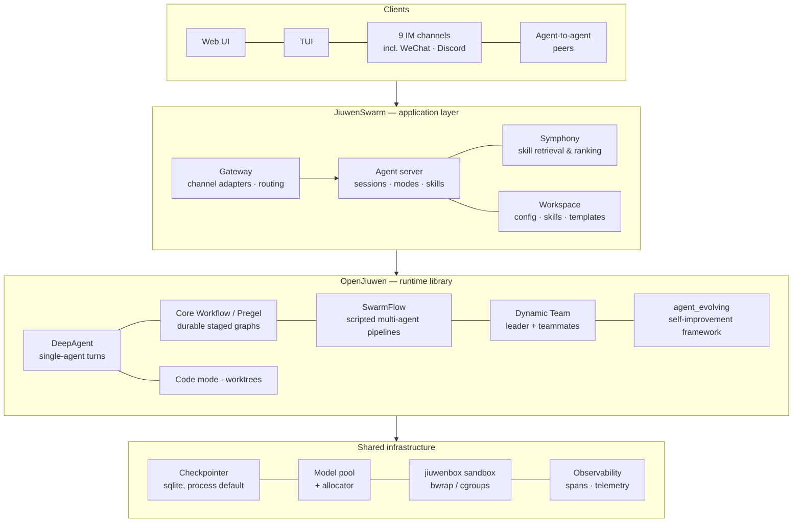

# JiuwenSwarm and OpenJiuwen Architecture

**Purpose of this document: describe the foundation as it actually is — what can be relied on,
what exists but is not reachable, and what is missing.** Every "confirmed" below was executed in
this analysis; every "not reachable" was demonstrated, not assumed. Probe details:
[06-evidence-assumptions-open-questions.md](06-evidence-assumptions-open-questions.md).

Versions examined: JiuwenSwarm `0.2.3.beta1`, OpenJiuwen `0.1.15.post3`.

---

## 1. The two-layer shape

JiuwenSwarm is the **application**: the deployable product with channels, a gateway, a web UI and
workspace management. OpenJiuwen is the **runtime library** it is built on: agents, execution
engines, sandboxing, memory and evolution primitives. Most execution capability lives in
OpenJiuwen; JiuwenSwarm wires a subset of it into the application.

## 2. The execution mechanisms

These five mechanisms are what AI4RnD work would actually run on. **None of them is a product
architecture**; each is a way of running work.

| Mechanism | Best for | Durability model |
|---|---|---|
| **DeepAgent** | One bounded agent task | Session checkpointer |
| **Core Workflow (Pregel)** | Stable multi-stage lifecycles with checkpoints and human interrupts | Graph snapshot/restore per superstep |
| **SwarmFlow** | Deterministic multi-agent pipelines: fan-out, panels, loops | Write-ahead journal; completed calls replay for free |
| **Dynamic Team** | Genuinely open-ended collaboration | Team session state |
| **Code mode / worktrees** | Software construction in isolation | Git worktree per task |

### Confirmed by execution

- **Journal replay is real.** A SwarmFlow run interrupted at step B was resumed: only step B
  re-executed; a third run replayed entirely from the journal with zero live calls.
- **Runtime-computed fan-out works in Core Workflow.** A conditional router returning a
  runtime-computed list of target nodes was accepted and the graph ran to completion. (Caveat:
  the router receives no arguments — fan-out width must come from a closure or a channel read.)
- **Admission control is a hard precondition.** SwarmFlow refuses to launch without a configured
  concurrency governor, with an explicit error, rather than running unmetered.
- **A stock install has persistent state.** The agent server configures a sqlite-backed
  checkpointer as the process default at startup.

### Confirmed gaps — the ones that shape the integration

| Gap | What was observed | Why it matters |
|---|---|---|
| **Silent model substitution** | Requesting an unknown model name resolves to `None` and the worker's default model is used, with no error or warning | A research product cannot run a step on a substitute model unannounced. Until fixed, model routing stays on the AI4RnD side. |
| **Resume is not exposed** | The agent-facing SwarmFlow tool advertises a `resume_id` parameter and rejects it: *"not supported yet"*. Resume exists only as an internal control-plane call | The integration bridge must provide the resume path; it is not free |
| **Failure degrades to `None`** | A step that fails all its retries returns `None`, and the workflow completes "successfully" around it | The engine's completion signal is not evidence of step success. AI4RnD must keep its own run-state authority |
| **`agent_type` is unread** | The option is validated and forwarded, but no execution backend consumes it | Typed operator binding (researcher vs. builder vs. judge) must be built in the bridge |
| **Guardrail tier loads zero rules** | OpenJiuwen's loader looks only inside its own package, where no rules file ships; JiuwenSwarm installs a rules file that no code reads back | The built-in shell-safety tier is inert in a stock install; fix before relying on it |

An important pattern in these gaps: **the engine fails loudly on typos but silently on
unimplemented features.** A misspelled option raises a precise error; an advertised-but-unwired
option passes clean. Reading the source overstates what is reachable — which is why every reuse
claim in this package is labelled by whether it was executed.

## 3. Skills, Symphony and why capsules don't map onto them

JiuwenSwarm's unit of reusable capability is the **skill** (name, description, prompt, optional
config), retrieved and ranked by Symphony using embedding similarity. Two properties make skills
insufficient as a capsule substrate:

1. **No contract.** Skills declare no inputs, outputs, preconditions, effects or verification.
2. **Ranking never refuses.** Symphony returns the best-scoring match; it has no concept of "no
   qualified capability exists — stall." Research correctness requires the refusal.

Skills remain the right mechanism for what they are; capsules layer governance *above* them and
can bind to skills as one kind of resource.

## 4. The evolution framework

OpenJiuwen ships a genuine self-improvement framework (`agent_evolving`): tunable-parameter
handles with freeze markers, case datasets, exact-match and LLM-judge metrics, a trainer with
candidate selection on a validation set, snapshot/rollback, multi-dimensional credit assignment,
and PPO-based RL.

Its reach today is narrow, and this was verified rather than assumed:

- The trainer requires an agent that exposes its tunable parameters; **exactly one agent class in
  OpenJiuwen does**.
- JiuwenSwarm imports only the experience-archive services and the tool-description optimizer
  from the framework. The trainer, updater and RL stack are not imported by the application at
  all.
- OpenJiuwen's graph-memory module is referenced **zero** times in JiuwenSwarm.

So the substrate for governed RSI exists and is well built, but treating it as "already wired" was
a Revision 3 error, corrected here: binding AI4RnD subjects (capsules, prompts, routing policies,
evaluators) to it is adaptation work, and only one of the eight RSI surfaces — text artifacts —
has working machinery on both sides today.

## 5. A naming hazard

OpenJiuwen defines `Operator` as a **tunable-parameter handle** and states in source: *"Operator
is NOT an executable unit."* The AI4RnD workbook defines Operator as exactly an executable unit.
Integration code must give the AI4RnD concept a distinct name internally, or the collision will
eventually produce a wrong binding. (JiuwenSwarm also has an `UpdaterService` that is an app
auto-updater, unrelated to the evolution framework's `Updater` — same hazard, same rule.)

## 6. What the foundation provides, netted out

| AI4RnD needs | Foundation provides | Verdict |
|---|---|---|
| Channels, UI, sessions, config, packaging | Fully | reuse |
| Sandboxed execution | jiuwenbox (bwrap/cgroups) | reuse (enforcement untested here — needs kernel privileges) |
| Durable staged execution | Core Workflow / Pregel | reuse |
| Deterministic replayable pipelines | SwarmFlow journal | reuse, once resume is exposed via the bridge |
| Concurrency and admission | ConcurrencyGovernor | reuse |
| Persistent session state | sqlite checkpointer | reuse — but it is *session*-scoped; project state needs its own store |
| Capability governance | nothing comparable | AI4RnD builds |
| Honest capability routing | Symphony ranks, never refuses | AI4RnD builds |
| Trustworthy failure semantics | completion signal unreliable (`None` steps) | AI4RnD keeps run-state authority |
| Model routing that fails loudly | silent substitution | AI4RnD keeps until fixed upstream |
| Evidence, gates, evaluators | nothing comparable | AI4RnD builds/ports |
| Self-improvement machinery | real but narrowly wired | adapt, surface by surface |
