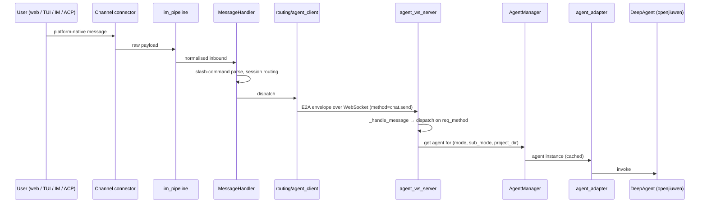
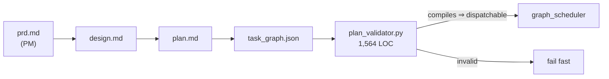
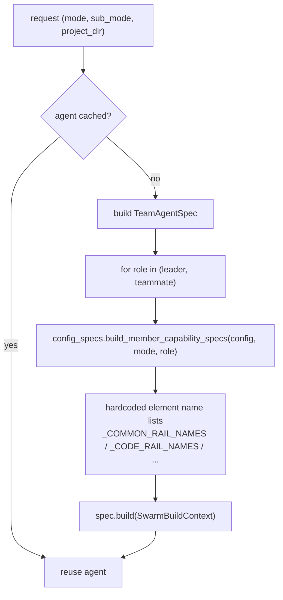
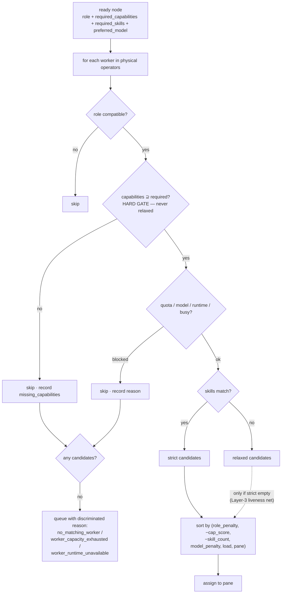
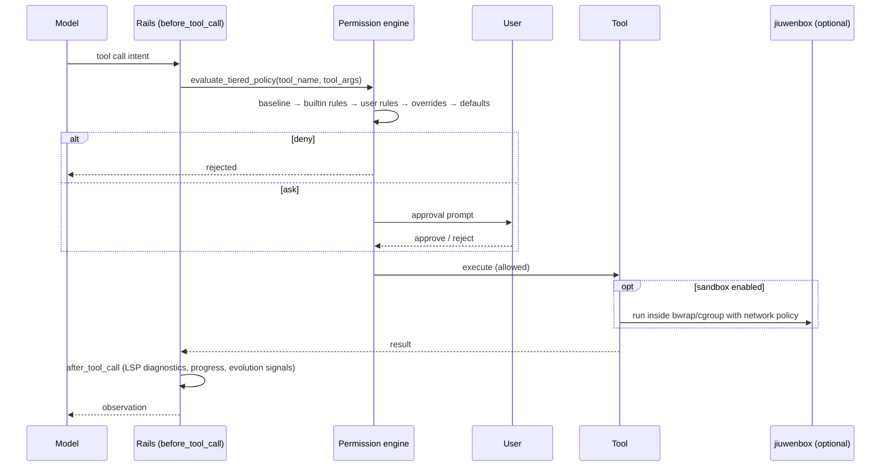
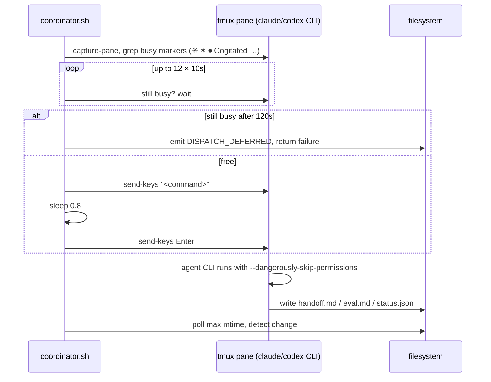
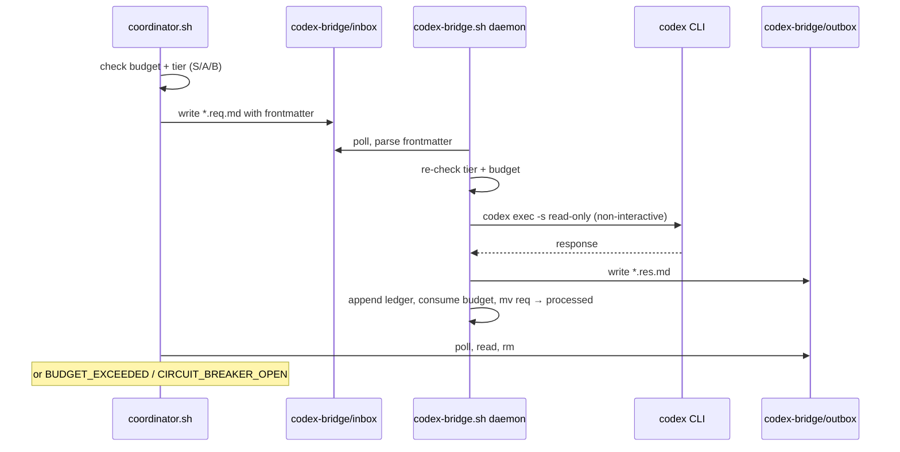
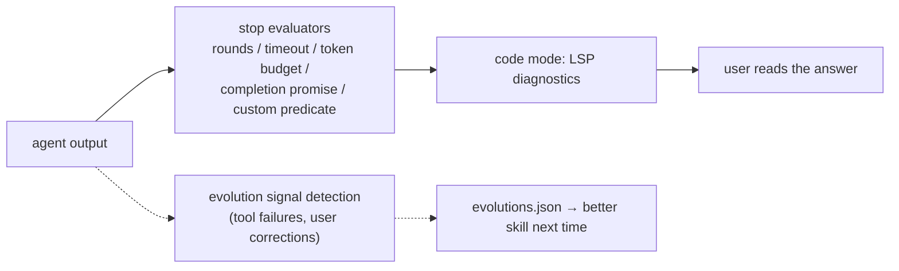
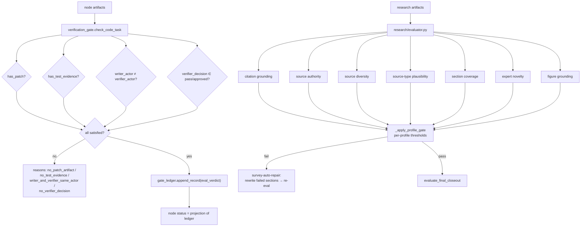
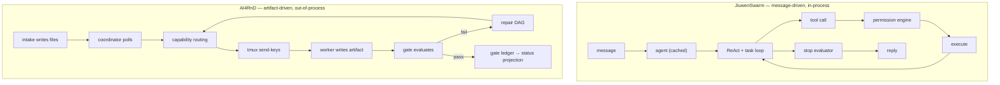

# Workflow Traces

Seven questions traced through both systems: how work enters, how it is planned, how a
worker is chosen, how tools execute, where intermediate state lives, how results are
verified, and what happens on failure, cancellation and recovery.

Evidence tags resolve in [11-evidence-appendix.md](11-evidence-appendix.md).

---

## 1. How work enters

### JiuwenSwarm



Every inbound path — nine IM platforms, web, TUI, desktop, ACP, A2A, cron — converges on
the same normalised E2A envelope before reaching the agent server. Cron-triggered work
enters through the same `MessageHandler` path, not a side door. [E-J03], [E-J04]

Work can also enter *below* the gateway: the agent server's WebSocket accepts direct RPC,
which is how the TUI and desktop app operate.

### AI4RnD

```mermaid
sequenceDiagram
    participant U as User
    participant CLI as solar-harness.sh
    participant WI as workflow_intake.py
    participant FS as sprints/&lt;sid&gt;.*
    participant CO as coordinator.sh

    U->>CLI: solar harness intake "..."
    alt registered workflow_id
        CLI->>WI: instantiate fixed-stages contract
        WI->>FS: write task_graph.json (with contract id/version/hash)
        WI->>FS: write status.json + prd/contract/design/plan
    else generic
        CLI->>FS: write drafting sprint scaffold
    end
    CO->>FS: poll (max mtime over sprint-*.status.json)
    CO->>CO: detect state change → dispatch
```

Entry is a CLI command that writes files. The coordinator discovers work by polling.
`workflow_intake.py` is a newer, stricter path: given a registered contract it instantiates
a fixed-stage task graph and **fails closed** (exit 3/4) on an unknown or
planner-generated `workflow_id` rather than falling through to the generic planner. [E-A17]

There is also a status-server HTTP surface with `POST /api/sprints/<sid>/plan-verdict`,
`/eval-verdict`, `/handoff-submit` — human gates over HTTP. [E-A18]

**Contrast.** JiuwenSwarm's entry is a *message* to a running agent. AI4RnD's entry is a
*file* that a poller finds. The former is push, low-latency, and authenticated by channel;
the latter is pull, up-to-one-poll-interval latent, and authenticated by filesystem
permissions.

---

## 2. How tasks are planned

### JiuwenSwarm

Three modes, and planning differs by mode:

| Mode | Planning |
|---|---|
| Performance | none — direct ReAct, parallel tool calls |
| Plan | `TaskPlanningRail` builds a step list; each step confirmed |
| Swarm | leader decomposes the goal, assembles a team, delegates to teammates |

`TaskPlanningRail` connects todo tools, a `TaskPlan`, task dependencies, progress reminders
and multi-model selection to the outer task loop. In code mode `swarm.code_task_planning`
and `core.task_planning` are the corresponding elements. Plan-mode state is persisted into
the session, so a plan survives restart. [E-J15] *(documented — the rail lives in
`openjiuwen`)*

Symphony adds a second planning axis when many skills are installed: retrieve candidate
skills from the tree index, then orchestrate them into a dependency-checked skill chain
using the skill score graph, presented for user confirmation before execution.

Planning output is **conversational and in-session**. There is no plan artifact on disk
that an external tool can validate.

### AI4RnD

Planning is a first-class, file-backed, validated stage.



The state machine will not advance out of `prd_ready` until
`exists(design.md) && exists(plan.md) && exists(task_graph.json)` [E-A03]. The task graph is
then validated: cycles, missing dependencies and duplicate node ids fail fast [E-A07]. A
comment in `plan_validator.py` records the intent that validation must also guarantee
routability — *"(no_matching_worker) — 'compiles' must imply 'dispatchable'"* — so a plan
that no worker can serve is a planning error, not a runtime surprise.

Human gate: `solar harness plan-verdict <sid> approve|reject [reason]`, an atomic
status + history + event update.

For research work, planning is the question graph and the physical operator plan
(`survey-plan`, `research plan`), with the optimizer specified as code-defined and
persisted rather than hidden reasoning [E-A14].

**Contrast.** JiuwenSwarm plans *in the model's context*; AI4RnD plans *into a validated
artifact*. AI4RnD's approach is strictly better for auditability and is a prerequisite for
its gate model. JiuwenSwarm's is lower-friction and better for conversational work.

---

## 3. How agents or workers are selected

### JiuwenSwarm — role and configuration



Selection is by **role plus mode**. `AgentManager` caches on
`(mode, sub_mode, project_dir)` [E-J19]. Within a team the leader delegates to teammates,
and in code mode to sub-agents (`explore`, `plan`, `browser`, `code`), but the choice is
prompt-driven rather than governed by a declared capability contract.

There is no capability declaration, no capability matching, and consequently no
"no capable worker" state. If a teammate lacks the ability to do the work, that surfaces
as a poor result, not a routing decision.

### AI4RnD — capability matching



[E-A06]. The key properties: capability is a hard gate that is never relaxed; skills are a
preference with a liveness net so a drifted skill string cannot permanently strand a node;
and the stall reason distinguishes "no capable worker exists" from "capable workers are all
busy" from "capable workers are quota-blocked".

**This is the single capability AI4RnD has that JiuwenSwarm most clearly lacks**, and it is
also the one most cleanly transplantable — it is pure data plus a scoring function over a
worker list.

---

## 4. How tools are executed

### JiuwenSwarm



Tools are Python callables registered on the agent's ability manager. Every call passes
the tiered policy engine [E-J12]; optionally the whole execution runs inside jiuwenbox
[E-J11]. `after_tool_call` rails feed the skill-evolution signal detector [E-J13].

### AI4RnD

Two distinct paths.

**Pane path** (the shipped default):



There is no permission check on this path. The worker CLI's own gate is explicitly disabled
at launch [E-A05], and AI4RnD adds none of its own. [E-A08]

**Codex bridge path:**



Bounded, read-only, budgeted (30 calls / 20,000 tokens per day, hard stop), audited.

**Contrast.** JiuwenSwarm's tool execution is governed at every call. AI4RnD's pane path
is ungoverned; its Codex path is well-governed but limited to read-only analysis. This is
the sharpest security asymmetry between the systems.

---

## 5. Where intermediate state is stored

| Concern | JiuwenSwarm | AI4RnD |
|---|---|---|
| Conversation | session store (`session_history.py`) | pane scrollback (ephemeral) |
| Task/plan state | persisted into session (documented) | `sprints/<sid>.status.json` + `.task_graph.json` |
| Long-term memory | SQLite + vector index, file-watched, hybrid search | `run/state.db`, wiki under `runtime/schema` contracts |
| Intermediate reasoning artifacts | **none** — lives in the transcript | typed files: `prd.md`, `design.md`, `plan.md`, `handoff.md`, `eval.md` |
| Research artifacts | **none** | evidence ledger, claims, citation map, gate results, repair history |
| Event stream | logs, OpenTelemetry | `events.jsonl` (append-only) + `<sid>.gate-ledger.jsonl` |
| Configuration | `~/.jiuwenswarm/config/config.yaml` | `harness/config/*.json|yaml` |

The structural difference: **AI4RnD's intermediate state is a validated artifact tree;
JiuwenSwarm's is a chat log.** AI4RnD can answer "which exact source span supports this
sentence" by reading files. JiuwenSwarm cannot answer it at all.

Corollary for integration: if AI4RnD's research core is retained, it brings its own
artifact store, and that store — not the JiuwenSwarm session — must remain the source of
truth for evidence.

---

## 6. How results are verified

### JiuwenSwarm



Verification answers *"should the loop stop"* and *"was the tool call permitted"*. Nothing
answers *"is this output correct"*. The Auto Harness CI loop verifies harness changes, and
`skilldev/stages/evaluate_stage.py` verifies generated skill definitions — both are
capability-quality checks, not result-correctness checks. [E-J14]

### AI4RnD



[E-A11], [E-A12], [E-A10]. Two independent verification layers: structural (did the work
produce the required evidence, was it independently checked) and epistemic (is the content
grounded in real sources).

`graph_scheduler` additionally guards the write path: `_assert_pass_mark_allowed`,
`_passed_without_required_eval`, `_node_eval_is_self_graded` and
`_node_has_independent_eval_report` block a node being marked passed without independent
evaluation evidence [E-A07].

**Contrast.** This is the capability gap. JiuwenSwarm has nothing at this layer.

---

## 7. Failure, cancellation, recovery

### JiuwenSwarm

| Situation | Mechanism |
|---|---|
| Cancel | `chat.interrupt` with intent `pause` / `resume` / `cancel`; `abort` cancels the outer task loop and attempts to interrupt the inner ReAct loop [E-J20] |
| Tool exception | `on_tool_exception` rails repair context and govern the exception |
| Model exception | `on_model_exception` rails |
| Runaway loop | stop evaluators: max rounds, timeout, token budget |
| Context overflow | `/compact`, `/compact-partial`, context engine, `ContextCompression` |
| Undo | three session rewind variants: full, full-with-file-restore, full-with-compaction; plus context rewind [E-J04] |
| Process failure | `gateway/heartbeat/`, `instance_manager/`, desktop auto-update |
| Bad skill behaviour | evolution signals → improved skill definition |

Cancellation is *synchronous and in-process* — the request reaches a live object.

### AI4RnD

| Situation | Mechanism |
|---|---|
| Node fails eval | `eval_verdict FAIL` → status `blocked` → re-dispatch to builder → `handoff_updated` → re-evaluate. Bounded by `retry_policy.max_attempts` [E-A03] |
| Gate fails | repair DAG: targeted evidence search → extract → verify → rewrite → re-gate; persisted to `repair_dags.jsonl` [E-A14]. Implemented for surveys as `survey-auto-repair` |
| Repair exhausted | `repair_exhausted` record in the gate ledger; `needs_human_review` node status |
| No capable worker | node marked `worker_blocked` with `blocking_reason: no_matching_worker`; run stalls honestly [E-A06] |
| Pane busy | busy-marker polling, then `DISPATCH_DEFERRED` [E-A08] |
| Dropped keystroke | the mitigation *is* the busy-poll + split send-keys; there is no delivery acknowledgement |
| Coordinator death | pidfile with `kill -0` liveness plus `ps aux` cross-validation; stale pidfile self-heal |
| Missed state change | periodic compensating sweeps (`loop_count % 30`), `detect_stuck_state()` scanning `events.jsonl` for events >60 s old with no status advance |
| Partial state write | atomic `plan-verdict` / `handoff-submit` / `eval-verdict` commands (tempfile+rename) |
| Duplicate finalisation | `.finalized` marker file |
| Corrupt sprint | `clean-corrupted --apply` moves to `.quarantine/` with a manifest — never deletes |
| Reconciliation | `verify-events <sid>` checks per-round completeness of history vs events |
| Stale code in a running process | md5 logged at coordinator start; PROBE logs on rarely-taken branches (after Bug #5) |

Cancellation is *asynchronous and advisory* — there is no direct cancel path to a pane
running an interactive CLI.

**Contrast.** AI4RnD's recovery machinery is more elaborate because its substrate generates
more failures. Almost every mechanism in the AI4RnD column exists to compensate for
filesystem polling or terminal-typing. Under an in-process substrate, most would be
unnecessary; the ones that would remain and are worth keeping are the *semantic* ones —
bounded repair, repair-exhausted → human review, honest stalling, quarantine-not-delete,
and event/history reconciliation.

---

## 8. End-to-end comparison



| Axis | JiuwenSwarm | AI4RnD |
|---|---|---|
| Coupling | tight, in-process | loose, filesystem |
| Latency | milliseconds | one poll interval + busy-wait |
| Governance of actions | strong (permissions, sandbox) | weak (pane) / strong (Codex) |
| Governance of *outputs* | none | strong (gates, ledger, independent verifier) |
| Inspectability of intermediates | low | high |
| Worker selection | role + config | capability match with honest stall |
| Cancellation | synchronous | advisory |
| Failure modes | model/tool exceptions | plus transport, polling, process-liveness |

The two systems are close to complementary. That is the case for integrating them, and
[08-recommended-architecture.md](08-recommended-architecture.md) proposes the split that
follows from this table.
