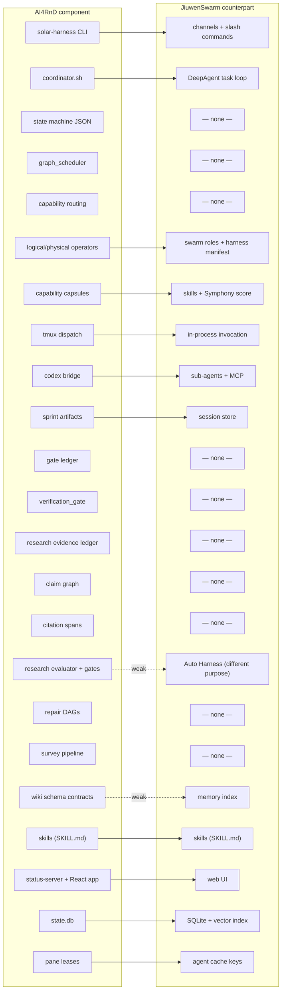

# Component-by-Component Comparison

> **Revision 2 note.** This document compares the two systems *as they exist*. The
> feature-level mapping against the **intended product** is in
> [`traceability/142-feature-matrix.md`](traceability/142-feature-matrix.md) and summarised in
> [14-reuse-vs-build-map.md](14-reuse-vs-build-map.md), which supersedes the summary tally at
> the end of this document.
>
> Three verdicts below changed after execution:
>
> | Component | Rev 1 verdict | Rev 2 verdict | Why |
> |---|---|---|---|
> | Capability capsules | folded into "operator model — Conflict" | **Port** — a distinct governed abstraction | 11-section contract; 30 registered, 23 validated [V-11] |
> | RSI / evolution | not treated as a component | **Port (GEPA) + Build (7 surfaces)** | 3,540 LOC with full promote/rollback, unwired [V-13] |
> | Durable queue + leases | "Reuse JiuwenSwarm's task loop" | **Port from AI4RnD** — `actor_*` family | JiuwenSwarm has no durable queue or lease model [V-8] |

For each AI4RnD component: what JiuwenSwarm offers in its place, and a verdict —
**Reuse** (take JiuwenSwarm's), **Port** (bring AI4RnD's across largely intact),
**Adapt** (bring the design, rewrite the implementation), **Rewrite** (neither is
adequate), **Drop** (AI4RnD's exists only to compensate for its substrate), or
**Conflict** (the two designs are mutually exclusive).

---

## Component map

Nine AI4RnD components map to nothing in JiuwenSwarm. All nine are in the routing,
verification and evidence layers.

---

## 1. Entry surface and channels

| | |
|---|---|
| **AI4RnD** | `solar-harness.sh` (6,119 LOC bash CLI), tmux cockpit, HTTP status server, `workflow_intake.py` |
| **JiuwenSwarm** | 9 IM connectors, web UI, TUI, desktop app, ACP, A2A, cron, slash commands, all normalised through E2A |
| **Verdict** | **Reuse JiuwenSwarm.** Strictly superior — multi-channel, normalised, authenticated, packaged. AI4RnD's CLI is single-user, single-machine, macOS-primary. |
| **Caveat** | AI4RnD's *contracted* intake (fail-closed on unknown `workflow_id`) is a good property with no JiuwenSwarm equivalent. **Port that behaviour** into the research service's own API. [E-A17] |

## 2. Control plane / task loop

| | |
|---|---|
| **AI4RnD** | `coordinator.sh` (5,797 LOC), filesystem polling, `coordinator-state-machine.json`, watchdog, self-healing sweeps |
| **JiuwenSwarm** | `DeepAgent` dual-layer task loop with `TaskLoopController`, `LoopCoordinator`, `LoopQueues`, stop evaluators, `follow_up`/`steer`/`abort` |
| **Verdict** | **Reuse JiuwenSwarm; drop AI4RnD's.** In-process event-driven beats bash-polling on latency, reliability, testability and cancellation. `DISPATCH-PROTOCOL.md`'s nine post-mortems are all substrate failures that disappear here. [E-A08] |
| **Keep from AI4RnD** | the *declarative* state machine as data. A frozen transition table with guards, `requested_role`, `required_artifacts`, ack/artifact timeouts and retry policy is more auditable than an implicit loop. Adapt as the research service's internal run state machine. [E-A03] |

## 3. Sprint / run state machine

| | |
|---|---|
| **AI4RnD** | 12 lifecycle states, artifact-existence guards, per-transition timeout and retry policy |
| **JiuwenSwarm** | none — no run concept above the session |
| **Verdict** | **Port (adapted).** The research service needs a run lifecycle. Reuse the shape; replace file-existence guards with typed artifact validation, since the service owns its own store. |

## 4. DAG scheduling

| | |
|---|---|
| **AI4RnD** | `graph_scheduler.py` (4,189 LOC): validation, topo order/layers, critical path, parallelism metrics, **write-scope conflict avoidance**, pass-mark guards |
| **JiuwenSwarm** | none. Swarm mode has a leader delegating to teammates, but no explicit dependency graph, no batching, no write-scope reasoning |
| **Verdict** | **Port.** Genuinely absent from JiuwenSwarm and genuinely valuable. Write-scope conflict avoidance (nodes with overlapping write scope never share a batch; undeclared scope ⇒ exclusive writer) is a correctness property for parallel agent work. [E-A07] |
| **Risk** | 4,189 LOC with heavy coupling to sprint paths, `state.db`, `gate_ledger`, `node_runstate` and `prerequisite_resolver`. Extracting the scheduling core from the Solar-specific plumbing is real work. Budget a rewrite of the I/O layer around a retained algorithm. |

## 5. Capability routing

| | |
|---|---|
| **AI4RnD** | hard capability gate (never relaxed), skills as preference with a Layer-3 liveness net, discriminated stall reasons, capability scoring |
| **JiuwenSwarm** | none. Selection is role + mode + config |
| **Verdict** | **Port.** The highest value-per-line item in the whole comparison. The algorithm is ~150 lines of pure scoring over a worker list; the data is two JSON files. [E-A06] |
| **Adaptation** | JiuwenSwarm workers are swarm members and sub-agents, not tmux panes. Worker capability declarations would come from member config, not `physical-operators.json`. The `flow_control`/quota fields map onto model-provider rate limits. |

## 5b. Capability Capsules ⭐ **new component, Rev 2**

| | |
|---|---|
| **AI4RnD** | `capability_capsules.py` (1,351 LOC) + `capability-capsule.v1.draft.json` requiring 11 sections + 30 registered capsules + `capsule_execution_gate` + `skill_to_capsule_compiler`. **Executed:** 30 load, 23 manifests validate, 0 invalid |
| **JiuwenSwarm** | skills — `SKILL.md` with `name` + `description`. No contract, no declared effects, no verification block, no operator compatibility, no composition rules |
| **Verdict** | **Port.** Not a naming difference. `effects` (read/write/execute/network/cost) and `operator_compatibility` (preferred/forbidden) are *router inputs* that let a capability be constrained at binding time. `bindings.skills` shows a JiuwenSwarm skill is an **ingredient** of a capsule. `required_guard_capsules` lets capsules gate capsules. |
| **Integration** | build a capsule↔skill bridge: a capsule's `bindings.skills` resolves to installed JiuwenSwarm skills, so the existing skill ecosystem becomes capsule-consumable without rewriting it. |

## 5c. RSI / controlled self-improvement ⭐ **new component, Rev 2**

| | |
|---|---|
| **AI4RnD** | `integrations/gepa_optimizer/` (3,540 LOC): propose · run · review · promote · rollback · status; dry-run default; `--execute` requires all three budget caps; promotion restricted to `/tmp`; `hard_policy_checker` freezes safety policy. Plus `evolution_engine` (854) and `failure_miner` (109). **All unwired.** |
| **JiuwenSwarm** | Auto Harness — optimises *the harness* against CI pass, with worktree isolation and PR submission. Different target (capability, not correctness) and no promote/rollback of versioned artifacts |
| **Verdict** | **Port GEPA + wire; Build the other 7 surfaces.** One of eight RSI surfaces exists. |
| **Synergy** | Auto Harness could *consume* AI4RnD's quality gates as its optimisation signal — scoring harness changes on grounding quality against a fixed benchmark rather than CI-pass. The strongest identified synergy between the systems. |

## 6. Operator model

| | |
|---|---|
| **AI4RnD** | `logical-operators.json` (types + required capabilities + concurrency), `physical-operators.json` (concrete workers), capability capsules (see §5b) |
| **JiuwenSwarm** | the harness element manifest — `@harness_element` descriptors with `kind`, `name`, `description`, `factory_ref`, `input_schema` with per-field `source` markers, `interface_methods`; catalog-driven registration; JSON round-trip |
| **Verdict** | **Conflict — resolve in JiuwenSwarm's favour for *construction*, AI4RnD's for *routing*.** They answer different questions. JiuwenSwarm's manifest describes *how to build a capability*; AI4RnD's registry describes *which worker can serve a requirement*. Both are needed. |
| **Note** | JiuwenSwarm's manifest is the more mature abstraction (serialisable input schemas with param/context source markers, reflective `factory_ref` resolution). AI4RnD's registries are flatter but carry the routing metadata JiuwenSwarm lacks. Merging them is a design task, not a port. |
| **Blocker** | JiuwenSwarm's `config_specs.py` hardcodes which element names are assembled. The "configuration-file → harness loader" that would make the manifest dynamically extensible is listed as **future work, not implemented** (`DESIGN.md` §15). [E-J05] |

## 7. Worker dispatch

| | |
|---|---|
| **AI4RnD** | `tmux send-keys` with busy-marker polling and split text/Enter; workers launched `--dangerously-skip-permissions` |
| **JiuwenSwarm** | direct in-process invocation of `DeepAgent` and sub-agents; distributed members via `remote_member_bootstrap.py` |
| **Verdict** | **Drop AI4RnD's entirely. Conflict if retained.** Porting it into JiuwenSwarm would bypass the permission engine, the sandbox and the audit trail, and reintroduce every failure mode in `DISPATCH-PROTOCOL.md`. [E-A05], [E-A08] |
| **Exception** | the **Codex bridge** pattern — bounded work packets, tier classification, token budget with circuit breaker, read-only execution, ledger — is worth **adapting** as a general policy for delegating to any external, expensive, untrusted runtime. |

## 8. Artifact store

| | |
|---|---|
| **AI4RnD** | `sprints/<sid>.*`, `events.jsonl`, run directories with typed sub-trees (`evidence/`, `claims/`, `quality/`, `repair/`, `bundle/`) |
| **JiuwenSwarm** | session store — a chat transcript with metadata |
| **Verdict** | **Port.** JiuwenSwarm has no equivalent and cannot gain one without adding a run concept. The artifact store must live with the research service. |
| **Consequence** | dual state. The session (JiuwenSwarm) and the run bundle (research service) both persist. They must be linked by an id, and the boundary must be explicit: *the session never becomes the source of truth for evidence.* |

## 9. Gate ledger

| | |
|---|---|
| **AI4RnD** | append-only JSONL, 8 record kinds, author typing, verdict kinds (content/mechanical/infrastructure), eval generation, repair attempt, **writer attribution on status transitions**, `applied: False` for neutralised writes, node status as a projection |
| **JiuwenSwarm** | none |
| **Verdict** | **Port, largely intact.** Small (single module), self-contained, no Solar-specific dependencies beyond path resolution, and the design is right. [E-A10] |

## 10. Verification gate

| | |
|---|---|
| **AI4RnD** | evidence requirements + **writer ≠ verifier** + verifier decision; scheduler-side guards against self-graded passes |
| **JiuwenSwarm** | stop evaluators (loop control), permission engine (action control), LSP diagnostics |
| **Verdict** | **Port.** Independent-verifier enforcement is a policy JiuwenSwarm cannot express today. |
| **Adaptation** | "actor id" in JiuwenSwarm terms is a team member id or sub-agent id. Enforcing writer ≠ verifier requires the leader to dispatch evaluation to a *different* member — expressible in swarm mode, but currently a prompt convention, not a constraint. |

## 11. Evidence ledger

| | |
|---|---|
| **AI4RnD** | `SourceDocument` / `EvidenceItem` / `Claim` / `ClaimEvidenceLink` / `CitationSpan`; SHA-256 content hashing; deterministic ids; char+byte-offset span verification; SQLite (7 tables) + JSONL |
| **JiuwenSwarm** | none — no such identifier exists in the tree [E-J14] |
| **Verdict** | **Port unchanged.** This is the core asset. It is pure Python over stdlib + sqlite3, with no Solar coupling beyond `PYTHONPATH`. It is the most portable component in AI4RnD and the most valuable. [E-A13] |

## 12. Claim graph

| | |
|---|---|
| **AI4RnD** | typed relations (`supports`, `refutes`, `qualifies`, `contradicts`, `depends_on`, `duplicates`, `updates`, `belongs_to_section`), verification status, confidence |
| **JiuwenSwarm** | none. Symphony's skill score is a graph, but of *skill I/O connectivity*, not of beliefs |
| **Verdict** | **Port.** Note the spec is richer than the implementation — `claim_graph.json` and contradiction search are specified in the SDD; the implemented surface is `mine` / `check` over claims and evidence links. Some build work remains regardless of integration. |

## 13. Quality gates / research evaluator

| | |
|---|---|
| **AI4RnD** | `evaluator.py` (1,673 LOC): citation grounding, source authority, diversity, source-type plausibility, section coverage, expert novelty, figure grounding; per-profile thresholds; pluggable `@register_gate` registry |
| **JiuwenSwarm** | Auto Harness (optimises the harness), `skilldev/evaluate_stage` (rates a skill definition) |
| **Verdict** | **Port.** Different purpose from anything JiuwenSwarm has. The gate registry pattern is clean and should survive intact. [E-A12] |
| **Opportunity** | JiuwenSwarm's Auto Harness could *consume* these gates: harness changes that improve grounding scores on a fixed research benchmark would be a far better optimisation signal than CI-pass. This is the most interesting synergy in the analysis. |

## 14. Repair DAG

| | |
|---|---|
| **AI4RnD** | specified fully; implemented for surveys (`survey-auto-repair`, `survey-rewrite-queue`, `survey-rewrite-run`); repair state in the gate ledger (`repair_start`, `repair_exhausted`) |
| **JiuwenSwarm** | `on_tool_exception` / `on_model_exception` rails repair *context*, not *results* |
| **Verdict** | **Port the design; complete the implementation.** Generalising beyond surveys is unfinished work in AI4RnD today. |

## 15. Skills

| | |
|---|---|
| **AI4RnD** | `skills/<name>/SKILL.md`, YAML frontmatter (`name`, `description`, plus Claude-Code extras: `user-invocable`, `disable-model-invocation`, `argument-hint`) |
| **JiuwenSwarm** | `skills/<name>/SKILL.md`, YAML frontmatter (`name`, `description`), optional `references/`, `scripts/`; five registries; hot install; `evolutions.json` |
| **Verdict** | **Reuse JiuwenSwarm; migrate AI4RnD's content.** The formats are compatible at the frontmatter level. [E-J16] |
| **Friction** | AI4RnD skills are slash-command-flavoured (`/stats`, `/save`, `/review` — user-invoked, argument-hinted); JiuwenSwarm skills are model-invoked capability packages. Migration is a rewrite of *invocation assumptions*, not of format. AI4RnD skills that shell out to `solar-harness.sh` will not port at all. |
| **Bonus** | JiuwenSwarm's skill evolution and Symphony retrieval apply to migrated skills for free. |

## 16. Knowledge base

| | |
|---|---|
| **AI4RnD** | schema-contracted wiki: `entities.yaml` (typed fields, ranges, enums, conditional requirements), `edges.yaml`, `xref.yaml` (mandatory bidirectional links), `conventions.yaml` (ownership: user-owned / tools-only / append-only) |
| **JiuwenSwarm** | memory index — SQLite + vectors, file-watched, hybrid search; `dreaming/sweeper.py` consolidation; project memory; coding memory |
| **Verdict** | **Both, for different jobs.** JiuwenSwarm's memory is *retrieval over unstructured content*; AI4RnD's wiki is a *typed, linked, contract-validated knowledge graph*. Keep JiuwenSwarm's memory for agent recall; keep the wiki as a research artifact store if the research programme needs it. [E-A16] |
| **Note** | AI4RnD's ownership contract (skills must not overwrite `raw/papers`) is a good idea with no JiuwenSwarm analogue. |

## 17. Observability surface

| | |
|---|---|
| **AI4RnD** | `status-server.py` (14,400 LOC) + React app; DAG view, agent roster, process stream, honest stall display, per-sprint token usage; endpoints for verdicts |
| **JiuwenSwarm** | web UI, TUI, desktop app, skill graph/index views, OpenTelemetry |
| **Verdict** | **Rewrite as a JiuwenSwarm view.** The AI4RnD *design contract* (honest state rules: never show a filled progress bar for a stalled sprint; never synthesise "result available"; show stalls via the blocked step's raw tokens) is valuable and should carry over. The 14,400-line implementation should not. [E-A02] |

## 18. Sandbox and permissions

| | |
|---|---|
| **AI4RnD** | none at the pane level; Codex path is read-only sandboxed |
| **JiuwenSwarm** | tiered permission engine; jiuwenbox (bwrap, cgroup, network policy, inference privacy proxy) |
| **Verdict** | **Reuse JiuwenSwarm.** Strict improvement. Research operators that fetch and parse untrusted web content are exactly the workload that should run sandboxed — arguably a stronger case than for coding agents. [E-J11], [E-J12] |

## 19. Concurrency control

| | |
|---|---|
| **AI4RnD** | pane leases, `concurrency-policy.json`, per-operator `max_parallel`/`singleton`, write-scope batching, SQLite WAL |
| **JiuwenSwarm** | agent cache keyed by `(mode, sub_mode, project_dir)`; per-session lifecycle locks; `tenant_agent_pool.py` |
| **Verdict** | **Adapt AI4RnD's declarative policy.** Per-operator concurrency limits and write-scope exclusion are expressible as data and belong with the ported scheduler. Pane leases are substrate-specific — drop. |

## 20. Distribution and packaging

| | |
|---|---|
| **AI4RnD** | `get-solar.sh` shell installer into `~/.solar` + `~/.claude/solar`, install receipt, `doctor`/`update`/`repair`/`backup`/`uninstall`; pipx wrapper; `install.ps1` provisioning WSL2 |
| **JiuwenSwarm** | `pip install jiuwenswarm`, `jiuwenswarm-init`, `jiuwenswarm-start`; signed desktop apps for Windows/macOS with auto-update |
| **Verdict** | **Reuse JiuwenSwarm.** AI4RnD's own README rates Windows as experimental and the macOS DMG as needing real-machine release proof. |

---

## Summary tally (component level)

| Verdict | Components |
|---|---|
| **Reuse JiuwenSwarm** (6) | channels, task loop, skills runtime, sandbox/permissions, packaging, agent memory |
| **Port from AI4RnD** (11) | evidence ledger, claim graph, citation spans, research evaluator + gate registry, gate ledger, verification gate, DAG scheduler, capability routing, **capability capsules**, **GEPA/RSI-1**, **durable queue + leases (`actor_*`)** |
| **Adapt** (5) | run state machine, concurrency policy, Codex-bridge delegation pattern, contracted intake, observability honesty rules |
| **Rewrite** (3) | status server UI, repair-DAG generalisation, **the grounding check (precision 0.25 — must not be ported)** |
| **Drop** (4) | tmux dispatch, coordinator polling loop, pane leases, shell installer |
| **Conflict** (1) | operator model — a merge of vocabularies, not a port |
| **Build** (7 surfaces) | RSI 2, 4, 5, 6, 7, 8 + entailment |

**The shape of the answer, revised.** JiuwenSwarm wins every execution-layer contest.
AI4RnD wins every correctness-*architecture* contest — but not every correctness-*implementation*
contest, because its central grounding gate does not work and its capsule and RSI layers are
disconnected.

Two caveats that Revision 1 did not carry:

- "Reuse JiuwenSwarm's permissions" now requires repairing the built-in rule loading first
  (V-4), and cannot deliver per-operator policy (V-6).
- "Port AI4RnD's evaluators" must exclude the grounding judgement (V-12), which needs
  replacing rather than moving.

The feature-level view — which is the one that should drive planning — is in
[14-reuse-vs-build-map.md](14-reuse-vs-build-map.md): **69 port · 27 build · 23 reuse-JW ·
21 adapt · 2 defer.**
