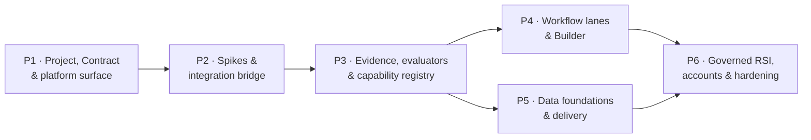

# Feature Ownership and Implementation Plan

**Purpose of this document: say who owns each part of the product, what work exists, and in what
order to do it.** The full row-level detail — all 142 features with semantic owner, runtime
implementer, persistence authority, verification authority, product surface, decision, evidence
and open questions per row — lives in the CSVs and stays authoritative:

- [142-feature-implementation-ownership.csv](traceability/142-feature-implementation-ownership.csv)
- [142-feature-preservation-gate.csv](traceability/142-feature-preservation-gate.csv)

This document summarizes them and adds the dependency structure the CSVs cannot express.

---

## 1. The totals

| Implementation decision | Rows | Meaning |
|---|---:|---|
| BUILD | 53 | exists in neither system — required under **every** architecture option |
| ADAPT | 32 | exists on one side but must change shape |
| REUSE | 23 | use as-is (6 of these are packaging rows, unverifiable here, labelled so) |
| PORT | 20 | move working AI4RnD code onto the new foundation |
| EXTEND | 11 | JiuwenSwarm feature plus a research-specific layer |
| DEFER | 2 | model-weight RSI and model construction — cost, not capability |
| UNRESOLVED | 1 | "Cluster setting": one workbook line, no definition to build from |

| Ownership | Semantic | Runtime |
|---|---:|---:|
| AI4RnD Core | 118 | 53 |
| AI4RnD–Jiuwen Integration | — | 32 |
| JiuwenSwarm Application | 19 | 27 |
| OpenJiuwen Runtime | — | 25 |
| External / new product work | 4 | 4 |
| Unresolved | 1 | 1 |

The 118-versus-53 gap between what AI4RnD *defines* and what it *runs* is the integration surface,
and is why the bridge exists.

## 2. Ownership by feature group

| Plane · group | Rows | Semantic owner | Dominant runtime | Decisions | Phase |
|---|---:|---|---|---|---|
| W · Ingestion | 7 | AI4RnD | JiuwenSwarm App | adapt 2 · port 2 · reuse/extend/build | P1 |
| W · Requirement compilation | 7 | AI4RnD | AI4RnD | adapt 5 · build 2 | P1 |
| W · Search & ideation | 8 | AI4RnD | Bridge | port 7 · build 1 | P2 |
| W · Opportunity selection | 7 | AI4RnD | AI4RnD | build 5 · adapt 2 | P4 |
| W · Claims & hypotheses | 5 | AI4RnD | AI4RnD | port 2 · build 2 · adapt 1 | P4 |
| W · POC implementation | 5 | AI4RnD | OpenJiuwen | reuse 2 · build 2 · adapt 1 | P4 |
| W · Benchmarking | 5 | AI4RnD | Bridge | port 2 · mixed | P4 |
| W · Evaluation | 6 | AI4RnD | AI4RnD | adapt 3 · build 2 · port 1 | P3 |
| W · Delivery | 4 | AI4RnD | Bridge | build 2 · port 1 · adapt 1 | P5 |
| F · Capability capsule | 5 | AI4RnD | AI4RnD | extend 2 · mixed | P3/P6 |
| F · Operators | 6 | AI4RnD | Bridge | build 4 · port 1 · adapt 1 | P3/P6 |
| F · Evaluator | 6 | AI4RnD | AI4RnD | build 4 · adapt 2 | P3 |
| F · Foundational models | 3 | JiuwenSwarm App | JiuwenSwarm App | extend 2 · build 1 | P1 |
| F · RSI | 8 | AI4RnD | Bridge | build 5 · adapt 2 · defer 1 | P6 |
| F · Data foundations | 9 | AI4RnD | AI4RnD | build 7 · extend/adapt | P5 |
| F · Harness Core | 6 | AI4RnD | OpenJiuwen | reuse 4 · adapt 2 | P2 |
| F · Intention compilers | 5 | AI4RnD | AI4RnD | adapt 4 · build 1 | P1 |
| F · Planner | 3 | AI4RnD | AI4RnD | adapt 3 | P2 |
| F · Builder | 14 | AI4RnD | OpenJiuwen | build 7 · reuse 3 · port 3 · defer 1 | P4/P6 |
| V · Visibility / statistics | 4 | JiuwenSwarm App | JiuwenSwarm App | extend 3 · build 1 | P2 |
| V · Installer / CLI / webapp | 5 | JiuwenSwarm App | JiuwenSwarm App | reuse 5 (unverified here) | P1 |
| V · UI | 3 | JiuwenSwarm App | JiuwenSwarm App | reuse 2 · extend 1 | P1 |
| V · Account management | 4 | External / new | External / new | build 4 | P6 |
| V · Message channels | 3 | JiuwenSwarm App | JiuwenSwarm App | reuse 2 · port 1 (tmux — open question) | P1 |
| V · System configurations | 4 | JiuwenSwarm App | JiuwenSwarm App | reuse/extend · 1 unresolved | P1 |

Verification authority follows semantic ownership throughout: AI4RnD's evaluators and gates
verify research outcomes; platform tests verify application rows; the writer of an artifact never
verifies it.

## 3. Not all rows are equal — the dependency-critical ten

These capabilities gate everything else. Slippage here blocks the plan; slippage elsewhere
narrows it.

| Critical capability | Why it gates | Depends on |
|---|---|---|
| 1 · Project & Contract foundation | every other outcome hangs off a durable project record | — |
| 2 · Intention Compiler | no trustworthy Contract → nothing downstream is well-defined | 1 |
| 3 · Capability Capsules & operator binding | honest stall, effects enforcement, writer≠verifier all live here | 1 |
| 4 · TaskGraph lifecycle | project-scoped plan state; the runtime journal is session-scoped and cannot carry it | 1 |
| 5 · Evidence & evaluator correctness | the gates are only as good as the evidence | 1, 4 |
| 6 · Grounding / entailment | measured at **0.25 precision** today; the product's central claim fails until this is rebuilt and re-measured | 5 |
| 7 · Model routing | silent substitution upstream; must fail loudly here until fixed | 3 |
| 8 · Data foundations | one store, seven typed projections; all evidence durability lands here | 5 |
| 9 · Governed RSI | only one of eight surfaces wired; everything routes through one approval loop | 3, 5 |
| 10 · Failure recovery | resume unreachable, failures degrade to `None`; the bridge must close both | 4 |

## 4. The plan

Six phases, dependency-driven. **No calendar or effort estimates** — earlier revisions' numbers
were extrapolations and are withdrawn; sequence is knowable, duration is a staffing decision.
Each phase states objective, major work, acceptance evidence and exit criteria.

### P1 — Project, Contract and platform surface

*Objective:* a durable research project exists as a product object on JiuwenSwarm.
*Major work:* project record and store (project-scoped, not session-scoped); Intention Compiler;
intake on existing channels; project view in the web UI; model/provider and settings surfaces.
*Acceptance evidence:* a request on any channel creates a project preserving the raw request; the
project survives an agent-server restart; an unconfirmed or ambiguous Contract blocks work.
*Exit:* users select objective and depth only — no execution mechanism appears anywhere.

### P2 — Discovery spikes and the integration bridge

*Objective:* prove the compilation assumption, then build the bridge on it.
*Major work — spikes first:*

- **F4 (retained, unchanged in intent): compile and validate at least three representative
  AI4RnD plans** — (1) source-heavy research, (2) POC construction plus benchmarking,
  (3) failed verification followed by repair and replanning — through the compiler to SwarmFlow
  and/or Core Workflow, and run the deterministic parts.
- F5: demonstrate write-scope exclusion at compile time (conflicting steps never share a parallel
  group).
- Two spikes already passed during analysis and need only re-confirmation in product context:
  runtime-computed fan-out in Core Workflow, and persistent checkpointing in a stock install.

*Major work — bridge:* the compiler (sub-plan → execution specification); dispatch with reachable
resume and cancel; the fact converter with strict failure semantics; loud-failure model binding;
repair of the inert guardrail rules file, with a startup assertion that the rule count is
non-zero.
*Acceptance evidence:* an interrupted run resumes re-executing only unfinished work; a step whose
result is `None` blocks its gate; guardrail rules load non-empty.
*Exit:* F4 passes for at least one execution target. If it fails for both, reopen
[03-integration-options.md](03-integration-options.md) at Option A.

### P3 — Trustworthy evidence, evaluators and the capability registry

*Objective:* the product's central claim — verifiable research — becomes true.
*Major work:* project-scoped evidence ledger and claim graph; **replacement grounding/entailment
check with the target precision published before building and the measurement published after**;
append-only gate ledger; capability registry wiring the 42 existing capsule manifests;
capability binding with honest stall and discriminated reasons; effects enforcement at binding;
writer≠verifier at candidate-set construction; the six evaluator families.
*Acceptance evidence:* every claim resolves to a citation span at character and byte offsets;
entailment precision measured on a labelled set, materially above 0.25; an unbindable requirement
stalls rather than substitutes; conflicting write scopes never co-schedule.
*Exit:* the evidence chain from source to verdict is machine-checkable end to end.

### P4 — Workflow lanes and the Builder

*Objective:* the nine lanes work as composable capabilities.
*Major work:* port search/ideation sources and extractors; build the Idea Card schema and
opportunity portfolio (absent today); build falsifiability screening and hypothesis contracting;
POC construction on code mode/worktrees; benchmarking with protocols as versioned artifacts; the
14 Builder outcomes.
*Acceptance evidence:* a run reaches a decision with an Idea Card, a falsifiability verdict, a
benchmark against a named baseline and an evaluation dossier; a non-falsifiable hypothesis is
blocked before construction; concurrent builds never share a worktree.
*Exit:* lanes can be skipped, revisited, parallelized and recursively expanded — demonstrated by
the three F4 plan shapes running end to end.

### P5 — Data foundations and delivery

*Objective:* knowledge outlives runs.
*Major work:* one authoritative event-sourced store with the seven typed graph projections;
TaskGraph lifecycle persistence; research retrieval over project memory; the delivery lane with
authorized distribution and lifecycle closure.
*Acceptance evidence:* any claim resolves to its concepts, datasets, code, runs and decisions in
one query; a closed project's evidence is frozen with distribution authorization recorded.
*Exit:* nothing the product asserts depends on session-scoped state.

### P6 — Governed RSI, accounts and operational hardening

*Objective:* the system improves itself only under governance, and ships as a product.
*Major work:* bind AI4RnD subjects (capsules, prompts, routing, evaluators) to the evolution
framework; proposal store, risk classes, frozen-policy check, approval inbox; capsule version
pinning; the account subsystem (all new); packaging across the four platforms; runtime resource
visibility; budget enforcement per project.
*Acceptance evidence:* a proposal relaxing a frozen policy is rejected before evaluation; a
promotion is rolled back in a drill and in-flight runs are unaffected; a reviewer answers *what
changed, why, is it better* from the inbox alone.
*Exit:* all 142 outcomes delivered, deferred-with-reason, or explicitly resolved as product
decisions (see the two open rows in
[06-evidence-assumptions-open-questions.md](06-evidence-assumptions-open-questions.md)).

## 5. Decision points

| After | Decide |
|---|---|
| P1 | Is the project the right product unit, or do users want one-shot runs? |
| P2 | Did F4 pass? Both targets failing reverts the architecture to Option A. |
| P3 | Did entailment clear the published bar? If not, stop widening and fix the core. |
| P4 | Are ported lanes better than Jiuwen-native alternatives, or was PORT wrong anywhere? |
| P6 | Is evolution producing measured improvement, or churn? |
