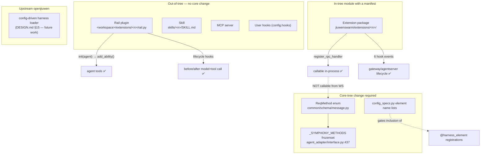

# Integration Challenges and Conflict Analysis

The obstacles, ranked by how much they constrain the architecture choice.

---

## 1. The extension surface is narrower than it looks — BLOCKER for pure-plugin designs

JiuwenSwarm advertises an extension system. Reading it closely, there are three distinct
surfaces with very different power.



### 1.1 The Rail plugin seam works and is the good news ✅

`RailManager` loads `rail.py` from `<agent_workspace>/extensions/<name>/`, validates that
it contains a class inheriting `DeepAgentRail` or `AgentRail`, compiles it, and can
register/unregister it on a **live** `DeepAgent` via `hot_reload_rail`. Four
`agent_ws_server` handlers drive import/delete/toggle/list. [E-J09]

And a Rail's `init(agent)` can add tools:

```python
for tool in tools:
    agent.ability_manager.add_ability(tool.card, tool)
```

— `MemberSkillToolkitRail`, `jiuwenswarm/agents/harness/team/rails/team_member_skill_toolkit_rail.py:53-55`. [E-J10]

**Consequence:** an AI4RnD integration can add research tools and hook every lifecycle
event without touching the core tree. This is what makes a non-fork architecture viable.

### 1.2 The extension RPC path is closed ❌

`ExtensionRegistry.register_rpc_handler(method, handler)` accepts any string method. But
reaching it from outside the process requires *both*:

```python
# jiuwenswarm/server/runtime/agent_adapter/interface.py:437
_SYMPHONY_METHODS: frozenset[ReqMethod] = frozenset({
    ReqMethod.SYMPHONY_BUILD_SCORE, ReqMethod.SYMPHONY_PAUSE_BUILD,
    ReqMethod.SYMPHONY_SCORE_STATUS, ReqMethod.SYMPHONY_GRAPH, ReqMethod.SYMPHONY_PLAN,
})

# interface.py:1400
if request.req_method not in _SYMPHONY_METHODS:
    return None
```

plus enum membership in `jiuwenswarm/common/schema/message.py:116-120`. [E-J08]

Both are core-tree files. There is no generic `extension.*` passthrough. So "extension"
in JiuwenSwarm means "in-tree module with a manifest and auto-installed dependencies", not
"third-party plugin with a stable versioned API".

**Mitigation:** in-process callers *can* dispatch by string —
`symphony_toolkits.py:47` does `registry.get_rpc_handler(method)` [E-J18]. So a Rail-registered
tool can call extension RPC handlers freely. The closed path only blocks *external*
callers, which the recommended architecture does not need.

**Residual cost:** a small in-tree patch (2 files, ~10 lines) is needed if the research
service must be driven from the web UI rather than only from the agent. Treat as an
upstream contribution candidate.

### 1.3 Harness element registration is open; inclusion is not ⚠️

`@harness_element` + `register_from_catalog()` writes into `openjiuwen`'s process-global
`dict[str, Callable]` registries. An out-of-tree module can register. But `config_specs.py`
holds hardcoded lists (`_COMMON_RAIL_NAMES`, `_CODE_RAIL_NAMES`, `_COMMON_TOOL_NAMES`, …)
that decide which names are folded into a member's `DeepAgentSpec`. Registering without
being listed is a no-op. The "configuration-file → harness loader" that would fix this is
explicitly **future work** in `DESIGN.md` §15. [E-J05]

**Consequence:** the elegant declarative assembly system is *not* an out-of-tree extension
point today. Adding a first-class swarm element means editing `config_specs.py`, which
means an in-tree change and a merge conflict on every upstream rebase.

---

## 2. Two orchestration models that cannot both be in charge — ARCHITECTURAL CONFLICT

| | JiuwenSwarm | AI4RnD |
|---|---|---|
| Unit of work | conversational turn / task-loop round | DAG node in a sprint |
| Progress trigger | model emits, loop evaluates | file appears, poller detects |
| Coupling | in-process objects | filesystem |
| Worker selection | role + configured elements | capability match |
| Completion | stop evaluator | gate verdict recorded in a ledger |
| Failure | exception → rail repairs context | verdict FAIL → status transition → re-dispatch |

Running both is not possible without one becoming subordinate. Three resolutions:

1. **JiuwenSwarm's loop is primary; AI4RnD's DAG runs inside a tool call.** The agent calls
   `research_run(...)`; the research service executes its own DAG internally and returns.
   Simple, works today, but AI4RnD's DAG cannot dispatch back to JiuwenSwarm agents.
2. **AI4RnD's DAG is primary; JiuwenSwarm agents are workers.** Requires an external API to
   drive JiuwenSwarm agents — blocked by §1.2 without a core patch, and inverts the
   ownership of session, permission and channel state.
3. **Two-level: JiuwenSwarm owns the outer loop; the research DAG owns research-internal
   scheduling and calls *back* into JiuwenSwarm agents for node execution.** Most powerful,
   most complex, and needs the §1.2 patch plus a callback contract.

The recommendation takes (1) for stage 1 and (3) as the target — see
[08-recommended-architecture.md](08-recommended-architecture.md).

---

## 3. Two state models that must not merge — DATA CONFLICT

JiuwenSwarm's durable state is a **session**: a chat transcript plus metadata, memory
index and skills. AI4RnD's is a **run bundle**: typed, content-hashed, schema-validated
artifacts under `runs/<run_id>/`.

Merging them would be wrong in both directions:

- Putting evidence into the session makes it un-queryable, un-hashable, and subject to
  context compaction and session rewind. A `/compact` must never be able to delete
  evidence.
- Putting conversation into the run bundle duplicates a working system.

**Resolution:** keep them separate, linked by `run_id` stored in session metadata. State
explicitly that *the run bundle is the source of truth for evidence, claims and verdicts;
the session is the source of truth for conversation and user intent.*

**Consequences to design for:**

- Session rewind must not orphan a run. Rewinding past the turn that started a run leaves
  the run alive — decide whether to cancel, detach or keep it.
- Session deletion and run retention need separate policies (research artifacts likely
  outlive conversations).
- Multi-channel session sharing means several users may observe one run.

---

## 4. `--dangerously-skip-permissions` versus the permission engine — SECURITY CONFLICT

AI4RnD's shipped workers launch as `claude --dangerously-skip-permissions --model opus`
[E-A05] and receive instructions by `tmux send-keys` with no permission check [E-A08].
JiuwenSwarm evaluates every tool call through a tiered policy engine with non-overridable
built-in denials, and can run the whole execution inside bwrap/cgroup [E-J11], [E-J12].

These are not reconcilable. Any design that ports AI4RnD's dispatcher into JiuwenSwarm
regresses the security posture of the combined system to AI4RnD's.

**Resolution: AI4RnD's dispatch layer does not come across.** Research operators execute as
JiuwenSwarm tool calls, governed normally.

**Note the direction of benefit.** Research operators fetch and parse untrusted web
content — arguably a stronger case for sandboxing than coding agents, since the input is
adversarial by default. Prompt injection through a fetched source is a live risk for any
research pipeline; jiuwenbox's network policy and the permission engine are exactly the
mitigations AI4RnD currently lacks.

---

## 5. Bash control plane cannot survive the move — PORTABILITY BLOCKER

`coordinator.sh` (5,797 LOC) and `solar-harness.sh` (6,119 LOC) encode a large amount of
orchestration logic in bash, with macOS-specific assumptions (`stat -f %m`, `osascript`
notifications, launchd plists). JiuwenSwarm is a Python package supporting Windows, macOS
and Linux, distributed via pip and signed desktop apps.

The logic worth keeping (state machine, routing, gate ledger) already exists in the Python
modules (`graph_scheduler.py`, `gate_ledger.py`, `verification_gate.py`); the bash is
mostly dispatch and polling — the parts being dropped anyway. But `coordinator.sh` also
holds the self-healing and compensation logic, which would need re-deriving if any of it
turns out to be load-bearing beyond substrate compensation.

**Estimated bash to port: near zero. Estimated bash to *read carefully first*: all of it**,
because the post-mortems in `DISPATCH-PROTOCOL.md` document behaviours the Python modules
assume.

---

## 6. Three overlapping "operator" concepts — VOCABULARY CONFLICT

Within AI4RnD alone:

| Module | Concept |
|---|---|
| `logical_operator_registry.py` | operator *types* with required capabilities |
| `physical_operator_catalog.py` | concrete *workers* with declared capabilities |
| `operator_router.py` | *scripts* dispatched per named "line" (a scheduled-job runner from the AI-influence subsystem) |

Plus `operator_runtime.py`, `operator_state_machine.py`, `operator_persona.py`,
`operator_score.py`, `operator_flow_control.py`, `skill_operator_registry.py`,
`logical_operator_router.py`, `operator_schedule_binder.py`,
`operator_model_selection.py`, `operator_registry_loader.py`.

Then JiuwenSwarm adds a *fourth* meaning: harness elements with provider factories.

**Consequence:** any integration must pick one vocabulary and rename the rest. Left
unresolved, this generates persistent confusion in code review, and there is real risk of
porting the wrong "operator" module. `operator_router.py` in particular looks central by
name and is not — it belongs to the AI-influence digest subsystem.

**Resolution:** adopt JiuwenSwarm's `element` for constructed capabilities, keep
`logical operator` / `physical operator` strictly for routing, and rename AI4RnD's
`operator_router.py` on port (or leave it behind — it is not needed).

---

## 7. Upstream maintenance exposure — RISK, not blocker

An integrator building on JiuwenSwarm is exposed to **two** upstream projects:

| Upstream | Exposure |
|---|---|
| `openJiuwen-ai/jiuwenswarm` | version 0.2.x, pre-1.0. Recent history shows renames (JiuwenClaw → JiuwenSwarm at v0.2.0) and active refactoring of the swarm assembly layer |
| `openjiuwen` (pinned `==0.1.15.post3`) | 0.1.x, pre-1.0, **not vendored, not readable in this repository**. Holds `DeepAgent`, rails, permission engine, the harness manifest framework and built-in elements |

Signals of instability in the swarm layer itself, from `DESIGN.md`:

- "openjiuwen has removed the class registry" — a registration mechanism was deleted
- "已下沉到 openjiuwen" — the manifest framework was *moved upstream* mid-development
- §15 lists six unfinished items including the config-driven loader and "upstream
  openjiuwen alignment"

**Implications:**

- Any in-tree change to `config_specs.py` or `interface.py` will conflict on rebase.
- `openjiuwen` API changes can break a Rail plugin without warning, since `DeepAgentRail`
  and `ability_manager` are its interfaces, not JiuwenSwarm's.
- Pinning `openjiuwen` protects against drift but forfeits fixes.

**Mitigation:** minimise in-tree footprint; wrap `openjiuwen` interfaces behind a thin
adapter in the integration layer so an upstream break is one file to fix; contribute the
RPC-passthrough patch upstream rather than carrying it.

---

## 8. Evidence integrity under context compaction — SUBTLE RELIABILITY RISK

JiuwenSwarm actively compacts context (`/compact`, `/compact-partial`, context engine) and
supports session rewind including file restoration. AI4RnD's model assumes artifacts are
immutable and content-hashed.

If evidence or citation data ever travels through the conversation as text — for example a
tool returning full evidence records into the transcript — compaction can silently drop or
summarise it, and a later citation-rendering step may cite something no longer present.

**Resolution:** research tools must return *references* (`evidence_id`, `claim_id`,
`run_id`), never bulk evidence text. The model reasons over ids and short summaries; the
service resolves them. This must be a hard rule in the tool contract, not a convention.

---

## 9. Language and contribution friction — OPERATIONAL

- JiuwenSwarm's code comments, design documents and log messages are substantially Chinese
  (`DESIGN.md` entirely so). AI4RnD mixes Chinese and English.
- JiuwenSwarm targets a Huawei-internal lint standard (`huawei-python-lint` referenced as a
  compliance gate in `DESIGN.md` §14) alongside ruff/pylint/mypy/codespell.
- Upstream contribution is via GitCode, not GitHub — the canonical repository is
  `gitcode.com/openJiuwen/jiuwenswarm`.

None of these blocks anything; all raise the cost of upstreaming and of onboarding
contributors who read only English.

---

## 10. Plugin execution is unsandboxed in both systems — SHARED SECURITY GAP

JiuwenSwarm validates `rail.py` by regex and `compile()`, then executes it with full
agent-server privileges [E-J09]. `ExtensionLoader._install_dependencies` runs
`pip install` / `uv pip install` on manifest-declared dependencies, logging failures rather
than raising [E-J17]. AI4RnD has no plugin isolation either.

Since the recommended architecture *depends* on the Rail plugin mechanism, this gap is
inherited. It is acceptable for a first-party integration (the plugin is your own code)
but must not be presented as a general third-party plugin story.

---

## Blocker summary

| # | Challenge | Severity | Blocks which options |
|---|---|---|---|
| 1.2 | Extension RPC path closed | Medium | pure out-of-tree with external API |
| 1.3 | Harness element inclusion hardcoded | Medium | first-class swarm elements without core change |
| 2 | Two orchestration models | High | any design where both drive |
| 3 | Two state models | Medium | any design that merges stores |
| 4 | Permission model conflict | **High** | any port of AI4RnD's dispatcher |
| 5 | Bash control plane | Medium | lift-and-shift of AI4RnD |
| 6 | Operator vocabulary | Low | none — but generates review confusion |
| 7 | Two pre-1.0 upstreams | Medium | designs with a large in-tree footprint |
| 8 | Compaction vs evidence integrity | Medium | designs that pass evidence through context |
| 10 | Unsandboxed plugins | Medium | third-party plugin distribution |

**None of these blocks the integration outright.** Together they rule out two of the six
architecture options and shape the rest — see [07-architecture-options.md](07-architecture-options.md).
