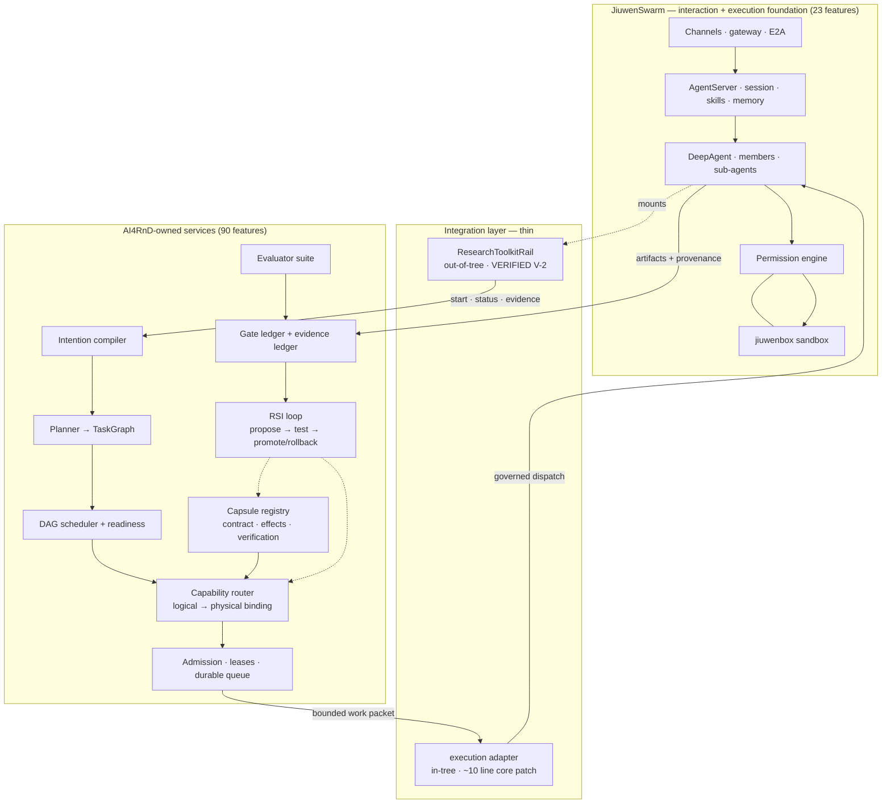

# Architecture Options — Reconsidered Against the Complete Product

**This document replaces the previous revision's version.** That version evaluated options
against "AI4RnD as it exists today, modelled as a research report generator". The controlling
question is now the complete intended product: 142 features across three planes
([00-intended-product-model.md](00-intended-product-model.md)), of which JiuwenSwarm covers
20 fully and 72 not at all.

The previous recommendation (Option D, hybrid) is **not assumed**. It is re-derived below,
and it survives — but with a materially different shape and for partly different reasons.

---

## What changed in the inputs

| Input | Previous revision | Now |
|---|---|---|
| Scope | one research lane | 142 features, 9 workflow lanes + 10 foundation groups + 6 verticals |
| Rail seam | inferred, unverified | **executed** — register + invoke + uninit all work (V-2) |
| Permission engine | "strong, non-overridable built-ins" | **built-in rules load 0 in a stock install** (V-4) |
| Per-member permissions | assumed feasible | **only 2 roles, global policy** — writer≠verifier not expressible (V-6) |
| Capsules | dismissed as ≈ skills | **formal 11-section contract**, 30 registered (V-11) |
| RSI | "largely aspirational" | **GEPA 3,540 LOC, full lifecycle, unwired**; 6 of 8 surfaces absent (V-13) |
| Grounding | unknown quality | **precision 0.25** (V-12) |
| DeepSearch overlap risk | High | **Low** — zero evidence machinery (V-14) |
| AI4RnD maturity | read | **48/48 import, 29 wired, 19 implemented-but-unwired** (V-8) |

Two of these change option scoring directly: the operator/capsule layer is much more real
than assumed (raising the cost of "rebuild inside JiuwenSwarm"), and JiuwenSwarm's team model
is much thinner than assumed (lowering the value of "make AI4RnD agents into JiuwenSwarm
members").

---

## Option A — AI4RnD through JiuwenSwarm extension points only

Everything out-of-tree: Rail plugins, skills, MCP, config.

**Now verified possible for tools** (V-2), and that matters — but the ceiling is lower than
the product needs.

| | |
|---|---|
| ✅ | zero upstream conflict; hot-installable; **mechanism proven by execution** |
| ✅ | delivers the research evidence lane quickly |
| ❌ | a Rail lives *inside* one agent's loop. The DAG scheduler, capability router, capsule registry and RSI loop must sit **above** agents, deciding which agent runs what. A Rail structurally cannot host them. |
| ❌ | no durable queue, no leases, no run lifecycle — Harness Core 2/4/6 unreachable |
| ❌ | 72 features with no JiuwenSwarm counterpart would all have to hide inside tool calls |
| ❌ | capsule `effects` / `operator_compatibility` cannot influence JiuwenSwarm's tool permissions |

**Verdict: viable as Stage 1 only.** It can deliver perhaps 25 of 142 features. It is the
right *first step* of a larger architecture, not an architecture.

---

## Option B — A substantial AI4RnD product layer inside JiuwenSwarm

Port the Foundation plane into the JiuwenSwarm tree as first-class subsystems, with new
harness elements, new `ReqMethod` entries, `config_specs` names, and UI views.

Now that we know the Foundation plane is ~25k LOC of existing tested code, this means moving
~25k LOC into a 340k-LOC tree owned by someone else.

| | |
|---|---|
| ✅ | full access to elements, RPC, UI, session; single process |
| ✅ | capsule effects could genuinely drive the permission engine |
| ❌ | permanent conflicts in `config_specs.py`, `message.py`, `interface.py` — the three files upstream refactors touch most |
| ❌ | AI4RnD's roadmap becomes gated by JiuwenSwarm's release cadence, lint standard (`huawei-python-lint`) and Chinese-first documentation conventions |
| ❌ | upstream did not ask for a research product; realistically un-upstreamable, so this is a soft fork wearing a different name |
| ❌ | **RSI would have to mutate JiuwenSwarm's own source** to improve capsules/operators — a self-modifying agent inside someone else's package |
| ❌ | the 27 build-new features arrive slower, gated by integration work |

**Verdict: rejected.** The RSI point is decisive on its own: a controlled self-improvement
loop that promotes and rolls back Capsules and Operators needs to own its artifact tree. It
cannot do that inside an upstream package it must periodically rebase.

---

## Option C — AI4RnD as a separate service connected over a stable protocol

The whole Foundation + Workflow plane runs as AI4RnD-owned services. JiuwenSwarm is one
client among several, reached over a defined protocol.

| | |
|---|---|
| ✅ | clean ownership; independent release, testing, language and lint standards |
| ✅ | the RSI loop owns its own artifact tree, registries and promotion path |
| ✅ | the research core is reusable outside JiuwenSwarm (CLI, CI, other hosts) — **verified standalone** (V-10) |
| ✅ | long-running runs are natural |
| ✅ | minimal upstream footprint |
| ⚠️ | execution has to happen *somewhere*. If AI4RnD executes work itself, it re-creates its own worker fleet — and the shipped one is tmux + `--dangerously-skip-permissions` |
| ❌ | without a callback, physical operators cannot be governed JiuwenSwarm agents, so the permission engine and sandbox do not apply to research work |

**Verdict: strong on ownership, incomplete on execution.** The gap is precisely what Option D
closes.

---

## Option D — Hybrid: JiuwenSwarm as interaction + execution foundation, AI4RnD-owned workflow services ✅ **RECOMMENDED**

Option C plus a governed execution callback, so AI4RnD's capability router can bind a DAG
node to a **JiuwenSwarm agent as a physical operator**.

**Ownership.** JiuwenSwarm owns: channels, session, conversational state, skills, memory,
tool execution, permissions, sandbox, packaging, UI shell. AI4RnD owns: capsules, operators,
TaskGraph, scheduling, routing, admission/leases, evaluators, evidence, gate ledger, RSI,
and all workflow lanes.

| | |
|---|---|
| ✅ | all of Option C's ownership benefits |
| ✅ | research nodes execute as **governed** JiuwenSwarm tool calls — permissions, sandbox, model config, cost accounting |
| ✅ | capability routing operates over real JiuwenSwarm agents as one operator class among several (API models, browser operators, remote hosts) |
| ✅ | in-tree footprint ≈ one extension directory + ~10 lines; **Stages 1–3 need none of it** |
| ✅ | RSI keeps its own tree, registries and promotion path |
| ⚠️ | **V-6 constraint:** JiuwenSwarm has only `leader`/`teammate` with global permission policy. Writer≠verifier and per-operator permissions must be enforced **in AI4RnD's router**, not delegated to JiuwenSwarm |
| ⚠️ | the callback contract is the hard design problem (bounded packets, idempotency, cancellation, non-re-entrancy) |
| ⚠️ | two processes to operate |

**Verdict: recommended.** Detail in [08-recommended-architecture.md](08-recommended-architecture.md).

---

## Option E — Maintained JiuwenSwarm fork

| | |
|---|---|
| ✅ | freedom to fix the closed `ReqMethod` enum, the hardcoded `config_specs` lists, the two-role team limit, and the V-4 built-in-rules regression |
| ✅ | could add per-member permissions properly |
| ❌ | inherits 340k LOC permanently, against an active upstream (v0.2.0 → v0.2.3.beta1 in ~3 months, including a project rename) |
| ❌ | **does not buy control of `openjiuwen`** — `DeepAgent`, rails, the permission engine and the manifest framework live in a separate pinned pre-1.0 package. The fork takes the maintenance cost of the smaller half. |
| ❌ | 27 build-new features and 6 missing RSI surfaces still have to be written; the fork buys none of them |

**Verdict: rejected**, on the same ground as before, now reinforced: V-4 showed the most
security-relevant defect is in `openjiuwen`, not JiuwenSwarm — so a JiuwenSwarm fork would
not even let you fix it cleanly.

---

## Option F — Separate systems, no integration

| | |
|---|---|
| ✅ | zero integration cost |
| ❌ | AI4RnD stays single-user, macOS-primary, with `--dangerously-skip-permissions` workers and no isolation |
| ❌ | 23 REUSE-JW features would have to be built: 9 IM channels, desktop apps, TUI, memory index, sandbox, packaging |
| ❌ | the tmux/polling substrate keeps generating the failure classes documented in `DISPATCH-PROTOCOL.md` |

**Verdict: rejected as a target.** Retained as the fallback if Stage 0/1 evidence gates fail.

---

## Option G — Defer JiuwenSwarm ⭐ **newly considered**

The instruction explicitly allows concluding that JiuwenSwarm is not a suitable foundation.
This option takes the finding that JiuwenSwarm covers only 20/142 features fully and asks:
is the substrate worth the coupling at all? Build AI4RnD standalone on generic infrastructure
(FastAPI + a real queue + a container sandbox), and integrate JiuwenSwarm later, or never.

| | |
|---|---|
| ✅ | no coupling to two pre-1.0 upstreams |
| ✅ | AI4RnD's Foundation plane never has to fit someone else's abstractions |
| ✅ | avoids the V-6 two-role limitation entirely — operators can have arbitrary per-operator permissions |
| ✅ | avoids the V-4 permission regression |
| ❌ | forfeits 23 working features, several of which are large: 9 IM connectors, signed desktop apps for two platforms, a TUI, a 1,224-LOC memory index with vector search, and a real OS sandbox (bwrap/cgroup/network policy) |
| ❌ | those are unglamorous, high-effort, low-differentiation builds — exactly the work worth *not* doing |
| ❌ | loses JiuwenSwarm's 2,816-test regression suite as a stability floor for the substrate |

**Verdict: rejected, but it is the closest competitor to Option D** and the honest
counterfactual. The deciding argument: everything Option G would rebuild is commodity
substrate, and everything AI4RnD differentiates on is already outside JiuwenSwarm under
Option D. Option D gets the substrate for the price of a thin adapter; Option G pays full
price for it. Option G becomes correct only if the callback contract proves unworkable or
the upstream coupling proves unstable — the Stage-2 decision point.

---

## Comparison

| Criterion | A: extensions | B: in-tree | C: service | **D: hybrid** | E: fork | F: separate | G: defer JW |
|---|---|---|---|---|---|---|---|
| Features reachable (of 142) | ~25 | 142 | ~130 | **142** | 142 | 119 | 119 |
| Core changes needed | 0 | many | 0 | ~10 lines | unlimited | 0 | 0 |
| Capsules / operators / TaskGraph owned by | JW (badly) | JW | AI4RnD | **AI4RnD** | fork | AI4RnD | AI4RnD |
| RSI can own its artifact tree | ❌ | ❌ | ✅ | **✅** | ⚠️ | ✅ | ✅ |
| Research nodes governed by permissions+sandbox | ✅ | ✅ | ❌ | **✅** | ✅ | ❌ | needs building |
| Durable queue + leases | ❌ | port | ✅ | **✅** | port | ✅ | ✅ |
| Writer≠verifier enforceable | ❌ | ⚠️ | ✅ | **✅ (in AI4RnD router)** | ✅ | ✅ | ✅ |
| Gets 23 REUSE-JW features free | ✅ | ✅ | ✅ | **✅** | ✅ | ❌ | ❌ |
| Upstream coupling risk | low | **high** | low | low–med | n/a | none | none |
| Time to first user value | 6 wks | 4 mo | 3 mo | **6 wks** | 2 mo | — | 3 mo |
| Time to complete product | n/a | 20+ mo | 16 mo | **15–18 mo** | 20+ mo | 18 mo | 18–20 mo |
| Maintenance burden | low | high | med | **med** | very high | med | med |
| **Overall** | stage 1 | ❌ | good | ✅ | ❌ | fallback | runner-up |

---

## Why D, restated against the complete product

1. **The Foundation plane must be AI4RnD-owned.** Capsules with formal contracts, logical/
   physical operators, TaskGraph, evaluators and an RSI loop that promotes and rolls back
   versions cannot live inside an upstream package on someone else's release cadence
   (rules out B and E).
2. **Execution must be governed.** Research operators fetch and parse untrusted web content —
   the workload most in need of a permission engine and a sandbox. AI4RnD's own execution
   path has neither (rules out C and F).
3. **The substrate is not worth rebuilding.** 23 features — channels, desktop apps, TUI,
   memory, sandbox, packaging — are commodity, large, and already tested to 2,816 passing
   tests (rules out G).
4. **The seam is proven.** V-2 executed the Rail registration and invocation path end to end.
   The integration mechanism is no longer an assumption.

**What would overturn this.** If the execution callback cannot be made bounded, idempotent
and cancellable — the Stage 2 exit gate — then governed execution through JiuwenSwarm fails,
and Option G becomes correct. That is the single decision that flips the recommendation, and
it is testable early.
