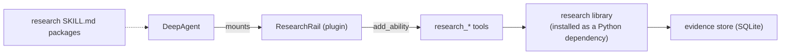
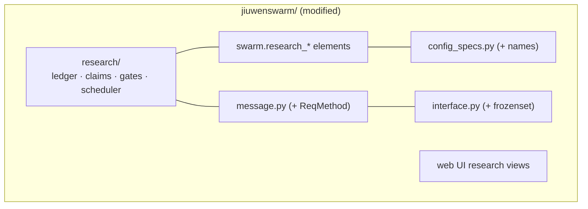
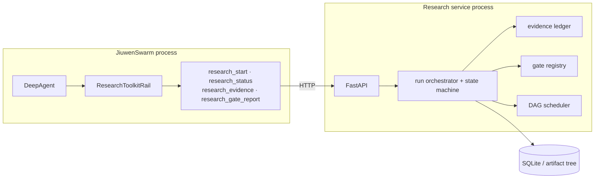
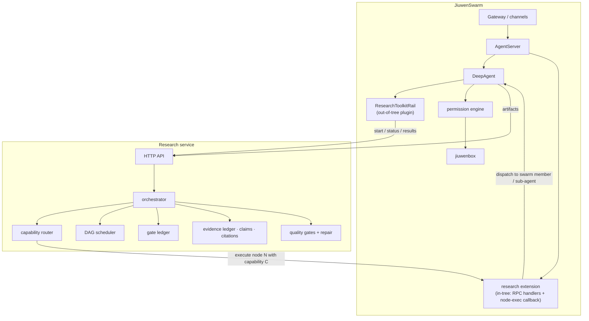

# Architecture Options Compared

Six options, evaluated against the constraints in
[06-integration-challenges.md](06-integration-challenges.md).

---

## Option A — AI4RnD entirely through existing extension points

Everything lives out-of-tree: Rail plugins, skills, MCP servers, config. No JiuwenSwarm
source changes.

**Feasible?** Partly. The Rail plugin can register tools and hook lifecycle events
[E-J09],[E-J10]; skills and MCP need no code changes.

| | |
|---|---|
| ✅ | zero upstream conflict; rebases cleanly forever |
| ✅ | hot-installable, hot-toggleable, no restart |
| ✅ | fastest path to a working demo |
| ❌ | no external API — the research pipeline can only be driven by the agent, never by the web UI or a scheduler (§1.2) |
| ❌ | no capability routing, no DAG scheduling — those need to sit *above* the agent loop, and a Rail sits *inside* it |
| ❌ | no run lifecycle visible to JiuwenSwarm; runs are opaque tool calls |
| ❌ | long research runs must complete inside a tool-call timeout, or become fire-and-forget |
| ❌ | plugin runs unsandboxed with full agent-server privileges (§10) |

**Cost:** ~4–6 weeks for a first useful version.
**Verdict: viable as a first stage, insufficient as the target.** It delivers the evidence
ledger and grounded synthesis to users quickly, and buys the evidence needed to justify
anything larger.

---

## Option B — AI4RnD components added inside JiuwenSwarm

Port the research core into the JiuwenSwarm tree as first-class subsystems
(`jiuwenswarm/research/`), with new harness elements, new `ReqMethod` entries, new
`config_specs` names, and web UI views.

| | |
|---|---|
| ✅ | full access to everything — elements, RPC, UI, session integration |
| ✅ | single deployable; one process model; one config file |
| ✅ | research state can participate in session rewind, permissions, sandbox natively |
| ❌ | **permanent merge conflicts** in `config_specs.py`, `message.py`, `interface.py` — the three files any upstream refactor touches (§7) |
| ❌ | couples the research roadmap to JiuwenSwarm's release cadence |
| ❌ | research code must satisfy a Huawei-internal lint standard and Chinese-first documentation conventions |
| ❌ | ~15–20k LOC of research code entering a tree whose maintainers did not ask for it — upstreaming is unlikely, so this is a soft fork in practice |
| ❌ | AI4RnD's research pipeline evolves fast; JiuwenSwarm's release process would gate every change |

**Cost:** ~4–6 months, plus permanent rebase tax.
**Verdict: rejected.** All the costs of a fork with none of the independence. If the code
is going in-tree anyway, Option E is more honest about what has happened.

---

## Option C — AI4RnD as a separate service connected to JiuwenSwarm

The research core runs as its own process with an HTTP API. JiuwenSwarm reaches it through
tools registered by a Rail plugin.

| | |
|---|---|
| ✅ | clean ownership boundary; each system keeps its own model |
| ✅ | independent release cadence, independent testing, independent language/lint standards |
| ✅ | the research core stays reusable outside JiuwenSwarm (CLI, CI, other agent hosts) |
| ✅ | long-running runs are natural — the agent polls status rather than blocking |
| ✅ | minimal upstream footprint: one Rail plugin, zero core changes |
| ✅ | the service can be given its own sandbox/network policy independently |
| ⚠️ | research operators that need an LLM must either call one directly (bypassing JiuwenSwarm's model config, permissions and cost accounting) or call back into JiuwenSwarm (needs the §1.2 patch) |
| ⚠️ | two processes to deploy, supervise, upgrade and secure |
| ⚠️ | the API is a new attack surface — must bind loopback with auth |
| ❌ | no capability-based routing over JiuwenSwarm's own agents unless the callback exists |

**Cost:** ~3–4 months.
**Verdict: strong.** The `⚠️` on LLM access is the crux — and is exactly what the hybrid
resolves.

---

## Option D — Hybrid ✅ RECOMMENDED

Option C, plus a *small* in-tree extension that gives the research service a governed way
to execute work back through JiuwenSwarm agents.

Two flows, deliberately separate:

- **User-facing** (out-of-tree, works today): the agent calls research tools; the Rail
  plugin talks HTTP to the service.
- **Service-facing** (small in-tree patch): the service asks JiuwenSwarm to execute a
  bounded work packet on a capability-matched agent, and JiuwenSwarm executes it with full
  permission and sandbox governance.

| | |
|---|---|
| ✅ | every benefit of Option C |
| ✅ | research nodes execute as *governed* JiuwenSwarm tool calls — permissions, sandbox, audit, model config, cost accounting all apply |
| ✅ | capability routing operates over real JiuwenSwarm workers |
| ✅ | in-tree footprint is one extension directory plus ~10 lines in two files — small enough to upstream as a generic "extension RPC passthrough" feature that benefits everyone |
| ✅ | degrades gracefully: without the patch, Option A/C behaviour still works |
| ⚠️ | the callback contract is the hard design problem — bounded packets, idempotency, cancellation, timeout, and no re-entrancy loops |
| ⚠️ | still two processes |

**Cost:** ~5–7 months to full target; ~6 weeks to the Option A subset.
**Verdict: recommended.** Detail in [08-recommended-architecture.md](08-recommended-architecture.md).

---

## Option E — Fork JiuwenSwarm

Take `suraj-subrahmanyan/jiuwenswarm`, add the research core in-tree, diverge.

| | |
|---|---|
| ✅ | total freedom; no negotiation with upstream |
| ✅ | can fix the closed RPC enum, the hardcoded `config_specs` lists, and add capability routing to swarm assembly directly |
| ❌ | inherits ~340k LOC of Python plus a pinned pre-1.0 external framework, permanently |
| ❌ | upstream is active (v0.2.0 → v0.2.1 → v0.2.3.beta1 over ~3 months, with a project rename in that window). Divergence cost compounds fast |
| ❌ | `openjiuwen` is still an unforkable external dependency — the fork does not buy control of the actual agent runtime |
| ❌ | loses security fixes, new channels, Symphony and Auto Harness improvements unless merged |
| ❌ | a small team cannot maintain a fork of this size alongside a research programme |

**Cost:** low to start, unbounded to sustain.
**Verdict: rejected.** The decisive argument is that forking JiuwenSwarm does not give
control of `openjiuwen`, where half the runtime lives. It buys the smaller half of the
problem at full price.

---

## Option F — Keep the systems separate

Do nothing. Run AI4RnD as it is; use JiuwenSwarm independently.

| | |
|---|---|
| ✅ | zero integration cost and zero risk today |
| ✅ | AI4RnD keeps full control of its roadmap |
| ❌ | AI4RnD stays single-user, single-machine, macOS-primary, with no packaging story |
| ❌ | research workers keep running `--dangerously-skip-permissions` with no isolation |
| ❌ | the tmux/polling substrate keeps generating the failure classes in `DISPATCH-PROTOCOL.md` |
| ❌ | no multi-channel delivery, no session management, no memory, no skill ecosystem |
| ❌ | duplicated investment: JiuwenSwarm's Auto Harness and AI4RnD's evaluation loop solve overlapping problems separately |

**Cost:** zero now; ongoing opportunity cost.
**Verdict: rejected as a target, valid as a fallback** if the Stage 1 evidence gates in
[09-implementation-plan.md](09-implementation-plan.md) fail.

---

## Comparison

| Criterion | A: Extension points | B: In-tree | C: Service | **D: Hybrid** | E: Fork | F: Separate |
|---|---|---|---|---|---|---|
| Upstream conflict | none | severe | none | minimal | n/a (owns it) | none |
| Core changes needed | 0 | many | 0 | ~10 lines, 2 files + 1 dir | unlimited | 0 |
| Delivers evidence ledger | ✅ | ✅ | ✅ | ✅ | ✅ | already has |
| Delivers capability routing | ❌ | ✅ | partial | ✅ | ✅ | already has |
| Delivers DAG scheduling | ❌ | ✅ | ✅ | ✅ | ✅ | already has |
| Governed tool execution | ✅ | ✅ | ⚠️ (service side ungoverned) | ✅ | ✅ | ❌ |
| Multi-channel delivery | ✅ | ✅ | ✅ | ✅ | ✅ | ❌ |
| Sandboxed research operators | ✅ | ✅ | ⚠️ | ✅ | ✅ | ❌ |
| External API for research | ❌ | ✅ | ✅ | ✅ | ✅ | ✅ |
| Independent release cadence | ✅ | ❌ | ✅ | ✅ | ⚠️ | ✅ |
| Research core reusable elsewhere | ⚠️ | ❌ | ✅ | ✅ | ❌ | ✅ |
| Processes to operate | 1 | 1 | 2 | 2 | 1 | 2 (unrelated) |
| Time to first user value | **6 wks** | 4 mo | 3 mo | 6 wks (A subset) | 2 mo | 0 |
| Time to target | n/a | 4–6 mo | 3–4 mo | 5–7 mo | 6+ mo | n/a |
| Maintenance burden | low | high | medium | medium | **very high** | medium |
| Risk of upstream break | low | high | low | low–medium | n/a | none |
| **Overall** | stage 1 | ❌ | good | ✅ **recommended** | ❌ | fallback |

---

## Why D over C

C's single weakness is that research operators needing an LLM must either call a model
provider directly or call back into JiuwenSwarm. Calling directly means:

- a second model configuration to maintain, diverging from `models show`
- no permission checks on tools those operators use
- no sandbox for fetching and parsing untrusted sources
- cost accounting split across two systems
- prompt-injection exposure with none of jiuwenswarm's mitigations

D closes that gap for the price of a ~10-line core patch that is *generically useful* —
allowing extension-registered RPC methods to be reached, which is arguably a bug fix rather
than a feature, and a plausible upstream contribution.

## Why D over A

A cannot host the DAG scheduler or the capability router. A Rail lives *inside* the agent
loop; those components must sit *above* it, deciding which agent runs what. A is the right
**first stage** of D, not an alternative to it.

## Why D over E

Forking does not deliver control of `openjiuwen`, where `DeepAgent`, the rails, the
permission engine and the harness manifest framework actually live. A fork therefore
inherits the maintenance cost of 340k LOC while still being exposed to a pinned, external,
pre-1.0 dependency for the runtime that matters. The trade is strictly bad.
