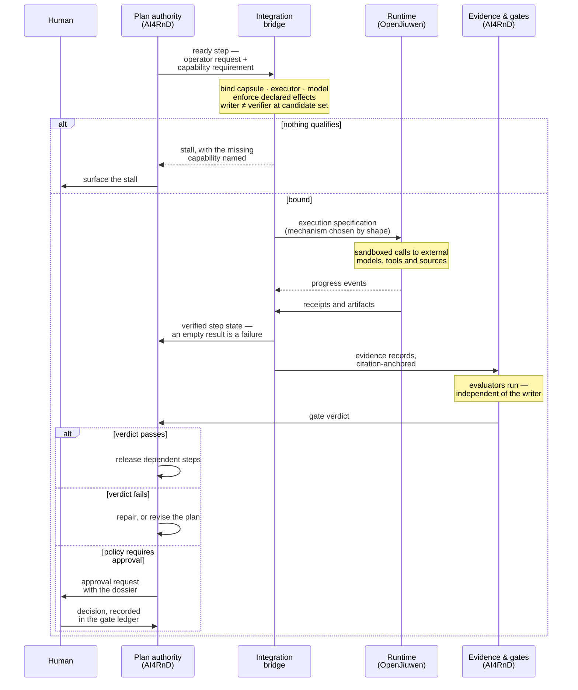

# The Functional Architecture, End to End

**Supporting engineering narrative.** The canonical stakeholder deliverable is the
[Architecture Report](REPORT.md); this document carries the deeper functional walk-through,
including the one-step execution sequence that the report deliberately leaves to an appendix.

The organizing idea:

> **AI4RnD is an evidence-governed autonomous R&D system**, and **claims refinement is its
> verification spine**: nothing it asserts reaches a user without resolving to evidence, and
> nothing is built before its hypothesis can state what would refute it. (An earlier revision
> used the spine — "a claims refinery" — as the whole identity; that was too narrow, and the
> correction is recorded in the report's change log.)

The stages (§2), the state model (§3), the execution round trip (§4) and the loops (§5) all
follow from that spine.

Labels used throughout: **[today]** — verified current behaviour; **[target]** — the proposed
architecture; **[evidence]** — the observation that justifies a choice, with its verification
class. Dense probe detail stays in
[06-evidence-assumptions-open-questions.md](06-evidence-assumptions-open-questions.md).

---

## 1. The user journey — where it really begins and ends

The journey does not begin at a chat message and does not end at a report.

It **begins when a need exists** — a research question, a qualified technical clue, or a pile of
material worth understanding. Two of the workbook's seven intake features are about capturing
needs the user did not type into a chat box (qualified channel signals, imported material).

It **ends twice**. First for the requester: they hold a deliverable whose every claim resolves to
evidence, distributed with authorization. Then for the organization: the project closes, its
evidence freezes, and what was learned — concepts, datasets, code, benchmarks, and sometimes a
new capability capsule — outlives the run. The workbook is explicit that closure and knowledge
transfer are product outcomes, not clean-up.

One loop deliberately **outlives every journey**: governed improvement. It consumes run history
across projects and returns better capsules, prompts, routing and evaluators to future runs.

```svg
<svg viewBox="0 0 1190 314" width="1190" xmlns="http://www.w3.org/2000/svg" font-family="inherit" role="img" aria-label="The user journey">
<defs><marker id="ahj" viewBox="0 0 10 10" refX="9" refY="5" markerWidth="7" markerHeight="7" orient="auto-start-reverse"><path d="M0 0L10 5L0 10z" fill="var(--subtle)"/></marker></defs>
<rect x="40" y="56" width="190" height="60" rx="7" fill="var(--surface)" stroke="var(--line-strong)"/>
<text x="135.0" y="83" font-size="12.5" text-anchor="middle" font-weight="640" fill="var(--ink)">A need</text>
<text x="135.0" y="97" font-size="11" text-anchor="middle" fill="var(--muted)">question · clue · material</text>
<rect x="290" y="56" width="220" height="60" rx="7" fill="var(--surface)" stroke="var(--line-strong)"/>
<text x="400.0" y="83" font-size="12.5" text-anchor="middle" font-weight="640" fill="var(--ink)">Understand</text>
<text x="400.0" y="97" font-size="11" text-anchor="middle" fill="var(--muted)">mint the Research Contract</text>
<rect x="570" y="56" width="220" height="60" rx="7" fill="var(--surface)" stroke="var(--line-strong)"/>
<text x="680.0" y="76" font-size="12.5" text-anchor="middle" font-weight="640" fill="var(--ink)">Frame</text>
<text x="680.0" y="90" font-size="11" text-anchor="middle" fill="var(--muted)">mint falsifiable claims</text>
<text x="680.0" y="104" font-size="11" text-anchor="middle" fill="var(--muted)">and the plan</text>
<rect x="850" y="56" width="250" height="60" rx="7" fill="var(--surface)" stroke="var(--line-strong)"/>
<text x="975.0" y="76" font-size="12.5" text-anchor="middle" font-weight="640" fill="var(--ink)">Establish</text>
<text x="975.0" y="90" font-size="11" text-anchor="middle" fill="var(--muted)">build · benchmark · evaluate</text>
<text x="975.0" y="104" font-size="11" text-anchor="middle" fill="var(--muted)">mint verdicts</text>
<path d="M230 86 L290 86" fill="none" stroke="var(--subtle)" stroke-width="1.5" marker-end="url(#ahj)"/>
<path d="M510 86 L570 86" fill="none" stroke="var(--subtle)" stroke-width="1.5" marker-end="url(#ahj)"/>
<path d="M790 86 L850 86" fill="none" stroke="var(--subtle)" stroke-width="1.5" marker-end="url(#ahj)"/>
<path d="M975 56 L975 28 L680 28 L680 56" fill="none" stroke="var(--subtle)" stroke-width="1.5" marker-end="url(#ahj)"/>
<text x="827" y="22" font-size="11" text-anchor="middle" fill="var(--muted)">claim refuted — reframe honestly</text>
<rect x="290" y="216" width="220" height="60" rx="7" fill="var(--surface)" stroke="var(--line-strong)"/>
<text x="400.0" y="236" font-size="12.5" text-anchor="middle" font-weight="640" fill="var(--ink)">Deliver</text>
<text x="400.0" y="250" font-size="11" text-anchor="middle" fill="var(--muted)">the evidence-backed</text>
<text x="400.0" y="264" font-size="11" text-anchor="middle" fill="var(--muted)">deliverable</text>
<rect x="570" y="216" width="220" height="60" rx="7" fill="var(--surface)" stroke="var(--line-strong)"/>
<text x="680.0" y="236" font-size="12.5" text-anchor="middle" font-weight="640" fill="var(--ink)">Close & retain</text>
<text x="680.0" y="250" font-size="11" text-anchor="middle" fill="var(--muted)">freeze evidence ·</text>
<text x="680.0" y="264" font-size="11" text-anchor="middle" fill="var(--muted)">keep the knowledge</text>
<rect x="850" y="216" width="250" height="60" rx="7" fill="var(--surface)" stroke="var(--line-strong)"/>
<text x="975.0" y="236" font-size="12.5" text-anchor="middle" font-weight="640" fill="var(--ink)">Improve — governed</text>
<text x="975.0" y="250" font-size="11" text-anchor="middle" fill="var(--muted)">better capsules · prompts ·</text>
<text x="975.0" y="264" font-size="11" text-anchor="middle" fill="var(--muted)">routing · evaluators</text>
<path d="M940 116 L940 186 L400 186 L400 216" fill="none" stroke="var(--subtle)" stroke-width="1.5" marker-end="url(#ahj)"/>
<text x="668" y="178" font-size="11" text-anchor="middle" fill="var(--muted)">Contract satisfied — deliver</text>
<path d="M510 246 L570 246" fill="none" stroke="var(--subtle)" stroke-width="1.5" marker-end="url(#ahj)"/>
<path d="M790 246 L850 246" fill="none" stroke="var(--subtle)" stroke-width="1.5" stroke-dasharray="5 4" marker-end="url(#ahj)"/>
<text x="820" y="240" font-size="11" text-anchor="middle" fill="var(--muted)">run history</text>
<path d="M1010 216 L1010 146 L400 146 L400 116" fill="none" stroke="var(--subtle)" stroke-width="1.5" stroke-dasharray="5 4" marker-end="url(#ahj)"/>
<text x="668" y="140" font-size="11" text-anchor="middle" fill="var(--muted)">next runs start stronger — the loop outlives every journey</text>
</svg>
```

Five journey phases, one standing loop. The nine workbook lanes live inside these phases
(Understand = Ingestion + Requirement compilation; Frame = Search & ideation + Opportunity
selection + Claims & hypotheses; Establish = POC + Benchmarking + Evaluation; Deliver and Close =
Delivery). The lanes remain individually addressable capabilities — a literature-only project
never enters Establish; a refuted claim re-enters Frame — but the *phases* are what a stakeholder
should hold in mind, because each phase exists to mint one kind of durable object.

**[evidence]** The phase grouping is not aesthetic. The workbook gives each lane an evidence
obligation, and the obligations cluster exactly this way: Understand owes a confirmed Contract,
Frame owes falsifiable claims (feature 33 makes falsifiability screening a hard gate before
construction), Establish owes verdicts against acceptance criteria, Deliver owes an authorized,
evidence-linked deliverable, Close owes frozen evidence and packaged knowledge.

## 2. The functional stages and who decides

Every stage has exactly one decision owner. "The system" is never an answer.

| Stage | What it decides | Decision owner | Human involvement |
|---|---|---|---|
| Intake & qualification | is this a real, authorized, non-duplicate need? | **AI4RnD** intake rules | none |
| Intention compilation | what does the user actually want; is it unambiguous? | **AI4RnD** Intention Compiler | answers ambiguity questions; **confirms the Contract** — work cannot start before this |
| Planning | what must be established, in what dependency order? | **AI4RnD** Planner | inspects the plan; may constrain it |
| Semantic readiness | is this step *meaningfully* ready — deps, inputs, budget, scope? | **AI4RnD** run-state authority | none |
| Capability & model binding | which capsule, executor and model may serve this step? | **Integration bridge**, from the capsule registry — stalls when nothing qualifies | resolves stalls (add capability, relax requirement, or cancel) |
| Mechanism choice | agent turn, scripted pipeline, staged workflow, team, or worktree build? | **Integration bridge** compiler, from the sub-plan's shape | never — this is invisible to users |
| Physical execution | ordering, batching, retries *within* a specification | **OpenJiuwen** runtime | none |
| Step success | did the step actually succeed? | **AI4RnD** — never inferred from the engine's completion signal | none |
| Evidence validity | does the artifact support the claim? | **AI4RnD** evaluators, writer ≠ verifier | none |
| Gate verdicts | does the claim stand; may work proceed? | **AI4RnD** gate policy | **approves where policy requires** |
| Repair vs replan | fix the artifact, or change the plan? | **AI4RnD** repair logic | escalation target |
| Completion & delivery | is the Contract satisfied; who may receive the result? | **AI4RnD** against Contract acceptance | authorizes distribution |
| Identity, session, config | who is the user; where do they interact? | **JiuwenSwarm** application | n/a |
| Self-modification | may the system change its own capabilities? | **Governed RSI** loop | **approves every promotion** |

Three human touchpoints are load-bearing and deliberate: Contract confirmation, gated approvals,
and improvement approvals. Everything else is designed to run unattended.

**[evidence]** Step success stays with AI4RnD because of an executed finding: a SwarmFlow step
that fails all its retries returns an empty result and the run reports success (EXEC, probe
V-22). Binding stalls rather than substitutes because the runtime silently falls back to the
default model when a requested one is missing (SRC, V-24). Mechanism choice is hidden from users
because exposing it would couple the product's semantics to a guess about internals — a judgment,
recorded as such.

## 3. The state spine — how persistent product state changes

The functional heart of the product is not a pipeline of services. It is a short chain of
**durable objects**, each minted by one phase, owned by one authority, and never silently
mutated. (Two earlier absolutes — "the TaskGraph is the only mutable object" and "runtime state
is never product state" — were over-statements; the report's §4.1 carries the precise invariant
classes: immutable records, versioned records, append-only streams *including execution-attempt
lineage as first-class project history*, mutable-but-reconstructible operational state, and
reproducible projections. Engine journals and checkpoints remain the runtime's reconstruction
aids; the *facts* of execution are captured into project history by the bridge.)

```svg
<svg viewBox="0 0 1190 300" width="1190" xmlns="http://www.w3.org/2000/svg" font-family="inherit" role="img" aria-label="The state spine">
<defs><marker id="ahs" viewBox="0 0 10 10" refX="9" refY="5" markerWidth="7" markerHeight="7" orient="auto-start-reverse"><path d="M0 0L10 5L0 10z" fill="var(--subtle)"/></marker></defs>
<rect x="40" y="36" width="230" height="66" rx="7" fill="var(--surface)" stroke="var(--line-strong)"/>
<text x="155.0" y="60" font-size="12.5" text-anchor="middle" font-weight="640" fill="var(--ink)">Contract</text>
<text x="155.0" y="73" font-size="10.5" text-anchor="middle" fill="var(--muted)">confirmed promise</text>
<text x="155.0" y="86" font-size="10.5" text-anchor="middle" font-style="italic" fill="var(--muted)">written once, then immutable</text>
<rect x="330" y="36" width="230" height="66" rx="7" fill="var(--surface)" stroke="var(--line-strong)"/>
<text x="445.0" y="60" font-size="12.5" text-anchor="middle" font-weight="640" fill="var(--ink)">TaskGraph</text>
<text x="445.0" y="73" font-size="10.5" text-anchor="middle" fill="var(--muted)">the living plan</text>
<text x="445.0" y="86" font-size="10.5" text-anchor="middle" font-style="italic" fill="var(--muted)">versioned on every replan</text>
<rect x="620" y="36" width="230" height="66" rx="7" fill="var(--surface)" stroke="var(--line-strong)"/>
<text x="735.0" y="60" font-size="12.5" text-anchor="middle" font-weight="640" fill="var(--ink)">Claims</text>
<text x="735.0" y="73" font-size="10.5" text-anchor="middle" fill="var(--muted)">falsifiable statements</text>
<text x="735.0" y="86" font-size="10.5" text-anchor="middle" font-style="italic" fill="var(--muted)">each knows what refutes it</text>
<rect x="910" y="36" width="240" height="66" rx="7" fill="var(--surface)" stroke="var(--line-strong)"/>
<text x="1030.0" y="60" font-size="12.5" text-anchor="middle" font-weight="640" fill="var(--ink)">Evidence</text>
<text x="1030.0" y="73" font-size="10.5" text-anchor="middle" fill="var(--muted)">citation-anchored records</text>
<text x="1030.0" y="86" font-size="10.5" text-anchor="middle" font-style="italic" fill="var(--muted)">append-only</text>
<path d="M270 69 L330 69" fill="none" stroke="var(--subtle)" stroke-width="1.5" marker-end="url(#ahs)"/>
<path d="M560 69 L620 69" fill="none" stroke="var(--subtle)" stroke-width="1.5" marker-end="url(#ahs)"/>
<path d="M850 69 L910 69" fill="none" stroke="var(--subtle)" stroke-width="1.5" marker-end="url(#ahs)"/>
<rect x="910" y="196" width="240" height="66" rx="7" fill="var(--surface)" stroke="var(--line-strong)"/>
<text x="1030.0" y="220" font-size="12.5" text-anchor="middle" font-weight="640" fill="var(--ink)">Verdicts</text>
<text x="1030.0" y="233" font-size="10.5" text-anchor="middle" fill="var(--muted)">gate decisions</text>
<text x="1030.0" y="246" font-size="10.5" text-anchor="middle" font-style="italic" fill="var(--muted)">append-only · writer-attributed</text>
<rect x="620" y="196" width="230" height="66" rx="7" fill="var(--surface)" stroke="var(--line-strong)"/>
<text x="735.0" y="220" font-size="12.5" text-anchor="middle" font-weight="640" fill="var(--ink)">Deliverable</text>
<text x="735.0" y="233" font-size="10.5" text-anchor="middle" fill="var(--muted)">claims + verdicts + evidence</text>
<text x="735.0" y="246" font-size="10.5" text-anchor="middle" font-style="italic" fill="var(--muted)">frozen at closure</text>
<rect x="330" y="196" width="230" height="66" rx="7" fill="var(--surface)" stroke="var(--line-strong)"/>
<text x="445.0" y="220" font-size="12.5" text-anchor="middle" font-weight="640" fill="var(--ink)">Knowledge</text>
<text x="445.0" y="233" font-size="10.5" text-anchor="middle" fill="var(--muted)">typed graph projections</text>
<text x="445.0" y="246" font-size="10.5" text-anchor="middle" font-style="italic" fill="var(--muted)">outlives the project</text>
<rect x="40" y="196" width="230" height="66" rx="7" fill="var(--surface)" stroke="var(--line-strong)"/>
<text x="155.0" y="220" font-size="12.5" text-anchor="middle" font-weight="640" fill="var(--ink)">Improvements</text>
<text x="155.0" y="233" font-size="10.5" text-anchor="middle" fill="var(--muted)">versioned promotions</text>
<text x="155.0" y="246" font-size="10.5" text-anchor="middle" font-style="italic" fill="var(--muted)">reversible</text>
<path d="M1030 102 L1030 196" fill="none" stroke="var(--subtle)" stroke-width="1.5" marker-end="url(#ahs)"/>
<path d="M910 229 L850 229" fill="none" stroke="var(--subtle)" stroke-width="1.5" marker-end="url(#ahs)"/>
<path d="M620 229 L560 229" fill="none" stroke="var(--subtle)" stroke-width="1.5" marker-end="url(#ahs)"/>
<path d="M330 229 L270 229" fill="none" stroke="var(--subtle)" stroke-width="1.5" stroke-dasharray="5 4" marker-end="url(#ahs)"/>
<path d="M960 196 L960 152 L470 152 L470 102" fill="none" stroke="var(--subtle)" stroke-width="1.5" marker-end="url(#ahs)"/>
<text x="715" y="146" font-size="10.5" text-anchor="middle" fill="var(--muted)">verdict fails → a new plan revision — recorded evidence is never edited</text>
<path d="M155 196 L155 102" fill="none" stroke="var(--subtle)" stroke-width="1.5" stroke-dasharray="5 4" marker-end="url(#ahs)"/>
<text x="165" y="152" font-size="10.5" text-anchor="start" fill="var(--muted)">improves future runs only —</text>
<text x="165" y="166" font-size="10.5" text-anchor="start" fill="var(--muted)">in-flight runs pin their versions</text>
</svg>
```

Rules that make this spine trustworthy, each traceable to a workbook requirement or a verified
gap:

1. **A Contract is written once.** Scope change means a new Contract version and re-confirmation —
   otherwise "done" is negotiable after the fact.
2. **The TaskGraph is the only mutable object**, and it mutates by versioned revision, so the
   plan's history is itself evidence.
3. **Evidence and verdicts only append.** A failed verdict is superseded, never edited
   **[today]** — this is the one part of the spine that already exists and runs: the AI4RnD gate
   ledger is append-only and writer-attributed (EXEC).
4. **The deliverable is a projection**, not a document written from memory: it can cite only what
   the evidence ledger holds.
5. **Knowledge is a set of typed projections over one authoritative store** — seven graph views,
   not seven databases. **[today]** none of the seven exists yet in either repository (EXEC —
   exhaustive search); this is honest new construction under every architecture option.
6. **Runtime state is not product state.** The runtime's replay journal is keyed by session and
   would silently reset on a session change (SRC) — which is precisely why a multi-week project
   cannot lean on it.

## 4. How work reaches execution and how truth comes back

One step's round trip, in the target architecture. This is where the two systems actually touch.



Three properties of this round trip carry the whole integration:

- **Ready is semantic.** A step is dispatched when the *product* says it is ready — dependencies,
  inputs, budget, scope — not merely when the graph engine could run it. **[evidence]** The
  runtime's own readiness (Pregel supersteps, journal replay, admission control) is real and
  verified (EXEC) and is reused *inside* a specification; it just doesn't get to define product
  readiness.
- **The specification is disposable.** If a run dies, the bridge re-derives a specification from
  the plan and resumes; completed work replays from the journal. **[evidence]** Journal replay
  re-executed only the failed step in probe V-22 (EXEC); the missing piece is only that no agent
  surface can trigger resume today (EXEC) — bridge work, listed in the plan.
- **Truth flows one way.** Execution produces facts; only evaluators and gates turn facts into
  verdicts; only verdicts change what the plan does next. There is no path where an engine
  signal directly advances the plan.

## 5. The three loops — repair, intervention, improvement

Failure is a normal state, and the architecture gives it three concentric responses. Each loop
has a different owner, timescale, and blast radius; none of them touches recorded evidence.

| Loop | Trigger | What changes | Decided by | Typical timescale |
|---|---|---|---|---|
| **Repair** | a step fails, an artifact fails its checks | the artifact — rebuilt, re-tested, re-evaluated under the same plan node | AI4RnD repair logic | minutes–hours |
| **Replan / reframe** | a gate verdict fails; a hypothesis is refuted; a stall cannot be resolved | the TaskGraph — a versioned revision; in the honest case, the *claims* change | AI4RnD Planner, sometimes back through Frame | hours–days |
| **Governed improvement** | accumulated performance history across runs | the system itself — capsules, prompts, routing, evaluators — via proposal → risk class → frozen-policy check → isolated evaluation → **human approval** → versioned promotion → monitoring → rollback | Governed RSI loop | days–weeks |

Human intervention is not a loop of its own; it is a *gate inside each loop*: stalls surface to a
person, failed verdicts above a risk threshold need sign-off, and no improvement promotes itself.

A distinction the product must keep sacred: **a refuted hypothesis is a success of the
verification machinery, not a failure of the run.** The repair loop fixes defects; it must never
be used to torture an artifact until a false claim passes. That is why repair and replanning are
separate decisions with separate owners, and why evidence of the refutation stays in the ledger
forever.

**[evidence]** The improvement loop's substrate exists and is real (trainer, candidate selection,
snapshot/rollback — SRC/EXEC), but only one of the eight improvement surfaces is wired end to end
today (EXEC), and the loop's governance — proposals, frozen-policy checks, the approval inbox —
exists nowhere yet. The loop is drawn as **[target]**, honestly.

## 6. What each side contributes, functionally

| Function | AI4RnD | Integration bridge | JiuwenSwarm / OpenJiuwen |
|---|---|---|---|
| Meaning: Contract, claims, plan, completion | **owns** | — | — |
| Capability governance: capsules, operators, effects | **owns** | enforces at binding | skills & Symphony exist below, ungoverned |
| Verification: evidence, evaluators, gates | **owns** | converts facts to evidence | — |
| Mechanism choice & binding | — | **owns** | — |
| Physical execution: agents, pipelines, staged graphs, teams, worktrees | — | — | **owns** (verified engines) |
| Sandboxing, channels, sessions, UI, accounts, config, packaging | — | — | **owns** |
| Failure truth: what actually succeeded | **owns** | detects | reports (unreliably today — hence the split) |
| Self-improvement | **governs** | binds subjects | provides the training machinery |

The boundary discipline in one line each way: **AI4RnD never schedules physical work; the
runtime never decides what anything means.** The bridge is the only component allowed to speak
both languages, and it is forbidden to make semantic decisions — it translates them.

## 7. Today versus target

The same functional map, coloured by what exists. This is the honest distance between the
repositories and the product.

| Functional element | Today | In the target |
|---|---|---|
| Intake via channels, sessions, UI shell | **exists** (JiuwenSwarm, 9 channels, web UI) | reused; project object added behind it |
| Intention compilation | partial — requirement compiler exists in AI4RnD | adapted onto the Contract schema |
| Contract, project record | **absent as durable objects** | new; the P1 foundation |
| Planning & TaskGraph | exists in AI4RnD, fused with a 4,189-line physical scheduler; carrier is a tmux cockpit with a polling script | plan survives as a semantic artifact; the scheduler and the tmux carrier are **retired** (see §8) |
| Capsules & registry | **exists** — 42 governed manifests, 35 registered (EXEC) | wired to binding; extended with versions, history, RSI targets |
| Honest binding & stall | absent — Symphony ranks, never refuses; runtime substitutes models silently | new, in the bridge; the single most safety-critical build |
| Execution engines | **exist and verified** — durable graphs, replayable pipelines, admission, sandbox, worktrees | reused as-is behind specifications |
| Resume reachable from the product | engine replay works; no surface can invoke it | bridge exposes dispatch · resume · cancel |
| Evidence ledger, gate ledger | **exist and run standalone** (EXEC) | ported; project-scoped |
| Grounding / entailment check | exists, **measured at 0.25 precision** (EXEC) | replaced; bar published before building, measurement after |
| Evaluator families | fragments | six families, new/adapted |
| Typed knowledge graphs | **absent** (all seven) | projections over one store; new |
| Governed RSI | machinery real, one surface wired, zero governance | the full §5 loop; mostly new |
| Accounts | absent in both | new |

## 8. Where this view corrects the earlier diagrams

This document was required to challenge the existing pictures, and it does change the story in
four places:

1. **The structural swimlane view (doc 04) is demoted to supporting material.** It answers "which
   component talks to which" — useful for engineers wiring the bridge — but it invites reading
   the product as a message pipeline. The authoritative functional view is the **state spine**
   (§3): the product *is* its durable objects; components are replaceable staff around them.
2. **The journey is longer than the earlier diagrams showed.** They began at a channel message
   and ended at a deliverable. The workbook's intake features start earlier (needs that were
   never typed) and its delivery lane ends later (closure, knowledge transfer, capability
   growth). §1 restores both ends.
3. **Repair and reframing were drawn as one "fail" edge.** They are different decisions with
   different owners and different blast radii (§5), and conflating them is how a system ends up
   retrying its way past a refuted hypothesis. The separation is now explicit.
4. **Two pieces of current architecture are formally rejected, with labels, not silence:** the
   tmux cockpit with its polling coordinator (replaced by channels, sessions and the project
   view — it cannot meet the multi-user, multi-channel vertical requirements), and AI4RnD's
   physical scheduler (its readiness/batching/retry duplicates verified runtime engines;
   only its *semantic* readiness and binding logic survive, relocated to where §2 puts those
   decisions). Both remain documented in [source-material/](source-material/README.md) as
   rejected designs useful for explaining the decision.

What did **not** change: the recommendation itself. Progressive compilation (Option C), the
preservation of all 142 outcomes, and the seven negative findings all stand exactly as stated in
[03](03-integration-options.md) and [04](04-recommended-target-architecture.md).

## 9. What remains uncertain

- **Compilation coverage** — will real research plans compile to the deterministic pipeline
  engine, or fall back to staged workflows more often than expected? The F4 spike (three
  representative plans, including a failed-verification-repair-replan shape) answers this;
  until then the compiler's mechanism mix is a design intention, not a fact.
- **Entailment quality** — the state spine's trustworthiness rests on evidence records meaning
  what they claim. 0.25 precision is the measured floor; the achievable ceiling on research
  citations is unknown until the replacement is built and measured.
- **Where semantic readiness converges** — if the runtime's gaps close upstream (loud model
  failure, reachable resume, propagated step failure), the run-state authority thins toward a
  pure policy layer. How thin is an empirical question the compatibility tests will answer.
- **Human-touchpoint load** — three touchpoints are designed; whether gated approvals become a
  bottleneck at real project volume is unknowable before Stage-1 usage.

## 10. Assumptions made in deriving this view

1. The 142-outcome workbook is the complete product definition; nothing outside it was treated
   as required.
2. Phases were grouped by *evidence obligation* (what each mints), judged the clearest cut for
   stakeholders; the workbook itself does not name macro-phases.
3. The Contract is assumed immutable-by-version; the workbook requires confirmation (feature 14)
   but does not state mutability rules. Chosen for auditability.
4. "One authoritative store with typed projections" is an architectural judgment satisfying the
   nine data-foundation outcomes; the workbook does not prescribe physical storage.
5. Human touchpoints were limited to the three named; the workbook implies human review
   (evaluator group 6, delivery authorization) but does not enumerate touchpoints.
6. The claims-refinery framing itself is interpretation — chosen because falsifiability
   screening (feature 33) and evidence-anchored delivery are the two least negotiable outcomes
   in the workbook, and every architecture that satisfies them looks like this.
