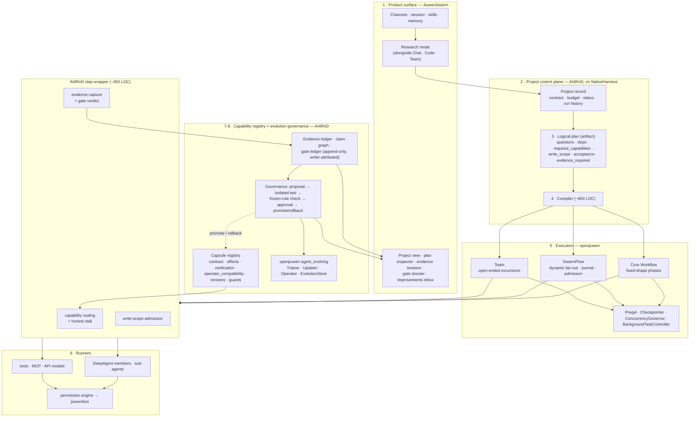
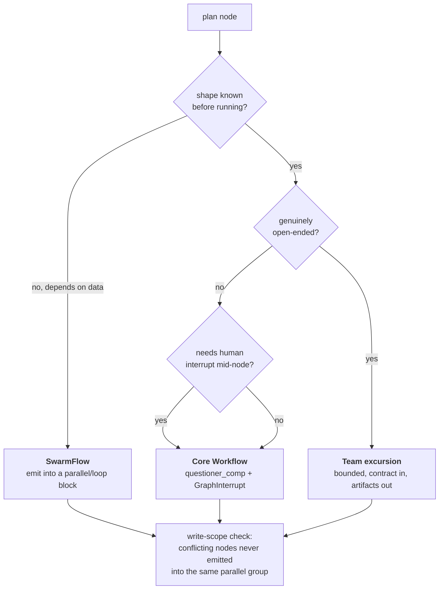
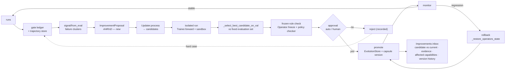

# Recommended Target Architecture — Revision 3

**AI4RnD is a mode plus a persistent project subsystem plus a workspace capability registry.**

Not only a mode. Not a separate application. Not a service with its own scheduler.

The Revision 2 version of this document is preserved in git history at `dc5de41`. What changed
and why: [15-correction-log.md](15-correction-log.md).

---

## 1. Target

---

## 2. The ten layers and who owns each

| # | Layer | Owner | Concretely |
|---|---|---|---|
| 1 | Product surface | **JiuwenSwarm** | Research mode; project views rendered by the web UI; all existing channels |
| 2 | Project / control plane | **AI4RnD** | persistent project on `NativeHarness` — start/stop/pause/abort/subscribe already provided |
| 3 | Logical plan | **AI4RnD** | semantic artifact, versioned, diffable. **Not a runtime graph** |
| 4 | Execution compilation | **AI4RnD** (~800 LOC) | plan → SwarmFlow script (default) / Core Workflow (static) / Team (open-ended) |
| 5 | Workers / runners | **JiuwenSwarm + openjiuwen** | DeepAgent members, sub-agents, tools, MCP, API models |
| 6 | Evidence & evaluation | **AI4RnD** | evidence ledger, claim graph, citation spans, 6 evaluator families, gate ledger |
| 7 | Capability registry | **AI4RnD** | capsules with contract/effects/verification/compatibility, versioned |
| 8 | Evolution governance | **AI4RnD governance over openjiuwen machinery** | proposal + approval + promotion; `Trainer`/`Updater`/`Operator`/`EvolutionStore` underneath |
| 9 | Persistence | **split** | conversation → JW session · execution → openjiuwen checkpoint/journal · meaning → AI4RnD stores |
| 10 | Observability | **JiuwenSwarm surfaces, AI4RnD data** | project view, plan inspector with collapsed diagnostics, Improvements inbox |

**The rule:** *JiuwenSwarm and openjiuwen decide how work runs safely. AI4RnD decides what work
exists, who may do it, whether the result is true, and what the system learns.*

---

## 3. Reuse-versus-build, by layer

| Layer | Reuse | Build | Size |
|---|---|---|---|
| Product surface | mode picker, channels, session, web UI shell | project views, plan inspector, Improvements inbox | UI work |
| Control plane | `NativeHarness` lifecycle | project record + run history | ~1,200 LOC |
| Logical plan | — | plan schema + validator (port `plan_validator` semantics) | ~1,000 LOC |
| Compilation | — | plan → SwarmFlow / Core Workflow emitter | ~800 LOC |
| Scheduling | **Pregel · Core Workflow · SwarmFlow · journal · checkpoint · admission · background · cancel** | nothing | **0** |
| Step wrapper | — | capability routing (~150) · write-scope (~100) · evidence capture (~200) | ~450 LOC |
| Runners | DeepAgent, sub-agents, tools, MCP, permissions, sandbox | runner capability declarations | ~200 LOC |
| Evidence & evaluation | `llm_as_judge` as the entailment substrate | evidence ledger, claims, spans, gates (port), **real entailment (build)** | ~3,000 LOC |
| Capability registry | Jiuwen resource registry (referenced, not duplicated) | capsule registry (port, 1,351 LOC exists) | ~1,500 LOC |
| Evolution governance | `Trainer`, `Updater`, `Operator`, `EvolutionStore`, metrics, RL | proposal type, approval gate, risk classes, inbox, version pinning | ~1,500 LOC |

**Total new/ported AI4RnD code: ~9,650 LOC**, against ~25,000 in Revision 2.

**Deleted from the plan entirely:** `graph_scheduler` port (4,189), `actor_*` port (1,051),
the execution-callback contract, and four RSI surfaces Revision 2 thought were absent.

---

## 4. Compilation — the decision the compiler makes

Write-scope exclusion is solved **at compile time** — the compiler simply does not put two
conflicting steps in one `parallel(...)`. That converts the last scheduling concern into a
code-generation invariant, and is why no runtime scheduler is needed
([17 §8](17-taskgraph-verdict.md)).

**SwarmFlow is the default.** Research is data-dependent: you do not know how many sources
you will find. Core Workflow is used for fixed-shape phases (intake, contract confirmation,
closeout) where interrupt-driven human confirmation matters.

---

## 5. The RSI loop in the target

Blue-sky elements are only the proposal object and the approval gate. Everything else binds to
`agent_evolving` — detail and reuse table in
[18-evolution-governance.md](18-evolution-governance.md).

---

## 6. Boundary rules

Carried forward from Revision 2 where still valid, revised where not.

| # | Rule | Status |
|---|---|---|
| 6.1 | Evidence never lives in the session; the session holds `project_id` only | unchanged |
| 6.2 | Research tools return **references**, not bulk evidence | unchanged |
| 6.3 | Node status is a **projection** of the append-only gate ledger | unchanged |
| 6.4 | Writer ≠ verifier enforced **in AI4RnD's router**, not delegated to JiuwenSwarm | unchanged — V-6 |
| 6.5 | Honest stalling: `no_matching_worker` + missing capabilities; never force-assign | unchanged |
| 6.6 | The LLM never owns run state | unchanged |
| 6.7 | Capsule `effects` enforced at **binding time** | unchanged |
| 6.8 | JiuwenSwarm's built-in guardrails must be repaired before production (V-4) | unchanged |
| **6.9** | **AI4RnD writes no scheduler, queue, lease manager or retry engine** | **new** |
| **6.10** | **Execution mechanism is never a user choice** — read-only diagnostic | **new** |
| **6.11** | **In-flight runs pin capsule versions** so a promotion cannot change a running project | **new** |
| **6.12** | **"Operator" means openjiuwen's evolution-parameter handle.** AI4RnD's executable units are **Steps** (logical) and **Runners** (physical) | **new** |

---

## 7. What to build first

1. **Research mode + project skeleton** — mode entry, project record on `NativeHarness`,
   project view. No compilation yet.
2. **SwarmFlow compilation for one objective** (literature review), with the step wrapper doing
   capability routing and evidence capture.
3. **Real entailment**, using `llm_as_judge` as the substrate — the correctness fix V-12 requires.
4. **Capsule registry wired** — the 1,351 LOC that already exists, plus `effects` enforcement in
   the router.
5. **Improvements inbox** over `Trainer`/`Updater` with the proposal + approval gate.

Staging in [09-implementation-plan.md](09-implementation-plan.md).

---

## 8. Evidence that would change this

| # | Question | Flips to |
|---|---|---|
| F2 | Can Core Workflow express runtime-determined fan-out? | SwarmFlow-only; then Option 5 |
| F4 | Does SwarmFlow's determinism lint block required research patterns? | Core Workflow; then Option 5 |
| F3 | Is a persistent Checkpointer backend available in a default install? | AI4RnD-side run store |
| F5 | Can write-scope exclusion be solved at compile time? | narrow parallel-group scheduler |
| F6 | Does in-process project state contend under load? | isolate the store (Option 8 step 2) |
| G2 | Does a Rail survive agent-cache invalidation and restart? | affects the mode rail |

F2 and F4 cost about a day each and are the first work in Stage 0. They are the cheapest
experiments that could disprove this recommendation.
