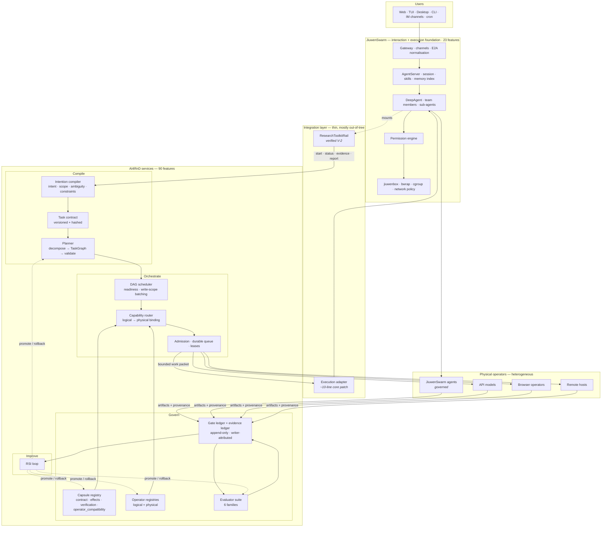
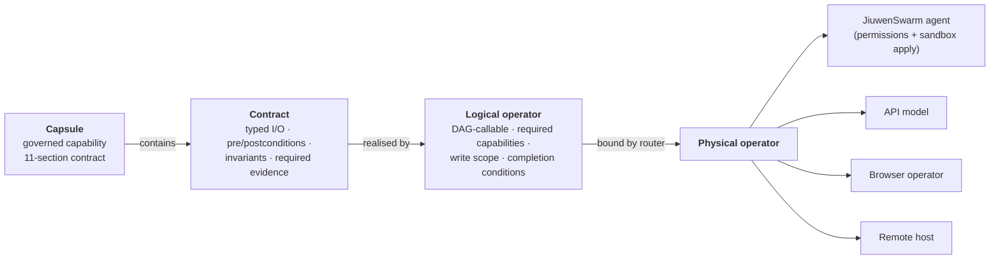
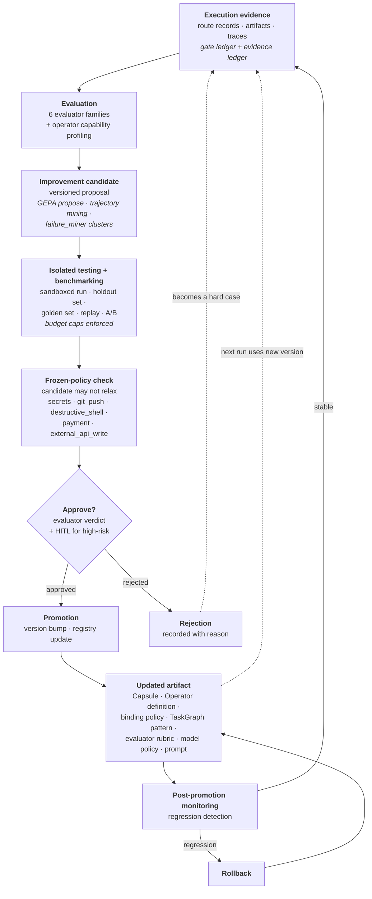
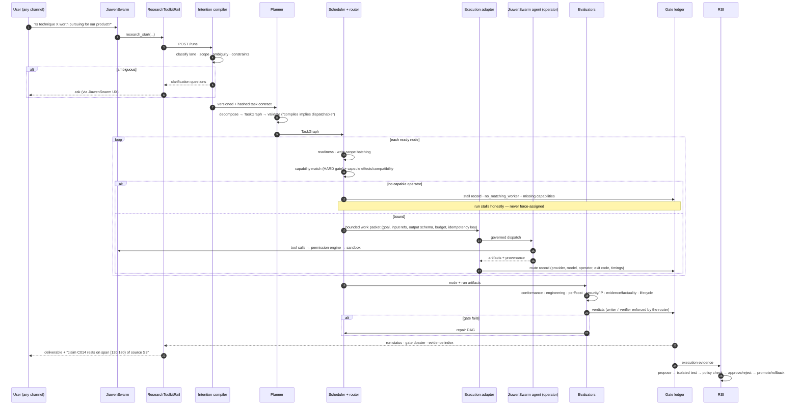

# Recommended Target Architecture

**Option D — Hybrid.** JiuwenSwarm is the interaction and execution foundation. AI4RnD owns
the workflow, the capability model and the improvement loop.

Re-derived against the complete 142-feature product; see
[07-architecture-options.md](07-architecture-options.md) for why the six alternatives lose.

---

## 1. Target architecture

---

## 2. Ownership boundaries

| Concern | Owner | Why |
|---|---|---|
| Channels, intake transport, delivery | **JiuwenSwarm** | 9 IM + web/TUI/desktop/ACP/A2A already exist |
| Conversational state, session rewind, compaction | **JiuwenSwarm** | mature; and research state must *not* live here |
| Skills, agent memory index | **JiuwenSwarm** | `MemoryIndexManager` 1,224 LOC; skills are capsule *ingredients* |
| Tool execution, permissions, sandboxing | **JiuwenSwarm** | only system with a permission engine and OS isolation |
| Packaging, installers, UI shell | **JiuwenSwarm** | signed desktop apps, pip, TUI |
| **Intention compilation, task contracts** | **AI4RnD** | must be a validated artifact, not model context |
| **Planning + TaskGraph** | **AI4RnD** | must be validated before dispatch |
| **DAG scheduling, capability routing, admission, leases** | **AI4RnD** | must sit *above* agents to choose which agent runs what |
| **Capsules + operator registries** | **AI4RnD** | versioned, certified, promotable — cannot live in an upstream package |
| **Evaluators, evidence, gate ledger** | **AI4RnD** | JiuwenSwarm has no gate concept |
| **RSI** | **AI4RnD** | must own the artifact tree it mutates |
| **Per-operator permission policy** | **AI4RnD router** | V-6: JiuwenSwarm has 2 roles and global policy — cannot express it |

**One-line rule.** *JiuwenSwarm decides how a unit of work is safely executed. AI4RnD decides
what work exists, who may do it, whether the result is true, and what the system should
learn from it.*

---

## 3. Capsules, Operators and TaskGraph in the target

The abstraction stack from
[00-intended-product-model.md](00-intended-product-model.md) §2 is preserved intact, with
JiuwenSwarm appearing only at the bottom as *one kind of physical operator*.

**Binding rules preserved from AI4RnD** (verified working, `graph_scheduler:2290-2400`):
capability match is a hard gate that is never relaxed; skills are a preference with a
liveness net; a node with no capable operator **stalls honestly** with
`no_matching_worker` plus the missing-capability list, and is never force-assigned.

**Added by the capsule layer:** `effects` (read/write/execute/network/cost) and
`operator_compatibility` (`preferred` / `forbidden`) become router inputs, and
`required_guard_capsules` gate admission. This is the mechanism that lets a capsule declare
"this capability may never touch the network" and have it enforced at binding time rather
than trusted at runtime.

---

## 4. The RSI feedback loop

The loop the brief requires, mapped onto owned components:

**What already exists for this** (V-13): `gepa_optimizer` implements
propose→run→review→promote→rollback with dry-run default, mandatory
`--max-evals`/`--max-spend`/`--max-walltime`, promotion-target restriction, and
`hard_policy_checker` enforcing the frozen-policy box above. `evolution_engine` implements
scorecard/recommend/promote/demote. `failure_miner` clusters failures into candidates.
**None of it is wired.** Stage 4 wires it; it is not a from-scratch build.

**What must be built:** RSI surfaces 2, 4, 5, 6, 7, 8 (routing optimisation, DAG/organisation
search, judge calibration and reward modelling, memory/retrieval learning, model weights,
curriculum and credit assignment). Six of eight.

**Safety invariants for the loop** — non-negotiable:

1. RSI may propose changes to any artifact; it may **never** promote without an evaluator
   verdict plus, for high-risk classes, a human verdict recorded in the gate ledger.
2. The frozen-policy set is not RSI-modifiable. A candidate that relaxes a safety policy is
   rejected before it reaches testing.
3. Every promotion is versioned and reversible, with the pre-promotion version retained.
4. RSI runs against **isolated** copies. It never mutates a live registry in place.
5. Every promotion and rollback is a gate-ledger record with writer attribution.

---

## 5. Request and evidence flow, end to end

---

## 6. Boundary rules — non-negotiable

### 6.1 Evidence never lives in the session
Research artifacts live in AI4RnD's store; the JiuwenSwarm session holds only `run_id`.
JiuwenSwarm compacts context and supports session rewind with file restoration; evidence must
survive both.

### 6.2 Tools return references, not bulk evidence
`research_evidence` returns ids plus one-line summaries. The model reasons over ids; the
service resolves them. Prevents compaction from silently destroying citation integrity.

### 6.3 Node status is a projection of the gate ledger
Never a directly written field. Preserve writer attribution on every transition — AI4RnD's
best state-design idea, and it costs nothing to keep.

### 6.4 Writer ≠ verifier is enforced in the AI4RnD router
**Changed from the previous revision.** V-6 established that JiuwenSwarm has only
`leader`/`teammate` with a single global permission policy, so this cannot be delegated. The
router must exclude the writing operator's actor id from the evaluation node's candidate set,
making self-grading *unroutable* rather than merely detected afterwards.

### 6.5 The LLM never owns run state
`LLM proposes. Schemas constrain. Code validates. Gates decide. Artifacts preserve.` An
operator produces artifacts; the service validates and records them. No operator marks its
own node passed.

### 6.6 Capsule effects are enforced at binding, not trusted at runtime
A capsule declaring `effects.network: none` must not be bound to an operator with network
access. This is the capsule layer earning its keep over a skill.

### 6.7 JiuwenSwarm's built-in security rules must be repaired before production
V-4: `get_builtin_security_rules()` returns **0** in a stock install, and `rm -rf /` resolves
to ALLOW under a permissive baseline. Either ship `builtin_rules.yaml` into the openjiuwen
package path, or have the integration load JiuwenSwarm's copy explicitly. **Do not assume the
guardrail layer is active.**

---

## 7. What to build first

1. **ResearchToolkitRail + evidence core** — no core changes; mechanism already verified.
2. **Real entailment for feature 70** — promoted from late hardening to Stage 1 by V-12.
3. **Extract AI4RnD services with an HTTP API** — proves the ownership boundary.
4. **Wire the unwired**: capsules, operators, actor queue/leases, TaskGraph persistence — 19
   modules, ~8k LOC, already tested.
5. **Execution adapter + callback** — the only step touching JiuwenSwarm's core tree.
6. **Wire GEPA; build the remaining RSI surfaces.**

Full staging in [09-implementation-plan.md](09-implementation-plan.md).

---

## 8. Evidence that would change the recommendation

| # | Question | Would flip to |
|---|---|---|
| G1 | Can the execution callback be made bounded, idempotent and cancellable against a real `DeepAgent`? | **Option G** (defer JiuwenSwarm) if not |
| G2 | Does an out-of-tree Rail survive agent-cache invalidation and agent-server restart? | Option G if not — V-2 verified registration, **not** lifecycle persistence |
| G3 | Does the two-role limit (V-6) block per-operator governance even with router-side enforcement? | Option E (fork) if the router cannot compensate |
| G4 | Is upstream willing to accept a generic extension-RPC passthrough? | carries a permanent patch if not — tolerable |
| G5 | Does `openjiuwen` 0.1.x churn break the Rail API within a release cycle? | Option G if the seam proves unstable |
| G6 | Is the tmux cockpit a genuine user requirement rather than an implementation artifact? | changes the physical-operator model materially |

G1 and G2 are the decisive pair and are testable in Stage 1–2 — before any core-tree change
and before the expensive ports begin.
