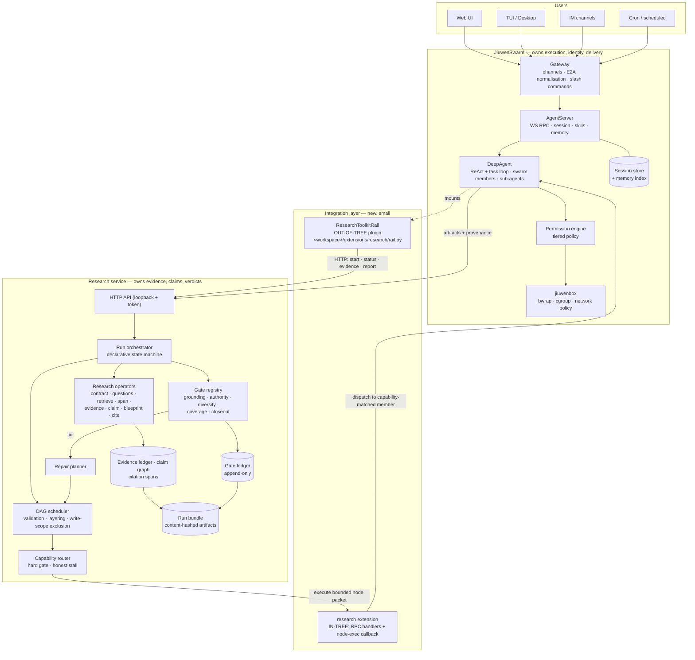

# Recommended Target Architecture

**Option D — Hybrid.** JiuwenSwarm owns execution; a standalone research service owns
truth; a thin, mostly out-of-tree layer joins them.

---

## 1. The target



---

## 2. Ownership — the decisive table

| Concern | Owner | Rationale |
|---|---|---|
| User intent capture, channels, delivery | **JiuwenSwarm** | 9 IM connectors + web/TUI/desktop/ACP/A2A already exist; nothing to gain by rebuilding |
| Conversational state, session rewind, compaction | **JiuwenSwarm** | mature, and research state must *not* live here |
| Agent identity, skills, memory | **JiuwenSwarm** | skill format is already compatible; evolution and Symphony come free |
| Tool execution, permissions, sandboxing | **JiuwenSwarm** | the only system with a permission engine and OS-level isolation |
| Model configuration and cost accounting | **JiuwenSwarm** | one source of truth; avoids the Option-C split |
| Conversational task planning | **JiuwenSwarm** | task-loop planning is adequate for chat-shaped work |
| **Research planning** (contract, question graph, physical plan) | **Research service** | needs to be a validated artifact, not model context |
| **DAG scheduling and capability routing** | **Research service** | must sit above the agent loop to choose which agent runs what |
| **Evidence, claims, citations** | **Research service** | must be immutable and content-hashed; incompatible with compaction |
| **Quality gates and verdicts** | **Research service** | JiuwenSwarm has no gate concept |
| **Repair planning** | **Research service** | operates on gate verdicts |
| **Final report assembly and closeout** | **Research service** | prose must be compiled from verified claims, not generated freely |
| Presenting results to the user | **JiuwenSwarm** | via `swarm.send_file`, chat, and a web view |

**One-line rule:** *JiuwenSwarm decides how work happens. The research service decides
whether the result is true.*

---

## 3. What to reuse, port, and build

### Reuse from JiuwenSwarm, unchanged

Gateway and all channel connectors · E2A protocol · AgentServer and session management ·
`DeepAgent` task loop · rails lifecycle · sub-agent delegation · skill system and the five
registries · Symphony skill retrieval · memory index · tiered permission engine ·
jiuwenbox sandbox · cron scheduler · MCP · packaging and desktop distribution.

### Port from AI4RnD

| Component | Source | Effort |
|---|---|---|
| Evidence ledger + schemas + hashing + ids | `harness/lib/research/{schemas,storage,hashing,ids}.py`, `evidence/` | **Low** — stdlib + sqlite3, no Solar coupling |
| Citation span verification | `research/evidence/citation_span.py` | Low |
| Research evaluator + gate registry | `research/evaluator.py`, `research/survey/gates/` | **Medium** — 1,673 LOC, some path coupling |
| Gate ledger | `lib/gate_ledger.py` | Low — single self-contained module |
| Verification gate (writer ≠ verifier) | `lib/verification_gate.py` | Low |
| DAG scheduler (algorithm) | `lib/graph_scheduler.py` | **High** — 4,189 LOC; keep the algorithm, rewrite the I/O layer |
| Capability router | `graph_scheduler.py` assignment loop + `config/*-operators.json` | **Low** — ~150 lines + two JSON schemas |
| Run state machine (as data) | `config/coordinator-state-machine.json` | Low |
| Survey pipeline | `research/survey/` | Medium |

### Adapt

- **Contracted intake** — fail-closed on unknown workflow id, into the service API.
- **Codex-bridge delegation pattern** — bounded packets, tier classification, token budget,
  circuit breaker — as the contract for the node-exec callback.
- **Honest-state UI rules** — never a filled progress bar for a stalled run; show stalls
  through the blocked node's raw reason tokens.
- **Concurrency policy** — per-operator `max_parallel` / `singleton`, write-scope exclusion.
- **Skills** — migrate AI4RnD research skills to JiuwenSwarm's model-invoked convention.

### Build new

1. `ResearchToolkitRail` — the out-of-tree plugin (see §4).
2. Research service HTTP API and process supervision.
3. The node-exec callback contract and its in-tree handler.
4. Real entailment checking to replace `_jaccard` token overlap
   ([05-capability-matrix.md](05-capability-matrix.md) §Missing, item 2).
5. Contradiction search and contradiction-coverage gating.
6. The research ontology (entity/claim vocabulary with alias resolution).
7. The optimizer — logical plan → physical operator plan.
8. A JiuwenSwarm web view for run state, DAG and gate verdicts.

### Drop

`coordinator.sh` · `solar-harness.sh` dispatch · tmux `send-keys` carrier · pane leases ·
pane doctor/hygiene · `status-server.py` (14,400 LOC) · the shell installer ·
`--dangerously-skip-permissions` worker launch · the `*_closeout.py` sprint artifacts.

---

## 4. The integration layer in detail

### 4.1 `ResearchToolkitRail` — out-of-tree, works today

Installed at `<agent_workspace>/extensions/research/rail.py`, discovered by `RailManager`,
hot-toggleable [E-J09]:

```python
class ResearchToolkitRail(DeepAgentRail):
    """Expose the research service to the agent as tools."""
    priority: int = 60

    def init(self, agent):
        for tool in self._build_tools():           # HTTP client wrappers
            agent.ability_manager.add_ability(tool.card, tool)   # [E-J10]

    def uninit(self, agent):
        for tool in self._tools:
            agent.ability_manager.remove_ability(tool.card.name)
```

Tool surface, deliberately reference-returning (see §5.3):

| Tool | Returns |
|---|---|
| `research_start(topic, depth_tier, profile)` | `run_id` |
| `research_status(run_id)` | phase, node states, stall reasons, gate summary |
| `research_evidence(run_id, query)` | evidence **ids** + short summaries |
| `research_claims(run_id, section?)` | claim ids, verification status, confidence |
| `research_gate_report(run_id)` | per-gate verdicts and P0 issues |
| `research_report(run_id, format)` | a file path, delivered via `swarm.send_file` |
| `research_cancel(run_id)` | acknowledgement |

Also uses `before_task_iteration` to surface run progress into the agent's context, and
`after_tool_call` to detect research-relevant signals.

### 4.2 In-tree `research` extension — the small patch

`jiuwenswarm/extensions/research/` with `extension.yaml` + `extension.py`, registering RPC
handlers `research.execute_node`, `research.node_status`, `research.cancel_node`.

Plus, to make them reachable from outside the process:

- `jiuwenswarm/common/schema/message.py` — add `RESEARCH_*` members to `ReqMethod`
- `jiuwenswarm/server/runtime/agent_adapter/interface.py` — add a `_RESEARCH_METHODS`
  frozenset and a dispatch branch mirroring `_handle_symphony_request` [E-J08]

**~10 lines across 2 files, plus one new directory.** Better still, generalise it: a
`_handle_extension_request` that dispatches any registered method under a reserved
namespace prefix. That is a genuine upstream contribution and removes the patch entirely.

### 4.3 The node-exec callback contract

The hard design problem. Constraints, borrowed from the Codex bridge:

| Property | Requirement |
|---|---|
| Bounded | a work packet carries an explicit goal, input artifact refs, output schema and token budget — never "research the topic" [E-A14] |
| Governed | executes as a normal JiuwenSwarm tool call: permission engine, sandbox, model config all apply |
| Idempotent | keyed by `(run_id, node_id, attempt)`; re-delivery must not duplicate work |
| Cancellable | maps to `chat.interrupt` / `abort` on the executing agent |
| Non-re-entrant | a node-exec agent must not be able to call `research_start` — enforced by a permission rule, not convention |
| Attributed | the response carries the executing member id, model, provider and timings, recorded as a route record in the gate ledger [E-A10] |
| Budgeted | per-run token and call ceilings with a circuit breaker, as the Codex bridge does |

---

## 5. Boundary rules — the non-negotiables

### 5.1 Evidence never lives in the session

Research artifacts live in the service's store. The session holds `run_id` in metadata and
nothing more. Rationale: JiuwenSwarm compacts context and supports session rewind including
file restoration; evidence must survive both
([06-integration-challenges.md](06-integration-challenges.md) §8).

### 5.2 The gate ledger is the only source of node status

Node status is a **projection** of the append-only ledger, never a directly written field
[E-A10]. Preserve writer attribution on every transition. This is AI4RnD's best state-design
idea and costs nothing to keep.

### 5.3 Tools return references, not bulk evidence

`research_evidence` returns ids and one-line summaries. If the model needs a span it asks
for that span by id. Prevents compaction from silently destroying citation integrity.

### 5.4 Writer ≠ verifier is enforced by routing, not by prompt

The capability router must be able to exclude the writing member from evaluating its own
node. Today AI4RnD checks this after the fact [E-A11]; the target should make it
unsatisfiable by construction — an evaluation node's candidate set excludes the writer's
actor id.

### 5.5 Honest stalling is preserved

When no capability-matched worker exists, the run stalls with `no_matching_worker` and the
missing capability list, and the UI shows the stall as a stall [E-A02], [E-A06]. No
force-assignment; no synthesised progress.

### 5.6 The LLM never owns run state

`LLM proposes. Schemas constrain. Code validates. Gates decide. Artifacts preserve.`
[E-A14] Applied here: agents produce artifacts; the service validates and records them.
An agent cannot mark its own node passed.

---

## 6. Why this is preferable

**Against a fork (E).** Forking buys control of 340k LOC while leaving the runtime that
matters — `openjiuwen`, holding `DeepAgent`, rails, the permission engine and the manifest
framework — as an external pinned pre-1.0 dependency. It is the larger cost for the smaller
half of the problem.

**Against in-tree (B).** Places a fast-moving research codebase inside a pre-1.0 project's
release cadence, lint standard and documentation conventions, with permanent merge conflicts
in exactly the three files upstream refactors most.

**Against pure extension points (A).** A Rail sits *inside* the agent loop; the DAG
scheduler and capability router must sit *above* it. A cannot host them. But A is the
correct *first stage* of D.

**Against pure service (C).** Leaves research operators executing LLM calls outside
JiuwenSwarm's permission engine, sandbox, model config and cost accounting — for research
that fetches and parses untrusted web content, that is the wrong side of the boundary.

**Against separation (F).** Leaves AI4RnD single-user, single-machine, with
`--dangerously-skip-permissions` workers and a substrate whose failure modes fill a
nine-entry post-mortem document.

---

## 7. What to build first

Ordered by evidence value per unit of effort. Full detail in
[09-implementation-plan.md](09-implementation-plan.md).

1. **`ResearchToolkitRail` + evidence ledger as a library.** No core changes. Proves the
   Rail seam carries real tools, and puts grounded, citation-verified research in front of
   users through JiuwenSwarm's existing channels. This is the highest-information,
   lowest-cost experiment available.
2. **Extract the research core into a service with an HTTP API.** Proves the boundary and
   makes runs long-lived and observable.
3. **Port the capability router.** Small, self-contained, and delivers a capability
   JiuwenSwarm lacks entirely.
4. **Port the DAG scheduler and gate ledger.** The largest single porting job.
5. **The node-exec callback and the in-tree extension.** Only after 1–4 prove the
   architecture, since this is the only step that touches the core tree.

## 8. Evidence required before committing to the full integration

Do not proceed past Stage 1 without these. Each is a falsifiable check with a defined
failure response.

| # | Question | How to answer | If it fails |
|---|---|---|---|
| E1 | Can a Rail plugin register tools on a live agent and survive a restart? | build a minimal `rail.py`, install it, call the tool, restart, call again | Option D collapses to Option B or E — reassess entirely |
| E2 | Does `openjiuwen`'s `DeepAgentRail` / `ability_manager` API match what the in-tree rails use? | inspect the installed `openjiuwen` package (was **not** possible in this analysis — see [10](10-risks-assumptions-open-questions.md) §L1) | adapt the plugin to the real API; cost rises but architecture holds |
| E3 | Does the evidence ledger run standalone outside the Solar tree? | `PYTHONPATH` import, run `init`/`add-source`/`extract`/`ledger` against a temp DB | port cost rises materially |
| E4 | Do research tool results survive `/compact` and session rewind intact? | run a research session, compact, rewind, re-query by id | tighten §5.3 or store run refs outside the session |
| E5 | Can the permission engine express "this agent may not start a research run"? | write a `permissions.rules` entry, verify the deny | enforce non-re-entrancy in the service instead |
| E6 | How much of `graph_scheduler.py` is genuinely Solar-coupled? | dependency audit of the 4,189 LOC | if >50%, rewrite the scheduler rather than port |
| E7 | Does JiuwenSwarm's `openJiuwen-DeepSearch` skill overlap enough to matter? | compare outputs on a fixed topic against the AI4RnD pipeline | if it is close, the value case for the whole integration weakens — this is the most important commercial check |
| E8 | Is `_jaccard`-based grounding good enough to claim verification? | run the evaluator against a labelled set with known unsupported claims | if precision is poor, real entailment must move into Stage 1, not Stage 4 |

**E7 and E8 are the two that could change the recommendation.** E7 tests whether the
integration is worth doing at all; E8 tests whether AI4RnD's central claim — that its
output is verified — currently holds.
