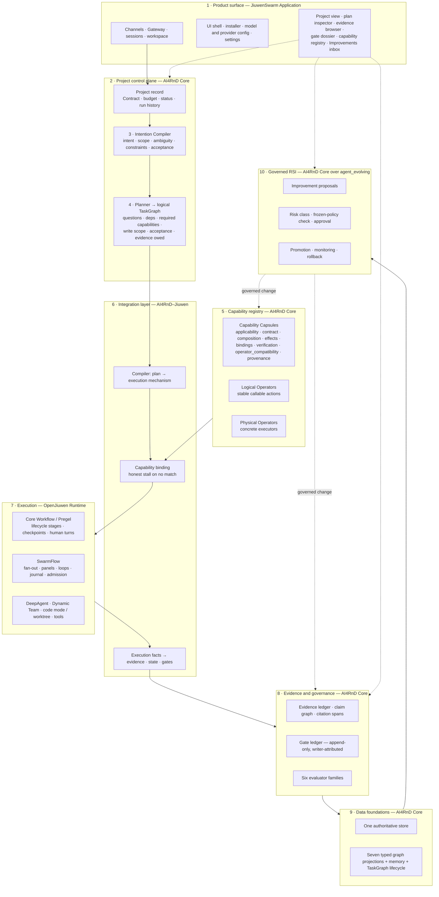
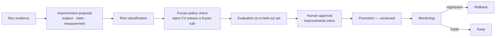

# Recommended Target Architecture — Revision 4

**AI4RnD is a first-class application surface on the JiuwenSwarm platform: a persistent project
subsystem with its own semantic control plane, a workspace capability registry, and a governed
evolution loop — compiled progressively onto OpenJiuwen execution mechanisms.**

Not "a mode". Not a runtime choice. Not a research-report workflow.

**Architecture option: C — progressive TaskGraph compilation.**
[Options and preservation gate](07-architecture-options.md) ·
[row-by-row ownership](20-feature-implementation-ownership.md).

**What changed from Revision 3.** Revision 3 answered "mode + project subsystem + registry" and
recommended retiring AI4RnD's scheduler immediately for a "~450 LOC step wrapper". Executing the
runtime in this revision found four gaps that estimate did not account for. The shape survives;
the migration discipline and the effort language do not.
See [15-correction-log.md](15-correction-log.md).

---

## 1. Target

---

## 2. The ten layers and who owns each

| # | Layer | Semantic owner | Runtime implementer | Persistence authority | Verification authority |
|---|---|---|---|---|---|
| 1 | Product surface, channels, shell, config | JiuwenSwarm Application | JiuwenSwarm Application | JiuwenSwarm config + session store | Platform tests |
| 2 | Project control plane | AI4RnD Core | AI4RnD Core | AI4RnD project store | Contract acceptance |
| 3 | Intention Compiler | AI4RnD Core | AI4RnD Core | AI4RnD Contract record | Contract completeness checks |
| 4 | Planner and logical TaskGraph | AI4RnD Core | AI4RnD Core | AI4RnD TaskGraph store | Validation + feasibility |
| 5 | Capability registry (Capsules, Operators) | AI4RnD Core | AI4RnD Core | AI4RnD capsule + operator registry | Certification + conformance |
| 6 | Integration and compilation | AI4RnD Core | AI4RnD–Jiuwen Integration | AI4RnD run index | Compilation tests |
| 7 | Execution | AI4RnD Core defines *what*; OpenJiuwen defines *how* | OpenJiuwen Runtime | Jiuwen checkpointer + SwarmFlow journal | Runtime invariants |
| 8 | Evidence and gates | AI4RnD Core | AI4RnD Core | AI4RnD evidence + gate ledgers | Evaluator families, writer ≠ verifier |
| 9 | Data foundations | AI4RnD Core | AI4RnD Core | One authoritative store, typed projections | Schema + provenance conformance |
| 10 | Governed RSI | AI4RnD Core | AI4RnD–Jiuwen Integration | AI4RnD improvement store + EvolutionStore | Approval gate + frozen-policy check |

Counts across all 142 rows: **118 semantically owned by AI4RnD Core**, 19 by JiuwenSwarm
Application, 4 by External/New product work, 1 Unresolved. Runtime ownership divides very
differently — 53 AI4RnD Core, 32 Integration, 27 JiuwenSwarm Application, 25 OpenJiuwen Runtime.
**That divergence is the architecture.**

---

## 3. Capability Capsules are the product's capability identity

A Capsule is not a workflow template and not a renamed skill. Verified in this revision: all 42
manifests in the AI4Research tree carry the same eight-section body.

| Capsule section | Present | What it governs |
|---|---:|---|
| `applicability` | 42/42 | task types, positive and negative signals — discovery and eligibility |
| `contract` | 42/42 | inputs, outputs, preconditions, postconditions, invariants |
| `composition` | 42/42 | consumes, produces, compatible_with, incompatible_with, requires_after |
| `effects` | 42/42 | read, write, execute, network, cost, risk — the permission boundary |
| `bindings` | 42/42 | skills, MCP capabilities, data refs, secret refs, required guard capsules |
| `verification` | 42/42 | self_check, external_verifier, pass_conditions |
| `operator_compatibility` | 42/42 | preferred and forbidden physical executors |
| `provenance` | 42/42 | owner, creation, source phase, compiler |

The registry holds 35 (32 capability, 1 guard, 2 resource), 30 stable and 5 draft, 35 carrying a
`default_operator_profile`. A JiuwenSwarm *skill* carries a name, a description and a prompt. The
gap is not naming.

**What the capsule schema does not yet carry**, and must: planning strategies, benchmarks,
performance history, version promotion and rollback, and RSI target declarations. Those are the
`BUILD` items in `FN-05`.

### The five-level stack, kept distinct

| Level | What it is | Lifetime |
|---|---|---|
| **Capsule** | Governed reusable capability identity | Independent of any request |
| **Contract** | The promise made for *this* request | One request |
| **TaskGraph** | The project-specific plan | One project |
| **Logical Operator** | A stable callable action a DAG node invokes directly | Independent |
| **Physical Operator** | The actual executor | One binding |

Capsules **shape, constrain, observe and improve** executions. They never hide the concrete DAG. A
DAG node calls a Logical Operator directly; the Capsule governs which Physical Operator may serve
it, under which effects, verified by which evaluators.

> **Naming.** `openjiuwen/core/operator/base.py` states: *"Operator is NOT an executable unit."*
> OpenJiuwen's `Operator` is a tunable-parameter handle for evolution. AI4RnD's Operator is an
> executable unit. Inside integration code the AI4RnD concept must carry a different name, or the
> collision will produce wrong bindings.

---

## 4. Boundary rules

1. **The product definition never moves.** Execution mechanism changes ownership, never outcomes.
2. **The user selects objective and depth. Never a mechanism.** Execution mechanism is a read-only
   diagnostic in the UI.
3. **The compiler chooses the mechanism**, per sub-plan, from the plan's shape — not from a mode
   flag and not from user intent.
4. **AI4RnD never trusts a completion signal it did not verify.** A SwarmFlow run whose step
   returned `None` after retries is a failed step, not a completed one.
5. **A capability that cannot be bound stalls.** It never falls back to the nearest available
   executor, the nearest model, or a default agent type.
6. **`effects` are enforced at binding time.** A capsule declaring `network: none` cannot bind to a
   network-capable runner.
7. **Writer ≠ verifier**, enforced at candidate-set construction, not by convention.
8. **Write-scope conflicts are excluded at compile time**, so conflicting steps are never emitted
   into one parallel group.
9. **The gate ledger is append-only and writer-attributed.** Status is a projection, never a
   mutable field.
10. **Evidence outlives the session.** The evidence ledger is not session-scoped, because the
    SwarmFlow journal is.
11. **RSI changes nothing without a proposal, a risk class, a frozen-policy check and an approval.**
12. **In-flight runs pin capsule versions.** A promotion never changes a running project.

---

## 5. Data foundations — one store, typed projections

The workbook names nine Data Foundation outcomes. **Do not build nine databases.**

| Outcome | Recommended realisation |
|---|---|
| Persistent Memory & Context Retrieval | Jiuwen checkpointer + context rail, extended with research retrieval |
| Concept / Dataset / Code / Policy / Workflow / Trace / Memory graphs | **Typed projections over one authoritative event-sourced store**, each with its own schema, provenance and lifecycle |
| TaskGraph Persistence & Lifecycle | AI4RnD TaskGraph store, project-scoped — explicitly *not* session-scoped |

Verified: none of the seven graph names appears anywhere in the AI4RnD tree, and openjiuwen's
`GraphMemory` is referenced zero times in JiuwenSwarm. All eight graph rows are `BUILD`, under
every architecture option.

The session-scoping point is not academic. The SwarmFlow journal path is
`{team}/sessions/{session_id}/workflows/{name}` — a new session resolves a new journal and replays
nothing. A multi-week research project must not depend on it for continuity.

---

## 6. Governed RSI across all eight surfaces

| # | Surface | Existing contribution | What remains |
|---|---|---|---|
| 1 | Text artifacts | GEPA optimizer (AI4RnD) + tool-description optimizer (imported by JiuwenSwarm) | Governed promotion. **The only surface wired on both sides.** |
| 2 | Runtime / resource routing | none found in either tree | Whole surface |
| 3 | Capsules and physical Operators | Capsules exist; no RSI target declaration | Bind capsules as evolution subjects |
| 4 | DAG and agent organisation | none | Whole surface |
| 5 | Evaluators, rewards, Contracts, governance | GEPA `hard_policy_checker.py`; `agent_evolving` metrics | Frozen-policy guard in the promotion path |
| 6 | Memory, retrieval, evidence | Evidence ledger exists | Retrieval learning; memory graph |
| 7 | Model policies and weights | `agent_rl` (PPO/verl) exists, unreachable from the app | **DEFER** — cost and infrastructure, not capability |
| 8 | Data, benchmarks, curriculum, observability | Benchmarks exist, not curriculum-managed | Hard-case mining into the benchmark set |

**Correction to Revision 3.** Revision 3 said only one of eight surfaces was absent because
`agent_evolving` supplies the rest. Executing against it shows `Trainer.train` requires an agent
implementing `get_operators()`, and **exactly one class in openjiuwen implements it**
(`ReactAgentEvolve`). JiuwenSwarm imports only the experience-archive and tool-description-optimizer
parts. The framework is real, but today its only subject is one ReAct agent's tunables. Reuse here
is `ADAPT`, not `REUSE`.

### The promotion path

Every promotion is versioned, evidence-backed and reversible. A user must be able to answer
*what changed · why · is it better* from the inbox alone.

---

## 7. What to build first

Ordered by what unblocks the most outcomes, not by what is easiest.

1. **Project subsystem and Contract** — 37 rows sit in phase P1 and most depend on a project
   record existing.
2. **Compilation spikes** — confirm the plan compiles before building on the assumption.
3. **Evidence lane with calibrated entailment** — the grounding check measured 0.25 precision. The
   product's central claim does not hold until this is replaced and the replacement is measured.
4. **Capability registry and binding with honest stall** — closes the routing gaps that make
   Option D fail.
5. **The 58 never-built outcomes**, in workbook order.

Staging: [09-implementation-plan.md](09-implementation-plan.md).

---

## 8. Evidence that would change this recommendation

| If this proves true | Then |
|---|---|
| Core Workflow cannot express the outer lifecycle with checkpoints and human turns | C degrades toward A |
| SwarmFlow's determinism lint blocks real research sub-plans | Compile everything to Core Workflow |
| The routing, resume and failure-signal gaps close upstream | C's mature form becomes D, and D stops dropping a row |
| A capsule cannot be registered as an evolution subject | RSI surfaces 3–6 grow substantially |
| Users genuinely want one-shot runs, not projects | Layer 2 shrinks to a session extension |
