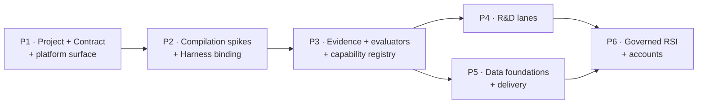

# Staged Path from the Current Repositories to All 142 Outcomes — Revision 4

**Effort is stated as work items with acceptance criteria, not as line counts or month estimates.**
Revision 3 quantified this plan as "~12–14 months" and its target as "~450 LOC". Both were
extrapolated from reading the runtime rather than executing it, and executing it found work the
extrapolation missed. Those figures are withdrawn — see
[15-correction-log.md](15-correction-log.md) §9.9. Sequence and dependency are knowable and are
stated below; duration is not, and is left to whoever owns the team.

Architecture: **option C, progressive TaskGraph compilation**
([07-architecture-options.md](07-architecture-options.md)).
Row-level sourcing: [20-feature-implementation-ownership.md](20-feature-implementation-ownership.md).

---

## 0. What the plan must deliver

| | Rows | Note |
|---|---:|---|
| Total workbook outcomes | 142 | fixed; never changes with architecture |
| Exist somewhere and can be reused, adapted, ported or extended | 84 | REUSE 23 · ADAPT 32 · PORT 20 · EXTEND 11 minus overlaps |
| Exist in neither system | 58 | `BUILD` — **unavoidable under every option** |
| Deliberately deferred | 2 | RSI-7 weights, Model Construction |
| Unresolved | 1 | `VT-23 Cluster setting` |

Phase distribution from the matrix: **P1 37 · P2 21 · P3 21 · P4 35 · P5 12 · P6 16**.

---

## Phase 1 — Project subsystem, Contract, and the platform surface

*37 rows sit here, and most of the rest depend on a project record existing.*

**Build**

1. **Project record and store** — Contract, objective, depth tier, budget, status, run history.
   Project-scoped, **not** session-scoped. This is the single most load-bearing decision in the
   plan: the SwarmFlow journal is keyed by `session_id`, so anything that must survive a session
   change cannot live there ([V-21/V-22](12-verification-appendix.md)).
2. **Intention Compiler** (`FN-44`–`FN-48`, `WF-08`–`WF-14`) — intent classification, scope
   normalisation, ambiguity resolution, constraint compilation, acceptance compilation.
3. **Intake plane** (`WF-01`–`WF-07`) on the existing Gateway and channels.
4. **Project view** in the web UI; project ↔ session link surviving restart.
5. Platform rows that need only wiring: model config, user settings, channels, CLI, TUI, web app.

**Exit criteria**

- A request arriving on any channel creates a project with its raw text preserved.
- A project survives an agent-server restart and a session rewind.
- A Contract cannot be confirmed while an ambiguity is open.
- The user selects **objective and depth only** — no execution mechanism is exposed anywhere.

---

## Phase 2 — Compilation spikes and Harness Core binding

*Prove the compilation assumption before building on it.*

**Spikes**

| Spike | Question | Status entering Phase 2 |
|---|---|---|
| F2 | Can Core Workflow express runtime-computed fan-out? | **Passed** ([V-26](12-verification-appendix.md)). Caveat: the router takes no arguments, so width comes from a closure or channel read. |
| F3 | Is a persistent checkpointer configured in a stock install? | **Passed** ([V-25 context](12-verification-appendix.md)) — sqlite `PersistenceCheckpointer` is the process default. |
| F4 | Does SwarmFlow's determinism lint block real research sub-plans? | **Open.** Compile three real AI4RnD plans and run `load_workflow_source`. |
| F5 | Can write-scope exclusion be solved in the compiler? | **Open.** Emit conflicting steps; assert they never share a `parallel(...)`. |

**Build**

1. **The compiler** — logical plan → Core Workflow stage, SwarmFlow script, Team excursion, code
   mode, or deterministic tool, chosen from the sub-plan's shape.
2. **Run-state authority** — the layer that does not trust the engine's completion signal. A step
   whose `agent()` returned `None` after retries is a **failed** step
   ([V-22](12-verification-appendix.md)).
3. **Reachable resume** — a control-plane path to `_relaunch`, since the agent-facing tool rejects
   `resume_id` ([V-21](12-verification-appendix.md)).
4. **Fix the orphaned guardrail file** — either point a loader at the installed
   `~/.jiuwenswarm/config/builtin_rules.yaml`, or ship the rules where openjiuwen's loader looks.
   Assert a non-zero rule count at startup ([V-25](12-verification-appendix.md)).

**Exit criteria**

- F4 **or** a Core-Workflow-only fallback is demonstrated. If both compilation targets fail,
  reopen [07-architecture-options.md](07-architecture-options.md) at Option A.
- A run interrupted mid-plan resumes and re-executes only unfinished work.
- A failed step blocks its gate. Asserted by test.
- `get_builtin_security_rules()` returns a non-zero count in the deployed configuration.

---

## Phase 3 — Evidence, evaluators, and the capability registry

*This phase is where the product's central claim either becomes true or does not.*

**Build**

1. **Evidence ledger and claim graph**, project-scoped, surviving compaction.
2. **Replace the grounding check.** [V-12](12-verification-appendix.md) measured precision **0.25**
   on a hand-labelled set. Build calibrated entailment on `llm_as_judge` plus judge calibration.
   **Publish the target before building**, then publish the measurement.
3. **Gate ledger** — append-only, writer-attributed, status as a projection.
4. **Capability registry** — wire the 42 existing capsule manifests and the 35-entry registry.
5. **Capability binding with honest stall** — a step needing an unavailable capability stalls with
   a discriminated reason. This closes the routing gaps that make Option D drop a row
   ([V-23/V-24](12-verification-appendix.md)).
6. **`effects` enforcement at binding time** — a capsule declaring `network: none` cannot bind to a
   network-capable runner.
7. **Writer ≠ verifier** enforced at candidate-set construction.
8. **Six evaluator families** (`FN-12`–`FN-17`).

**Exit criteria**

- Every claim resolves to a citation span verified at character and byte offsets.
- **Entailment precision measured on a labelled set and materially above 0.25**, published.
- A step requiring an unavailable model or agent type stalls; it never substitutes.
- An evaluation step can never bind to the runner that produced the artifact.
- Two write-scope-conflicting steps never co-schedule. Asserted by test.

---

## Phase 4 — The R&D lanes

*35 rows. The build-new middle of the pipeline.*

1. **Search and ideation** (`WF-15`–`WF-22`) — mostly PORT from existing AI4RnD sources.
2. **Opportunity selection** (`WF-23`–`WF-29`) — including the **Idea Card schema**, verified
   absent from the entire AI4RnD tree ([V-29](12-verification-appendix.md)).
3. **Claims and hypotheses** (`WF-30`–`WF-34`) — including **falsifiability screening**, the
   scientific core, present in two files today.
4. **POC implementation** (`WF-35`–`WF-39`) on code mode and worktrees.
5. **Benchmarking** (`WF-40`–`WF-44`).
6. **Builder** (`FN-52`–`FN-65`) — 14 rows, the largest single group in the workbook.

**Exit criteria**

- A run goes intake → decision producing an Idea Card, a falsifiability verdict, a benchmark
  comparison against a named baseline, and an evaluation dossier.
- A non-falsifiable hypothesis is blocked before POC construction.
- Concurrent builds never share a worktree.

---

## Phase 5 — Data foundations and delivery

*One authoritative store, seven typed projections — not seven databases.*

1. **Authoritative event-sourced store** with typed projections for the concept, dataset, code,
   policy, workflow, trace and memory graphs. All verified absent
   ([V-29](12-verification-appendix.md)).
2. **TaskGraph persistence and lifecycle**, project-scoped.
3. **Persistent memory and research retrieval** over the Jiuwen checkpointer and context rail.
4. **Delivery lane** (`WF-51`–`WF-54`) including authorized distribution and lifecycle closure.

**Exit criteria**

- Any claim resolves to the concepts, datasets, code, runs and decisions behind it, in one query.
- A closed project's evidence is frozen and its distribution authorization is recorded.

---

## Phase 6 — Governed RSI, accounts, and the remainder

1. **Bind AI4RnD subjects to `agent_evolving`** — the adaptation `Trainer` needs, given that its
   only current subject is `ReactAgentEvolve` ([V-27](12-verification-appendix.md)).
2. **Improvement proposal type and store**; risk classification; frozen-policy check (port
   `gepa_optimizer/hard_policy_checker.py`); approval gate.
3. **Improvements inbox** UI; capsule version pinning for in-flight runs.
4. **RSI surfaces 2, 3, 4, 6, 8**; surface 5 partly exists; surface 1 is wired; **surface 7 is
   deferred**.
5. **Account management** (`VT-13`–`VT-16`) — absent from both systems.
6. **Capsule schema extension**: planning strategies, benchmarks, performance history, version
   promotion and rollback, RSI targets (`FN-05`).

**Exit criteria**

- A candidate relaxing a frozen policy is rejected before evaluation.
- Every promotion is versioned, evidence-backed and reversible; rollback exercised.
- A user answers *what changed · why · is it better* from the inbox alone.
- A promotion never changes a running project.

---

## Dependency order

P4 and P5 are independent of each other and can run in parallel. Everything depends on P3, and P3
depends on the compilation assumption proved in P2.

---

## Decision points

| After | Decide |
|---|---|
| P1 | Is a project the right unit, or do users want one-shot runs? |
| P2 | Did F4 pass? If neither compilation target works, revert to Option A. |
| P3 | Does entailment clear the published bar? **If not, the product's central claim is unmet** and no amount of downstream work fixes it. |
| P3 | Is compile-time write-scope exclusion sufficient in practice? |
| P4 | Are the ported lanes better than the Jiuwen-native alternative, or is PORT the wrong call? |
| P6 | Is evolution producing measured improvement, or churn? |

---

## What this plan deliberately does not do

- **Does not exhibit a duration.** The evidence supports sequence, not schedule.
- **Does not retire AI4RnD scheduling on a date.** Each retirement needs a passing test — that is
  the whole content of option C.
- **Does not expose execution mechanisms to users.**
- **Does not ship the current grounding check.**
- **Does not build seven databases** for seven graph domains.
- **Does not treat a completed SwarmFlow run as evidence that its steps succeeded.**
