# Staged Implementation Plan

Five stages. Each has an exit gate that must pass before the next begins. Effort figures
assume 2–3 engineers familiar with both codebases and are **estimates, not commitments**
— they are derived from module sizes and coupling, not from any measured velocity.

```mermaid
gantt
    dateFormat X
    axisFormat %s
    title Stage sequence (relative weeks)
    section Stage 0
    Evidence spikes           :s0, 0, 2
    section Stage 1
    Rail plugin + ledger lib  :s1, after s0, 6
    section Stage 2
    Extract research service  :s2, after s1, 8
    section Stage 3
    Capability router + DAG   :s3, after s2, 10
    section Stage 4
    Node-exec callback        :s4, after s3, 6
    section Stage 5
    Verification hardening    :s5, after s4, 8
```

---

## Stage 0 — Evidence spikes (2 weeks)

Answer E1–E8 from [08-recommended-architecture.md](08-recommended-architecture.md) §8
before writing production code. This stage exists because several conclusions in this
analysis rest on documentation rather than executed code
(see [10-risks-assumptions-open-questions.md](10-risks-assumptions-open-questions.md) §L1).

**Deliverables**

- A working JiuwenSwarm install with `openjiuwen` present, and a written note on the real
  `DeepAgentRail` / `ability_manager` API surface — the largest unverified dependency in
  this whole analysis.
- A minimal `hello_rail` plugin that registers one tool, proving E1.
- A dependency audit of `graph_scheduler.py` — what fraction is Solar-coupled (E6).
- A standalone import of `research/{schemas,storage,hashing,ids}` outside the Solar tree (E3).
- A head-to-head comparison of `openJiuwen-DeepSearch` against the AI4RnD survey pipeline on
  one fixed topic (E7).
- A precision measurement of `_jaccard`-based grounding against hand-labelled unsupported
  claims (E8).

**Exit gate**

- E1 ✅ and E3 ✅ — otherwise re-open the architecture decision entirely.
- E7 answered with a written value judgement. If `openJiuwen-DeepSearch` is close in
  quality, escalate to a stakeholder decision before Stage 1.
- E8 answered. If grounding precision is poor, move real entailment work from Stage 5 into
  Stage 1 — because otherwise Stage 1 ships a verification claim it cannot support.

---

## Stage 1 — Rail plugin + evidence ledger as a library (6 weeks)

Smallest thing that puts verified research in front of a user through JiuwenSwarm.
**Zero core-tree changes.**

**Build**

1. Extract `harness/lib/research/{schemas,storage,hashing,ids,evidence,extractors}` into an
   installable package (`ai4rnd-research-core`). Keep the SQLite schema and JSONL export.
2. Port `evaluator.py`'s grounding, authority, diversity and source-type gates, plus the
   `@register_gate` registry.
3. Write `ResearchToolkitRail` as an out-of-tree plugin exposing `research_start`,
   `research_status`, `research_evidence`, `research_claims`, `research_gate_report`,
   `research_report`.
4. Run the pipeline **in-process, synchronously**, bounded to the `quick` depth tier so it
   fits inside a tool call.
5. Migrate 3–5 AI4RnD research skills to JiuwenSwarm's model-invoked convention.

**Explicitly not in scope:** DAG scheduling, capability routing, the service process, any
core-tree change.

**Exit gate**

- A user asks for research in the web UI and receives a report where **every claim resolves
  to a citation span that verifies at char and byte offsets**.
- Gate failures are visible to the user as gate failures, not hidden.
- E4 ✅ — results survive `/compact` and session rewind.
- The plugin installs, toggles and uninstalls through the existing UI with no restart.
- No regression in JiuwenSwarm's own test suite.

**Risk:** the `quick` tier may still exceed a reasonable tool-call duration. If so, move the
async split forward from Stage 2.

---

## Stage 2 — Extract the research service (8 weeks)

Move the research core out of the agent process, behind an HTTP API.

**Build**

1. FastAPI service: `POST /runs`, `GET /runs/{id}`, `GET /runs/{id}/evidence`,
   `/claims`, `/gates`, `/report`, `POST /runs/{id}/cancel`.
   Bind loopback; require a bearer token; no unauthenticated surface.
2. Run orchestrator driven by a declarative state machine adapted from
   `coordinator-state-machine.json` — but with typed artifact validation replacing
   file-existence guards [E-A03].
3. Port the gate ledger unchanged: append-only, 8 record kinds, writer attribution, node
   status as a projection [E-A10].
4. Port the contracted-intake fail-closed behaviour [E-A17].
5. Rewrite the Rail plugin's tools as HTTP clients; runs become asynchronous with polling.
6. Process supervision — the service starts with the agent server, following the
   `jiuwenbox_runner` pattern (subprocess with `PR_SET_PDEATHSIG`) [E-J11].
7. Support `standard` and `deep` depth tiers now that runs are long-lived.

**Exit gate**

- A `deep`-tier run completes across an agent-server restart.
- Node status is *never* written directly — verified by an audit test asserting every
  status change has a corresponding ledger record with a `writer` field.
- The service refuses unauthenticated requests and does not bind a public interface.
- Session rewind past a run's start does not corrupt the run (behaviour chosen and tested).

---

## Stage 3 — Capability router + DAG scheduler (10 weeks)

The largest porting job. Gives the research service real orchestration.

**Build**

1. **Capability router** (~2 weeks). Port the assignment loop [E-A06] preserving:
   the hard capability gate that is never relaxed; skills as preference with the Layer-3
   liveness net; discriminated stall reasons with `missing_capabilities` / `missing_skills`.
   Define the JiuwenSwarm worker schema — capabilities derived from swarm member config,
   not `physical-operators.json`.
2. **DAG scheduler** (~6 weeks). Port validation (cycles, missing deps, duplicates), topo
   layering, critical path, parallelism metrics, and **write-scope conflict avoidance**
   [E-A07]. Rewrite the I/O layer against the service's store; keep the algorithm. Retain
   `_assert_pass_mark_allowed` and `_passed_without_required_eval`.
3. **Verification gate** (~1 week). Port writer ≠ verifier [E-A11], and strengthen it per
   [08](08-recommended-architecture.md) §5.4 — the router excludes the writer from the
   evaluation node's candidate set, making self-grading unroutable rather than merely
   detected.
4. **Repair planner** (~1 week). Generalise `survey-auto-repair` to arbitrary gate
   failures; persist repair DAGs; `repair_exhausted` → `needs_human_review`.

**Exit gate**

- A research run with ≥10 nodes and real dependencies executes with correct ordering.
- Two nodes with overlapping `write_scope` are never batched together — asserted by test.
- A node requiring an unavailable capability stalls with `no_matching_worker` and the
  missing capability list, and no node is force-assigned.
- A node cannot be marked passed without an independent evaluation record.
- A gate failure produces a repair DAG that re-runs and either resolves or exhausts.

**Risk:** E6 determines whether this is a port or a rewrite. If >50% of `graph_scheduler.py`
is Solar-coupled, plan a rewrite against the documented guarantees instead — same exit gate,
different means, roughly the same duration.

---

## Stage 4 — Node-exec callback (6 weeks)

The only stage that changes the JiuwenSwarm core tree. Research nodes execute as governed
JiuwenSwarm agent work.

**Build**

1. In-tree `jiuwenswarm/extensions/research/` registering `research.execute_node`,
   `research.node_status`, `research.cancel_node`.
2. The core patch: `ReqMethod` members plus a dispatch branch in `interface.py` [E-J08].
   **Prefer the general form** — a `_handle_extension_request` dispatching any registered
   method under a reserved namespace — and offer it upstream, which removes the patch.
3. The work-packet contract per [08](08-recommended-architecture.md) §4.3: bounded goal,
   input artifact refs, output schema, token budget, idempotency key, cancellation mapping,
   non-re-entrancy, attribution, circuit breaker.
4. Route records into the gate ledger — provider, model, operator id, backend, exit code,
   timings [E-A10].
5. Non-re-entrancy enforced as a permission rule (E5), not a prompt instruction.

**Exit gate**

- A research node executes on a capability-matched swarm member, under the tiered permission
  engine, optionally inside jiuwenbox.
- Every node execution produces a route record naming the executing member and model.
- Cancelling a run cancels in-flight node executions.
- A node-exec agent attempting `research_start` is denied by the permission engine.
- Re-delivery of the same `(run_id, node_id, attempt)` does not duplicate work.
- The core patch is ≤20 lines across ≤2 files, or has been accepted upstream.

---

## Stage 5 — Verification hardening (8 weeks)

Close the gaps that neither system has today
([05-capability-matrix.md](05-capability-matrix.md) §Missing).

**Build**

1. **Real entailment checking** to replace `_jaccard` token overlap — an NLI model or a
   bounded LLM judge with its own schema and audit trail. *Move to Stage 1 if E8 showed
   poor precision.*
2. **Contradiction search** and a contradiction-coverage gate.
3. **The research ontology** — entity and claim type vocabulary with synonym/alias
   resolution and domain profiles.
4. **The optimizer** — logical plan → physical operator plan, code-defined, inspectable,
   persisted [E-A14].
5. **JiuwenSwarm web view** — DAG, gate verdicts, evidence browser, honouring the
   honest-state rules [E-A02].
6. **Auto Harness integration** — expose research quality gates as an Auto Harness
   optimisation signal, so harness changes are scored on grounding quality against a fixed
   benchmark rather than only on CI pass. *This is the most valuable synergy identified in
   the analysis and the strongest argument that the combined system exceeds the sum.*
7. **Cross-run cost budgeting** with a circuit breaker, adapting the Codex bridge's model.

**Exit gate**

- A claim passing the grounding gate is genuinely entailed by its evidence — measured
  against a labelled set, with the metric published.
- Contradiction coverage is reported for every run.
- Auto Harness can run an optimisation cycle scored on research quality.
- Cost is bounded per research programme, not only per loop.

---

## Cumulative view

| Stage | Duration | Cumulative | Core changes | Value delivered |
|---|---|---|---|---|
| 0 | 2 wks | 2 wks | none | de-risked decisions |
| 1 | 6 wks | 8 wks | **none** | verified research in JiuwenSwarm's channels |
| 2 | 8 wks | 16 wks | **none** | long-running, observable, restart-safe runs |
| 3 | 10 wks | 26 wks | **none** | capability routing + DAG orchestration |
| 4 | 6 wks | 32 wks | ~10–20 lines | governed node execution on real agents |
| 5 | 8 wks | 40 wks | none | verification that withstands scrutiny |

**~9–10 months to the full target; ~2 months to first user value.**

Stages 1–3 require **no JiuwenSwarm core changes at all**. That is the plan's most important
property: the architecture can be abandoned at any point through Stage 3 with the research
core intact and reusable, and with no upstream debt incurred.

---

## Decision points

| After | Decide |
|---|---|
| Stage 0 | proceed, or fall back to Option F (keep separate) if E1/E3 fail or E7 shows the value case is weak |
| Stage 1 | whether users actually want verified research through a chat channel — measure, do not assume |
| Stage 2 | whether two processes are acceptable operationally; if not, reconsider Option B with eyes open |
| Stage 3 | whether the ported scheduler carries its weight, or whether the research DAG is better expressed with JiuwenSwarm swarm delegation |
| Stage 4 | whether the core patch was accepted upstream; if not, whether carrying it is sustainable |

---

## What this plan deliberately does not do

- **Does not port `coordinator.sh` or `solar-harness.sh`.** Read them for behaviour;
  reimplement nothing.
- **Does not port the tmux carrier.** Not in any stage, under any condition.
- **Does not fork JiuwenSwarm.** If a fork ever becomes necessary, that is a signal the
  boundary was drawn wrongly — revisit the boundary first.
- **Does not migrate JiuwenSwarm users to AI4RnD's UI.** The 14,400-line status server is
  replaced by a JiuwenSwarm view, not carried across.
- **Does not attempt multi-tenancy.** Both systems are effectively single-user today; adding
  tenancy to the research artifact model is separate work with its own justification.
