# Staged Path to the Complete Product

Revised for the full 142-feature target. Effort figures are **estimates derived from module
sizes, coupling and test coverage** — not measured velocity, and not commitments.

Prior spikes E1–E3, E7, E8 are now **closed by execution**
([12-verification-appendix.md](12-verification-appendix.md)); the remaining open ones are
carried into Stage 0 below.

```mermaid
gantt
    dateFormat X
    axisFormat %s
    title Stage sequence (relative weeks)
    section Foundation
    S0 Close remaining spikes        :s0, 0, 3
    S1 Evidence lane + real entailment :s1, after s0, 8
    section Services
    S2 Extract AI4RnD services       :s2, after s1, 10
    S3 Wire the unwired              :s3, after s2, 12
    section Governed execution
    S4 Execution adapter + callback  :s4, after s3, 8
    section Product
    S5 Workflow lanes + evaluators   :s5, after s4, 16
    S6 RSI surfaces                  :s6, after s5, 16
    S7 Verticals + accounts          :s7, after s6, 10
```

---

## Stage 0 — Close the remaining spikes (3 weeks)

Most verification is already done. What remains is the pair that can flip the architecture.

| Spike | Question | Method | If it fails |
|---|---|---|---|
| **G2** | Does an out-of-tree Rail survive agent-cache invalidation and agent-server restart? | run a live JiuwenSwarm agent server with a model backend; install a Rail plugin, restart, re-invoke | Option G — the seam is not durable |
| **G1** | Can a bounded work packet be dispatched to a live `DeepAgent` and cancelled mid-flight? | prototype the callback against a real agent | Option G — governed execution unavailable |
| **E6** | What fraction of `graph_scheduler.py` (4,189 LOC) is Solar-coupled? | dependency audit | rewrite rather than port; same exit gate |
| **G6** | Is the tmux cockpit a user requirement? | ask the owners (Q4) | changes the physical-operator model |
| **N1** | Does JiuwenSwarm's `builtin_rules.yaml` load if placed in openjiuwen's package path? | copy + re-run V-4 harness | permission repair needs an upstream fix |

**Exit gate.** G1 ✅ and G2 ✅, or the architecture decision reopens with Option G as the
front-runner.

---

## Stage 1 — Evidence lane, with verification that actually verifies (8 weeks)

Smallest thing that puts *trustworthy* research output in front of a user. **Zero core
changes.**

**Build**

1. Extract `harness/lib/research/{schemas,storage,hashing,ids,evidence,extractors}` into an
   installable package. Verified standalone in V-10, so this is packaging, not porting.
2. **Replace the grounding check.** V-12 measured precision 0.25 / detection 0.14 for
   `ok = bool(token_overlap)`. Build real entailment — an NLI cross-encoder, or a bounded
   LLM judge with its own schema, golden set and audit trail. *This is Stage 1 work, not
   Stage 5 hardening: shipping the current check would ship a verification claim the code
   cannot support.*
3. Port the rest of the evaluator suite (source authority, diversity, source-type
   plausibility, section coverage) — 104 tests already pass.
4. Port `gate_ledger` — append-only, writer-attributed, status-as-projection.
5. `ResearchToolkitRail` as an out-of-tree plugin; tools return **references, not bulk
   evidence** (boundary rule 6.2).
6. Ship JiuwenSwarm's `builtin_rules.yaml` into the openjiuwen package path so the permission
   guardrails are actually active (V-4).

**Exit gate**

- Every claim in a delivered report resolves to a citation span verified at char and byte
  offsets.
- **Entailment precision measured on a labelled set and published.** Must materially beat
  0.25 — set the bar before building, not after.
- Gate failures are visible to the user as gate failures.
- `get_builtin_security_rules()` returns > 0 in the deployed configuration.
- No regression in JiuwenSwarm's 2,816-test suite.

**Features delivered:** ~18 (5, 6, 17–19, 31, 43, 45–49, 52, 66, 70, 89, 117, 121).

---

## Stage 2 — Extract AI4RnD services (10 weeks)

Move the workflow out of the agent process, behind an API. Proves the ownership boundary.

**Build**

1. FastAPI service: runs, status, evidence, claims, gates, report, cancel. Loopback + bearer
   token; no unauthenticated surface.
2. Port the intention compiler (`intent_gateway` 736 + `intent_engine_adapter` 851) and
   contract layer (`workflow_contract` 1,136 + `workflow_intake` fail-closed).
3. Port the planner (`apo_plan_compiler` 1,093 + `plan_validator` 1,564 + `epic_decomposer`
   926), preserving "compiles implies dispatchable".
4. Run lifecycle state machine adapted from `coordinator-state-machine.json`, with typed
   artifact validation replacing file-existence guards.
5. Process supervision following the `jiuwenbox_runner` pattern.

**Exit gate**

- A long run survives an agent-server restart.
- Every status change has a gate-ledger record with a `writer` field — asserted by test.
- An unknown `workflow_id` fails closed (exit 3/4 semantics preserved).
- **Decision point:** if two processes prove operationally unacceptable, reconsider now — not
  later.

**Features delivered:** ~14 (8–11, 14, 92, 97–99, 101–105).

---

## Stage 3 — Wire the unwired (12 weeks)

The highest-leverage stage: ~8,000 LOC of tested code with no live caller (V-8).

**Build**

1. **Capsules** (~4 wks) — `capability_capsules` 1,351 + `capsule_execution_gate` 194 +
   `skill_to_capsule_compiler` 323 + the 30 shipped manifests. Wire registry → discovery →
   selection → invocation → composition. Build the capsule↔JiuwenSwarm-skill bridge
   (`bindings.skills`).
2. **Operators** (~3 wks) — `logical_operator_registry`, `physical_operator_catalog`,
   `operator_state_machine`, `operator_score`, `operator_flow_control`. Wire capsule
   `effects` and `operator_compatibility` into binding.
3. **Capability router** (~2 wks) — port the assignment loop, preserving the hard capability
   gate, the Layer-3 liveness net and discriminated stall reasons. **Add writer≠verifier
   exclusion at candidate-set construction** (boundary rule 6.4).
4. **DAG scheduler** (~2 wks if port, ~6 if rewrite — E6 decides) — validation, topo layering,
   critical path, **write-scope conflict avoidance**, pass-mark guards. 321 tests to carry
   over.
5. **Durable queue + leases** (~1 wk) — `actor_registry`/`actor_lease`/`actor_mailbox`/
   `actor_runtime` (1,051 LOC). This closes Harness Core features 2 and 4, which JiuwenSwarm
   does not provide.
6. TaskGraph persistence — `task_graph_io` + `task_graph_state_io`.

**Exit gate**

- A ≥10-node TaskGraph executes with correct ordering.
- Two nodes with overlapping `write_scope` are never batched — asserted by test.
- A node needing an unavailable capability stalls with `no_matching_worker` + missing list;
  nothing is force-assigned.
- An evaluation node can never be bound to the operator that wrote the artifact.
- A capsule declaring `effects.network: none` cannot bind to a network-capable operator.
- Leases are reaped after operator death; no duplicate dispatch.

**Features delivered:** ~24 (55–65, 88, 91, 93–95, 60–62, 64, 71 partial).

---

## Stage 4 — Governed execution (8 weeks)

The only stage touching JiuwenSwarm's core tree.

**Build**

1. In-tree extension directory registering execution RPC handlers.
2. Core patch: `ReqMethod` members + dispatch branch in `interface.py`. **Prefer the generic
   form** — a passthrough for any registered method under a reserved namespace — and offer it
   upstream, which removes the patch.
3. Work-packet contract: bounded goal, input artifact refs, output schema, token budget,
   idempotency key `(run_id, node_id, attempt)`, cancellation mapping, non-re-entrancy,
   attribution, circuit breaker. Model it on the Codex bridge, which already does budgets and
   circuit-breaking correctly.
4. Route records into the gate ledger for every execution.
5. Non-re-entrancy enforced by policy, not prompt.

**Exit gate**

- A node executes on a capability-matched JiuwenSwarm agent under the permission engine,
  optionally inside jiuwenbox.
- Cancelling a run cancels in-flight node executions.
- Re-delivery of the same idempotency key does not duplicate work.
- Core patch ≤20 lines across ≤2 files, or accepted upstream.

**Features delivered:** ~8 (63, 96, plus governed execution for the build lanes).

---

## Stage 5 — Workflow lanes and the full evaluator suite (16 weeks)

The build-new middle of the R&D pipeline — the part neither system has.

**Build**

1. **Opportunity selection lane** (features 23–29, ~6 wks) — candidate consolidation, idea
   identification, **the Idea Card schema** (a governing artifact with no implementation
   anywhere), opportunity definition, technical and strategic screening, portfolio
   prioritisation.
2. **Claims & hypotheses** (32–34, ~4 wks) — hypothesis pool, mechanism formation,
   **falsifiability screening** (the scientific core; absent everywhere), POC design contract.
3. **Benchmarking lane** (40–44, ~3 wks) — port the unwired benchmark suite.
4. **Remaining evaluator families** (67–69, ~3 wks) — engineering correctness, performance/
   cost, security/privacy/compliance/IP. Compose with JiuwenSwarm's LSP, Auto Harness CI and
   permission engine rather than duplicating.

**Exit gate**

- A full run goes intake → decision with an Idea Card, a falsifiability verdict, a benchmark
  comparison and an evaluation dossier.
- A non-falsifiable hypothesis is blocked before POC construction.

**Features delivered:** ~21.

---

## Stage 6 — RSI (16 weeks)

**Build**

1. **Wire GEPA** (~2 wks) — 3,540 LOC already implemented with budget caps and a frozen-policy
   checker. This is integration, not construction.
2. **Wire `evolution_engine` + `failure_miner`** (~2 wks) — scorecard/recommend/promote/
   demote and failure clustering into candidates.
3. **RSI-3 capsule/operator evolution** (~3 wks) — `skill_to_capsule_compiler` exists;
   add trajectory mining and compatibility testing.
4. **RSI-5 evaluator/governance** (~3 wks) — judge calibration, golden sets, agreement rates.
5. **RSI-2 routing, RSI-4 DAG/organisation, RSI-6 memory/retrieval, RSI-8 data/curriculum**
   (~6 wks) — the four remaining surfaces with no code.
6. **RSI-7 model weights** — **deferred** (needs training infrastructure).

**Exit gate**

- A candidate that relaxes a frozen policy is rejected before testing.
- Every promotion is versioned, evidence-backed and reversible; rollback is exercised.
- A regression detected post-promotion triggers rollback automatically.
- Promotion of high-risk classes requires a recorded human verdict.

**Features delivered:** ~7 of 8 RSI surfaces.

---

## Stage 7 — Verticals and accounts (10 weeks)

**Build**

1. **Account management** (132–135) — registration, auth/session, profile, **privacy/export/
   delete controls**. Absent from both systems; carries compliance obligations.
2. **Data graphs** (85, 86) — dataset graph, code graph.
3. **Visibility** (120–123) — DAG/gate/evidence views as JiuwenSwarm surfaces, honouring the
   honest-state rules. Cross-run cost budgeting (missing from both).
4. Remaining delivery and packaging features.

**Features delivered:** ~12.

---

## Cumulative view

| Stage | Weeks | Cumulative | Core changes | Features (cum.) |
|---|---|---|---|---|
| 0 Spikes | 3 | 3 | none | 0 |
| 1 Evidence + entailment | 8 | 11 | **none** | ~18 |
| 2 Services | 10 | 21 | **none** | ~32 |
| 3 Wire the unwired | 12 | 33 | **none** | ~56 |
| 4 Governed execution | 8 | 41 | ~10–20 lines | ~64 |
| 5 Workflow lanes | 16 | 57 | none | ~85 |
| 6 RSI | 16 | 73 | none | ~92 |
| 7 Verticals + accounts | 10 | 83 | none | ~104 |

**~19–20 months to substantial completeness; ~2.5 months to first trustworthy user value.**

The residual ~38 features are `ADAPT`/`REUSE-JW` items absorbed incrementally across stages,
plus the 2 `DEFER` items.

**Stages 0–3 require no JiuwenSwarm core changes at all** — 33 weeks and ~56 features before
any upstream commitment. That is the plan's most important property: the architecture can be
abandoned for Option G at the Stage 3 boundary with all AI4RnD work intact.

---

## Decision points

| After | Decide |
|---|---|
| Stage 0 | proceed, or switch to Option G if G1/G2 fail |
| Stage 1 | does entailment clear the published bar? If not, the product's core claim is unmet — fix before building further |
| Stage 2 | are two processes operationally acceptable? |
| Stage 3 | did the scheduler port carry its weight, or should routing be rebuilt? |
| Stage 4 | was the core patch accepted upstream? If not, is carrying it sustainable? |
| Stage 6 | is RSI producing measurable improvement, or only churn? Require evidence before extending it. |

---

## What this plan deliberately does not do

- **Does not port `coordinator.sh` or the tmux carrier.** Read them for behaviour;
  reimplement nothing.
- **Does not ship the current grounding check.** It would encode a false verification claim.
- **Does not put capsules, operators or RSI inside the JiuwenSwarm tree.** They must be
  versionable and promotable independently.
- **Does not assume JiuwenSwarm's permission guardrails are active.** V-4 proved otherwise;
  Stage 1 repairs it explicitly.
- **Does not attempt RSI-7 (model weights).** Deferred until the evidence and benchmark
  layers produce trustworthy training signal.
