# Staged Path to the Complete Product — Revision 3

**Replaces the Revision 2 staging** (preserved at `dc5de41`). Revision 2's Stage 3 ("wire the
unwired", 12 weeks) and Stage 6 ("RSI", 16 weeks) were largely aimed at rebuilding openjiuwen
machinery — see [15-correction-log.md](15-correction-log.md). Total drops from ~19–20 months to
**~12–14 months**.

```mermaid
gantt
    dateFormat X
    axisFormat %s
    title Stage sequence (relative weeks)
    section Prove
    S0 Compilation spikes            :s0, 0, 3
    section Product
    S1 Research mode + project       :s1, after s0, 8
    S2 Evidence lane + entailment    :s2, after s1, 8
    section Capability
    S3 Capsules + routing + gates    :s3, after s2, 10
    S4 Workflow lanes                :s4, after s3, 14
    section Improve
    S5 Governed evolution            :s5, after s4, 8
    S6 Verticals + accounts          :s6, after s5, 10
```

---

## Stage 0 — Compilation spikes (3 weeks)

Everything hinges on whether an AI4RnD plan compiles to existing mechanisms. Three cheap tests.

| Spike | Question | Method | If it fails |
|---|---|---|---|
| **F2** | Can Core Workflow express fan-out where N is discovered at runtime? | build a `add_conditional_connection` router returning `list[Hashable]` of computed length; run it | SwarmFlow-only compilation |
| **F4** | Does SwarmFlow's determinism lint block real research patterns? | compile 3 real AI4RnD plans to SwarmFlow scripts; run `load_workflow_source` | more Core Workflow; if both fail → separate service |
| **F3** | Is a persistent `Checkpointer` backend available in a default JiuwenSwarm install? | inspect configuration; restart mid-run | AI4RnD-side run store |
| F5 | Can write-scope exclusion be solved in the compiler? | emit conflicting steps, verify they never share a `parallel(...)` | narrow parallel-group scheduler |
| G2 | Does an out-of-tree Rail survive agent-cache invalidation and restart? | install rail, restart agent server, re-invoke | affects the mode rail only |

**Exit gate.** F2 ✅ **or** F4 ✅ (one compilation target suffices to proceed). If both fail,
reopen [07-architecture-options.md](07-architecture-options.md) with Option 5.

---

## Stage 1 — Research mode + project subsystem (8 weeks)

The product skeleton. **No core-tree changes.**

**Build**
1. `Research` mode: an out-of-tree Rail registering project tools (verified mechanism, [V-2]).
2. Project record + store (SQLite): contract, objective, depth tier, budget, status, run history.
3. Project lifecycle on `NativeHarness` — `start` / `pause` / `abort` / `subscribe` / `outputs`
   already exist; AI4RnD adds the record and the run index.
4. Project view + plan inspector in the web UI ([19 §5](19-product-layers-and-ux.md)).
5. Session ↔ project link (`project_id` in session metadata).

**Exit gate**
- A project survives an agent-server restart and a session rewind.
- The user selects only **objective** and **depth** — no execution mechanism is exposed.
- Cancelling from the project view stops in-flight work.

---

## Stage 2 — Evidence lane with real verification (8 weeks)

**Build**
1. Package the research evidence core (verified standalone, [V-10]).
2. Compile the literature-review objective to **SwarmFlow**; step wrapper captures evidence.
3. **Replace the grounding check.** [V-12] measured precision 0.25. Build entailment on
   `llm_as_judge` + `agent_rl/online/judge` calibration — a substrate that already exists.
4. Port `gate_ledger` (append-only, writer-attributed, status-as-projection).
5. Ship `builtin_rules.yaml` into openjiuwen's package path; assert
   `get_builtin_security_rules() > 0` at startup ([V-4]).

**Exit gate**
- Every claim resolves to a citation span verified at char + byte offsets.
- **Entailment precision measured on a labelled set and published**, materially beating 0.25.
  Set the bar before building.
- Guardrails confirmed loaded in the deployed configuration.

---

## Stage 3 — Capsules, routing, gates (10 weeks)

**Build**
1. **Capsule registry** — wire the existing 1,351 LOC + 30 manifests ([V-11]).
2. **Capability router** (~150 LOC) with the hard gate, Layer-3 liveness net and discriminated
   stall reasons; **plus writer≠verifier exclusion at candidate-set construction** ([V-6]).
3. **`effects` enforcement at binding time** — a capsule declaring `effects.network: none`
   cannot bind to a network-capable runner.
4. **Write-scope exclusion in the compiler** — conflicting steps never emitted into one
   `parallel(...)` ([17 §8](17-taskgraph-verdict.md)).
5. Remaining evaluator families (conformance, engineering, perf/cost, security/IP).

**Exit gate**
- A step needing an unavailable capability stalls with `no_matching_worker` + missing list.
- An evaluation step can never bind to the runner that wrote the artifact.
- Two write-scope-conflicting steps never co-schedule — asserted by test.
- **No AI4RnD scheduler exists** — asserted by code review.

---

## Stage 4 — Workflow lanes (14 weeks)

The build-new middle of the R&D pipeline.

1. **Opportunity selection lane** (features 23–29) — incl. the **Idea Card schema**, which has
   no implementation anywhere.
2. **Claims & hypotheses** (32–34) — incl. **falsifiability screening**, the scientific core.
3. **Benchmarking lane** (40–44) — port the unwired benchmark suite.
4. Team-excursion compilation for open-ended steps.

**Exit gate**
- A run goes intake → decision with an Idea Card, a falsifiability verdict, a benchmark
  comparison and an evaluation dossier.
- A non-falsifiable hypothesis is blocked before POC construction.

---

## Stage 5 — Governed evolution (8 weeks, was 16)

**Build**
1. Bind AI4RnD subjects as `Operator` implementations with `TunableSpec`s
   ([18 §4](18-evolution-governance.md)).
2. `ImprovementProposal` type + store — **new**.
3. Approval gate + risk classification + frozen-policy check (port
   `gepa_optimizer/hard_policy_checker.py`) — **new**.
4. AI4RnD research metrics as `metrics/` implementations.
5. **Improvements inbox** UI.
6. Capsule version pinning for in-flight runs.
7. RSI-4 (`PlanTemplateOperator`) — the one genuinely absent surface.

**Deliberately not built:** candidate generation, validation selection, snapshot/rollback,
credit assignment, RL training. All exist in `agent_evolving` ([V-17]).

**Exit gate**
- A candidate relaxing a frozen policy is rejected before evaluation.
- Every promotion is versioned, evidence-backed and reversible; rollback exercised.
- A user can answer *did it change · why · is it better* from the inbox alone.

---

## Stage 6 — Verticals and accounts (10 weeks)

Account management (132–135, absent from both), data graphs (85–86), cost/budget visibility,
remaining delivery features.

---

## Cumulative

| Stage | Weeks | Cum. | Core changes | Features (cum.) |
|---|---|---|---|---|
| 0 Spikes | 3 | 3 | none | 0 |
| 1 Mode + project | 8 | 11 | **none** | ~12 |
| 2 Evidence + entailment | 8 | 19 | **none** | ~30 |
| 3 Capsules + routing + gates | 10 | 29 | **none** | ~54 |
| 4 Workflow lanes | 14 | 43 | none | ~75 |
| 5 Governed evolution | 8 | 51 | none | ~90 |
| 6 Verticals | 10 | 61 | none | ~104 |

**~14 months to substantial completeness; ~4.5 months to first trustworthy user value.**
No JiuwenSwarm core-tree change is required at any stage — the ~10-line RPC patch is needed
only if project control must be driven from the web UI rather than through the agent.

---

## Decision points

| After | Decide |
|---|---|
| Stage 0 | proceed, or reopen options if both compilation targets fail |
| Stage 1 | is a project the right unit, or do users want one-shot runs? |
| Stage 2 | does entailment clear the published bar? If not, the core claim is unmet |
| Stage 3 | is compile-time write-scope exclusion sufficient in practice? |
| Stage 5 | is evolution producing measured improvement, or churn? |

---

## What this plan deliberately does not do

- **Does not build a scheduler, queue, lease manager or retry engine.** [17]
- **Does not port `graph_scheduler` or `actor_*`.** ~4,700 LOC of duplication removed.
- **Does not rebuild candidate selection, snapshot/rollback or RL.** [18]
- **Does not expose execution mechanisms to users.** [19 §2]
- **Does not ship the current grounding check.**
- **Does not port `coordinator.sh` or the tmux carrier.**
