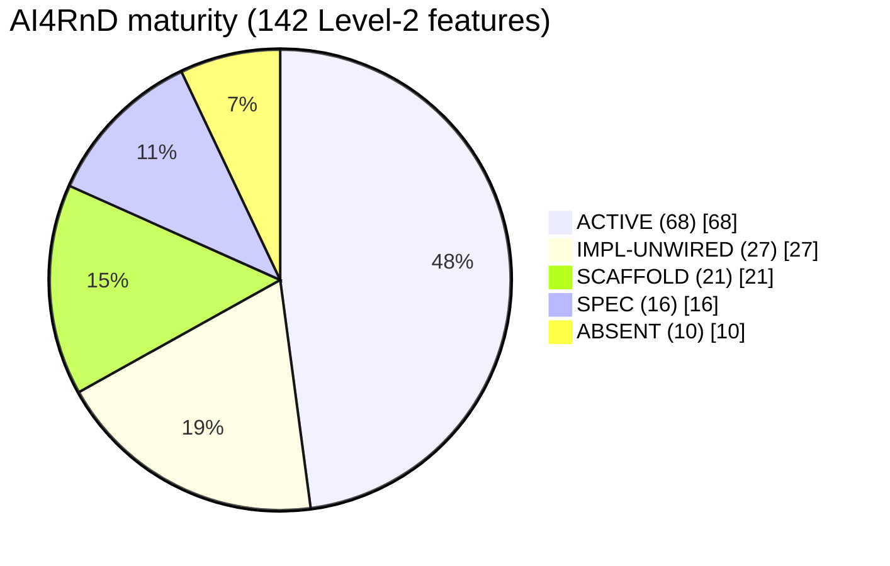
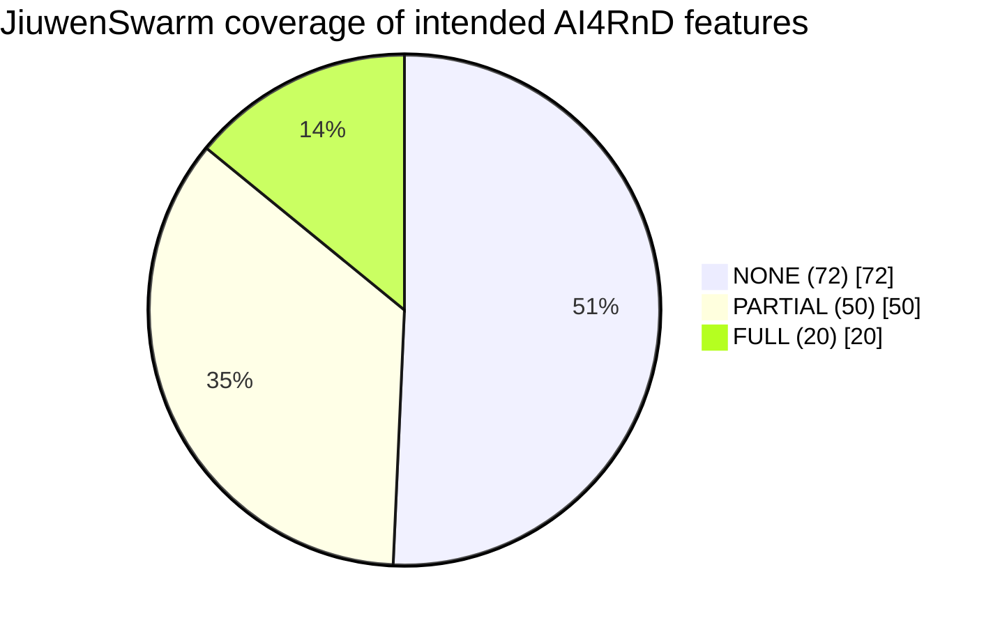
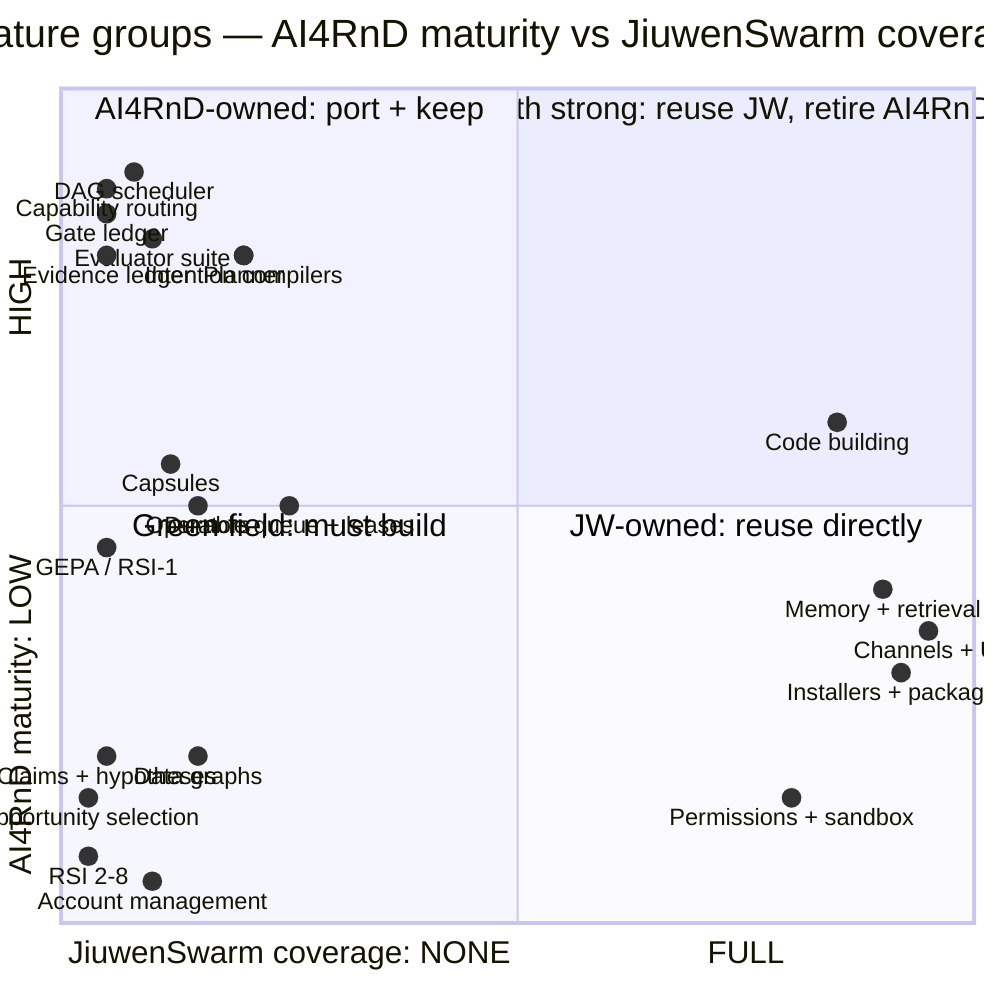

# Maturity Map

What exists, in what state, on each side. Classifications are from
[V-8](12-verification-appendix.md#v-8--ai4rnd-module-maturity-by-execution) (executed
import/wiring/test probe over 48 modules) plus source reading, mapped onto the 142-feature
set.

---

## 1. Classification scheme

| Class | Definition | How determined |
|---|---|---|
| **ACTIVE** | wired into a live runtime path and exercised | referenced by `coordinator.sh`, `solar-harness.sh`, `graph_scheduler`, `graph_node_dispatcher` or `multi_task_runner`, and imports cleanly |
| **IMPL-UNWIRED** | implemented and tested, but nothing in the runtime calls it | imports cleanly, has tests, **no** runtime reference |
| **SCAFFOLD** | partial, thin, or a stub with real structure | source-read |
| **SPEC** | described in the workbook or SDD, no implementation | source absence + spec presence |
| **ABSENT** | not present anywhere | word-boundary search returns nothing |

---

## 2. AI4RnD maturity across the 142 features

### By plane

| Plane | ACTIVE | IMPL-UNWIRED | SCAFFOLD | SPEC | ABSENT |
|---|---|---|---|---|---|
| Workflow (54) | 27 | 10 | 4 | 13 | 0 |
| Foundation (65) | 30 | 16 | 12 | 3 | 4 |
| Vertical (23) | 11 | 1 | 5 | 0 | 6 |

**Reading.** The Workflow plane is strong at both ends (ingestion/requirement compilation are
ACTIVE; evaluation/delivery are ACTIVE) and hollow in the middle — the entire
idea-identification and opportunity-selection lane (features 23–29) plus most of
claims/hypotheses (30–34) is `SPEC`. That is the part of the R&D pipeline that turns research
signals into *decisions*, and it is the least built.

---

## 3. The 19 implemented-but-unwired modules ⭐

This category did not appear in the previous revision and it changes the cost picture
materially: this is finished, tested code with no live caller.

| Module | LOC | Serves feature(s) | Why it matters |
|---|---|---|---|
| `capability_capsules` | 1351 | 55–59 | the whole capsule layer — 30 registered, 23 manifests validate |
| `capsule_execution_gate` | 194 | 58 | pre-dispatch cooldown + idempotency gating |
| `skill_to_capsule_compiler` | 323 | 59, 77 | promotes a skill into a capsule draft — the RSI-3 on-ramp |
| `capability_token` | 105 | 56 | capability grant tokens |
| `logical_operator_registry` | 33 | 60 | thin loader over `logical-operators.json` |
| `physical_operator_catalog` | 100 | 61 | static admission (`disabled`/`unavailable`/`deprecated`/health) |
| `operator_router` | 305 | — | **belongs to the AI-influence subsystem, not operator binding** — a naming trap |
| `operator_state_machine` | 233 | 61, 64 | operator lifecycle states |
| `task_graph_io` / `task_graph_state_io` | 351 / 491 | 91 | TaskGraph persistence + runtime state |
| `evidence_ledger` | 117 | 43, 70 | sprint-level evidence records |
| `event_ledger` | 198 | 89, 121 | event stream |
| `actor_registry` | 382 | 93, 95 | durable actor identity |
| `actor_lease` | 238 | 95 | lease acquire/release/reap |
| `actor_mailbox` | 102 | 93 | durable message delivery |
| `actor_runtime` | 329 | 92, 96 | actor execution |
| `context_store` / `solar_db` | 58 / 41 | 83 | context + DB helpers |
| `integrations/gepa_optimizer/` | **3540** | 75 | full RSI propose→promote→rollback with budget caps |

Two clusters stand out:

- **The `actor_*` family** is a durable actor model — registry, leases, mailboxes, runtime.
  It directly implements Harness Core features 2 (durable queue) and 4 (lease and
  concurrency control), which are exactly the features JiuwenSwarm lacks. It is sitting
  unused while the live system uses filesystem polling and tmux pane leases.
- **`gepa_optimizer`** is the single most valuable unwired asset: a complete, safety-gated
  controlled-improvement loop.

**Implication for cost.** Roughly 8,000 LOC of tested capability is one integration effort
away from being live. Any plan that treats these as "to build" over-estimates; any plan that
treats them as "working" over-claims.

---

## 4. AI4RnD — what is genuinely ACTIVE

Verified by execution (V-8, V-9, V-10):

| Area | Evidence |
|---|---|
| DAG scheduling + capability routing | `graph_scheduler` 4,189 LOC; **321 graph tests pass** |
| Evaluator suite | **104 evaluator tests pass** |
| Gate ledger | **124 tests pass** (2 root-env artifacts); append-only, writer-attributed |
| Research evidence core | init→add-source→extract→ledger→mine executed standalone |
| Intention compilation | `intent_gateway` 736 + `intent_engine_adapter` 851, wired |
| Planning | `apo_plan_compiler` 1,093 + `plan_validator` 1,564, wired |
| Contract instantiation | `workflow_contract` 1,136 + `workflow_intake` fail-closed |
| Model registry/routing/audit | `model_registry`, `model_call_runtime`, wired |

---

## 5. AI4RnD — ABSENT (10 features)

| Feature | Note |
|---|---|
| 76 RSI runtime routing (bandits / Bayesian optimisation) | no code |
| 78 RSI DAG & agent organisation (AFlow / MCTS / ADAS) | no code |
| 81 RSI model policies & weights (SFT / LoRA / DPO / GRPO) | no code; needs training infrastructure |
| 109 Model Construction (train / fine-tune) | absent both sides |
| 132–135 Account management (registration, auth/session, profile, privacy controls) | absent both sides — both systems are single-user local |
| 136–137 WeChat / Discord channels | absent in AI4RnD; **JiuwenSwarm ships both** |

---

## 6. JiuwenSwarm coverage of the 142 features

### Where JiuwenSwarm is FULL (20)

Concentrated almost entirely in the execution substrate and the vertical plane:

| Feature | What JiuwenSwarm provides |
|---|---|
| 1 Request capture · 3 material import | 9 IM connectors + web/TUI/desktop/ACP/A2A, E2A-normalised |
| 35–36 POC env prep + construction · 107–108 build prep + code construction · 112 verification assets | code mode, worktree, LSP, sandbox, test tooling |
| 83 Persistent memory & context retrieval | `MemoryIndexManager` 1,224 LOC, SQLite + vector + file watcher |
| 92 Runtime control loop · 96 dispatch & supervision | `DeepAgent` dual-layer task loop (11 rail events verified) |
| 124–131 Installers, CLI, GUI, TUI, web app | pip + signed desktop apps + TUI package |
| 136–137 WeChat, Discord | shipped connectors |
| 139–140 LLM config, user settings | config.yaml + `.env` + Configuration UI |

### Where JiuwenSwarm is NONE (72)

Every feature in these groups has no JiuwenSwarm counterpart at all:

- **Search & ideation** signal extraction, organisation, trend/gap, coverage review (17–22)
- **Idea identification / opportunity selection** — the entire lane (23–29)
- **Claims & hypotheses** — the entire lane (30–34)
- **Benchmarking** — the entire lane (40–44)
- **Evaluation** — the entire lane (45–50)
- **Capsules** (55, 59), **operator definition/binding/profiling** (60–62, 64–65)
- **Evidence/factuality evaluation** (70), **performance/cost evaluation** (68)
- **RSI** — all eight (75–82)
- **Data foundations** — dataset/policy/workflow/trace/memory graphs, TaskGraph persistence (85, 87–91)
- **DAG scheduler + readiness** (94), **admission/lease** (95, partial)
- **Intention compilation** (98–99, 102), **planner** (104–105)

---

## 7. The two-sided maturity picture

**Quadrant reading.**
- **Bottom-right (JW-owned):** channels, UI, installers, packaging, memory, permissions,
  sandbox, code building. Reuse directly — 23 features.
- **Top-left (AI4RnD-owned):** scheduler, routing, ledgers, evaluators, intention
  compilers, planner, capsules, operators. Port — 69 features. JiuwenSwarm offers nothing
  here and building it fresh would discard working, tested code.
- **Bottom-left (green field):** RSI 2–8, opportunity selection, claims/hypotheses, data
  graphs, account management. Build — 27 features. **Neither system has these.**
- **Top-right:** essentially empty. There is very little the two systems both do well, which
  is why the integration is complementary rather than competitive.

---

## 8. Health signals

| System | Signal | Value |
|---|---|---|
| JiuwenSwarm | full test suite | **2,816 passed, 18 skipped, 0 failed** (419s) |
| JiuwenSwarm | package install | clean `pip install -e ".[test]"`, 2,834 tests collected |
| JiuwenSwarm | permission built-in rules | **0 loaded in a stock install** (V-4) — a live defect |
| AI4RnD | module imports | **48/48 clean** on stdlib + pyyaml |
| AI4RnD | targeted suites | **556 passed**, 2 root-environment artifacts |
| AI4RnD | full suite | **aborts at collection** (`SystemExit` at module import) |
| AI4RnD | research core | runs standalone, no harness |
| AI4RnD | capsule manifests | 23/23 valid, 0 invalid |
| AI4RnD | grounding evaluator | **precision 0.25, unsupported-detection 0.14** (V-12) |

The asymmetry is informative. JiuwenSwarm is a well-maintained package with a real
regression suite and one significant unnoticed security regression. AI4RnD is a large,
partially-wired research system whose core subsystems are individually tested but whose
whole cannot be collected, and whose headline verification claim does not currently hold.
