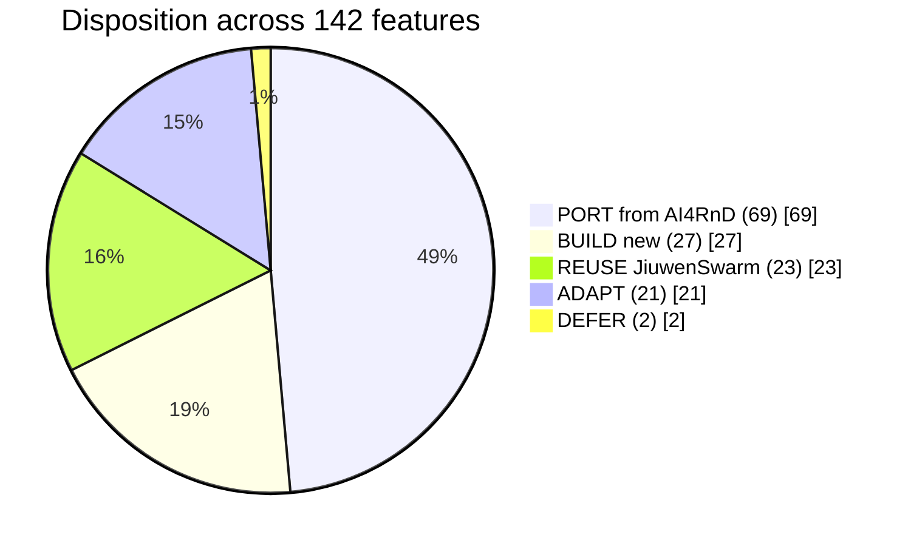
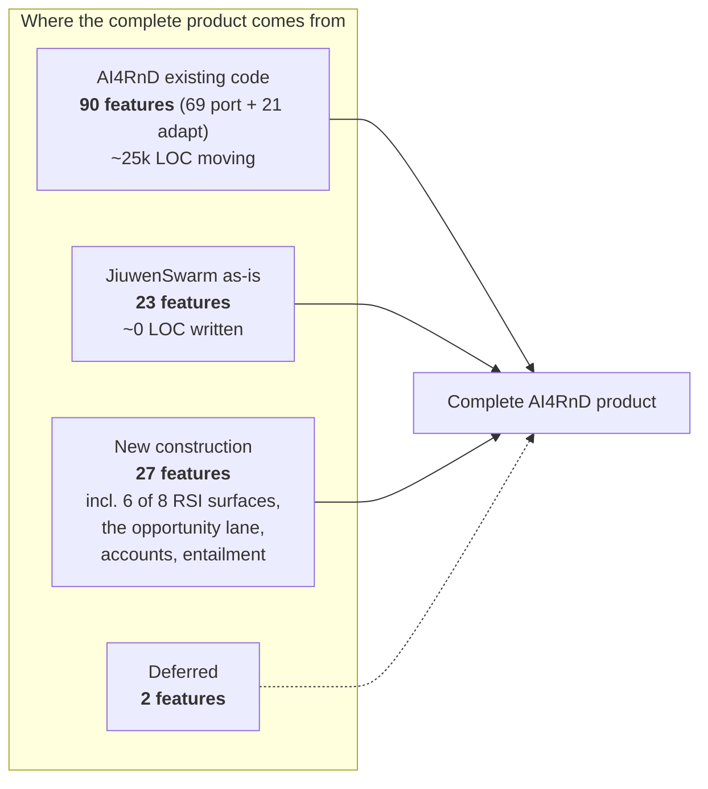

# Reuse-versus-Build Map

> **Revision 4 amendment.** This map is superseded for sourcing decisions by
> [20-feature-implementation-ownership.md](20-feature-implementation-ownership.md), which decides
> all 142 rows against the fuller vocabulary the brief requires (REUSE · CONFIGURE · ADAPT · PORT ·
> EXTEND · BUILD · DEFER · UNRESOLVED) and separates semantic ownership from runtime ownership.
> Revision 4 totals: BUILD 53 · ADAPT 32 · REUSE 23 · PORT 20 · EXTEND 11 · DEFER 2 ·
> UNRESOLVED 1. Several Revision 3 `REUSE` calls became `ADAPT` once the capability was invoked
> rather than read — see [15-correction-log.md](15-correction-log.md) §9.


Derived from the 142-row matrix. Every feature carries exactly one disposition.

| Disposition | Count | Meaning |
|---|---|---|
| **PORT** | 69 | AI4RnD code exists and should move across largely intact |
| **BUILD** | 27 | neither system has it; must be written |
| **REUSE-JW** | 23 | JiuwenSwarm provides it; do not rebuild |
| **ADAPT** | 21 | exists on one side but needs rework to fit |
| **DEFER** | 2 | not now, and for stated reasons |



**The headline ratio: 69 port + 21 adapt = 90 features (63%) come from AI4RnD's existing
code.** JiuwenSwarm supplies 23 (16%) directly. 27 (19%) are green field.

---

## 1. REUSE from JiuwenSwarm — 23 features

Take as-is. Rebuilding any of these would be waste.

| Group | Features | Why |
|---|---|---|
| **Channels & intake transport** | 1, 3, 136, 137 | 9 IM connectors + web/TUI/desktop/ACP/A2A, E2A-normalised. AI4RnD has none of this. |
| **Execution substrate** | 92, 96 | `DeepAgent` dual-layer task loop; 11 rail lifecycle events verified by execution (V-1). |
| **Code building** | 36, 107, 108, 112 | code mode, worktree isolation, LSP, edit tools, test tooling. |
| **Environment & isolation** | 35 | jiuwenbox (bwrap, cgroup, network policy) — AI4RnD has **no** isolation on its pane path. |
| **Memory & retrieval** | 83 | `MemoryIndexManager` 1,224 LOC, SQLite + vector + file watcher + consolidation. |
| **UI & packaging** | 124–131 | pip install, signed desktop apps, TUI package, web app. AI4RnD rates its own Windows path experimental and its DMG unproven. |
| **Configuration** | 139, 140 | config.yaml + `.env` + Configuration UI. |
| **Deliverable formats** | 119 | packaging/distribution. |

**Caveat on the sandbox.** V-4 found that the built-in high-risk shell rules load **zero
rules** in a stock install, so "reuse JiuwenSwarm's permission engine" must include shipping
`builtin_rules.yaml` into the openjiuwen package path or patching the loader. The engine is
sound; its default wiring is not.

---

## 2. PORT from AI4RnD — 69 features

Existing, tested code. Grouped by port difficulty.

### 2a. Cheap ports — self-contained, stdlib-only (verified by execution)

| Component | Features | Evidence |
|---|---|---|
| Research evidence core (`schemas`, `storage`, `hashing`, `ids`, `evidence/`, `extractors/`) | 5, 6, 18, 19, 31 | **V-10** — ran standalone: init→add-source→extract (span `[0,150)`)→ledger→mine (3 claims, 3 links) |
| `gate_ledger` | 43, 49, 89, 117 | **V-9** — 124 tests pass; append-only, writer-attributed, status-as-projection |
| `verification_gate` | 71 | writer≠verifier + evidence requirements |
| `capability_capsules` + schema + 30 manifests | 55–59 | **V-11** — 30 registered, 23 manifests valid, 0 invalid |
| `capsule_execution_gate` | 58 | cooldown + idempotency, unwired |
| `task_graph_io` / `task_graph_state_io` | 91 | TaskGraph persistence + runtime state |
| `logical_operator_registry` + `physical_operator_catalog` | 60, 61 | thin loaders over the two JSON registries |
| `evidence_ledger`, `event_ledger`, `context_store` | 43, 89, 121 | small, unwired |

### 2b. Moderate ports — real coupling, algorithm worth keeping

| Component | LOC | Features | Note |
|---|---|---|---|
| **Capability routing** (`graph_scheduler` assignment loop) | ~150 | **62** | The highest value-per-line asset in either system. Hard capability gate that is never relaxed; skills as preference with a Layer-3 liveness net; discriminated stall reasons (`no_matching_worker` / `worker_capacity_exhausted` / `worker_runtime_unavailable`). |
| Research evaluator + gate registry | 1,673 | 45–48, 66, 70 | **104 tests pass.** But see §5 — feature 70's grounding check must be replaced, not ported. |
| `intent_gateway` + `intent_engine_adapter` | 1,587 | 8, 9, 98, 99 | wired and active |
| `apo_plan_compiler` + `plan_validator` + `epic_decomposer` | 3,583 | 103–105 | `plan_validator` encodes "compiles implies dispatchable" |
| `workflow_contract` + `workflow_intake` | 1,422 | 7, 11, 14, 101, 102, 88 | fail-closed intake, versioned+hashed contracts |
| `actor_registry` / `actor_lease` / `actor_mailbox` / `actor_runtime` | 1,051 | 93, 95 | **durable queue + leases — exactly the Harness Core gap in JiuwenSwarm** |
| `integrations/gepa_optimizer/` | 3,540 | 75 | full propose→run→review→promote→rollback with budget caps and a frozen-policy checker |

### 2c. Hard port — large and Solar-coupled

| Component | LOC | Features | Note |
|---|---|---|---|
| **DAG scheduler** (`graph_scheduler` whole) | 4,189 | 94, 104 | **321 tests pass.** Keep the algorithm — validation, topo layering, critical path, **write-scope conflict avoidance**, pass-mark guards. Rewrite the I/O layer against a new store. Requires the coupling audit (prior spike E6, still open). |
| Benchmark suite (`benchmark/`, `agent_arena_benchmark`, `heavy_proof_benchmark`, `capability_fusion_benchmark`) | ~3,500 | 40–44, 68, 111 | unwired; the whole benchmarking lane |

---

## 3. ADAPT — 21 features

Exists somewhere, but the shape is wrong.

| Feature(s) | What exists | Required change |
|---|---|---|
| 63 Physical operator fleet | AI4RnD `physical-operators.json` with full profiles (provider, quota, cost, health, flow control) | **Drop the tmux carrier.** Workers become JiuwenSwarm members / sub-agents / MCP endpoints. Keep the data model. |
| 72–74 Model registry / routing / audit | both sides have partial versions | one registry; JiuwenSwarm owns credentials, AI4RnD's `model-scenario-routing.json` owns task→model policy |
| 120, 122 Status visibility | AI4RnD `status-server.py` 14,400 LOC + React | rewrite as a JiuwenSwarm view; **keep the honest-state rules** (never show progress for a stalled run) |
| 87 Policy graph | AI4RnD `runtime/policy/writers.yaml` + capsule `effects`; JiuwenSwarm permissions | merge into one policy model |
| 142 Cluster settings | AI4RnD `actor-hosts.json`; JiuwenSwarm `instance_manager` + `distributed_runtime` | one topology source feeding operator binding |
| 4 Intake context binding | both have workspace concepts | reconcile session/project/workspace models |
| 10, 100 Ambiguity resolution | AI4RnD readiness checks; JiuwenSwarm `structured_ask_user` rail | decide who owns the clarification UX |
| 67, 69 Engineering + security evaluators | AI4RnD `eval_runner`; JiuwenSwarm LSP + Auto Harness CI + permissions | compose rather than duplicate |
| 51, 54, 118 Delivery | AI4RnD export/render; JiuwenSwarm `send_file` + skills (docx/pptx) | AI4RnD produces, JiuwenSwarm delivers |
| 37, 106, 110, 114, 115 Build lanes | partial both sides | route through JiuwenSwarm code mode under AI4RnD contracts |

---

## 4. BUILD new — 27 features

Neither system has these. **This is the honest cost of the full product.**

| Cluster | Features | Size |
|---|---|---|
| **Opportunity selection lane** — candidate consolidation, idea identification, **Idea Card schema**, opportunity definition, technical + strategic screening, portfolio prioritisation | 23–29 | 7 |
| **Claims & hypotheses** — hypothesis pool, mechanism formation, **falsifiability screening**, POC design contract | 32–34 | 3 |
| **RSI surfaces 2, 4, 5, 6, 7, 8** — routing optimisation, DAG/organisation search, judge calibration + reward modelling, memory/retrieval learning, model weights, curriculum/credit assignment | 76, 78–82 | 6 |
| **Account management** — registration, auth/session, profile, privacy controls | 132–135 | 4 |
| **Data graphs** — dataset graph, code graph | 85, 86 | 2 |
| **Entailment checking** (replacing the current grounding heuristic) | within 70 | 1 |
| Requirement prioritisation, search-strategy gaps, idea generation, decision artifacts, model construction | 12, 21, 113, 109, 2 | 5 |

Two of these deserve emphasis:

- **Falsifiability screening (33)** is the scientific core of the product — deciding whether
  a hypothesis *can* be refuted by obtainable data. It has no implementation anywhere.
- **Account management (132–135)** is absent from both because both are single-user local
  tools. Any multi-user product needs this built from zero, including privacy/export/delete
  controls with compliance implications.

---

## 5. The one thing that must be **replaced**, not ported

**Feature 70 — Evidence, Factuality & Scientific Validity Evaluator.**

The ledger, spans, hashing and source-authority scoring are sound and should be ported. The
grounding *judgement* must not be:

```python
overlap = sorted(context_tokens & evidence_tokens)
checks.append({..., "ok": bool(overlap), ...})
```

Measured (V-12): precision **0.25**, unsupported-claim detection **0.14**. "Bananas are
yellow and grow in tropical climates `[cite:ev_1]`" is reported grounded because it shares
the token *"and"* with the evidence. A word-boundary search confirms **no entailment
machinery anywhere in AI4RnD**.

Porting this as-is would carry a verification claim the code cannot support. Real entailment
(an NLI model or a bounded, audited LLM judge with its own golden set) belongs in **Stage 1**,
not in later hardening.

---

## 6. DEFER — 2 features

| Feature | Reason |
|---|---|
| 81 RSI model policies & weights (SFT/LoRA/DPO/GRPO) | requires training infrastructure that is out of scope until the evidence and benchmark layers produce trustworthy training signal. Marked `ASPIRE` in the workbook. |
| 138 TMUX as a first-class surface | conflicts directly with an in-process execution model. Keep **only** if the tmux cockpit is a genuine user requirement rather than an implementation artifact — an open question for the owners (Q4). |

---

## 7. Net effect



**What this map says about the architecture question.** JiuwenSwarm contributes 16% of the
intended product, all of it in the substrate and vertical planes. It contributes essentially
nothing to the Foundation plane that gives AI4RnD its identity — capsules, operators,
evaluators, RSI, data graphs. That does not disqualify it as a foundation; a substrate is
supposed to be invisible. But it does mean **the integration must be structured so that
AI4RnD's 90 features are not forced through JiuwenSwarm's abstractions**, and it rules out
any option that treats AI4RnD as a plugin.

Continued in [07-architecture-options.md](07-architecture-options.md).
