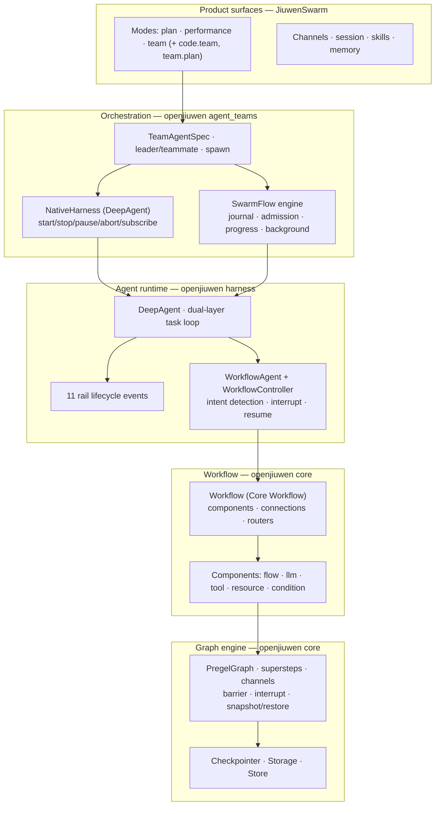

# Jiuwen Execution Mechanisms — Bottom-Up Map

The document Revision 2 should have opened with. Everything here is from
`openjiuwen==0.1.15.post3` installed from PyPI, and `jiuwenswarm` @ `a98d7ad`.

Evidence classes: **EXEC** executed here · **SRC** read in source · **DOC** documented ·
**UNK** not determined.

---

## 0. The stack

**The key structural fact:** JiuwenSwarm is a thin product layer. Nearly every execution
primitive lives in openjiuwen, and there are **five** distinct graph/state mechanisms, not one.

---

## 1. Core Workflow (`openjiuwen/core/workflow/`)

| Property | Finding | Class |
|---|---|---|
| Graph owned | component graph — `set_start_comp`, `add_workflow_comp`, `set_end_comp`, `add_connection`, `add_stream_connection`, `add_conditional_connection` | **EXEC** |
| Topology | **static skeleton, dynamic routing.** `add_conditional_connection(router)` where the router returns `Hashable` **or `list[Hashable]`** → runtime fan-out to a computed set of targets | **EXEC** |
| Components available | `flow`: `start_comp`, `end_comp`, `branch_comp`, `branch_router`, **`workflow_comp`** · `llm`: `llm_comp`, `intent_detection_comp`, `questioner_comp` · `tool`: `tool_comp` · `resource`: `knowledge_retrieval_comp`, `memory_retrieval_comp`, `memory_write_comp` · `condition`: `expression`, `number`, `array`, `condition` | **EXEC** |
| Nesting / recursion | **yes** — `workflow_comp` makes a workflow a component of another workflow | **EXEC** |
| Persistence & resume | via Pregel + `Checkpointer` (§2, §3) | **EXEC** |
| Background work | `_spawn_background_task`, `_wait_background_task`, `_is_background_task_done` on `Workflow` | **SRC** |
| Timeout | `_execute_with_timeout(func, timeout)` | **SRC** |
| Cancellation | inherited from Pregel/session; not a first-class `Workflow.cancel()` | **SRC** |
| Progress | `stream()` with stream modes; `draw()` for visualisation | **SRC** |
| Typed contracts on nodes | **no.** Components carry input/output schemas but no acceptance criteria, evidence requirements or gate semantics | **SRC** |
| Verified | built a `PregelBuilder` graph with fan-out + barrier; enumerated the full `Workflow` API | **EXEC** [V-15] |

**Assessment.** A real, general workflow engine. It can express an AI4RnD research plan's
*shape* — sequence, branch, fan-out, join, nesting. It cannot express *why* a node exists or
*what would make its output acceptable*.

---

## 2. Pregel graph engine (`openjiuwen/core/graph/pregel/`)

| Property | Finding | Class |
|---|---|---|
| Model | Bulk-synchronous supersteps. `PregelNode`, `Channel`, `Message`, `TriggerMessage`, `BarrierMessage`, `IRouter` | **EXEC** |
| Ready-set computation | `ChannelManager.get_ready_nodes()`, `is_ready()`, `flush()`, `buffer_message()` | **SRC** |
| Barrier | `BarrierMessage` + `add_node(..., wait_for_all=True)` | **EXEC** |
| Durability | `Channel.snapshot()` / `.restore()`; `ChannelManager.snapshot()/restore()`; `PregelLoop._save_state_on_error` writes `channel_snapshot` | **EXEC** |
| Resume | `PregelLoop._is_resume(state)`; on resume `manager.restore(state.channel_values)` and `max_step = state.step + RECURSION_LIMIT` | **SRC** |
| Interrupt | `Interrupt`, `GraphInterrupt(Exception)`; `Pregel.run()` returns interrupt payloads | **EXEC** |
| Loop guard | `RECURSION_LIMIT` → `max_step`, raises on exceed | **SRC** |
| Store | `core/graph/store/{base,inmemory,serde}` | **SRC** |
| Verified | primitives imported, graph built, API signatures captured | **EXEC** [V-15] |

**Assessment.** This is the durable DAG scheduler. Supersteps + channel snapshot/restore +
barrier + interrupt is the same shape as AI4RnD's `graph_scheduler` readiness/batching loop,
one layer down and already integrated with sessions.

**Not provided:** write-scope conflict avoidance. Pregel batches by *message readiness*, not by
*declared side-effect scope*. That is a genuine AI4RnD contribution (§9).

---

## 3. Checkpointer & Storage (`openjiuwen/core/session/checkpointer/`)

| Property | Finding | Class |
|---|---|---|
| Hooks | `pre_workflow_execute`, `post_workflow_execute`, `pre_agent_execute`, `post_agent_execute`, `pre_agent_team_execute`, `post_agent_team_execute`, `interrupt_agent_execute`, `session_exists`, `release`, `graph_store` | **EXEC** |
| Storage contract | `save`, `recover`, `clear`, `exists` | **EXEC** |
| Implementations | `inmemory` (`AgentStorage`, `AgentTeamStorage`, …) and `persistence.py` over a `BaseKVStore` with serialise/deserialise | **SRC** |
| Survives restart | **yes, if a persistent KV backend is configured**; the in-memory implementation does not | **SRC** |
| Verified | contract enumerated by execution | **EXEC** [V-15] |

**Open question (Q24):** which KV backends are wired in a default JiuwenSwarm install. If only
in-memory is active, durability is a configuration task, not a build task — but it is a task.

---

## 4. WorkflowAgent / WorkflowController (`openjiuwen/core/application/workflow_agent/`)

| Property | Finding | Class |
|---|---|---|
| Role | selects **which registered workflow** answers a request, then runs it | **SRC** |
| Selection | `intent_detection()`, `_detect_workflow_via_llm()`, `WorkflowEventHandler._get_workflows() -> List[WorkflowCard]` | **SRC** |
| Interrupt / resume | `interrupt_task`, `_handle_resume`, `_should_resume_interrupted_task`, `_find_interrupted_task_by_node_id`, `_get_interrupted_component_id`, `_clear_interrupted_state` | **SRC** |
| Task model | `_create_new_task`, `Task`, per-session interrupted-task lookup | **SRC** |
| Human interaction | `_extract_interaction_value_from_interaction_data`, `_count_interactions`, `_get_first_interrupt` | **SRC** |

**This is "Auto Route".** LLM-based dispatch across registered workflows is an existing
openjiuwen mechanism. It is not something to build, and not something to put in front of users
as a strategy choice.

---

## 5. SwarmFlow (`openjiuwen/agent_teams/workflow/`)

| Property | Finding | Class |
|---|---|---|
| Script model | **ordinary Python**: a pure-literal `META = {name, description, phases}` + `async def run(args)`; primitives imported from `swarmflow` (`agent`, `parallel`, `workflow`, …) | **EXEC** |
| META purity | enforced by `ast.literal_eval` — a `META` referencing a name is rejected with `MetaError` | **EXEC** |
| Determinism lint | bans `time.{time,monotonic,perf_counter,…}`, all of `random`, all of `uuid`, and `datetime.{now,today,utcnow}`; also lints the `lambda: agent(...)`-in-comprehension closure footgun | **EXEC** |
| Idempotent replay | `Journal` — WAL-backed (`_append_wal`), `call_signature(...)` keys, `get_cached(ks, sig)`, `save`/`finalize`, `_discard_wal_if_durable`, `hits()` | **SRC** |
| Admission | `SemaphoreAdmission(cap)`, `ConcurrencyGovernor`, `ConcurrencyLimits`, `WorkflowAdmission`, `RunAgentAdmission`, `agents_per_run_cap` | **SRC** |
| Background | `SwarmflowTool.run_background(task_id, inputs)`; `BackgroundTaskController.pause/resume/is_paused/register/deregister`; `SwarmflowRunHandle` | **SRC** |
| Cancellation | `_check_abort(rt)` before each primitive call | **SRC** |
| Progress | `WorkflowProgressEvent`, `PhasePlan`, `ProgressKind`; `WorkflowRun`/`PhaseRecord`/`AgentActivity` with per-agent status | **SRC** |
| Human-in-the-loop | `_on_human_prompt(member, correlation_id, prompt)`, `_on_human_replied(...)` | **SRC** |
| Resume | `resume_id` parameter on the tool | **SRC** |
| Topology | **fully dynamic** — it is a Python program; loops and conditionals are ordinary control flow | **EXEC** |
| Typed contracts on nodes | **no** — `agent(...)` takes a prompt and an optional output `schema` | **SRC** |
| Verified | META extraction accepted a valid script and rejected a name-referencing one | **EXEC** [V-16] |

**Assessment.** This is the strongest match for AI4RnD's execution needs. Deterministic,
journalled, resumable, admission-controlled, backgroundable, cancellable, with progress
events — and *dynamic*, because it is a real program rather than a static graph.

**Exposure in JiuwenSwarm:** `SWARMFLOW_ENABLED_CONFIG_PATH = ("modes","team","jiuwen_team",
"enable_swarmflow")` — a config flag inside team mode. Its phases and workers are converted
into `team.task` and `team.member` events so the existing web UI renders them
(`team_helpers.py:2159-2288`). **Users never choose SwarmFlow; they use team mode and
SwarmFlow may be how it runs.** [SRC]

---

## 6. Teams (`openjiuwen/agent_teams/`)

| Property | Finding | Class |
|---|---|---|
| Spec | `TeamAgentSpec`: `agents: dict[str, DeepAgentSpec]`, `team_name`, `lifecycle`, `enable_team_plan`, `teammate_mode`, `spawn_mode`, `leader: LeaderSpec`, plus `TransportSpec`/`StorageSpec` | **SRC** |
| Roles | JiuwenSwarm enriches exactly two: `leader`, `teammate` | **SRC** [V-6] |
| Spawn | `inprocess_spawn`, `external_cli_spawn`, `shared_resources` | **SRC** |
| Dynamic team | leader composes teammates at runtime; `TinyAgentSpec` for lightweight members | **SRC** |
| Distribution | `TransportSpec` + `remote_member_bootstrap` (JiuwenSwarm side) | **SRC** |
| Typed contracts | **no** | **SRC** |

**Assessment.** Good for uncertain, conversational decomposition. Poor for auditable pipelines
— no dependency graph, no gate semantics, and only two roles.

---

## 7. NativeHarness (`openjiuwen/agent_teams/harness/native_harness.py`)

`class NativeHarness(DeepAgent)` with `start`, `stop`, `pause`, `abort(immediate=)`, `send`,
`subscribe`, `outputs`, `run_once`, `dispose`, `state`, `schedule_auto_invoke_on_spawn_done`,
`launch_async_tool`, `async_tool_runtime`. [SRC]

**Assessment.** A long-lived, controllable agent process with an async tool runtime. This is
the natural host for a **persistent AI4RnD project** — it already models "a thing that keeps
running, can be paused and resumed, and emits an output stream".

---

## 8. Evolution (`openjiuwen/agent_evolving/`) — see [18](18-evolution-governance.md)

| Component | Contents | Class |
|---|---|---|
| `core/operator/` | `Operator` = **tunable-parameter handle, explicitly not executable**; `TunableSpec(name, kind, path, constraint)`; kinds `prompt`/`continuous`/`discrete`/`tool_selector`/`memory_selector`; implementations `llm_call`, `memory_call`, `skill_call`, `tool_call` | **EXEC** |
| `dataset/` | `Case(inputs, label, tools, case_id)`, `EvaluatedCase(case, answer, score, reason, per_metric)`, `CaseLoader` | **EXEC** |
| `evaluator/` | `metrics/{exact_match, llm_as_judge}`, `evaluator_pipeline`, `templates` | **EXEC** |
| `trainer/` | `Trainer.train(agent, train_cases, val_cases)`, `_select_best_candidate_on_val(candidates)`, `_snapshot_operators_state`, `_restore_operators_state`, `_save_checkpoint_if_needed`, `_resume_if_needed`, `apply_updates`, `evaluate` | **EXEC** |
| `updater/` | `Updater` protocol (`bind`, `process`, `update`, `requires_forward_data`, `get_state`, `load_state`) with `single_dim` and `multi_dim` (credit assignment) | **EXEC** |
| `signal/` | `from_eval`, `from_conv`, `team`, `EvolutionSignal` | **EXEC** |
| `agent_rl/` | `offline/`, `online/` (gateway, inference, judge, launcher, rail, scheduler), `rl_trainer/{ppo_step, verl_converter, verl_executor}`, `reward.py`, `rl_rail.py` | **EXEC** |
| `checkpointing/` | `EvolutionStore` (append_record, archive_evolutions, archive_skill_body, create_skill), `skill_package` (pack/unpack/install) | **EXEC** |
| `sharing/` | `hub_client`, `experience_sharer`, `share_stager` | **EXEC** |
| `experience/` | `archive`, `lifecycle`, `online_orchestrator`, `scorer`, `submission` | **SRC** |

**Assessment.** A general self-evolution framework with candidate generation, validation-set
selection, snapshot/rollback, freeze markers and RL. Revision 2 said most of this had to be
built.

---

## 9. What no Jiuwen mechanism provides

After the full inventory, these AI4RnD requirements have **no** counterpart anywhere in
JiuwenSwarm or openjiuwen:

| Requirement | Why it is genuinely missing |
|---|---|
| **Capability match as a hard admission gate** | Jiuwen selects by *role* and *registered workflow intent*. Nothing matches a task's `required_capabilities` against a worker's declared ones, and nothing produces a discriminated `no_matching_worker` stall. |
| **Write-scope conflict avoidance** | Pregel batches on message readiness; `ConcurrencyGovernor` caps counts. Neither reasons about declared side-effect scope, so two nodes writing the same artifact can co-schedule. |
| **Typed research contracts on nodes** | No node type carries acceptance criteria, required evidence, or proof obligations. |
| **Evidence ledger / claim graph / citation spans** | Absent (confirmed again against openjiuwen). |
| **Gate ledger with node status as a projection** | `Checkpointer` stores execution state, not *verdicts with authorship*. |
| **Writer ≠ verifier enforcement** | No concept of actor identity constraining who may evaluate. |
| **Capability Capsules** | `skill_package` is a tarball; there is no contract, effects declaration, guard capsule or operator-compatibility rule. |
| **Governed promotion of research capabilities** | `Trainer` promotes *parameters*; there is no approval gate, no frozen-policy check on the *artifact*, no human verdict record. |
| **RSI-4 (DAG / agent-organisation search)** | Nothing searches workflow structure. |

**These nine are the real AI4RnD contribution.** Everything else in Revision 2's port list is
now a candidate for deletion.

---

## 10. Comparison table

| | Core Workflow | Pregel | SwarmFlow | Team | NativeHarness | AI4RnD `graph_scheduler` |
|---|---|---|---|---|---|---|
| Topology | static + dynamic routing | static + routers | **fully dynamic (Python)** | dynamic (LLM) | n/a | static JSON DAG |
| Barrier / join | ✅ | ✅ | ✅ (`parallel`) | ✗ | n/a | ✅ |
| Persist & resume | ✅ | ✅ snapshot/restore | ✅ journal + `resume_id` | partial | ✅ | ✅ files |
| Skip already-done work | via checkpoint | via channel state | ✅ **journal memoisation** | ✗ | n/a | ✅ status |
| Background | ✅ | — | ✅ | ✅ | ✅ | ✅ |
| Pause / resume | ✅ interrupt | ✅ | ✅ controller | ✗ | ✅ | ✗ |
| Cancel | session-level | ✅ | ✅ `_check_abort` | ✅ | ✅ `abort` | ✗ (advisory) |
| Progress events | stream | — | ✅ rich | ✅ | ✅ | ✅ files |
| Admission / concurrency | ✗ | ✗ | ✅ governor | ✗ | ✗ | ✅ leases |
| Nesting | ✅ `workflow_comp` | ✅ | ✅ `workflow()` | ✅ subagents | ✅ | ✗ |
| Typed contracts / evidence | ✗ | ✗ | ✗ | ✗ | ✗ | ✅ |
| Capability routing | ✗ | ✗ | ✗ | ✗ | ✗ | ✅ |
| Write-scope exclusion | ✗ | ✗ | ✗ | ✗ | ✗ | ✅ |

The last three rows are the entire justification for AI4RnD-owned code at this layer. The
other twelve are reasons not to write any.
