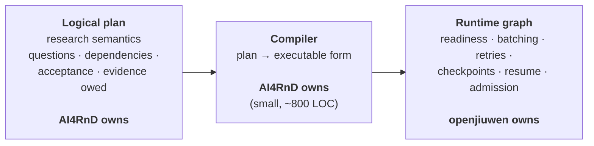
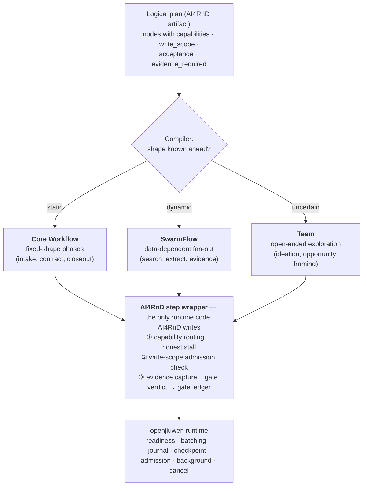

# Verdict: Custom TaskGraph versus Core Workflow / SwarmFlow Reuse

**Question.** Does AI4RnD need its own DAG scheduler, or can existing Jiuwen mechanisms carry
the work?

**Answer. AI4RnD keeps a logical research plan. It does not keep a scheduler.**

The plan is a *semantic* artifact — what must be established, what depends on what, what
evidence each step owes. It compiles to an existing Jiuwen execution mechanism. AI4RnD writes
no readiness loop, no batching, no lease manager, no retry engine, no resume logic.

Revision 2 said the opposite. [15-correction-log.md §1](15-correction-log.md) explains why it
was wrong.

---

## 1. The three things Revision 2 confused



A logical plan is not a scheduler. Revision 2 treated `sprint.task_graph.json` as one object
and concluded AI4RnD had to own all of it. Splitting it leaves AI4RnD owning the part that
carries research meaning and none of the part that duplicates infrastructure.

---

## 2. What would be duplicated if AI4RnD shipped its own scheduler

Measured against `graph_scheduler.py` (4,189 LOC) and the `actor_*` family (1,051 LOC):

| `graph_scheduler` capability | Existing Jiuwen equivalent | Duplication |
|---|---|---|
| `validate_graph` (cycles, missing deps, duplicates) | Pregel `_validate_node_id`, `_forward_reachable`; `Workflow` connection validation | **full** |
| `topo_order`, `topo_layers` | Pregel supersteps — layering *is* the execution model | **full** |
| ready-node computation | `ChannelManager.get_ready_nodes()`, `Channel.is_ready()` | **full** |
| parallel batch formation | Pregel superstep dispatch | **full** |
| retry / requeue | `Trainer`/session retry; SwarmFlow journal replay | **most** |
| resume without re-running passed work | SwarmFlow `Journal.get_cached(ks, sig)`; Pregel `_is_resume` + channel restore | **full** |
| status persistence | `Checkpointer.save/recover`, `Storage` | **full** |
| `critical_path`, `graph_parallelism_metrics` | not provided — but diagnostics, not scheduling | none |
| **write-scope conflict avoidance** | **not provided** | **none — keep** |
| **capability matching + honest stall** | **not provided** | **none — keep** |
| **pass-mark guards / self-graded-eval detection** | **not provided** | **none — keep** |
| `actor_lease` / `actor_mailbox` / `actor_registry` | `SemaphoreAdmission`, `ConcurrencyGovernor`, `WorkflowAdmission`, `RunAgentAdmission`, SwarmFlow journal | **full** |

**Roughly 85% of `graph_scheduler` and effectively all of `actor_*` would be re-implementation.**
Three capabilities survive, and they are small.

---

## 3. Can AI4RnD compile directly into Core Workflow?

**Yes for static-shaped research, with two caveats.** [EXEC — V-15]

Available: `set_start_comp` / `add_workflow_comp` / `set_end_comp` / `add_connection` /
`add_conditional_connection(router)`. The router returns `Hashable` **or `list[Hashable]`**, so
one node can fan out to a computed set. `workflow_comp` nests a whole workflow as a component,
so a research phase can be a sub-workflow. `wait_for_all=True` gives the join.

A literature-review plan maps cleanly:

```
start → scope → plan_questions → [conditional fan-out over questions]
      → search_q1 … search_qN → extract → join(wait_for_all)
      → synthesise → gate → end
```

**Caveat 1 — node count must be known at compile time or produced by a router.** Core Workflow
graphs are built before invocation. A plan that discovers it needs 40 more searches mid-run
must either pre-declare a router-driven fan-out or re-enter the compiler. Workable, but it is
the reason SwarmFlow exists.

**Caveat 2 — components carry no contract.** There is no place on a component to record
"this node must produce ≥3 independent sources, and its output is inadmissible without
citation spans". AI4RnD must hold that in the logical plan and enforce it in a wrapper (§6).

---

## 4. Can deterministic subgraphs compile into SwarmFlow?

**Yes, and this is the better default for research pipelines.** [EXEC — V-16]

A SwarmFlow script is ordinary Python with a pure-literal `META` and `async def run(args)`.
Loops, conditionals and recursion are just Python, so a plan that grows during execution needs
no recompilation. The journal memoises each call by signature, so resume skips completed work
without any AI4RnD status bookkeeping. Admission control and background execution come free.

The determinism lint (`time`, `random`, `uuid`, `datetime.now` banned) is a *constraint that
suits research*: reproducibility is the point. AI4RnD run ids and timestamps must be passed in
via `args` rather than generated inside the script — the same discipline AI4RnD's own
deterministic-ID design already follows.

**Compilation sketch** — the AI4RnD plan becomes a generated script:

```python
META = {"name": "ai4rnd-run", "description": "...", "phases": ["scope", "search", "evidence", "gate"]}

async def run(args):
    from swarmflow import agent, parallel, workflow
    contract = await agent(args["scope_prompt"], schema=ResearchContract)
    qs = await agent(args["questions_prompt"], schema=QuestionGraph)
    hits = await parallel([lambda q=q: agent(search_prompt(q), schema=SourceHits) for q in qs.items])
    ...
```

with AI4RnD supplying `search_prompt`, the schemas, and a wrapper around `agent(...)` that
performs capability routing and records evidence.

---

## 5. Can uncertain sections invoke Dynamic Teams?

**Yes, and they should.** Team mode is the right host for genuinely open-ended steps —
"explore this space and tell me what matters" — where a fixed graph would be dishonest.

The constraint from [V-6] applies: only `leader` and `teammate` roles exist, with a global
permission policy. So a team step is a *bounded excursion* — AI4RnD hands it a contract, it
returns artifacts, and AI4RnD gates the result. It is not where writer≠verifier or
per-operator effects can be enforced.

---

## 6. Does AI4RnD still need a logical TaskGraph?

**Yes — as a semantic model only. Not as a second scheduler.**

What it must carry, none of which any Jiuwen mechanism holds
([16 §9](16-jiuwen-execution-mechanisms.md)):

| Field | Purpose |
|---|---|
| `question_id` / `claim_id` | why this step exists |
| `required_capabilities` | the hard routing gate |
| `write_scope` | side-effect exclusion at batch formation |
| `acceptance` | what makes the output admissible |
| `evidence_required` | proof obligations |
| `gate_refs` | which evaluators must pass |
| `verifier_constraint` | e.g. `actor != writer_of(node_X)` |
| `capsule_ref` + `version` | which governed capability realises it |

This is a **typed annotation layer over an execution graph**, not an execution graph. It is
persisted as an artifact, versioned, and diffable — which the runtime graph is not.

---

## 7. The compiler, and where the three surviving capabilities live



The three surviving capabilities become a **wrapper around each step invocation**, not a
scheduler:

1. **Capability routing** — before a step runs, choose the runner by matching
   `required_capabilities`. Stall honestly if none qualifies. ~150 LOC, ported from
   `graph_scheduler:2290-2400`.
2. **Write-scope exclusion** — a small admission predicate consulted before a step is admitted,
   composing with `ConcurrencyGovernor` rather than replacing it. ~100 LOC.
3. **Evidence + gate recording** — after a step, capture artifacts and write a gate-ledger
   record. ~200 LOC, ported from `gate_ledger` + `verification_gate`.

**Total AI4RnD runtime code: ~450 LOC**, against ~5,200 LOC in Revision 2's port list.

---

## 8. Where write-scope exclusion actually attaches

This is the one capability that cannot be a pure wrapper, because it constrains *co-scheduling*
rather than a single call.

| Host | How | Feasibility |
|---|---|---|
| **SwarmFlow** | AI4RnD's compiler emits `parallel([...])` groups that are already scope-disjoint. Exclusion becomes a *compile-time* property. | **best** — no runtime hook needed |
| **Core Workflow** | Nodes with overlapping scope are placed on a serial chain rather than a fan-out. Also compile-time. | good |
| **Runtime admission** | A custom `AgentAdmission` implementing the `Protocol` (`acquire()` async context manager) that refuses a conflicting step. | possible; needs the live-scope registry |

**Preferred: solve it in the compiler.** Because AI4RnD owns plan→script generation, it can
simply not emit conflicting steps into the same `parallel(...)` group. That converts a runtime
scheduling problem into a code-generation invariant, and removes the last reason to own a
scheduler.

---

## 9. Falsifiers

What would overturn this verdict:

| # | Finding that would restore a custom scheduler | How to test | Cost |
|---|---|---|---|
| F1 | SwarmFlow's journal cannot memoise a step whose output is a large artifact reference | write a script returning a 10 MB artifact ref, kill, resume, check `hits()` | 1 day |
| F2 | Core Workflow cannot express fan-out where N is discovered at runtime | build a router returning `list[Hashable]` of computed length and run it | 1 day |
| F3 | Checkpointer has no persistent backend wired in a default install, and adding one is invasive | inspect JiuwenSwarm's checkpointer configuration | 2 days |
| F4 | The determinism lint blocks a research pattern AI4RnD genuinely needs | compile three real AI4RnD plans to SwarmFlow and run the loader | 3 days |
| F5 | A custom `AgentAdmission` cannot see enough state to enforce write-scope, *and* compile-time exclusion proves insufficient | prototype the admission protocol | 3 days |

**F2 and F4 are the two cheapest and most informative.** They are the first two experiments in
[09-implementation-plan.md](09-implementation-plan.md) Stage 0.

---

## 10. Bottom line

| Question | Answer |
|---|---|
| Compile directly into Core Workflow? | **Yes** for fixed-shape phases |
| Compile deterministic subgraphs into SwarmFlow? | **Yes**, and it is the better default |
| Uncertain sections into Dynamic Teams? | **Yes**, as bounded excursions |
| Still need a separate logical TaskGraph? | **Yes** — semantic only |
| Is it also a second scheduler? | **No** |
| What is duplicated if AI4RnD builds one? | ~85% of `graph_scheduler`, all of `actor_*` — roughly 4,700 LOC |
| What survives as AI4RnD runtime code? | capability routing, write-scope exclusion, evidence/gate recording — **~450 LOC** |
