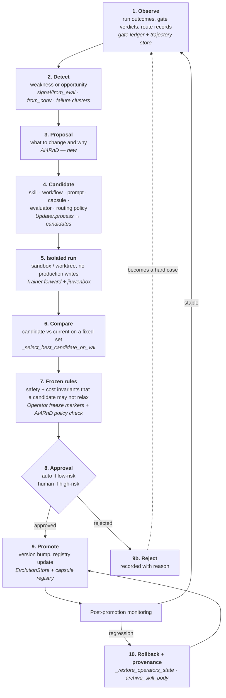

# Governed Recursive Improvement

Not "an agent rewriting itself". A concrete ten-step loop, most of which openjiuwen already
implements.

Revision 2 said six of eight improvement surfaces had to be built. That was wrong —
[15-correction-log.md §2](15-correction-log.md).

---

## 1. Two kinds of improvement, deliberately separated

The brief asks for this distinction, and it is the organising idea of the whole design.

| | **Ordinary Skill evolution** (exists, keep) | **Governed AI4RnD evolution** (build the governance) |
|---|---|---|
| Trigger | tool failure, user correction | evaluator verdict, gate failure, capability profile drift |
| Subject | one skill's text | capsule, routing policy, evaluator rubric, workflow shape, prompt, model policy |
| Validation | none — appended and used next time | fixed evaluation set, candidate vs current, holdout |
| Approval | none | policy-gated; human verdict for high-risk classes |
| Versioning | `evolutions.json` entries | versioned artifact with promotion + rollback |
| Blast radius | one skill, one agent | any run using that capability |
| Where it shows up | silently in the next answer | **Improvements inbox** |

JiuwenSwarm's existing skill evolution stays exactly as it is. AI4RnD does **not** route
ordinary skill tweaks through governance — that would make the system unusable. Governance
applies when the subject is a *governed capability*: something with a capsule, a version and
consumers.

---

## 2. The loop



---

## 3. Reuse map — step by step

| Step | openjiuwen provides | AI4RnD adds | Verdict |
|---|---|---|---|
| 1 Observe | `trajectory/{builder,extractor,aggregator,store,registry}`; `experience/archive` | gate-ledger verdicts and route records as an additional signal source | **reuse + feed** |
| 2 Detect | `signal/from_eval`, `signal/from_conv`, `signal/team`, `EvolutionSignal` | `failure_miner` clustering; capability-profile drift detection | **reuse + extend** |
| 3 Proposal | — | **new**: a typed `ImprovementProposal` (subject, rationale, evidence refs, risk class, expected effect) | **build (small)** |
| 4 Candidate | `Updater.process(...) → candidates`; `optimizer/{llm_call,tool_call,memory_call,skill_call}`; AI4RnD's GEPA | bind AI4RnD subjects (capsule, routing policy, evaluator rubric) as `Operator`s with `TunableSpec`s | **reuse + bind** |
| 5 Isolated run | `Trainer.forward`; `core.worktree` rail; jiuwenbox sandbox | ensure no production ledger writes during candidate runs | **reuse** |
| 6 Compare | `Trainer._select_best_candidate_on_val(candidates, val_cases)`; `Case`/`EvaluatedCase`; `metrics/{exact_match,llm_as_judge}` | AI4RnD's research metrics (grounding, authority, coverage) as additional `metrics` implementations | **reuse + extend** |
| 7 Frozen rules | `Operator.set_parameter` honours **freeze markers** | AI4RnD's frozen-policy set (`secrets_access`, `git_push`, `destructive_shell`, `payment_action`, `external_api_write`) + cost ceilings — port `gepa_optimizer/hard_policy_checker.py` | **reuse + port** |
| 8 Approval | — (Auto Harness has PR review for meta-harness changes) | **new**: risk classification + approval routing + human verdict recorded in the gate ledger | **build** |
| 9 Promote | `EvolutionStore.{append_record,archive_evolutions,archive_skill_body,create_skill}`; `skill_package.{pack,unpack,install}`; `Trainer._save_checkpoint_if_needed` | capsule version bump + registry update + consumer notification | **reuse + extend** |
| 10 Rollback | `_snapshot_operators_state` / `_restore_operators_state`; `store_archive`, `store_records`, `store_projection` | capsule version pinning so in-flight runs are unaffected by a promotion | **reuse + extend** |

**Build tally: two new pieces** — the proposal object (step 3) and the approval gate (step 8).
Everything else binds to existing machinery.

Revision 2 budgeted 16 weeks for RSI. The realistic figure is **6–8 weeks**, most of it in
binding and the approval surface.

---

## 4. Binding AI4RnD subjects to `Operator`

The mechanism that makes reuse possible. openjiuwen's `Operator` is a *tunable-parameter
handle* with `get_tunables() → list[TunableSpec]`, `set_parameter`, `get_state`, `load_state`,
and `operator_id` for trajectory attribution. `TunableKind` is an open string; the shipped set
is `prompt | continuous | discrete | tool_selector | memory_selector`.

AI4RnD registers its governed subjects as `Operator` implementations:

| AI4RnD subject | `Operator` implementation | Tunables |
|---|---|---|
| Capsule prompt / instructions | `CapsulePromptOperator` | `kind="prompt"`, path into `SKILL.md` body or capsule instruction block |
| Capability routing policy | `RoutingPolicyOperator` | `kind="discrete"` (candidate ranking weights), `kind="tool_selector"` |
| Evaluator rubric / thresholds | `EvaluatorRubricOperator` | `kind="continuous"` (per-profile gate thresholds) |
| Workflow shape (RSI-4) | `PlanTemplateOperator` | `kind="discrete"` over compiled plan variants — **the one genuinely new surface** |
| Model policy per step class | `StepModelPolicyOperator` | `kind="discrete"` |

Consequence: `Trainer.train(agent, train_cases, val_cases)` and multi-dimensional credit
assignment (`updater/multi_dim.py`) work on AI4RnD subjects **without modification**. That is
the whole reuse argument in one sentence.

**Freeze markers matter.** `set_parameter` checks them and `load_state` does not — so a
frozen safety parameter cannot be tuned, but a rollback can still restore it. AI4RnD marks its
frozen-policy fields accordingly.

---

## 5. Evaluation sets

`Case(inputs, label, tools, case_id)` and `EvaluatedCase(case, answer, score, reason,
per_metric)` are exactly the shape AI4RnD needs for a fixed comparison set. AI4RnD supplies:

- **Golden research cases** — topic → known-good evidence set, known claims, known
  contradictions. These are the `label`s.
- **Research metrics** as `metrics/` implementations alongside `exact_match` and
  `llm_as_judge`: grounding precision, source authority, source diversity, question coverage,
  citation validity.
- **Hard cases** harvested from rejected candidates and gate failures (step 9b → step 1).

**Note the opportunity:** `llm_as_judge` is a ready-made mechanism for the entailment work
that [V-12](12-verification-appendix.md) showed is required. It arrives with calibration
plumbing (`agent_rl/online/judge`) rather than needing to be built from scratch — which
lowers the cost of the single most important correctness fix in the programme.

---

## 6. Where improvement lives, and how users see it

**Not inside an individual chat.** A chat is transient; a promotion affects every future run.
Improvement is **project-level for proposals, and system-level for promotions**.

```
Workspace
├── Projects (research projects)
│   └── Improvements  ← proposals arising from this project's runs
└── Capabilities      ← the registry: capsules, versions, evaluation sets
    └── Improvements inbox  ← promotions affecting everything
```

### The Improvements inbox

One row per proposal:

| Column | Content |
|---|---|
| Subject | *Capsule* `cap.evidence-extractor` · v1.4 → v1.5 |
| Why | "12 of 40 runs since 2026-07-02 produced claims failing `CitationSpanGate`" |
| Evidence | links to the 12 gate-ledger records |
| Candidate vs current | grounding 0.71 → 0.88 · authority 0.64 → 0.66 · cost +12% · latency +3% |
| Evaluation set | `golden/evidence-extraction-v3` (48 cases), holdout 12 |
| Affected | 3 capsules consume this · 2 active projects |
| Risk class | **medium** — changes extraction, not permissions |
| Frozen-rule check | ✅ passed |
| Status | **awaiting approval** |
| Actions | Approve · Reject · View diff · Run again with more cases |

After promotion the row keeps: version history, who approved, when, and a **Roll back**
control that restores the prior version and pins in-flight runs.

**Visibility of learning, in plain terms.** A user should be able to answer three questions
without reading code:

1. *Did the system change?* — version history on the capability.
2. *Why?* — the proposal's rationale, with links to the runs that motivated it.
3. *Is it actually better?* — candidate-vs-current scores on a named evaluation set.

If a change cannot answer all three, it does not get promoted. That is the governance rule.

### Auto-promotion policy

| Risk class | Criteria | Approval |
|---|---|---|
| **Low** | prompt-only, no effects change, improves primary metric, no regression >2% | automatic; appears in the inbox as *promoted* |
| **Medium** | changes capsule behaviour or routing; effects unchanged | human approval |
| **High** | touches `effects`, permissions, evaluator thresholds, or model policy | human approval + a second reviewer recorded in the ledger |
| **Blocked** | relaxes a frozen policy | rejected before evaluation |

---

## 7. Connection back into JiuwenSwarm

Three concrete paths, all using existing mechanisms:

1. **Promoted capsule → skill store.** A capsule's `bindings.skills` resolve to installed
   JiuwenSwarm skills. `EvolutionStore.archive_skill_body` + `skill_package.install_skill_package`
   already move skill bodies with versioning, so a promotion updates what JiuwenSwarm agents
   load.
2. **Promoted routing policy → step wrapper.** Routing is AI4RnD-side
   ([17 §7](17-taskgraph-verdict.md)); promotion swaps the policy the wrapper consults.
3. **Promoted prompt → harness element params.** Prompts baked into `RailSpec.params` are
   serialisable config; promotion rewrites the project's stored spec, and the next
   `enrich_team_spec_for_swarm` picks it up.

**Deliberately not proposed:** letting RSI mutate JiuwenSwarm source. Auto Harness already
does meta-harness improvement via PR review; AI4RnD's governance stops at artifacts it owns.

---

## 8. Relationship to Auto Harness

They optimise different things and should stay separate, with one join:

| | Auto Harness | AI4RnD governance |
|---|---|---|
| Subject | JiuwenSwarm's own harness (prompts, tools, rails) | AI4RnD capabilities (capsules, routing, evaluators, plans) |
| Signal | CI pass, benchmark vs competitor | research quality gates |
| Output | a PR, or a hot-loaded extension package | a promoted capsule version |
| Approval | PR review | Improvements inbox |

**The join worth building:** expose AI4RnD's research metrics as an Auto Harness optimisation
signal, so harness changes are scored on grounding quality against a fixed research benchmark
rather than only on CI-pass. This remains the strongest identified synergy between the two
systems, and it is now cheaper than Revision 2 thought because both sides speak
`Case`/`EvaluatedCase`.

---

## 9. What is genuinely new

| Piece | Size | Why it cannot be reused |
|---|---|---|
| `ImprovementProposal` type + store | small | no equivalent; `EvolutionSignal` is a trigger, not a proposal with rationale and risk class |
| Approval gate + risk classification | medium | `Trainer` promotes on validation score alone; there is no policy gate or human verdict |
| Improvements inbox UI | medium | no equivalent surface |
| Capsule version pinning for in-flight runs | small | `EvolutionStore` versions skills, not consumers |
| Research metrics as `metrics/` implementations | medium | domain-specific |
| `PlanTemplateOperator` (RSI-4) | medium | genuinely absent everywhere |
| Frozen-policy checker | small | **port** `gepa_optimizer/hard_policy_checker.py` |

**Total: ~6–8 weeks**, versus Revision 2's 16.
