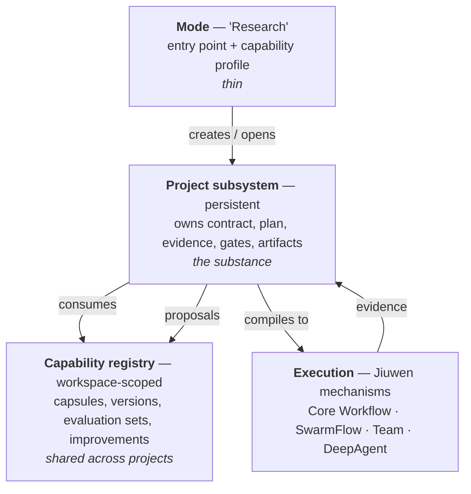

# Product Layers, What Users Select, and Evolution Visibility

> **Revision 4 amendment.** The layer model and the "users select objective and depth, never a
> mechanism" rule both stand. The product framing is sharpened: AI4RnD is a **first-class
> application surface** on the JiuwenSwarm platform — a persistent project subsystem with its own
> semantic control plane, capability registry and governed evolution loop — not "a mode". Ownership
> counts across all 142 outcomes: 118 semantically owned by AI4RnD Core, 19 by JiuwenSwarm
> Application, 4 External/New, 1 Unresolved. See
> [20-feature-implementation-ownership.md](20-feature-implementation-ownership.md).


The question Revision 2 never asked: **what kind of product is AI4RnD?**

---

## 1. What kind of product is AI4RnD?

**Answer: a mode that opens a persistent project subsystem.** Neither a mode alone nor a
separate application.

### What "mode" means here

In JiuwenSwarm a mode is an **agent assembly profile**: `mode` and `sub_mode` select which
rails, tools and sub-agents are folded into the member spec, and `AgentManager` caches agents
by `(mode, sub_mode, project_dir)`. Existing modes: `plan`, `performance`, `team`, plus
`code.team` and `team.plan`.

So a mode is an *entry point and capability profile*, not a subsystem. Choosing "AI4RnD mode"
gives you an agent that knows about research projects. It does not by itself give you a
research project that outlives the conversation.

### Why AI4RnD cannot be only a mode

Against the 142-feature product, a mode cannot hold:

- state that outlives a session (projects run for days; sessions get compacted and rewound)
- an evidence ledger that must survive `/compact` and session rewind
- a capability registry shared across projects
- an improvement loop whose subject is *the system*, not *this conversation*
- multiple concurrent runs against one project

### Why it should not be a separate application either

Revision 2 proposed a standalone service reached through a Rail plugin. Re-earned against the
evidence, that now over-isolates:

- users would leave JiuwenSwarm's channels, session and skills to use it
- research steps would execute outside the permission engine and sandbox
- it duplicates workflow, admission, journal and checkpoint machinery
  ([17](17-taskgraph-verdict.md))

### The answer: layered



**AI4RnD is: a mode, plus a persistent project subsystem, plus a workspace-level capability
registry.** The mode is the doorway. The project is the product. The registry is what makes it
improve.

---

## 2. What should users actually select?

The four dimensions in the brief, resolved.

| Dimension | Visibility | Rationale |
|---|---|---|
| **Product / mode** | **user-selected** | Same shelf as chat / code / team. One new entry: *Research*. |
| **Research objective** | **user-selected** | This is the real choice: literature review · evidence audit · research-to-POC · benchmark · full R&D lifecycle · custom. It maps to which workflow lanes run and which gates apply. |
| **Thoroughness** | **user-selected, three presets + custom** | quick / standard / deep, matching AI4RnD's existing depth tiers. Sets source targets, gate thresholds and budget ceilings. |
| **Internal execution mechanism** | **read-only diagnostic** | Core Workflow vs SwarmFlow vs Team vs DeepAgent is a compiler decision, not a user preference. |

### Why execution mechanism must not be user-facing

Three reasons, each evidenced:

1. **Jiuwen already treats it as internal.** SwarmFlow is a config flag inside team mode
   (`modes.team.jiuwen_team.enable_swarmflow`), and its phases are converted into `team.task` /
   `team.member` events so the *existing* team UI renders them
   (`team_helpers.py:2159-2288`). Upstream deliberately hides it.
2. **"Auto Route" is already a mechanism, not a mode.** `WorkflowController.intent_detection`
   and `_detect_workflow_via_llm` select a registered workflow by intent. Surfacing it as a
   user choice would expose an implementation detail as a product concept.
3. **The choice is derivable.** Shape known ahead → Core Workflow. Data-dependent fan-out →
   SwarmFlow. Genuinely open-ended → Team. A user cannot make that judgement better than the
   compiler, and a wrong choice degrades results silently.

### Expert overrides — narrow and honest

| Override | Allowed? | Form |
|---|---|---|
| Pin a step to a specific runner | **yes** | per-step in the plan inspector |
| Force a compilation target | **yes, with a warning** | project setting, off by default; a footgun, and labelled as one |
| Adjust gate thresholds | **yes** | thoroughness → custom |
| Disable a gate | **no** | gates are the product |
| Edit the compiled workflow | **no** | edit the plan; recompile |

---

## 3. The ten layers

| # | Layer | Owner | Mechanism |
|---|---|---|---|
| 1 | **Product surface** | JiuwenSwarm | Research mode in the existing mode picker; project list; all 9 IM channels + web + TUI + desktop |
| 2 | **Project / control plane** | **AI4RnD** | persistent project record: contract, plan, run history, evidence, gates, artifacts, budget. Hosted on `NativeHarness` (start/stop/pause/abort/subscribe) |
| 3 | **Logical plan** | **AI4RnD** | semantic DAG — questions, dependencies, `required_capabilities`, `write_scope`, `acceptance`, `evidence_required`, `gate_refs`, `capsule_ref`. Artifact, not runtime |
| 4 | **Execution compilation** | **AI4RnD–Jiuwen Integration** | plan → Core Workflow / SwarmFlow script / Team excursion / code mode |
| 5 | **Workers / runners** | JiuwenSwarm + openjiuwen | DeepAgent members, sub-agents, tools, MCP, API models — selected by AI4RnD's capability router (~150 LOC) |
| 6 | **Evidence & evaluation** | **AI4RnD** | evidence ledger, claim graph, citation spans, 6 evaluator families, gate ledger with writer attribution |
| 7 | **Capability registry** | **AI4RnD** | capsules with contract / effects / verification / operator_compatibility; versions; guard capsules |
| 8 | **Evolution governance** | **AI4RnD** governance over **openjiuwen** machinery | proposal + approval + promotion/rollback over `Trainer`/`Updater`/`Operator`/`EvolutionStore` — [18](18-evolution-governance.md) |
| 9 | **Persistence** | split — §6 below | session store (JW) · project store (AI4RnD) · checkpoint/journal (openjiuwen) |
| 10 | **Observability** | JiuwenSwarm surfaces, AI4RnD data | project view, plan inspector, evidence browser, gate dossier, improvements inbox |

---

## 4. Capability Capsules — how they integrate

**Verdict: a capsule is a registry record that references Jiuwen resources and adds an
execution policy around them.** Not a Harness element, not a workflow template.

Why not the alternatives:

| Candidate | Rejected because |
|---|---|
| Specialised Harness element | Harness elements are *construction* descriptors resolved at agent-assembly time. Capsules must be selectable per *step*, versioned independently, and carry verification — none of which the element manifest models. And inclusion is gated by hardcoded `config_specs.py` lists [E-J05]. |
| Workflow template | A capsule may bind a workflow, but also skills, tools, teams and evaluators. Template is too narrow. |
| Duplicate of Jiuwen's resource registry | Jiuwen registers *resources* (tools, workflows, skills). A capsule adds contract, effects, verification, compatibility and guards. It **references** the resource registry rather than replacing it. |

### Binding table

| Capsule binds | Resolves to | Mechanism |
|---|---|---|
| Skills | installed JiuwenSwarm skills | `bindings.skills` → `SkillManager` |
| Swarm Skills | team-scoped skills | `swarm.member_skill_toolkit` |
| Core Workflows | registered `WorkflowCard`s | `_find_workflow_by_id` |
| SwarmFlow scripts | script path + `META` | `load_workflow_meta` |
| Tools | ability-manager tools | `add_ability` [V-2] |
| Agents / teams | `DeepAgentSpec` / `TeamAgentSpec` | team assembly |
| Logical step / runner | AI4RnD plan node + capability router | AI4RnD |
| Evaluators | gate ids | `verification.external_verifier` |
| Evidence requirements | proof obligations | `verification.pass_conditions` |
| Permissions & effects | `effects.{read,write,execute,network,cost}` | router admission check |
| Compatibility | `composition.{compatible_with,incompatible_with,requires_after}`, `operator_compatibility.{preferred,forbidden}` | compiler + router |
| Versions & guards | `version`, `bindings.required_guard_capsules` | registry |

**The mechanism that matters:** `effects` and `operator_compatibility` are consulted at
*binding time* by the capability router. A capsule declaring `effects.network: none` cannot be
bound to a network-capable runner. That is enforcement by construction, and it is the thing no
Jiuwen abstraction provides.

---

## 5. UX proposal

### Normal user — starting work

```
[ Research ▾ ]                                    ← mode picker, alongside Chat / Code / Team

  What do you want to find out?
  ┌──────────────────────────────────────────────┐
  │ Is retrieval-augmented fine-tuning worth      │
  │ adopting for our support assistant?           │
  └──────────────────────────────────────────────┘

  Objective    ( ) Literature review
               ( ) Evidence audit
               (•) Research → POC
               ( ) Benchmark
               ( ) Full R&D lifecycle
               ( ) Custom

  Depth        ( ) Quick ~3-5 sources
               (•) Standard ~10-20 sources
               ( ) Deep 50+ sources
               ( ) Custom budgets & gates

                                      [ Start project ]
```

Two choices. No mention of Core Workflow, SwarmFlow, Dynamic Team or Auto Route.

### Project view

```
Project: RAFT for support assistant          ● running   day 2 of ~4
─────────────────────────────────────────────────────────────────
Contract    v3 · confirmed 2026-07-27 · 4 acceptance criteria
Budget      $18.40 / $50 · 1.2M tokens

Plan  ▸ 24 steps · 18 passed · 3 running · 2 blocked · 1 stalled

  ⚠ 1 step stalled — no runner provides `benchmark_execution`
     Step 19 · "Run latency benchmark vs baseline"
     Missing capability: benchmark_execution
     [ Add a runner ]  [ Skip this step ]  [ Change plan ]

Evidence    142 items · 38 claims · 31 verified · 5 qualified · 2 contradicted
Gates       6 of 8 passed · CitationSpanGate failed → repair running (attempt 2/3)

[ Plan ]  [ Evidence ]  [ Gates ]  [ Artifacts ]  [ Activity ]  [ Settings ]
```

Honest-state rules preserved: a stalled step shows as stalled with its raw reason token, and
never as progress.

### Plan inspector — where diagnostics live

```
Step 12  Extract evidence from 14 sources                    ✓ passed

  Why            Answers Q3 "What latency penalty does RAFT impose?"
  Capsule        cap.evidence-extractor v1.4
  Capabilities   evidence_extraction ≥3, long_context ≥2
  Write scope    evidence/ (exclusive)
  Acceptance     ≥1 span per claim; spans verify at char+byte offsets
  Ran on         teammate-2 (claude-sonnet) · 4m12s · $0.82

  ▾ Diagnostics                                    ← read-only, collapsed
    Compiled to  SwarmFlow  (data-dependent fan-out over 14 sources)
    Run id       sf_9c21… · journal hits 3/14 on resume
    Gate ledger  3 records
```

Execution mechanism appears exactly here: as a diagnostic, collapsed, explaining *why* that
target was chosen.

### Capabilities & Improvements inbox

Workspace-level, outside any project — see
[18 §6](18-evolution-governance.md#6-where-improvement-lives-and-how-users-see-it).

---

## 6. State ownership

| State | Store | Writer | Survives restart |
|---|---|---|---|
| Chat / session | JiuwenSwarm session store | AgentServer | yes |
| Session ↔ project link | session metadata (`project_id`) | AI4RnD mode rail | yes |
| **Project record** (contract, budget, status) | AI4RnD project store (SQLite) | AI4RnD control plane | yes |
| **Logical plan** (versioned artifact) | AI4RnD project store | AI4RnD planner | yes |
| Compiled workflow / script | project store + generated file | AI4RnD compiler | yes |
| **Runtime graph state** | openjiuwen `Checkpointer` / `Storage` | Pregel / Workflow | **yes if a persistent KV backend is configured** — Q24 |
| **Journal (idempotent replay)** | SwarmFlow WAL + journal file | SwarmFlow engine | yes |
| Worker execution state | openjiuwen session / team state | DeepAgent | yes |
| **Evidence / claims / citations** | AI4RnD evidence store | AI4RnD step wrapper | yes |
| **Gate ledger** | append-only JSONL per project | AI4RnD evaluators | yes |
| Artifacts | project artifact tree, content-hashed | AI4RnD | yes |
| **Capsule registry** | workspace-level, versioned | AI4RnD registry | yes |
| Evaluation sets | workspace-level | AI4RnD + harvested hard cases | yes |
| **Improvement proposals** | workspace-level | AI4RnD governance | yes |
| Promoted versions | capsule registry + `EvolutionStore` | AI4RnD governance | yes |
| Rollback history | capsule registry + `store_archive` | AI4RnD governance | yes |

**Invariants.**
1. Evidence never lives in the session — `/compact` and rewind must not touch it.
2. The gate ledger is append-only; node status is a projection, never written directly.
3. A project survives session deletion. Deleting a project is a separate, explicit action.
4. In-flight runs pin capsule versions, so a promotion cannot change a running project's
   behaviour mid-flight.

---

## 7. Who starts, stores, cancels and approves

Plain language, as requested.

| Action | Who |
|---|---|
| **Starts work** | The user, from Research mode. The project control plane then starts runs; a schedule or an improvement proposal can also start one. |
| **Stores state** | AI4RnD stores meaning (plan, evidence, gates, capsules). openjiuwen stores execution (checkpoints, journal). JiuwenSwarm stores conversation. |
| **Cancels** | The user, from the project view. It propagates: control plane marks the run cancelled → SwarmFlow `_check_abort` stops at the next primitive → `NativeHarness.abort` stops the agent. Completed steps stay in the journal, so a later restart resumes rather than repeats. |
| **Approves changes** | For research results: gates decide, and a human verdict is required for high-risk classes. For capability changes: the Improvements inbox — automatic only for low-risk, human for medium and high, blocked if a frozen policy would be relaxed. |

---

## 8. What this means for the earlier recommendation

Revision 2's "separate durable service + Rail plugin + execution callback" is **partly
superseded**:

| Revision 2 | Revision 3 | Why |
|---|---|---|
| Separate service, own scheduler | in-process project subsystem compiling to Jiuwen mechanisms | the scheduler was duplication [17] |
| Reached only through tools | a first-class mode + project surface | a tool call cannot host a multi-day project |
| Execution callback into JiuwenSwarm | direct compilation to Core Workflow / SwarmFlow | the callback existed to solve a problem the compiler removes |
| RSI as an AI4RnD-only loop | AI4RnD governance over openjiuwen `Trainer`/`Updater` | most of the loop already exists [18] |

**What survives:** AI4RnD owns meaning and verification; JiuwenSwarm owns execution and
interaction; evidence never enters the session; writer≠verifier is enforced AI4RnD-side.

The boundary moved. The principle did not.
