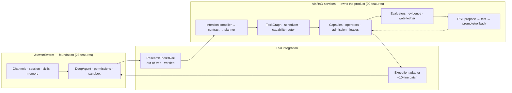

# AI4RnD on JiuwenSwarm — Architecture Evaluation (Revision 2)

**Question.** Can the *complete intended* AI4RnD product be built using JiuwenSwarm as its
foundation?

**Verdict. Yes — as an execution and interaction substrate only, and only if AI4RnD's
foundation plane stays AI4RnD-owned.** JiuwenSwarm fully covers 20 of the 142 intended
features and covers none of 72. It supplies the substrate (channels, agent loop, tool
execution, permissions, sandbox, memory, packaging) and essentially nothing of the layer that
gives AI4RnD its identity (Capability Capsules, logical/physical Operators, TaskGraph,
evaluators, evidence, RSI). The recommended architecture is a **hybrid**: JiuwenSwarm as the
interaction and execution foundation, AI4RnD-owned services for everything else.

**What would change the verdict** is listed in
[08 §8](08-recommended-architecture.md#8-evidence-that-would-change-the-recommendation) —
principally whether a bounded, cancellable execution callback works against a live
`DeepAgent`, and whether an out-of-tree Rail survives restart. Both are testable in the first
three weeks, before any commitment.

---

## What is new in Revision 2

Revision 1 compared two repositories as they existed. This revision evaluates against the
**complete intended product** defined by `AI4RnD Feature List.xlsx` (142 Level-2 features),
the architecture specifications, and dormant/unwired code — and it **executes both systems**
rather than reading them.

| | Revision 1 | Revision 2 |
|---|---|---|
| Target | AI4RnD as it exists | 142-feature intended product |
| Execution | none | 2,816 + 556 tests run; 14 experiments |
| AI4RnD model | "research report generator with an evidence ledger" | automated R&D organisation: 9 workflow lanes, 10 foundation groups, 6 verticals |
| Capsules | dismissed as ≈ skills | **formal 11-section contract**; 30 registered, 23 validated |
| RSI | "largely aspirational" | **GEPA: 3,540 LOC, full promote/rollback lifecycle** — unwired |
| Grounding quality | unknown (open spike) | **measured: precision 0.25** |
| Permission engine | cited as a strength | **built-in rules load 0 in a stock install** |

Twelve specific corrections are tabulated in
[12 §Summary](12-verification-appendix.md#summary-of-corrections-to-the-previous-revision).

---

## Document set

| # | Document | Contents |
|---|---|---|
| **00** | [Intended product model](00-intended-product-model.md) | What AI4RnD is meant to be: 142 features, the Capsule→Contract→Operator stack, the RSI loop, unsettled design questions |
| 01 | [JiuwenSwarm architecture](01-jiuwenswarm-architecture.md) | Current state, corrected by execution |
| 02 | [AI4RnD architecture](02-ai4rnd-architecture.md) | Current state, including dormant and unwired components |
| 03 | [Workflow traces](03-workflow-traces.md) | Entry → planning → routing → execution → state → verification → recovery |
| 04 | [Component comparison](04-component-comparison.md) | Component-by-component verdicts |
| 05 | [Capability matrix](05-capability-matrix.md) | Provided / partial / extensible / needs-internals / missing |
| 06 | [Integration challenges](06-integration-challenges.md) | Conflicts, blockers, security implications |
| 07 | [Architecture options](07-architecture-options.md) | **Seven** options compared against the full product |
| 08 | [Recommended architecture](08-recommended-architecture.md) | Target design, ownership, the RSI feedback loop |
| 09 | [Staged path](09-implementation-plan.md) | 8 stages, exit gates, decision points |
| 10 | [Risks & open questions](10-risks-assumptions-open-questions.md) | Unresolved items, assumptions, conflicting evidence |
| 11 | [Evidence appendix](11-evidence-appendix.md) | Source references |
| **12** | [Verification appendix](12-verification-appendix.md) | **Commands and results — 14 experiments** |
| **13** | [Maturity map](13-maturity-map.md) | Active / unwired / scaffold / spec / absent, both sides |
| **14** | [Reuse-vs-build map](14-reuse-vs-build-map.md) | Where each of the 142 features comes from |
| — | [142-feature traceability matrix](traceability/142-feature-matrix.md) · [CSV](traceability/142-feature-matrix.csv) | Row-by-row |
| — | [Diagrams](diagrams/README.md) | Full diagram set |

---

## Systems analysed

| System | Repository | Commit / state |
|---|---|---|
| JiuwenSwarm | `suraj-subrahmanyan/jiuwenswarm` (fork of `openJiuwen-ai/jiuwenswarm`) | `a98d7ad`, branch `develop` |
| openjiuwen | PyPI `openjiuwen==0.1.15.post3` | installed and inspected — **new in Rev 2** |
| AI4RnD | `Stellven/AI4Research` | `d35c511`, branch `openJiuwen-Solar` |
| AI4RnD specs | `Stellven/AI4Research-A` | docs only |
| AI4RnD artifacts | `Stellven/AI4Research-B` | run records |
| Feature list | `AI4RnD Feature List.xlsx` | 3 sheets, 142 Level-2 rows |

---

## The numbers

**Intended product** — 142 Level-2 features: Workflow 54 · Foundation 65 · Vertical 23.

**AI4RnD maturity**

| ACTIVE | IMPL-UNWIRED | SCAFFOLD | SPEC | ABSENT |
|---|---|---|---|---|
| 68 | **27** | 21 | 16 | 10 |

**JiuwenSwarm coverage**

| FULL | PARTIAL | NONE |
|---|---|---|
| 20 | 50 | **72** |

**Disposition**

| PORT | BUILD | REUSE-JW | ADAPT | DEFER |
|---|---|---|---|---|
| 69 | 27 | 23 | 21 | 2 |

**63% of the complete product comes from AI4RnD's existing code** (69 port + 21 adapt).
JiuwenSwarm supplies 16% directly. 19% is green field.

---

## Seven findings that drive the recommendation

1. **JiuwenSwarm covers none of 72 features (51%).** Every workflow lane after ingestion and
   almost the whole foundation plane is partial or absent. It is a substrate, not a platform
   for this product. ([14](14-reuse-vs-build-map.md))

2. **Capability Capsules are not renamed skills — verified by execution.** The schema requires
   11 sections including `contract` (pre/postconditions, invariants), `effects`
   (read/write/execute/network/cost), `verification`, `operator_compatibility` and
   `composition`. 30 capsules load; 23 manifests validate; 0 invalid. `bindings.skills` shows
   a skill is an *ingredient* of a capsule. ([V-11](12-verification-appendix.md#v-11--capability-capsules-execute-and-validate-))

3. **19 AI4RnD modules (~8,000 LOC) are implemented, tested and unwired.** Including the whole
   capsule layer, the operator registries, a durable actor model (registry + leases +
   mailboxes) that closes JiuwenSwarm's Harness-Core gaps, and GEPA. Treating these as
   "to build" over-estimates cost; treating them as working over-claims.
   ([V-8](12-verification-appendix.md#v-8--ai4rnd-module-maturity-by-execution-))

4. **AI4RnD's citation grounding does not verify grounding.** Measured precision **0.25**,
   unsupported-claim detection **0.14**. The check is `ok = bool(token_intersection)` — one
   shared word passes. *"Bananas are yellow and grow in tropical climates"* is reported
   grounded against a FlashAttention abstract, on the token "and". No entailment machinery
   exists anywhere in the codebase. This moves real entailment from late hardening to Stage 1.
   ([V-12](12-verification-appendix.md#v-12--citation-grounding-quality--measured--decisive))

5. **JiuwenSwarm's built-in security rules load zero rules in a stock install.** openjiuwen
   0.1.15.post3 reads them only from an in-package path that does not exist in the wheel;
   JiuwenSwarm writes its copy to a user directory the pinned version no longer consults.
   With a permissive baseline, `rm -rf /`, `mkfs.ext4 /dev/sda` and `sudo su` all return
   ALLOW. Revision 1 cited this layer as a strength.
   ([V-4](12-verification-appendix.md#v-4--permission-engine--built-in-rules-do-not-load--new-finding))

6. **JiuwenSwarm cannot express per-operator permissions.** Exactly two member roles
   (`leader`, `teammate`) with a single global permission policy. AI4RnD's four named agents
   and its per-operator governance do not map onto it, so writer≠verifier must be enforced in
   AI4RnD's router rather than delegated.
   ([V-6](12-verification-appendix.md#v-6--per-member-permissions-and-roles))

7. **The integration seam is proven, and the substrate is healthy.** An out-of-tree Rail
   registers a tool, resolves it, invokes it (`evidence_for::C014`) and cleanly removes it.
   JiuwenSwarm's suite runs **2,816 passed, 0 failed**.
   ([V-2](12-verification-appendix.md#v-2--can-an-out-of-tree-rail-register-and-invoke-an-ability-), [V-7](12-verification-appendix.md#v-7--jiuwenswarm-test-suite))

---

## Recommended architecture at a glance

| Owner | Concerns |
|---|---|
| **JiuwenSwarm** | channels, session, skills, memory, tool execution, permissions, sandbox, packaging, UI |
| **AI4RnD** | capsules, operators, TaskGraph, scheduling, routing, admission, leases, evaluators, evidence, gate ledger, RSI, all workflow lanes |

*JiuwenSwarm decides how a unit of work is safely executed. AI4RnD decides what work exists,
who may do it, whether the result is true, and what the system should learn.*

**Timeline:** ~2.5 months to first trustworthy user value; ~19–20 months to substantial
completeness. **Stages 0–3 (33 weeks, ~56 features) need no JiuwenSwarm core changes** — the
architecture can be abandoned at that boundary with all AI4RnD work intact.

---

## Reading the evidence

Claims carry tags — `[E-Jxx]` / `[E-Axx]` resolve in
[11-evidence-appendix.md](11-evidence-appendix.md); `V-n` refers to a verification experiment
in [12-verification-appendix.md](12-verification-appendix.md). Every claim is labelled:

- **EXEC** — executed here, with commands and output reproduced
- **SRC** — read in source at the stated commit
- **DOC** — documented but not independently confirmed
- **INF** — inferred, with the inference stated

Across the 142-row matrix: **70 features rest on executed evidence, 70 on source reading, 2
on documentation.**

The largest remaining gap is that no live JiuwenSwarm agent was driven end to end — that
requires model credentials, which the safeguards excluded. Spikes G1 and G2 in
[Stage 0](09-implementation-plan.md#stage-0--close-the-remaining-spikes-3-weeks) close it.
