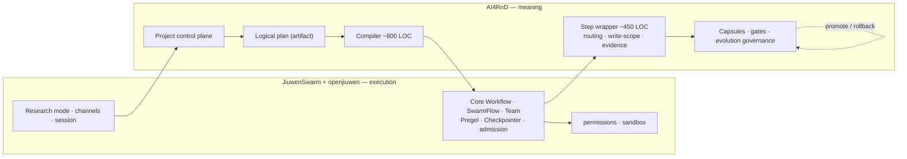

# AI4RnD on JiuwenSwarm — Architecture Evaluation (Revision 3)

**Question.** What is the best way to build the complete intended AI4RnD product using
JiuwenSwarm / openJiuwen as its foundation?

**Answer. AI4RnD is a mode, plus a persistent project subsystem, plus a workspace capability
registry — and it writes no scheduler.**

Revision 3 reopened the decision after inspecting parts of openjiuwen that earlier revisions
never opened. openjiuwen contains a Pregel graph engine, a workflow engine, SwarmFlow
(deterministic, journalled, resumable), admission control, and a complete self-evolution
framework. Revision 2 recommended porting ~5,200 LOC of scheduler, queue and lease code that
already exists one layer down.

**The corrected shape:** AI4RnD owns *meaning* — the logical research plan, capability routing,
evidence, gates, capsules and evolution governance. Jiuwen owns *execution* — readiness,
batching, checkpointing, resume, admission, background work and cancellation. A compiler
(~800 LOC) turns the plan into a SwarmFlow script or a Core Workflow. The only AI4RnD runtime
code is a ~450-LOC step wrapper.

| | Revision 2 | Revision 3 |
|---|---|---|
| Shape | separate service with its own scheduler | mode → project subsystem → compiles to Jiuwen |
| AI4RnD runtime code | ~5,200 LOC ported | **~450 LOC** |
| RSI surfaces to build | 6 of 8 | **1 of 8** |
| JiuwenSwarm coverage of 142 features | 20 FULL / 72 NONE | **23 FULL / 62 NONE** |
| Time to complete product | ~19–20 months | **~12–14 months** |

Full account: **[15-correction-log.md](15-correction-log.md)**.

---

## Start here

| Read this | For |
|---|---|
| **[15 Correction log](15-correction-log.md)** | what changed and why |
| **[16 Jiuwen execution mechanisms](16-jiuwen-execution-mechanisms.md)** | the bottom-up map earlier revisions lacked |
| **[17 TaskGraph verdict](17-taskgraph-verdict.md)** | custom scheduler vs Core Workflow / SwarmFlow |
| **[19 Product layers & UX](19-product-layers-and-ux.md)** | what kind of product this is, and what users select |
| **[08 Recommended architecture](08-recommended-architecture.md)** | the target |

---

## Document set

| # | Document | Contents |
|---|---|---|
| 00 | [Intended product model](00-intended-product-model.md) | 142 features; Capsule→Contract→Step stack; RSI scope |
| 01 | [JiuwenSwarm architecture](01-jiuwenswarm-architecture.md) | current state, corrected by execution |
| 02 | [AI4RnD architecture](02-ai4rnd-architecture.md) | current state incl. dormant and unwired code |
| 03 | [Workflow traces](03-workflow-traces.md) | entry → planning → routing → execution → verification |
| 04 | [Component comparison](04-component-comparison.md) | component-by-component verdicts |
| 05 | [Capability matrix](05-capability-matrix.md) | provided / partial / extensible / missing |
| 06 | [Integration challenges](06-integration-challenges.md) | conflicts and blockers |
| 07 | [Architecture options](07-architecture-options.md) | **rewritten** — 8 options as (entry, control plane, execution) triples |
| 08 | [Recommended architecture](08-recommended-architecture.md) | **rewritten** — ten layers, ownership, RSI loop |
| 09 | [Staged path](09-implementation-plan.md) | **rewritten** — 7 stages, ~14 months |
| 10 | [Risks & open questions](10-risks-assumptions-open-questions.md) | incl. Revision 3 reversals |
| 11 | [Evidence appendix](11-evidence-appendix.md) | source references |
| 12 | [Verification appendix](12-verification-appendix.md) | **19 experiments**, commands and results |
| 13 | [Maturity map](13-maturity-map.md) | active / unwired / scaffold / spec / absent |
| 14 | [Reuse-vs-build map](14-reuse-vs-build-map.md) | per-feature sourcing |
| **15** | [**Correction log**](15-correction-log.md) | what Revision 2 got wrong |
| **16** | [**Jiuwen execution mechanisms**](16-jiuwen-execution-mechanisms.md) | bottom-up map of all five graph/state mechanisms |
| **17** | [**TaskGraph verdict**](17-taskgraph-verdict.md) | definitive answer on custom scheduler vs reuse |
| **18** | [**Evolution governance**](18-evolution-governance.md) | governed RSI loop over `agent_evolving` |
| **19** | [**Product layers & UX**](19-product-layers-and-ux.md) | product model, user controls, state ownership |
| — | [142-feature matrix](traceability/142-feature-matrix.md) · [CSV](traceability/142-feature-matrix.csv) | row-by-row |
| — | [Diagrams](diagrams/README.md) | 27 diagrams |
| — | [`ai4rnd-architecture-review.html`](ai4rnd-architecture-review.html) | single-page review artifact |

---

## The seven findings that drive Revision 3

1. **openjiuwen has a durable DAG engine.** Pregel supersteps, channel `snapshot`/`restore`,
   `BarrierMessage`, `GraphInterrupt`, `_is_resume`, plus `Checkpointer`/`Storage`.
   ([V-15](12-verification-appendix.md))

2. **SwarmFlow is a deterministic, journalled, resumable workflow engine.** Scripts are ordinary
   Python with a pure-literal `META`; the loader bans `time`/`random`/`uuid`/`datetime.now`
   because a WAL-backed `Journal` memoises calls by signature and replays on resume. Admission
   control, background execution, pause/resume and abort come with it.
   ([V-16](12-verification-appendix.md))

3. **openjiuwen has a self-evolution framework.** `Operator` tunable handles with freeze
   markers, `Case`/`EvaluatedCase` datasets, `exact_match` + `llm_as_judge` metrics, `Trainer`
   with candidate selection on a validation set, snapshot/restore rollback, `Updater` with
   multi-dimensional credit assignment, and PPO-based RL. Revision 2 said six of eight RSI
   surfaces were absent from both systems; **one is.**
   ([V-17](12-verification-appendix.md))

4. **"Operator" means opposite things in the two systems.** openjiuwen: *"Operator is NOT an
   executable unit"* — it is a tunable-parameter handle. AI4RnD: an executable work unit.
   Revision 3 renames AI4RnD's to **Step** and **Runner**. ([V-18](12-verification-appendix.md))

5. **Execution mechanism must never be a user choice.** SwarmFlow is already a config flag
   inside team mode, with phases projected into the existing team UI as `team.task` /
   `team.member`. "Auto Route" is `WorkflowController.intent_detection`. These are internal
   mechanisms; the compiler picks them. ([19 §2](19-product-layers-and-ux.md))

6. **Only three capabilities have no Jiuwen equivalent** — capability routing with honest
   stall, write-scope conflict exclusion, and typed contracts/evidence on nodes. They are worth
   ~450 LOC, not ~5,200. ([16 §9](16-jiuwen-execution-mechanisms.md))

7. **A mode alone cannot hold the product.** A JiuwenSwarm mode is an agent assembly profile
   cached by `(mode, sub_mode, project_dir)`. It cannot own multi-day state, an evidence ledger
   that survives `/compact`, or a cross-project capability registry. Hence mode **plus**
   project subsystem **plus** registry. ([19 §1](19-product-layers-and-ux.md))

---

## Recommended architecture at a glance

*JiuwenSwarm and openjiuwen decide how work runs safely. AI4RnD decides what work exists, who
may do it, whether the result is true, and what the system learns.*

**~4.5 months to first trustworthy user value; ~14 months to substantial completeness.** No
core-tree change is required at any stage.

---

## The three cheapest experiments that could disprove this

| # | Experiment | Cost | Disproves |
|---|---|---|---|
| **F2** | Build a Core Workflow conditional router returning a runtime-computed `list[Hashable]` and run it | ~1 day | that AI4RnD plans compile to Core Workflow |
| **F4** | Compile three real AI4RnD plans to SwarmFlow scripts and run `load_workflow_source` | ~1 day | that the determinism lint is compatible with research |
| **Q27** | Register a non-agent subject (a capsule) as an openjiuwen `Operator` and run `Trainer.train` on it | ~2 days | that RSI can be reused rather than rebuilt |

If F2 **and** F4 both fail, the recommendation reverts toward Revision 2's separate service.
If Q27 fails, Stage 5 grows from 8 weeks back toward 16.

---

## Reading the evidence

`V-n` refers to a verification experiment in
[12-verification-appendix.md](12-verification-appendix.md); `[E-Jxx]` / `[E-Axx]` to source
references in [11-evidence-appendix.md](11-evidence-appendix.md). Claims are labelled **EXEC**
(executed here), **SRC** (source-read), **DOC** (documented), **INF** (inferred).

Across the 142-row matrix: **74 features rest on executed evidence, 66 on source reading, 2 on
documentation.**

Not executed, and why: no live agent conversation, no real model call, no sandbox enforcement
test — all require credentials or kernel privileges the safeguards exclude. Stage 0 closes the
remaining gaps.
