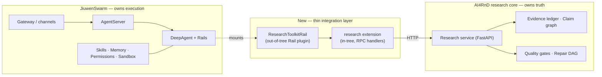

# AI4RnD on JiuwenSwarm — Architecture Evaluation

**Question asked:** can AI4RnD be built on top of JiuwenSwarm, using JiuwenSwarm as the
foundation?

**Short answer:** yes for the *execution substrate*, no for the *research core*. JiuwenSwarm
is a credible foundation for agent execution, tool governance, multi-agent teaming, skills,
memory, sandboxing and channels. It provides none of AI4RnD's defining research machinery —
evidence ledger, claim graph, citation-span verification, quality gates, repair DAGs — and
its extension surface is too narrow to host that machinery without in-tree changes. The
recommended target is a **hybrid**: keep AI4RnD's research core as a standalone Python
service, and integrate it into JiuwenSwarm through a thin in-tree extension plus a Rail-based
toolkit. Detail in [08-recommended-architecture.md](08-recommended-architecture.md).

---

## Document set

| # | Document | Contents |
|---|---|---|
| 01 | [JiuwenSwarm architecture](01-jiuwenswarm-architecture.md) | Components, execution model, agent/worker model, orchestration, tools/skills, memory, verification, extension points, security |
| 02 | [AI4RnD architecture](02-ai4rnd-architecture.md) | Same axes for AI4RnD, plus the research pipeline and evidence model |
| 03 | [Workflow traces](03-workflow-traces.md) | Work entry → planning → worker selection → tool execution → state → verification → failure/cancel/recovery, for both systems |
| 04 | [Component comparison](04-component-comparison.md) | Component-by-component mapping, reuse / adapt / rewrite / conflict verdicts |
| 05 | [Capability & compatibility matrix](05-capability-matrix.md) | Provided / partial / extensible / needs-internals / missing-from-both |
| 06 | [Integration challenges](06-integration-challenges.md) | Conflicts, blockers, security and reliability implications |
| 07 | [Architecture options](07-architecture-options.md) | Six options compared on cost, risk, upstream exposure |
| 08 | [Recommended architecture](08-recommended-architecture.md) | Target design, ownership boundaries, rationale |
| 09 | [Staged implementation plan](09-implementation-plan.md) | Stages, exit criteria, required evidence |
| 10 | [Risks, assumptions, open questions](10-risks-assumptions-open-questions.md) | Everything unresolved, with impact on conclusions |
| 11 | [Evidence appendix](11-evidence-appendix.md) | Source-code references backing every claim |
| — | [Diagram index](diagrams/README.md) | All required diagrams (Mermaid) |

---

## Systems in scope

| System | Repository analysed | Commit at analysis time |
|---|---|---|
| JiuwenSwarm | `suraj-subrahmanyan/jiuwenswarm` (fork of `openJiuwen-ai/jiuwenswarm`) | `a98d7ad`, branch `develop` |
| AI4RnD (implementation) | `Stellven/AI4Research` | `d35c511`, branch `openJiuwen-Solar` |
| AI4RnD (Pipeline A spec) | `Stellven/AI4Research-A` | docs-only repository |
| AI4RnD (Pipeline B artifacts) | `Stellven/AI4Research-B` | run-artifact repository |

**Naming note.** The task names the second system "AI4RnD". No repository, package, or
source identifier uses that string. The identifier resolves to the `Stellven/AI4Research*`
family, whose implementation repository self-describes as "OpenJiuwen Solar". This document
set uses **AI4RnD** for the system as a whole and **Solar harness** when referring
specifically to the shell/Python runtime in `AI4Research/harness/`. See
[10-risks-assumptions-open-questions.md](10-risks-assumptions-open-questions.md) §A1.

---

## Scale

Measured from the working trees at the commits above.

| Metric | JiuwenSwarm | AI4RnD |
|---|---|---|
| Python | ~340k LOC, 1,033 files | ~534k LOC |
| Shell | negligible | ~83k LOC |
| Primary language of control flow | Python (async, in-process) | Bash (`coordinator.sh`, 5,797 LOC) + Python |
| Largest single file | `interface_deep.py` (8,458) | `lib/symphony/status-server.py` (14,400) |
| Distribution | PyPI package `jiuwenswarm` 0.2.3.beta1 | shell installer into `~/.solar` |
| Licence | Apache-2.0 | Apache-2.0 (harness); vendored components vary |

---

## The five findings that drive the recommendation

1. **JiuwenSwarm has no evidence model.** No evidence ledger, claim graph, citation span,
   entailment check, or factuality gate exists anywhere in the tree. This is AI4RnD's entire
   reason for existing. It must be brought across, not found.
   ([evidence E-J14](11-evidence-appendix.md#e-j14))

2. **JiuwenSwarm's Extension SDK is narrow, and its RPC surface is closed.** `BaseExtension`
   offers `initialize`/`shutdown`; the registry accepts RPC handlers, a crypto provider, an
   agent-server client, and callbacks on six hook events. But an extension's RPC method is
   only reachable from outside the process if it is also added to the `ReqMethod` enum *and*
   a hardcoded frozenset in `interface.py`. Both are core-tree files.
   ([E-J07](11-evidence-appendix.md#e-j07), [E-J08](11-evidence-appendix.md#e-j08))

3. **The Rail plugin system is the real out-of-tree seam.** `RailManager` loads user-authored
   `rail.py` files from `<workspace>/extensions/`, hot-registers them onto a live `DeepAgent`,
   and a Rail's `init(agent)` may call `agent.ability_manager.add_ability(...)` to register
   arbitrary tools. This is enough to expose an external research service to the agent without
   forking. ([E-J09](11-evidence-appendix.md#e-j09), [E-J10](11-evidence-appendix.md#e-j10))

4. **AI4RnD's orchestration layer conflicts with JiuwenSwarm's, and should not be ported.**
   AI4RnD drives agents by typing into tmux panes with `tmux send-keys`, polls the filesystem
   for state changes, and runs its workers with `claude --dangerously-skip-permissions`.
   JiuwenSwarm runs agents in-process with a tiered permission engine and an optional bwrap/
   cgroup sandbox. Porting AI4RnD's dispatcher would regress security and reliability.
   ([E-A05](11-evidence-appendix.md#e-a05), [E-A06](11-evidence-appendix.md#e-a06),
   [E-J12](11-evidence-appendix.md#e-j12))

5. **AI4RnD's verification discipline is stronger and is the thing worth keeping.** Independent
   verifier enforcement (writer ≠ verifier), evidence-required gates, an append-only gate
   ledger with node status as a projection, and citation-grounding metrics have no JiuwenSwarm
   equivalent. JiuwenSwarm's Auto Harness is an *optimisation* loop, not a *correctness* gate.
   ([E-A08](11-evidence-appendix.md#e-a08), [E-A09](11-evidence-appendix.md#e-a09))

---

## Recommendation at a glance

| Concern | Owner |
|---|---|
| Planning (task decomposition, agent teaming) | JiuwenSwarm |
| Research planning (question graph, physical operator plan) | AI4RnD service |
| Tool execution, permissions, sandboxing | JiuwenSwarm |
| Conversational and session state | JiuwenSwarm |
| Evidence, claims, citations, gate verdicts | AI4RnD service |
| Final report assembly and verification | AI4RnD service |
| Delivery to the user | JiuwenSwarm |

---

## How to read the evidence

Every factual claim about either codebase carries an evidence tag such as
`[E-J07]` or `[E-A05]`, resolved in [11-evidence-appendix.md](11-evidence-appendix.md) to a
repository, file path and line range. Claims are labelled:

- **Verified** — read directly in source at the stated commit.
- **Documented** — stated in in-repo documentation but not independently confirmed in source
  (most often because the code lives in the external `openjiuwen` package).
- **Assumption** — inferred; the inference and its blast radius are stated.
- **Proposal** — this analysis's own design suggestion, not an observation.

Nothing in this document set was executed. No test suite was run against either system; the
container had neither system installed and `openjiuwen` (JiuwenSwarm's core agent framework,
a separate PyPI package) is not vendored into the repository. This limits several conclusions
and is recorded in [10-risks-assumptions-open-questions.md](10-risks-assumptions-open-questions.md) §L1.
