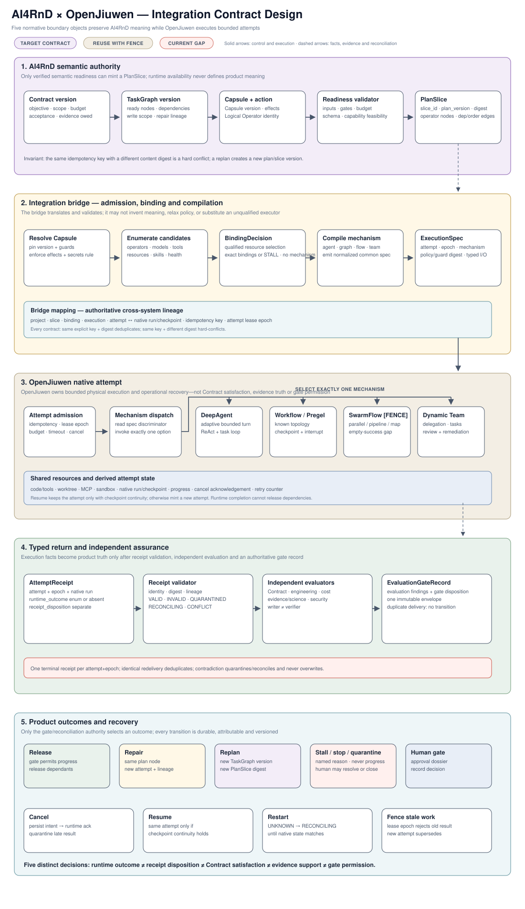

# AI4RnD × OpenJiuwen integration contract design

## Technical summary

The integration is viable only if it is treated as a **typed, fail-closed execution boundary**, not as a loose agent-to-agent hand-off. AI4RnD remains authoritative for the Contract, semantic TaskGraph, Capability Capsules, evidence, evaluation and gates. OpenJiuwen remains authoritative for one bounded physical attempt and its operational recovery. The bridge records the translation between them but cannot silently weaken either side.

Five versioned boundary objects make that separation reviewable:

1. `PlanSlice` — work that AI4RnD has declared semantically ready.
2. `BindingDecision` — the qualified Capsule, Logical Operator and exact execution resources, or an honest stall.
3. `ExecutionSpec` — a normalized common, idempotent attempt specification with an explicit runtime-mechanism discriminator.
4. `AttemptReceipt` — normalized technical facts from one physical attempt.
5. `EvaluationGateRecord` — independent verdicts and the only authority that may release, repair, replan or stop work.

The design deliberately separates five questions: **did the runtime finish, is the receipt valid, does the artifact satisfy the Contract, does evidence support the claim, and may the gate release dependent work?** A “yes” to an earlier question never implies a “yes” to a later one.

The plate is the Level-2 design view. The exact source symbols and probes that justify it remain in the evidence section rather than becoming part of the stakeholder-facing contract.

## Abstraction ladder

| Level | Purpose | Primary material |
|---|---|---|
| 0 — system | who owns product meaning, hosting and execution | canonical high-level architecture |
| 1 — subsystem | how agent turns, orchestration, Capsules, planning, evidence and RSI work | plates 06–10 |
| 2 — contracts | what crosses the integration boundary, who owns it, and how failure is handled | plate 11 and this document |
| 3 — evidence | source files, classes, private functions, line references and probes | adversarial review and source-material appendices |

The contract level is intentionally specific about identity, state and failure while remaining independent of private implementation structure.

## The complete round trip

1. AI4RnD validates semantic readiness against the confirmed Contract, current TaskGraph version, Capsule version, Logical Operator requirements, budget and gate state.
2. It mints an immutable `PlanSlice`. Changing its content creates a new digest and version; reusing its idempotency key with a different digest is a hard conflict.
3. The bridge resolves the Capsule and guard/resource requirements, enumerates candidate Physical Operators and models, records every rejection, then mints either an exact `BindingDecision` or `STALL`.
4. The compiler turns the qualified slice and binding into an `ExecutionSpec`. It chooses an OpenJiuwen mechanism but does not change the plan’s meaning.
5. OpenJiuwen admits and runs one attempt. Its checkpoint, journal, task database and session state are operational state, not semantic completion evidence.
6. The bridge normalizes the native outcome into an `AttemptReceipt`. Null results, malformed results, missing required artifacts, wrong policy digests and stale lease epochs are rejected.
7. Independent evaluators check receipt conformance, Contract conformance, engineering/performance, evidence/science and security/lifecycle policy.
8. AI4RnD appends an `EvaluationGateRecord`. Only this record may release dependants, request repair, create a replan, require human approval or stop the project.

## Normative contract summary

| Contract | Semantic owner | Producer → consumer | Stable identity and version | Authoritative content |
|---|---|---|---|---|
| `PlanSlice` | AI4RnD plan authority | readiness validator → bridge | key `(project_id, plan_version, slice_id, schema_version)` + content digest | ready Logical Operator nodes, dependency/ordering edges, inputs, acceptance and evidence owed |
| `BindingDecision` | AI4RnD binding policy, recorded by bridge | resolver → compiler | key `(slice_digest, policy_digest, registry_version_set, binding_scope)` + decision digest | qualified executor/model/tool/resource candidates, rejection reasons, exact selected bindings or `STALL`; no mechanism choice |
| `ExecutionSpec` | bridge contract; meaning inherited from AI4RnD | mechanism compiler → OpenJiuwen adapter | key `(attempt_id, lease_epoch)` + schema/spec digest | normalized common fields plus explicit `mechanism`; inputs, outputs, effects, budgets, cancellation and retry policy |
| `AttemptReceipt` | OpenJiuwen for native facts; bridge for normalized envelope | runtime adapter → receipt validator/evaluators | key `(attempt_id, lease_epoch)` + receipt digest | observed runtime outcome, separate receipt disposition, artifacts/hashes, effects, timing, cost and lineage |
| `EvaluationGateRecord` | AI4RnD evaluation/gate authority | independent evaluators → project state projection | key `(evaluation_id, receipt_digest, gate_policy_version)` + record digest | distinct evaluation findings and gate disposition in one immutable envelope, with evidence, author and lineage |

All five contracts are immutable once accepted. For each explicit key, redelivery with the same digest deduplicates; the same key with a different digest hard-conflicts. Corrections create a superseding record under a new key; they never rewrite history.

## Contract 1 — `PlanSlice`

### Required fields

- Identity: `project_id`, `contract_version`, `plan_id`, `plan_version`, `slice_id`, `schema_version`, `content_digest`; idempotency key `(project_id, plan_version, slice_id, schema_version)`.
- Lineage: parent slice or replan reference, included node ids and dependency versions.
- Meaning: Logical Operator nodes plus dependency/ordering edges, typed input references, expected output types, preconditions, write scopes and evidence obligations.
- Governance: Capsule ids and versions, required guard/resource Capsules, budget/risk class, policy references and required approvals.
- Readiness proof: dependency verdict references, available input digests and the validator version that accepted the slice.

### Invariants and recovery

- The TaskGraph is authoritative; `PlanSlice` is an immutable executable projection of one version.
- The same idempotency key and digest may be replayed. The same key with a different digest must be rejected.
- A replan, changed input, changed Capsule or changed policy creates a new slice version.
- Restart reconstructs readiness from authoritative project records. A runtime checkpoint cannot make a slice ready.
- Emitted record: a signed or hashed readiness record that explains why every included action may run.

## Contract 2 — `BindingDecision`

### Required fields

- Identity: `binding_id`, `slice_id`, `slice_digest`, `schema_version`, `decision_digest`; idempotency key `(slice_digest, policy_digest, registry_version_set, binding_scope)`.
- Frozen inputs: Capsule/Logical Operator versions; Physical Operator registry, model registry, policy and guard-bundle versions/digests.
- Candidate ledger: every considered Physical Operator, model, tool/MCP and resource binding, with qualification facts and explicit rejection reason. Runtime mechanism is not a binding candidate.
- Selection: exact Physical Operator identity/version, model pool entry/version, skill/tool/MCP and resource bindings.
- Decision: `BOUND`, `STALL` or `HUMAN_REQUIRED`; never an implicit fallback.

### Invariants and recovery

- Operator kind and explicit operator-id deny-lists are applied before scoring.
- Secret references are admissible only when a required `guard.*` Capsule is present and its policy digest is pinned.
- A missing requested model or executor produces `STALL`; the current runtime’s silent fallback is not acceptable target behavior.
- Redelivery of the same binding key and decision digest returns the accepted decision. The same key with a different digest hard-conflicts and cannot replace it.
- `default_operator_profile` from v1 is migrated as a capability-scoped preference only. It is re-qualified for every attempt and never becomes Capsule identity.
- Restart may reuse a decision only if the slice, registries, health claims and policy/guard digests remain valid; otherwise it rebinds under a new decision id.
- Emitted record: a complete admission/binding audit, including missing capability details when stalled.

## Contract 3 — `ExecutionSpec`

### Required fields

- Identity: `execution_id`, `attempt_id`, `binding_id`, schema version and spec digest; dispatch idempotency key `(attempt_id, lease_epoch)`.
- Fencing: attempt lease id and monotonically increasing lease epoch.
- Work: bounded objective, typed inputs by immutable reference, expected output schema, required artifacts and completion checks.
- Authority: exact bound executor/model/tool/resources inherited from `BindingDecision`, Capsule/Logical Operator versions, policy and guard-bundle digest.
- Mechanism: the compiler selects one compatible `DeepAgent`, `Workflow/Pregel`, `SwarmFlow` or `Dynamic Team` mechanism and records it in the normalized common specification’s `mechanism` discriminator.
- Effects: allowed read/write/execute/network scopes, sandbox/isolation, secret handles by reference only.
- Controls: budget, deadline, timeout, retry class, cancellation semantics, checkpoint policy and progress event schema.

### Invariants and recovery

- The specification cannot relax the `PlanSlice` or `BindingDecision`; compilation is validated by digest linkage.
- Duplicate submission with the same `(attempt_id, lease_epoch)` key and spec digest returns the existing attempt identity. The same key with a different digest is a hard conflict.
- An internal retry may remain the same attempt only when it preserves the same specification, lease and checkpoint continuity. Otherwise a new attempt and epoch are required.
- Cancellation intent is persisted before the runtime request. Completion after cancellation is quarantined until reconciliation.
- Emitted record: dispatch/admission acknowledgement with native run identity and checkpoint namespace.

## Contract 4 — `AttemptReceipt`

### Required fields

- Identity: `attempt_id`, execution-spec digest, binding digest, lease epoch, native mechanism and native run/checkpoint ids; receipt idempotency key `(attempt_id, lease_epoch)`.
- Runtime fact: `runtime_outcome` is `SUCCEEDED`, `FAILED`, `CANCELLED` or `TIMED_OUT` when observed. If no terminal fact was observed, it is absent and `runtime_observation` records `UNKNOWN`; `UNKNOWN` is not a terminal outcome.
- Receipt state: `receipt_disposition` is `VALID`, `INVALID`, `QUARANTINED`, `RECONCILING` or `CONFLICT`; these are bridge validation/reconciliation states, not native runtime outcomes.
- Outputs: artifact references, content hashes, media/schema types and producer identity.
- Effects and provenance: actual tool/model/operator versions, policy/guard bundle digest, read/write/network facts, timestamps and cost/usage.
- Recovery: retry number, resumed-from checkpoint, cancellation intent/ack ids and any late-result marker.
- Diagnostics: typed errors and missing/partial outputs; no empty result may imply success.

### Invariants and recovery

- Runtime success is only a technical fact. It does not satisfy the Contract or release dependencies.
- Null/malformed output, absent required artifacts, mismatched digests, wrong bindings, stale lease epoch or unacknowledged cancellation cannot produce a valid successful receipt.
- Exactly one terminal receipt may be accepted for `(attempt_id, lease_epoch)`. Identical redelivery deduplicates; a contradictory receipt becomes `CONFLICT`, is quarantined for reconciliation and never overwrites the accepted receipt.
- After process restart, unresolved attempts enter operational `UNKNOWN/RECONCILING` state; they do not automatically rerun, succeed or invent a terminal receipt.
- A stale result from a superseded epoch is retained for audit but quarantined from product state.
- Emitted record: the immutable receipt plus validation disposition and diagnostic evidence.

## Contract 5 — `EvaluationGateRecord`

### Required fields

- Identity: `evaluation_id`, `attempt_id`, receipt digest, schema version, evaluator/rubric versions, gate-policy version and record digest; idempotency key `(evaluation_id, receipt_digest, gate_policy_version)`.
- Independence: writer and verifier identities, separation-of-duties proof and any human approver.
- Evaluation findings: distinct receipt-conformance, Contract-conformance, engineering/performance, evidence/science, security/lifecycle and cost/budget findings.
- Evidence: exact artifact/evidence references, measurements, limitations and confidence—not merely a textual score.
- Gate disposition: `RELEASE`, `REPAIR`, `REPLAN`, `STALL`, `HUMAN_REQUIRED`, `STOP` or `QUARANTINE`. Findings and disposition share one immutable envelope but remain distinct fields.
- Lineage: superseded evaluation, repair attempt, plan revision or approval record.

### Invariants and recovery

- The writer cannot self-verify when policy requires independence.
- Evidence and gate writes are authoritative and fail closed. The current best-effort ledger behavior is useful telemetry but cannot serve as target gate authority.
- Gate history is append-only. A correction supersedes an earlier record and preserves both.
- Duplicate delivery of the same gate key and record digest is idempotent and must not repeat a project transition. The same key with a different digest hard-conflicts and leaves the project blocked.
- Restart reprojects project status from accepted gate records. Missing or ambiguous gate persistence leaves work blocked.
- Emitted record: an attributable gate verdict and, when applicable, a repair dossier, replan trigger or human-approval dossier.

## State ownership and mutation rules

| State | Authority | Mutation model | Restart rule |
|---|---|---|---|
| Contract, Capsule and Logical Operator definitions | AI4RnD | immutable by version | reload pinned versions or block |
| TaskGraph | AI4RnD | versioned revisions | rebuild readiness from authoritative records |
| five boundary contracts | authority named above | immutable + supersession | deduplicate by identity/digest; conflicts fail closed |
| cross-system id map and lease epochs | bridge | durable transactional mapping | reconcile before dispatching replacement work |
| session, checkpoint, WAL and team task state | OpenJiuwen | mutable operational state | return native state; never advance product state directly |
| receipts, evidence and gate records | AI4RnD project/evidence authority | append-only | reproject status; missing authority blocks progression |
| UI/project status | JiuwenSwarm presentation layer | reproducible projection | rebuild from AI4RnD and runtime reconciliation state |

## Cancellation, retry, resume and reconciliation

### Cancellation

1. Persist cancellation intent against `attempt_id` and lease epoch.
2. Send cancellation to the native mechanism.
3. Persist acknowledgement or timeout.
4. Mark later results from that epoch quarantined until reconciled.
5. Gate policy decides whether to stop, repair or create a new attempt.

### Retry and resume

- A transient retry may stay inside one attempt only if the `ExecutionSpec`, lease epoch and native checkpoint continuity are unchanged.
- A changed input, binding, model, policy, guard bundle, effect scope or checkpoint namespace creates a new attempt.
- SwarmFlow engine replay may be reused only through an adapter that exposes and validates resume; the current agent tool surface does not provide it.

### Restart

- The bridge scans nonterminal attempts and marks them `UNKNOWN/RECONCILING`.
- It queries the native mechanism using the persisted mapping.
- A matching live run may continue; a matching terminal run may issue a receipt; missing or contradictory state remains blocked or is superseded by a new fenced attempt.
- The lease epoch prevents results from an older worker from winning after replacement dispatch.

## Compatibility obligations before reuse

| Component | Reuse decision | Required fence or proof |
|---|---|---|
| DeepAgent | reuse behind `ExecutionSpec` | typed output/receipt adapter; cancellation and effect capture |
| Core Workflow/Pregel | reuse | compile real slices; account for zero-argument conditional router; prove checkpoint continuity |
| SwarmFlow | reuse with mandatory fence | convert empty/`None` results to failure; expose engine resume; validate journal identity |
| Dynamic Team/NativeHarness | reuse | map task/review facts into one attempt; keep semantic gates external |
| model allocator | fix or wrap before reuse | exact requested binding or loud `STALL`; never silent default substitution |
| permission/guardrail loader | fix before reuse | prove the deployed rule bundle is non-empty and include its digest in spec/receipt |
| current AI4RnD gate ledger | reuse pattern, strengthen authority | authoritative transactional/append-only write; no best-effort loss on gate path |
| research evidence store | bounded derivation | promote current hash/span/claim lineage to project-wide evidence contracts |

## Evidence basis and limitations

### Source-verified

- The pinned AI4Research revision contains 42 unique Capsule manifests and 35 registry entries: 30 stable, 5 draft and 7 unregistered.
- All 42 current manifests carry the same 11 v1 sections. v1 enforces a Physical Operator deny-list and a secret-reference-requires-guard rule.
- Every current registry entry carries `default_operator_profile`; the target migration therefore has to demote it from identity-like default to requalified preference.
- The current research SQLite substrate contains source hashes, evidence spans, claims and `supports/refutes/qualifies` links. That lineage is not harness-wide today.
- OpenJiuwen exposes distinct DeepAgent, Workflow/Pregel, SwarmFlow and Dynamic Team execution/state mechanisms.

### Execution-verified in prior analysis

- A failed SwarmFlow step may return an empty value while the run reports success.
- SwarmFlow journal replay works at the engine layer, but the agent-facing tool rejects resume parameters.
- The deployed JiuwenSwarm/OpenJiuwen layout loads zero built-in guardrail rules.
- Core Workflow accepts computed fan-out, but its conditional router receives no state argument.

### Source-verified but not execution-confirmed

- A missing model pool selection can fall back to the per-agent default. The target treats this as a fail-closed compatibility defect; no credentialed end-to-end model invocation was run.

### Inferred target design

- The five contract schemas, lease-epoch fencing, transactional reconciliation and authoritative gate persistence are proposals derived from the verified failure modes. No runtime bridge implements them yet.
- Which OpenJiuwen mechanism each real AI4RnD slice compiles to remains conditional on the representative-plan compilation spike.

## Required spikes before implementation sign-off

1. Compile three representative AI4RnD plans—including failed verification and repair—into real OpenJiuwen mechanisms.
2. Expand one v2 Capsule with two Logical Operator steps and one guard through validation, binding and dispatch.
3. Exercise duplicate dispatch, key/digest conflict, cancellation race, stale lease result, process restart and reconciliation.
4. Fix or fence exact model binding and prove no silent substitution end to end.
5. Fix guardrail loading and assert a non-empty, digest-pinned rule bundle at startup and receipt time.
6. Validate an `AttemptReceipt` against success, null, malformed, missing-artifact, cancelled, timed-out and stale-epoch outcomes.
7. Persist an `EvaluationGateRecord`, restart, and prove project state reconstructs without trusting runtime completion.

## Review readiness

This package is ready for **contract-design stakeholder review**, not implementation sign-off. The ownership boundary and failure semantics are explicit enough to evaluate the proposal. The bridge, Capsule expansion and mechanism mappings remain inferred until the spikes above produce executable evidence.
