# Diagram Index

All diagrams are Mermaid, rendered inline by GitHub/GitCode. Each is reproduced here as a
standalone reference; several also appear in context in the analysis documents.

| # | Diagram | Also in |
|---|---|---|
| 1 | [JiuwenSwarm high-level architecture](#1-jiuwenswarm-high-level-architecture) | [01](../01-jiuwenswarm-architecture.md) §2 |
| 2 | [AI4RnD high-level architecture](#2-ai4rnd-high-level-architecture) | [02](../02-ai4rnd-architecture.md) §2 |
| 3 | [JiuwenSwarm execution workflow](#3-jiuwenswarm-execution-workflow) | [03](../03-workflow-traces.md) §1, §4 |
| 4 | [AI4RnD execution workflow](#4-ai4rnd-execution-workflow) | [03](../03-workflow-traces.md) §1, §4 |
| 5 | [JiuwenSwarm swarm assembly](#5-jiuwenswarm-swarm-assembly-pipeline) | [01](../01-jiuwenswarm-architecture.md) §3.4 |
| 6 | [AI4RnD sprint state machine](#6-ai4rnd-sprint-state-machine) | [02](../02-ai4rnd-architecture.md) §4.1 |
| 7 | [AI4RnD capability routing](#7-ai4rnd-capability-routing-decision-tree) | [03](../03-workflow-traces.md) §3 |
| 8 | [AI4RnD research pipeline](#8-ai4rnd-research-pipeline) | [02](../02-ai4rnd-architecture.md) §8.1 |
| 9 | [Component mapping](#9-component-mapping) | [04](../04-component-comparison.md) |
| 10 | [Current integration boundary](#10-current-integration-boundary) | — |
| 11 | [Recommended target architecture](#11-recommended-target-architecture) | [08](../08-recommended-architecture.md) §1 |
| 12 | [Proposed end-to-end functional workflow](#12-proposed-end-to-end-functional-workflow) | — |
| 13 | [Verification comparison](#13-verification-model-comparison) | [03](../03-workflow-traces.md) §6 |
| 14 | [Extension surface map](#14-jiuwenswarm-extension-surface-map) | [06](../06-integration-challenges.md) §1 |

---

## 1. JiuwenSwarm high-level architecture

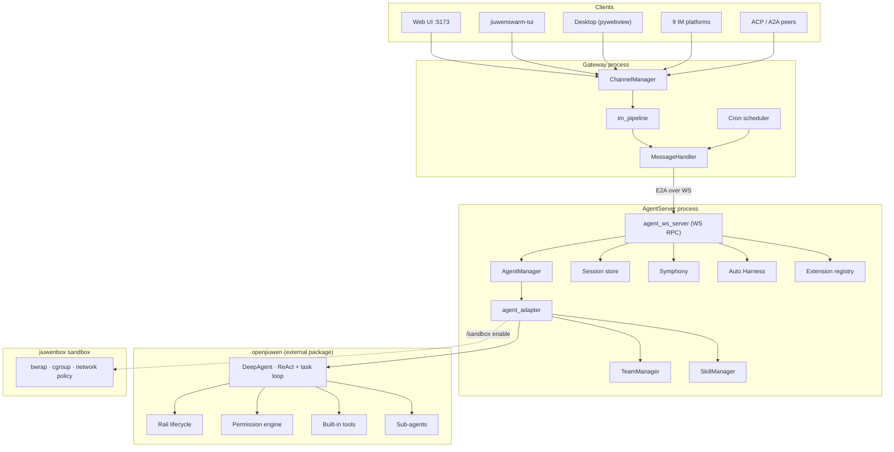

## 2. AI4RnD high-level architecture

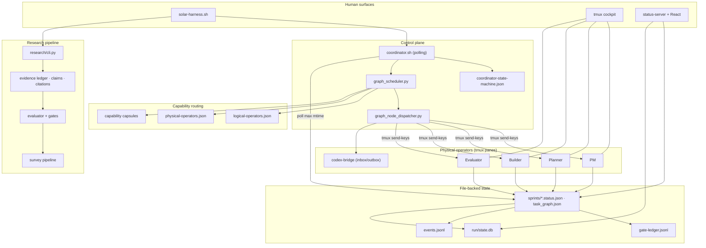

## 3. JiuwenSwarm execution workflow

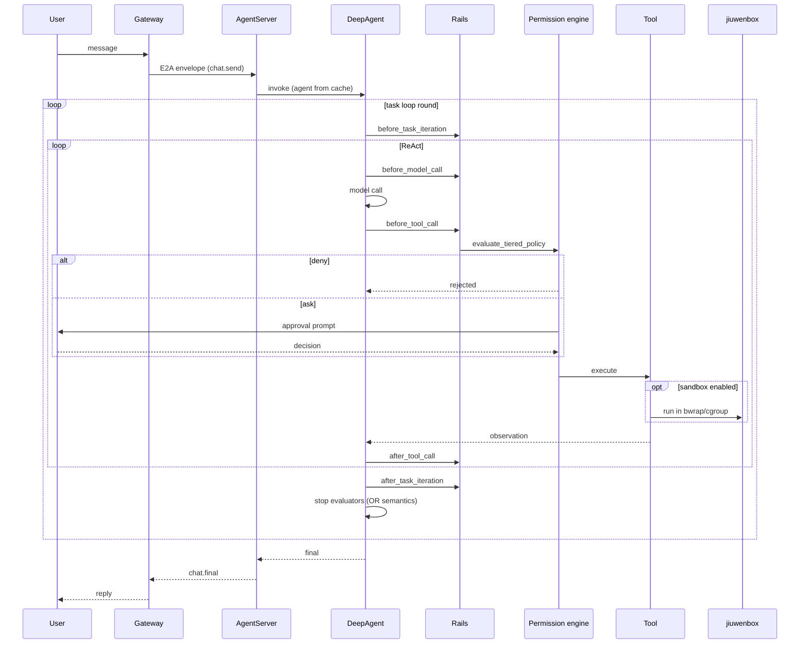

## 4. AI4RnD execution workflow

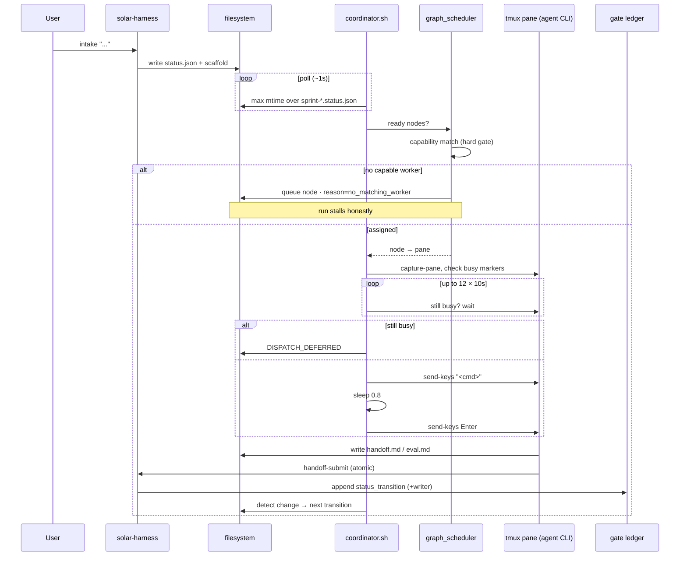

## 5. JiuwenSwarm swarm assembly pipeline

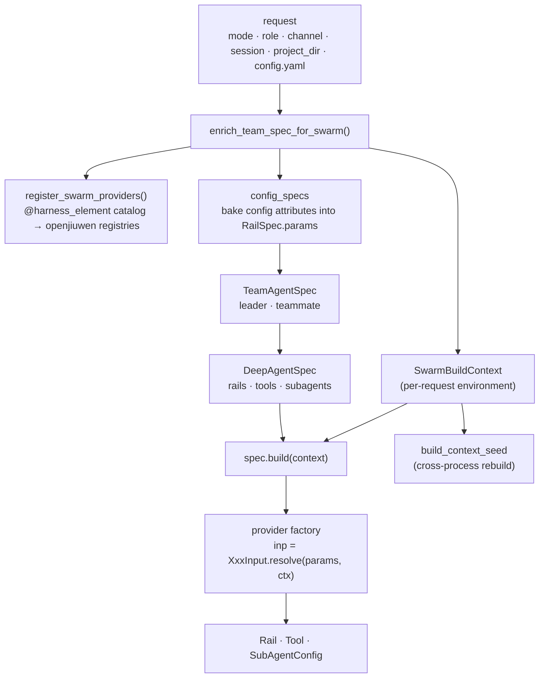

## 6. AI4RnD sprint state machine

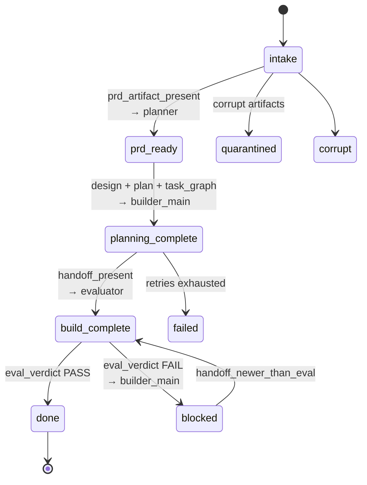

## 7. AI4RnD capability routing decision tree

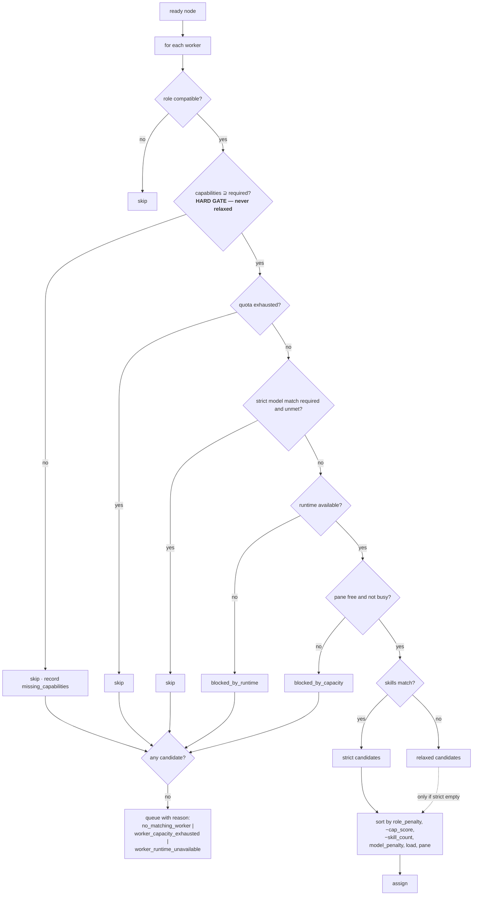

## 8. AI4RnD research pipeline

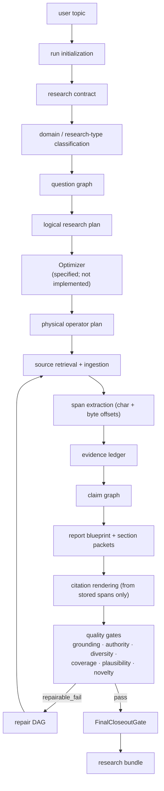

## 9. Component mapping

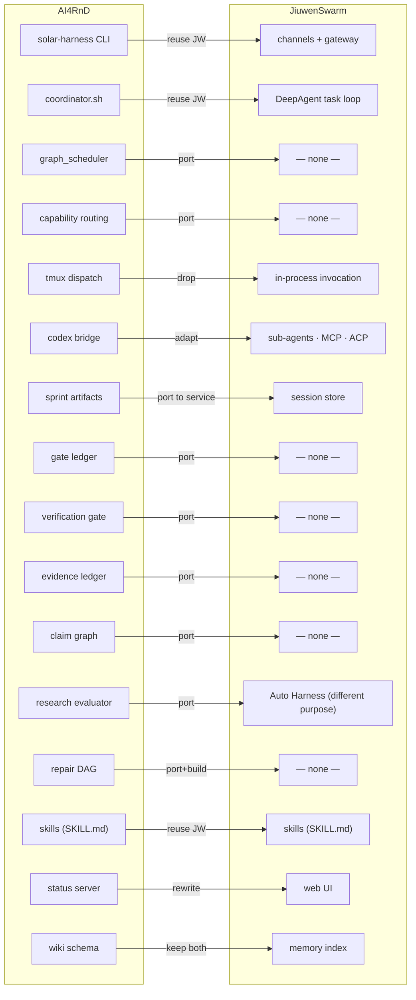

## 10. Current integration boundary

Today there is none. The two systems share no code, no protocol, no data format — with one
exception.

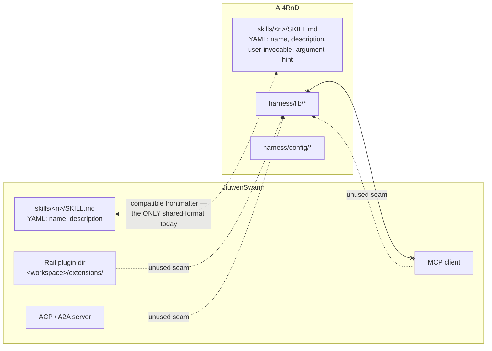

The dotted lines are *potential* seams, none currently used. The only real overlap is the
`SKILL.md` frontmatter convention, which both inherit from the Anthropic skill format.

## 11. Recommended target architecture

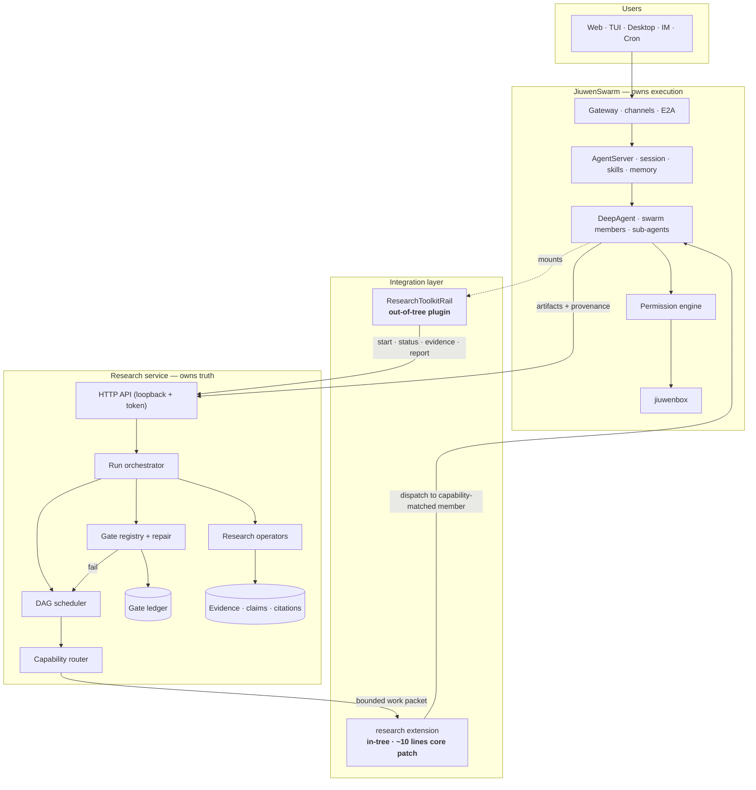

## 12. Proposed end-to-end functional workflow

```mermaid
sequenceDiagram
    autonumber
    participant U as User (Feishu)
    participant GW as Gateway
    participant DA as DeepAgent
    participant RL as ResearchToolkitRail
    participant SV as Research service
    participant RT as Capability router
    participant EX as research extension
    participant WK as Swarm member (capability-matched)
    participant PE as Permission engine
    participant GL as Gate ledger

    U->>GW: "Research the state of skills governance"
    GW->>DA: E2A chat.send
    DA->>RL: research_start(topic, depth=standard)
    RL->>SV: POST /runs
    SV-->>RL: run_id
    RL-->>DA: run_id
    DA-->>U: "Started run <id>. I'll report as gates complete."

    SV->>SV: contract → domain → question graph → plan
    loop each ready DAG node
        SV->>RT: assign(node)
        alt no capability match
            RT-->>SV: no_matching_worker + missing_capabilities
            SV->>GL: append gate_check (stalled)
            SV-->>RL: status: stalled (honest)
            RL-->>U: "Stalled: no worker provides <capability>"
        else assigned
            RT->>EX: execute_node(bounded packet, budget, idempotency key)
            EX->>WK: dispatch
            WK->>PE: tool calls (fetch, parse, extract)
            PE-->>WK: allow / ask / deny
            WK-->>EX: artifacts + provenance
            EX-->>SV: node result
            SV->>GL: append route_record + status_transition (writer attributed)
        end
    end

    SV->>SV: span extraction → evidence ledger → claim graph
    SV->>SV: run quality gates
    alt gate fails
        SV->>SV: repair DAG (targeted search → extract → verify → rewrite)
        SV->>GL: repair_start
        Note over SV: bounded; on exhaustion → needs_human_review
    end
    SV->>SV: FinalCloseoutGate
    SV->>GL: eval_verdict (evaluator ≠ writer, enforced by routing)

    DA->>RL: research_status(run_id)
    RL->>SV: GET /runs/{id}
    SV-->>RL: done · gate summary · claim counts
    DA->>RL: research_report(run_id, "md")
    RL->>SV: GET /runs/{id}/report
    SV-->>RL: file path
    DA->>GW: swarm.send_file
    GW-->>U: report + gate dossier
    U->>DA: "Where does claim C014 come from?"
    DA->>RL: research_evidence(run_id, claim="C014")
    RL->>SV: GET /runs/{id}/evidence?claim=C014
    SV-->>DA: evidence ids + verified spans
    DA-->>U: source, span offsets, authority score
```

## 13. Verification model comparison

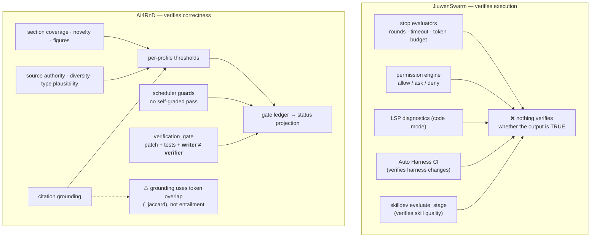

## 14. JiuwenSwarm extension surface map

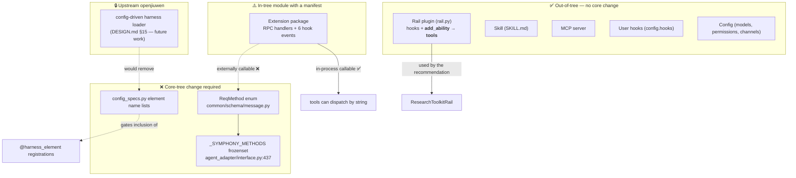
