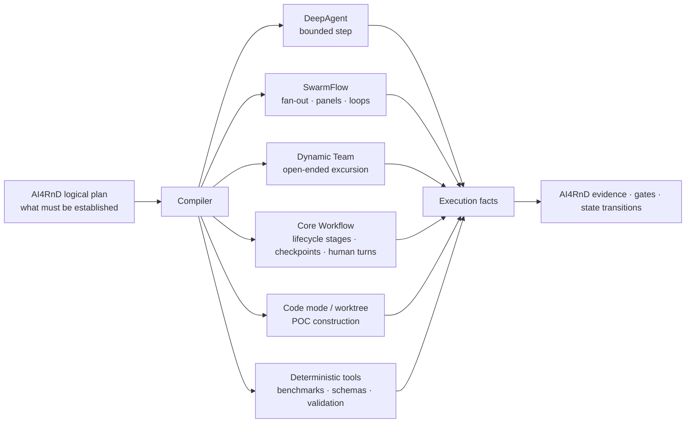

# Complete-Product Architecture Options — Revision 4

**What changed in Revision 4.** Revision 3 compared options that were not comparable. It treated
"Auto Route", "SwarmFlow", "Dynamic Team" and "Core Workflow" as selectable execution strategies
sitting alongside genuine architectures. They are not architectures. They are execution mechanisms
*inside* the product. None of them implements the nine R&D workflow lanes, Capability Capsules,
logical and physical Operators, scientific evaluators, eight RSI surfaces, seven typed graph
domains, Harness Core, Intention Compilers, Planner, Builder, or any of the visibility,
installation, UI, account, channel and configuration outcomes.

**The rule this revision enforces.** An option is a *complete architecture* only if it preserves
all 142 workbook outcomes. Anything else is an execution pattern, a partial implementation, or a
rejected option — and is labelled as such.

Row-by-row evidence: [20-feature-implementation-ownership.md](20-feature-implementation-ownership.md)
· [preservation gate CSV](../traceability/142-feature-preservation-gate.csv).

---

## 1. What is *not* an architecture option

| Candidate | What it actually is | Outcomes it implements alone |
|---|---|---|
| DeepAgent | Bounded single-agent execution | 0 of 142 |
| SwarmFlow | Deterministic multi-agent pipeline engine with a replay journal | 0 of 142 |
| Core Workflow / Pregel | Durable staged graph execution | 0 of 142 |
| Dynamic Team | Open-ended multi-agent collaboration | 0 of 142 |
| Auto Route | `WorkflowController.intent_detection` — a router between the above | 0 of 142 |
| Code mode / worktree | Isolated software construction | 0 of 142 |

Each is a mechanism the product *composes*. The composition is the compiler's job — not the
user's, and not the architecture's. A single research run uses several at once:

---

## 2. The five complete-product options

Each is stated as a triple: **what AI4RnD keeps**, **what Jiuwen provides**, **what the integration
layer does**.

### Option A — AI4RnD-led control plane on Jiuwen execution

AI4RnD keeps its TaskGraph, its scheduler, Contracts, Capsules, evidence and gates exactly as they
are. Jiuwen adapters replace physical execution only: where AI4RnD would spawn a tmux pane, it now
invokes a DeepAgent, a SwarmFlow script or a Team.

- *Keeps:* `graph_scheduler.py` (4,189 LOC), the actor family, the gate and evidence ledgers.
- *Gains:* real sandboxing, nine channels, model pool, UI shell, packaging.
- *Forfeits:* Pregel readiness computation, the SwarmFlow replay journal, `ConcurrencyGovernor`
  admission — all three verified working in this revision.

### Option B — Jiuwen-native lifecycle with AI4RnD semantic control

Core Workflow provides the persistent outer R&D lifecycle: intake → compile → plan → discover →
claim → build → benchmark → evaluate → deliver, as durable stages with checkpoints and human turns.
AI4RnD keeps project-specific TaskGraphs, Capsules, Contracts, evidence and RSI. OpenJiuwen
mechanisms execute individual stages.

- *Keeps:* all AI4RnD semantics.
- *Delegates:* stage sequencing, checkpointing, human interaction.
- *Requires:* that the outer lifecycle is genuinely stable in shape — which it is, because the nine
  lanes are fixed by the workbook.

### Option C — Progressive TaskGraph compilation into Jiuwen ★ recommended

Option B, plus an explicit migration discipline. AI4RnD retains semantic planning and governance
permanently. Low-level scheduling migrates into SwarmFlow and Core Workflow **only after** a
compatibility test passes for that specific capability.

**Initial form.** Outer lifecycle on Core Workflow. Deterministic sub-plans compiled to SwarmFlow.
AI4RnD retains capability binding, write-scope exclusion, gate evaluation, evidence capture, and a
thin run-state authority that does not trust the engine's completion signal.

**Mature form.** As each verified gap closes — upstream or in the integration layer — the
corresponding AI4RnD-side logic is retired against a passing test, never on a date.

The difference between the two forms is not a schedule; it is a list of falsifiable conditions.
See [17-taskgraph-verdict.md](17-taskgraph-verdict.md).

### Option D — Full compilation into Jiuwen execution

AI4RnD keeps product semantics but removes most of its execution scheduler now, trusting Jiuwen for
persistence, gates, evidence, cancellation and recovery.

**This option fails the preservation gate.** See §3.

### Option E — Standalone AI4RnD baseline, or defer

Keep the current implementation where Jiuwen integration does not yet add value or safety. Not a
null option — it preserves the most outcomes today, because it changes nothing. It also gains
nothing: no channels, no sandbox, no model pool, no UI shell, no packaging. And it leaves the 58
never-built outcomes exactly where they are.

---

## 3. Preservation-gate results

All 142 outcomes, evaluated against every option:

| Verdict | A | B | C ★ | D | E |
|---|---:|---:|---:|---:|---:|
| PRESERVED | 70 | 76 | 76 | 58 | 82 |
| PRESERVED WITH ADAPTATION | 12 | 6 | 6 | 23 | 0 |
| NEW BUILD REQUIRED | 58 | 58 | 58 | 57 | 58 |
| UNRESOLVED | 2 | 2 | 2 | 3 | 2 |
| **DROPPED** | **0** | **0** | **0** | **1** | **0** |
| Total evaluated | 142 | 142 | 142 | 142 | 142 |

**Option D drops `FN-19 Model Routing & Selection`** and is therefore not a complete architecture.

The reason is verified, not theoretical. `resolve_member_model` returns `None` when a requested
model name is absent from the pool, and `TeamWorkerBackend._resolve_model` then falls back to the
worker base spec's own model — silently, with no error and no warning
(`openjiuwen/agent_teams/models/allocator.py` lines 417–423). A product whose central promise is
verifiable research cannot silently run a step on a substitute model. Under Option D there is no
AI4RnD-side layer left to catch it.

The same class of finding puts `FN-43 Failure Recovery & Resumability` at UNRESOLVED under D: the
leader-facing `swarmflow` tool advertises `resume_id` in its JSON schema and rejects it at invoke
time, and a failed agent step returns `None` after its retries rather than failing the run. Both
were executed in this revision — see [12-verification-appendix.md](12-verification-appendix.md).

**The number that matters most is the one that barely moves.** `NEW BUILD REQUIRED` sits at 57–58
under every option, because 58 outcomes exist in neither system. No architecture choice avoids
them. Any comparison showing one option needing dramatically less work is comparing execution
plumbing, not product.

---

## 4. Comparison on the axes that actually separate the options

| | A | B | C ★ | D | E |
|---|---|---|---|---|---|
| Complete architecture | yes | yes | yes | **no** | yes |
| Preserves all 142 outcomes | yes | yes | yes | no — 1 dropped | yes |
| Reuses verified Pregel readiness | no | yes | yes | yes | no |
| Reuses verified journal replay | no | yes | yes | yes | no |
| Reuses verified admission control | no | yes | yes | yes | no |
| Survives the silent model fallback | yes | yes | yes | **no** | yes |
| Survives the unreachable resume | yes | yes | yes | **no** | yes |
| Duplicates existing scheduling | yes | no | shrinking | no | yes |
| Gains channels / sandbox / UI / packaging | yes | yes | yes | yes | **no** |
| Migration risk | low | medium | **staged** | high | none |
| Reversible if a gap proves fatal | n/a | partly | **yes, by construction** | no | n/a |

---

## 5. Why C rather than B

B and C preserve identically — 76 / 6 / 58 / 2 / 0. They differ only in *when* AI4RnD-side
machinery is retired.

Revision 3 recommended retiring it up front, on the strength of reading the engine. This revision
executed the engine and found three surfaces that look reusable and are not yet reachable:
`resume_id` rejected at invoke, `agent_type` accepted then ignored by every backend, unknown model
silently substituted. A fourth — the built-in shell guardrail tier — loads zero rules in a stock
install, because openjiuwen's package resources directory does not exist and the copy JiuwenSwarm
installs at workspace init is never read back by any code in either tree.

None of those is fatal. All are small. But they are exactly the class of gap a schedule-driven
migration discovers *after* it has deleted its fallback. C keeps the fallback until a test says it
is safe to remove. That is the entire difference between B and C, and this revision's evidence
says it is worth having.

---

## 6. Rejected framings

| Framing | Why rejected |
|---|---|
| "AI4RnD is a mode" | A mode is an agent assembly profile cached by `(mode, sub_mode, project_dir)`. It cannot own multi-day project state, an evidence ledger that survives compaction, or a cross-project capability registry. |
| "Pick SwarmFlow *or* Core Workflow" | Both, chosen per sub-plan by the compiler. Neither is a product. |
| "Let the user pick the execution strategy" | Execution mechanism is internal. Exposing it makes the product's semantics depend on a user's guess. |
| "Capsules are workflow templates" | Verified false. All 42 manifests carry `applicability`, `contract`, `composition`, `effects`, `bindings`, `verification`, `operator_compatibility` and `provenance`. A template has none of these. |
| "Foundation and Vertical features follow from the runtime choice" | The gate shows the opposite: 58 rows need new work under every option, and the Vertical plane is almost entirely unaffected by the choice. |
| "Retire the AI4RnD scheduler now and write ~450 LOC" | Revision 3's estimate rested on an unexecuted reading. The verified gaps in routing, resume and failure signalling are not covered by it. Effort is now stated as work items, not line counts. |
